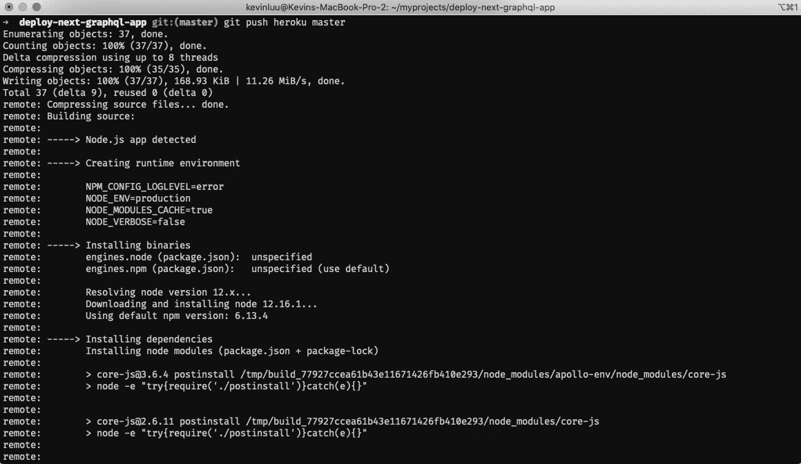
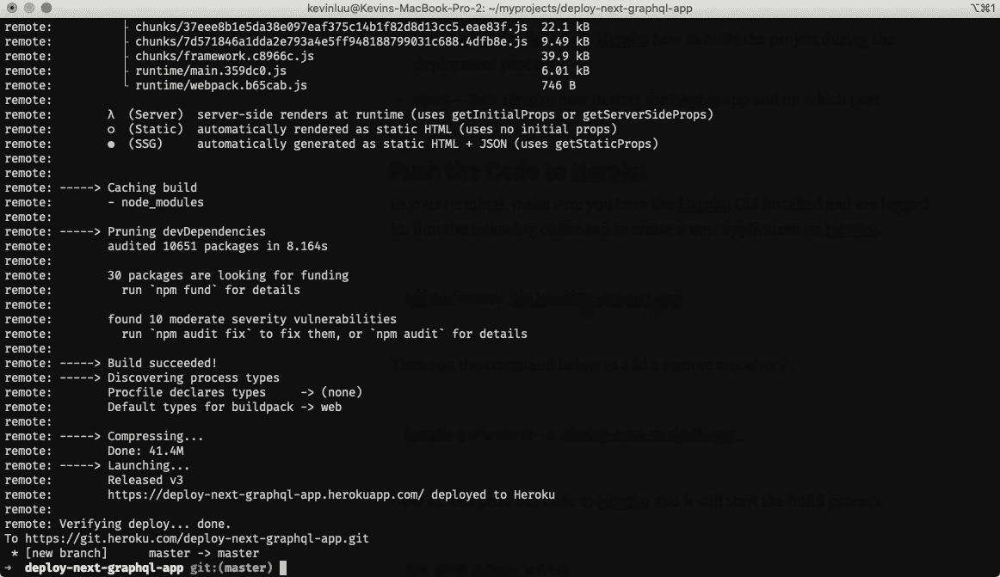

# 如何将带有 Apollo GraphQL 的 Next.js 应用程序部署到 Heroku

> 原文：<https://javascript.plainenglish.io/how-to-deploy-a-next-js-app-to-heroku-d33bd86c2a2b?source=collection_archive---------7----------------------->


Photo by [Aaron Burden](https://unsplash.com/@aaronburden?utm_source=medium&utm_medium=referral) on [Unsplash](https://unsplash.com?utm_source=medium&utm_medium=referral)

# 介绍

部署是会让很多人犯错的事情之一。当我参加训练营的时候，我清楚地记得班上很大一部分人都在努力部署他们的应用程序。编码是有趣和令人愉快的部分..但是部署...😅

在本文中，我将向您展示如何使用 Apollo GraphQL 将 Next.js 应用程序轻松部署到 Heroku。这里需要注意的关键点是，中的**没有区别**你将如何部署任何其他 Next.js 应用程序。如果您检查下面提供的启动代码，您会注意到我们在 Next.js 提供的路线上提供 Apollo GraphQL。

# 先决条件

请验证您是否安装并配置了以下项目。

*   已安装 node . js 10 . x(next . js 要求)
*   Git CLI 已安装和配置
*   Heroku 帐户
*   Heroku CLI 已安装并登录

# 起始代码

我已经提供了启动代码，如果你想继续下去。

您可以通过在终端中运行以下命令来克隆 repo。

```
git clone [https://github.com/kluu1/deploy-next-graphql-app.git](https://github.com/kluu1/deploy-next-graphql-app.git)
```

[](https://github.com/kluu1/deploy-next-graphql-app) [## kluu 1/部署-下一步-图表 SQL-应用程序

### 这是我在 Medium 上发表的博文的示例代码。看看吧…

github.com](https://github.com/kluu1/deploy-next-graphql-app) 

# 检查 package.json

导航到项目目录，并在您喜欢的文本编辑器中打开项目。如果您使用的是 VSCode，并且路径中有“Code”命令，则可以在终端中运行以下命令。

```
cd deploy-next-graphql-app
code .
```

现在打开文本编辑器，让我们看看 **package.json** 文件。

这里需要注意的重要脚本是“**开始**和“**构建**”。

*   **构建** — Heroku 将在构建过程中运行它
*   **启动** — Heroku 将运行此命令以在特定端口上启动应用程序

如果您希望定制 Heroku 构建过程，我强烈推荐您阅读 [Heroku Node.js 支持](https://devcenter.heroku.com/articles/nodejs-support)文档。例如，您可以添加**预安装**和**后安装**脚本，它们在 Heroku 上构建之前或之后运行。

# 把密码推给 Heroku

在您的终端中，确保安装并登录了 Heroku CLI。运行以下命令在 Heroku 上创建一个新的应用程序。

```
heroku create deploy-next-graphql-app
```

然后运行下面的命令来添加远程存储库。

```
heroku git:remote -a deploy-next-graphql-app
```

现在我们可以将代码推送到 Heroku，它将开始构建过程。

```
git push heroku master
```



Starting the build process



Build is complete

一旦构建过程完成，Heroku 将自动部署该应用程序。我希望你喜欢这场魔术表演！您的应用程序现已部署并上线！

# 结论

Heroku 是最容易使用的平台之一。只需对 Next.js 项目做一些修改，您就可以在几分钟内将应用程序部署到 Heroku 上。来自社区的文档和支持是一流的。我个人在所有个人项目中都使用 Heroku，并将继续这样做。我希望这篇文章对您有所帮助，并且您能够使用它来部署您的 Next.js 项目！继续下一个！😆

我在业余时间写这些文章是为了娱乐。如果你喜欢这篇文章，请在下面留下你的喜欢和评论！可以关注我上 [*中*](https://medium.com/@this.kevinluu) *和* [*推特*](https://twitter.com/kluu_10) *。感谢支持！*