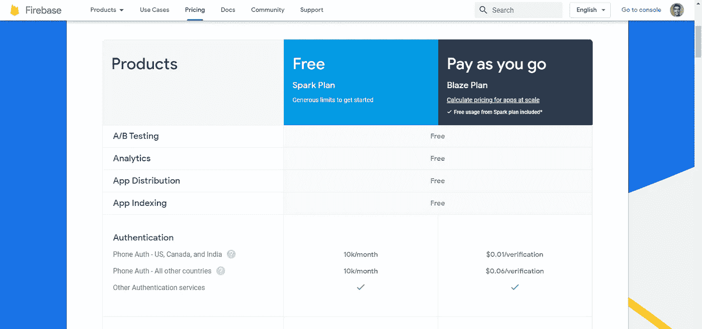
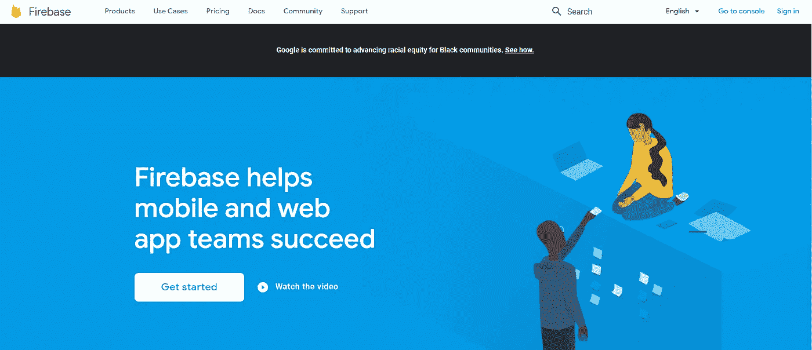
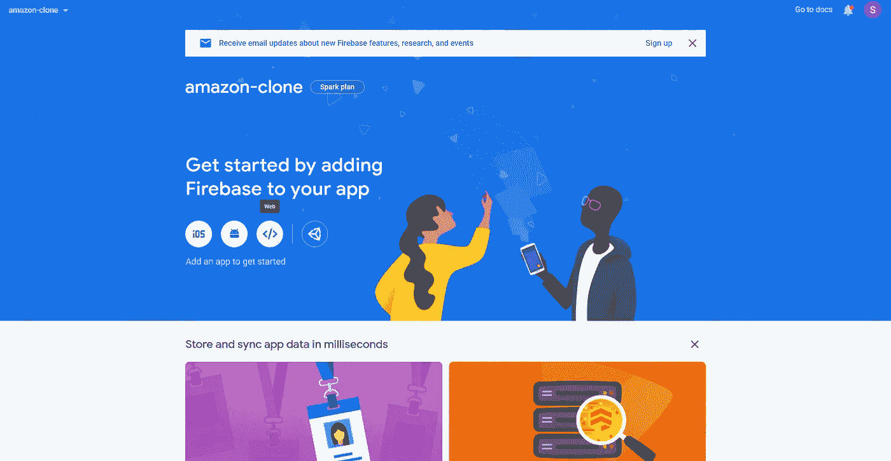
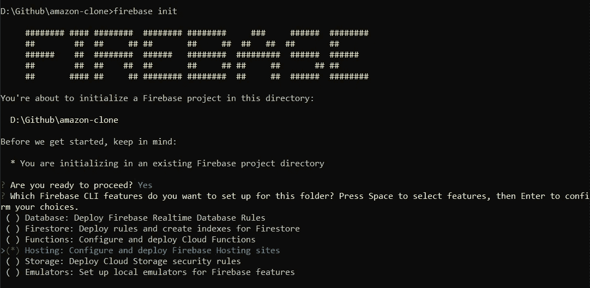
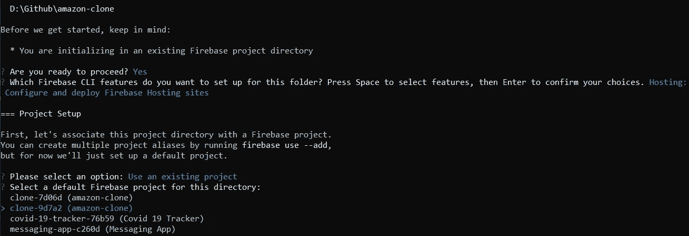
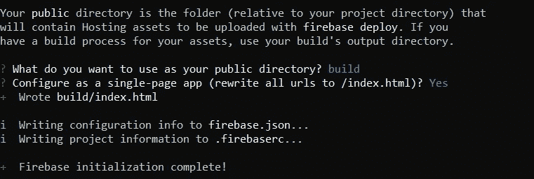

# 如何在 Firebase 上免费部署 React 应用程序

> 原文：<https://javascript.plainenglish.io/how-to-deploy-your-react-applications-for-free-on-firebase-ffb3e6dcddf5?source=collection_archive---------7----------------------->

## 大家好，这是针对完全初学者的循序渐进教程。


Photo by [Ian Battaglia](https://unsplash.com/@ianjbattaglia?utm_source=medium&utm_medium=referral) on [Unsplash](https://unsplash.com?utm_source=medium&utm_medium=referral)

React 与 Firebase 的结合使其成为最强大的技术之一。在 Firebase 上部署应用程序非常简单。我个人已经使用 Firebase 部署了许多应用程序。

# 为什么选择 Firebase？

Firebase 是 Google 开发的一个平台，用于创建移动和网络应用程序。Firebase 提供了一个很酷的 Spark 计划，有很多非常适合开发者的特性。



Source: [Firebase Website](https://firebase.google.com/)

默认情况下，Firebase 上托管的每个应用程序都附带一个 SSL 证书。它内置了谷歌分析。你可以为你的应用添加认证、数据库、云功能等等，并且免费测试你的应用。

# 入门指南

你只需要一个谷歌账户和一个 React 应用程序。您可以使用现有的 React 应用程序，也可以克隆下面链接的现有存储库。

[](https://github.com/mvshashank123/Amazon-Clone) [## mvshashank 123/亚马逊-克隆

### 这个项目是用 Create React App 引导的。在项目目录中，您可以运行:在…中运行应用程序

github.com](https://github.com/mvshashank123/Amazon-Clone) 

# Firebase 控制台中的初始设置

**第一步:**登陆 Firebase [网站](https://firebase.google.com/)然后登录谷歌。



Source: [Firebase Website](https://firebase.google.com/)

**第二步**:然后到控制台点击添加项目。


Source: [Firebase Website](https://firebase.google.com/)

**第三步:**给出一个项目名称。然后点击继续。


Source: [Firebase Website](https://firebase.google.com/)

**步骤 4:** 继续，然后为 Firebase 选择默认帐户，然后创建一个项目。


Source: [Firebase Website](https://firebase.google.com/)

**步骤 5:** 转到项目并点击 Web 图标。



Source: [Firebase Website](https://firebase.google.com/)

**第 6 步:**输入名称并注册应用程序，然后点击下一步。

# Firebase CLI 上的设置

**步骤 1:** 打开命令提示符，键入以下命令。

```
**npm install -g firebase-tools**
```

**步骤 2:** 然后打开项目文件夹内的终端。然后键入以下命令。

```
**firebase login**
```

**第三步:**然后登录谷歌。然后键入以下命令。

```
**firebase init**
Are you ready to proceed? **Yes**
```



第四步:然后点击上面给出的 Firebase 主机。然后**使用现有项目。**选择需要部署的项目。



**第五步:**然后输入 **build。*(这是 React 应用非常重要的一步)。*** 配置为单页应用— **是。**

**步骤 6:** 然后运行以下命令。这个命令实质上使您的应用程序为生产环境做好了准备。

```
**npm run build**
```

**Step-7:** 然后是最后一个命令。

```
**firebase deploy**
```


Photo by [SpaceX](https://unsplash.com/@spacex?utm_source=medium&utm_medium=referral) on [Unsplash](https://unsplash.com?utm_source=medium&utm_medium=referral)

然后，我们完成了您的应用程序在线部署。

感谢您的阅读！

👋嘿，我们做朋友吧！在 [LinkedIn](https://www.linkedin.com/in/shashank-mv/) 上联系我。别忘了在[媒体](https://medium.com/@mv.shashank123)上关注我，获取更多类似的内容。