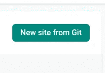
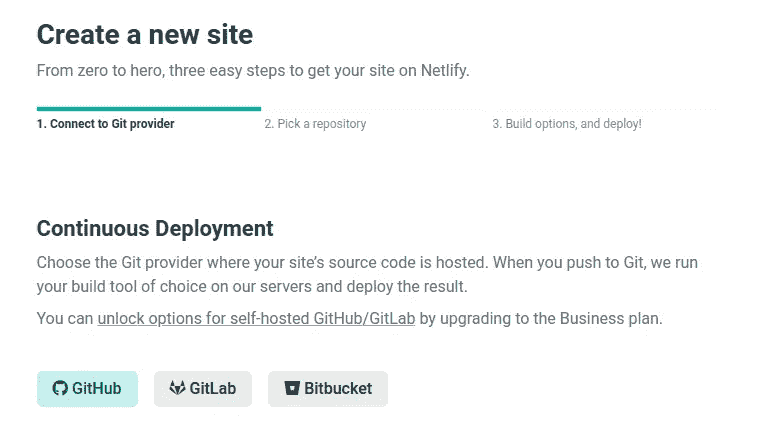
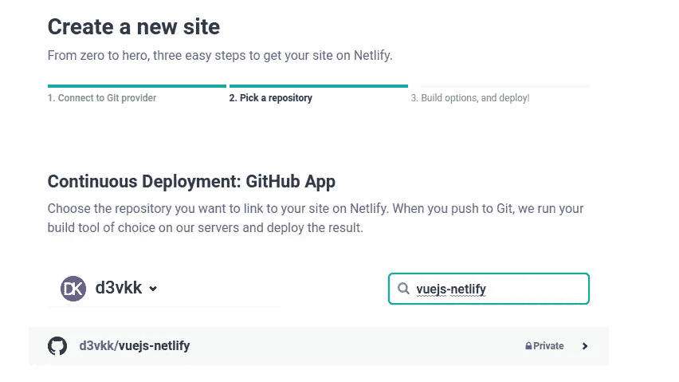
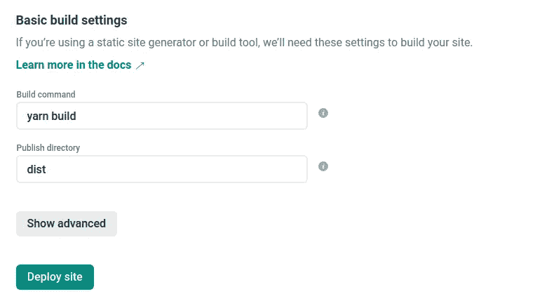
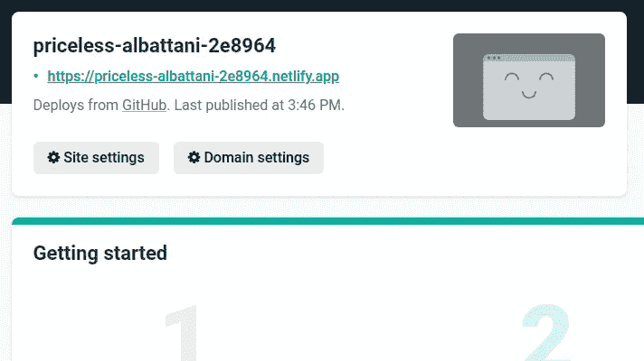
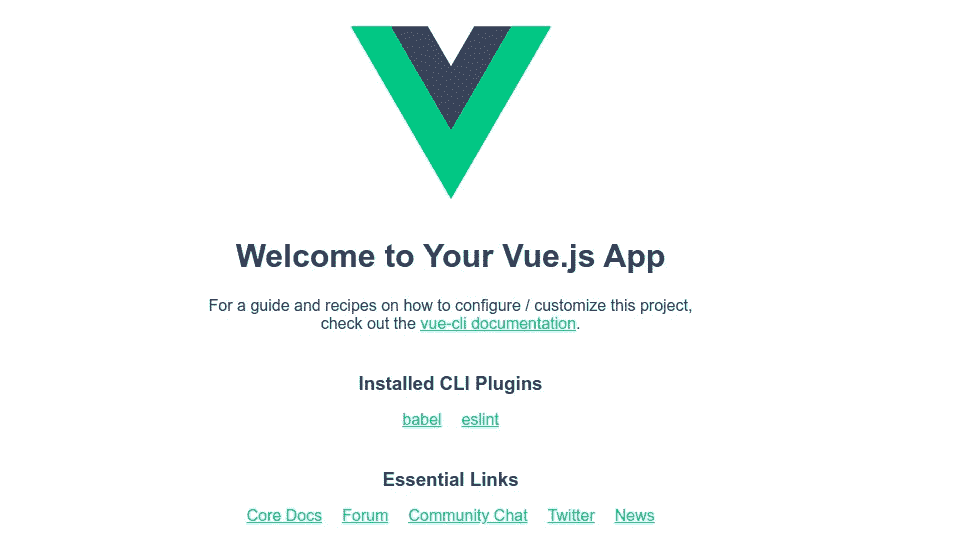

# 如何将您的 Vue.js 应用程序部署到 Netlify

> 原文：<https://javascript.plainenglish.io/how-to-deploy-your-vue-js-app-to-netlify-8f9b96260e97?source=collection_archive---------13----------------------->


比尔·杰伦在 [Unsplash](https://unsplash.com/s/photos/spacex?utm_source=unsplash&utm_medium=referral&utm_content=creditCopyText) 上的照片

# 介绍

[Vuejs](https://vuejs.org) 是一个渐进式的 Javascript 框架，用于构建反应式且易于扩展的网站

Netlify 是一个快速的静态网站托管平台，当你把你的推送到 git 库时，它会自动重新部署你的网站

# 先决条件

确保您具备以下条件:

*   [NPM](https://npmjs.com)
*   [Vue CLI](https://cli.vuejs.org)
*   GitHub 账户
*   [净值账户](https://netlify.com)
*   [GitHub CLI](https://cli.github.com) (可选)

# 开始部署吧！

使用 Vue CLI 创建一个新的 Vue 项目，并更改到它的目录

```
vue create vuejs-netlify
cd vuejs-netlify
```

使用 GitHub CLI 创建远程 repo

```
gh repo create — public vuejs-netlify
```

或者，你也可以通过访问[https://github.com/new](https://github.com/new](https://github.com/new))在 GitHub 网站上创建它

Git 推送到远程 repo

```
git push -u origin master
```

登录你的网络账户

点击 Git 中的*新站点*



连接到 Git 提供程序。在这种情况下， *GitHub*



选择 *vuejs-netlify* 仓库



主分支是默认的部署分支。但是，您可以从任何其他分支进行部署

添加*纱线构建*或 *npm 运行构建*作为构建命令。运行这两个命令中的任何一个都会生成一个 dist 文件夹，所有代码都在这个文件夹中编译

因此，添加 *dist* 作为发布目录



点击*部署网站*部署网站

等待网站被部署。这不会花太长时间，因为 Netlify 是一个快速的静态网站托管平台

打开自动生成的网站网址



你做到了！您已经部署了您的 Vuejs 应用程序！🎊🎊🎊



发现错别字？想投稿？[下面是源代码](https://github.com/d3vkk/vuejs-netlify-article)

[在 Twitter 上关注我](https://twitter.com/amdonaldk)获取博客更新和精彩的网络开发内容