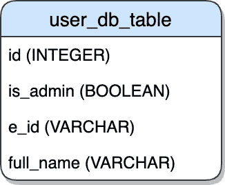

# 如何设计一个出色的 GraphQL 模式

> 原文：<https://javascript.plainenglish.io/how-to-design-a-kick-ass-graphql-schema-79d573e85147?source=collection_archive---------3----------------------->

本文将提供一些实用的技巧，帮助您设计一个直观的、可伸缩的和强大的 GraphQL 模式。

## 什么是 GraphQL 模式？

一个**模式**是一个产品领域的结构化表示。它描述了产品的关键概念、这些概念之间的关系以及系统支持的核心操作。

GraphQL 仅仅是一个**工具**，它让我们以一种易于使用的语法与我们定义的模式进行交互。它*没有强制执行*任何关于数据来源或我们定义模式的方式的标准。

因为没有强制的指导方针，好的模式设计经常被遗忘，直到为时已晚。这导致模式**难以理解，** **难以维护，并且几乎不可能**随着新特性的引入而扩展。

# **产品驱动**

GraphQL 的一个显著优势是，它允许您创建一个对**工程师**和**产品**团队直观的 API。GraphQL 模式应该揭示您的最终用户**将与之交互的项目、字段和动作。**

数据库是以高度技术化和高性能的方式构建和设计的。GraphQL 让我们**将这些结构简化为项目和动作，从而**更好地反映**我们产品的本质。**

> 首先，我们必须是我们领域的专家...其次，我们必须擅长 graph QL’—[graph QL 模式设计@ Scale (Marc-André Giroux)](https://www.youtube.com/watch?v=pJamhW2xPYw)

Shopify 在一个友好的自述文件中标准化了他们的模式设计。主要的一点是，当设计一个模式时，API 不需要直接对用户界面建模，“实现和 UI 都可以作为 API 设计的灵感和输入，但是您的决策的最终驱动因素必须始终是业务领域。”

## **为什么是**？

1.  一个产品比一个复杂的数据架构更容易理解
2.  帮助推广一种通用的**产品语言**，工程师、设计师和所有利益相关者可以用它来讨论和阐述复杂的概念。

## 例子

假设我们正在创建一个系统，让员工在自己的公司提交休假申请。我们产品中的主要项目是`Employees`、`Admins`和`Leave Requests`。主要动作是`requesting`和`approving`休假请求。

下面是在我们的系统中为代表用户而创建的数据库表。

**错误的模式设计**

**良好的模式设计**

通过将表格分成两个概念，我们已经正确地封装了每种类型用户的行为和字段。当实现特性时，我们可以轻松地与`Employees`和`Admins`交互，而不是每次我们想获取用户时都传递一个参数`is_admin`。

此外，我们将`e_id`列抽象为一个描述性字段，该字段仅与`Employee.`相关联。这**防止混淆**该字段是什么，并向我们的工程师表明该字段仅用于`Employees.`

## 仔细想想你想揭露什么

> “添加一个字段比删除一个字段更容易”——[规则#4 Shopify 模式标准](https://github.com/Shopify/graphql-design-tutorial/blob/master/TUTORIAL.md)

最好是手工制作一个模式，以确保您正在创建一个可用的 API。从数据库生成模式的工具很诱人，但应该避免，因为它们充当瘦中间件，不会给我们的底层结构增加任何产品价值。在添加字段或实体之前，请仔细考虑，我们暴露的越多，模式就越不集中，对我们的工程师来说就越混乱。

Michael Watson 在“[你的模式和 GraphQL 操作的注意事项](https://www.youtube.com/watch?v=fG8zy1OROp4)”中建议根据客户的用例慢慢地发展你的图。这里的要点是，在将解析器和每个字段添加到模式之前，要确保它们都有用例。

## 简化复杂的结构

在设计和扩展数据库时，我们经常会遇到来自多个不同数据源的表和关系的蜘蛛网。复杂功能的优化和实现需要这些结构。

然而，这导致新工程师和困惑的产品经理头疼。GraphQL 让我们将底层架构抽象成一个**友好的** API，工程师可以更快地理解、交互和实现特性。

要遵循的一条好规则是，解析器**不应该公开底层数据源**，而应该反映产品中的单一概念。

## 在服务器端聚合字段

在可能的情况下，在服务器端执行*复杂的计算*，并将它们作为产品中的一个值公开。这有助于我们**重用**逻辑，避免“客户端消费者不得不操纵数据”( [Apollo](https://www.youtube.com/watch?reload=9&v=b_qFpde74Ho) )并且**简化了**前端开发人员的认知负荷。

**示例**

在我们的人力资源公司，休假申请在满足一系列标准时被视为已被接受:管理员已*手动批准*它，休假类型为*医疗*或申请日期为*未来 6 个月以上*。

下面是典型的 GraphQL 响应。

**输出设计不良**

这里的问题是，每当我们在 UI 中使用它时，我们都必须计算休假请求是否被批准——业务规则应该位于一个中心位置，而不是分散在代码库中。这增加了复杂性，每个工程师必须了解休假请求被批准的确切条件。

**良好的输出设计**

我们现在重用这个逻辑，与单个`isApproved`字段交互变得简单多了。

注意—如果您的产品也向用户公开单个字段，请在您的模式中提供这些字段。

# 创建一个易于**配置的模式**

> “构建经得起时间考验的 API”——[Github](https://www.youtube.com/watch?v=pJamhW2xPYw)

这里的关键信息是设计一个模式，让您可以轻松地添加功能并无缝地弃用产品的某些部分。这在敏捷开发中尤其重要。我们需要**围绕客户需求快速迭代**，尽快交付价值。

具体的数据库结构很难迭代，因为它们需要复杂的迁移。幸运的是，GraphQL 模式更具延展性，如果设计正确，配置起来也很简单。

## **始终**使用单输入**对象**进行变异

*注意:截止到 2020 年末，一直在讨论在 GraphQL 规范中引入不赞成使用的输入参数。在实现时，这个输入规则可能不是必需的。*

这使得添加字段变得更加容易，也使得废弃字段变得更加容易。

对于这个例子，我们将创建一个突变，让一个`Employee` `request`成为一个`LeaveRequest`。

**错误的输入设计**

这是我第一次创造突变时犯的错误。这里的问题是，添加**和删除变异的功能变得非常困难。**

如果我们想添加一些功能，比如图片附件，唯一的方法就是添加第五个参数。这显然*不能很好地扩展*并且*难以维护*。

使用单个参数也使得客户端的执行更加容易。

**良好的输入设计**

这种模式允许我们向输入对象添加字段，而不会引入任何重大更改。

如果我们想弃用`description`字段，我们可以将该字段设置为可空，添加弃用原因，并将其从我们的前端代码中淘汰。

## 你总是希望**返回**一个单一的输出对象，而不是一个值

> “当处理突变时，返回突变记录作为突变的结果被认为是好的设计。这允许我们相应地更新前端的状态并保持事情的一致性”“ [Atheros](https://atheros.ai/blog/graphql-best-practices-for-graphql-schema-design)

出于类似的原因，通过在响应中返回一个对象，向该响应对象添加和移除字段变得更加容易。当我们想要扩展功能并向响应添加新字段时，我们的客户端可以继续使用这些端点**而不会中断更改**。

使用上面的例子，我们还将返回新的休假请求，这样我们就可以更新我们的 UI，而不必执行第二次请求。

**良好的输出设计**

# 将 GraphQL 中的突变映射到一个**特定的用户流**

将我们的变化映射到我们产品中的动作确保了我们创建更小和更集中的请求。

> “避免试图构建支持移动、桌面和所有功能的‘一刀切’的 API。拥抱不同的使用案例和客户，并以此为基础进行构建。”— [Github](https://www.youtube.com/watch?v=pJamhW2xPYw) 。

**为什么？**

1.  通过更小、更直观的操作，我们更容易理解和推理特定端点的功能
2.  **更少的代码中断**——如果更少的端点使用相同的通用突变，我们减少了我们的变化的影响
3.  引导我们走向好的架构模式，尤其是'[单一责任](https://medium.com/@severinperez/writing-flexible-code-with-the-single-responsibility-principle-b71c4f3f883f)

## *贫血设计*

贫血设计是一种反模式，你把你的系统设计成纯粹的数据，没有任何内置的行为。简而言之，这意味着当您想要更改一些底层状态时，您可以使用通用的创建、读取、更新和删除方法直接与数据层进行交互。在贫血的设计中，商业规则和行为是存在的，但是它们存在于工程师的大脑中。

对于这个例子，一个`Admin`想要批准一个`LeaveRequest`

**不良突变设计**

*为什么要避免贫血设计？*

1.  你必须向**发送你需要更新或创建的全部有效载荷**。
2.  工程师需要理解底层数据结构和改变每个字段的副作用
3.  一个单一的突变必须迎合许多不同的用例

**好的变异设计**

动作现在更具体，副作用的空间更小，我们的逻辑现在可以更加集中在解析器内部。

## 使用一致的命名约定

> [Shopify 规则 9](https://github.com/Shopify/graphql-design-tutorial/blob/master/TUTORIAL.md) — *根据有意义的东西来选择字段名称，而不是根据实现或者字段在传统 API 中的名称。*

这里主要的要点是使用一个**对你的团队**有效的标准，并坚持下去。一致的命名让您的团队能够立即理解特定分解器或变异的作用。

整个行业的一个普遍规则是先用动词，再用名词。

# **最终注释**

当构建消费者软件时，我们需要一个反映我们产品的 API。GraphQL 的建立是为了让客户能够准确地要求他们所需要的东西，并让 API 随着时间的推移变得更容易。—[graphql.org](http://graphql.org)。

是时候扩展我们的知识了，超越我们从基于 REST 和 SOAP 的端点中学到的原理。为了创建一个**超棒的模式**，仔细考虑你想要公开的实体、字段和动作。

花时间确保你的模式是**灵活的**，并且**高度耦合**到你的业务领域。对您的模式设计的早期深谋远虑将使您的前端工程师的工作更加顺利，将帮助新的初学者更快地入门，并将确保更快地迭代改善您的用户生活的功能。