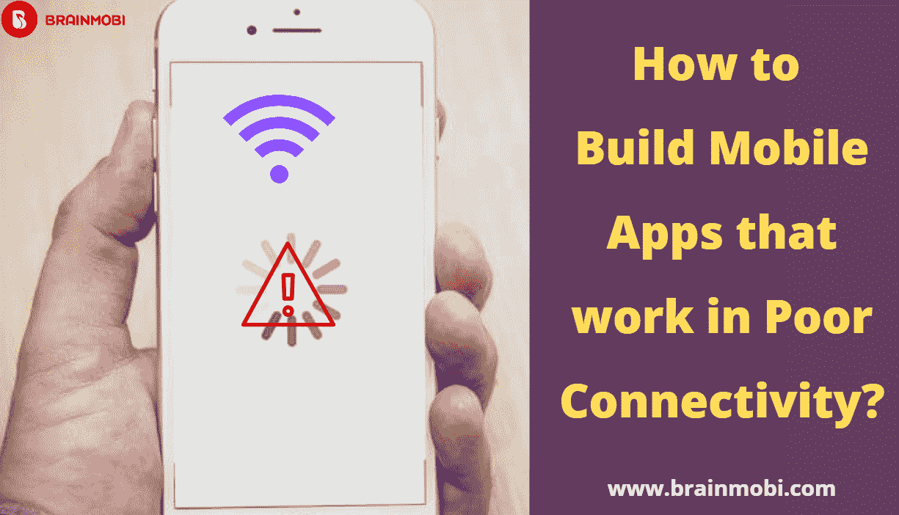
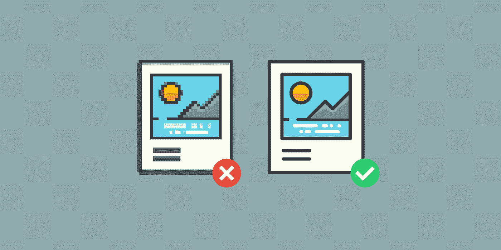
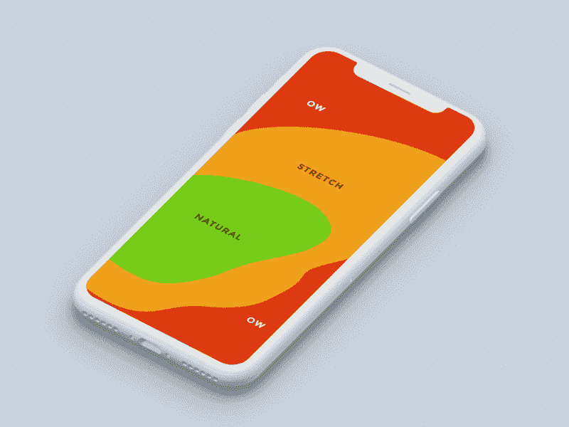
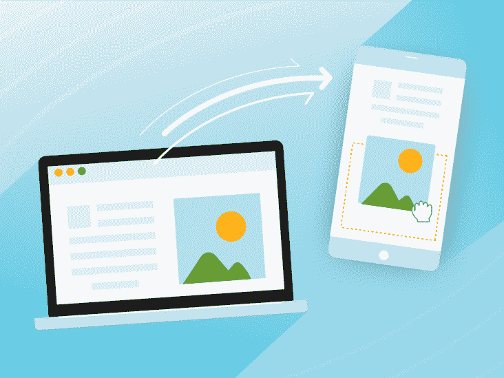

# 如何设计能够在恶劣网络条件下生存的移动应用

> 原文：<https://javascript.plainenglish.io/how-to-design-a-mobile-apps-that-survive-poor-network-conditions-a8761a6e95c7?source=collection_archive---------3----------------------->

构建应用程序面临许多挑战。当涉及到革命性的想法时，人们可能会吸引公众，这可能会导致他们下载应用程序。
接下来是开发应用程序的工作。

需要确保每个功能都能够完成它应该做的事情，找到一个好的图形设计师来给编码注入活力，并且将正确数量的内容整合到应用程序中，这些都是指导这个过程的重要方面。

还有许多其他应用程序能够以众多的功能和引人注目的视觉效果赢得用户。尽管如此，即使在互联网连接不良的情况下，当应用程序完全正常运行时，您也需要记住一些事情。

作为美国 [**最优秀的移动应用开发公司之一**](https://www.brainmobi.com/mobile-app-development-company-in-usa) ，我们 BrainMobi 能够展示一些有助于您轻松结束讨论的关键因素。

**1。策划不需要太多互联网连接的内容:**

几乎任何应用程序都有能力在良好的互联网连接的边缘，但在网络瘫痪的时候，它可能会有压力。你不能指望用户在等待空白页面的同时期待结果，这可能会破坏你的应用程序。

脸书、推特和许多其他的移动应用开发公司也能够缓存新闻提要的加载部分，即使应用没有连接到互联网。他们有足够的能力显示一条消息，告诉用户互联网已关闭，但通过显示缓存的内容，他们能够确保他们的用户不会立即关闭应用程序。

应用程序的设计应该以一种即使没有互联网连接也能工作的方式来编织页面。因此，即使它只是几页内容，缓存的提要也能够为应用程序提供至少一些离线支持，这在特定情况下是强制性的。此类页面通常应附带一条消息，提醒用户不存在网络连接。

# 2.让带宽优化成为您的首要任务

当设计应用程序时，当提供良好的用户体验是动机时，有很多事情需要考虑。带宽优化当然应该是重中之重，拥有一个拥有大量功能和丰富内容的应用程序是没有用的，但是需要用户花费数分钟来加载。

无论应用程序的内容是什么，从文本到图像，动画，应用程序的设计或加载速度都不应该受到影响。

对于由 [**移动应用开发服务**](https://www.brainmobi.com/services/mobile-app-development) 提供的设计，你需要考虑的另一件事是层级。重要的是要确保用户不用经过那么多步骤就能到达他们要找的页面。这可以让你避免在到达期望的步骤时需要多次加载，为了实现这一点，你需要允许自己思考和计划。

**3。考虑更轻的设计**

如果你使用脸书，你可能知道他们的信使和脸书应用程序的精简版本。Lite 实际上意味着 light，这是一个更简约的应用程序版本，或使用更低的图形，以提高网络连接不好的地区的速度。

当你和一个应用开发公司设计一个更轻版本的应用程序时，你想要真正赢得用户，你应该能够设置应用程序，使它切换到更轻的版本。这样你就不会觉得需要更频繁地在应用程序之间切换，甚至不会遇到任何糟糕的网络问题。

# 4.优化您的图形和用户界面

在许多情况下，未经优化的图形可能会降低应用程序的性能。很多时候，应用程序加载缓慢的原因是图形内容未优化，为了使其看起来更好，在不影响性能的情况下优化图形内容非常重要。 [**手机应用开发者**](https://www.brainmobi.com/contact-us) 有很多帮助优化图形的工具。

这是用户中的一个趋势，因为他们选择使用图像来获得更多的用户反馈，并帮助他们在视觉上增强它。尽管如此，图像加载速度慢得多，在慢速连接时提供的用户体验也很差，这有助于他们将信息的重要部分保留在文本中，让你享受慢速连接方面的服务。

这些技术已经证明在许多情况下挽救了生命，并解决了案例中的应用问题。通过这种方式，用户不必等待整个图像加载，就可以看到相当大一部分内容。

**结论:**

因此，当你设计一个应用程序时，你应该确保它看起来是最好的，并且应该继续吸引你这边的用户。然而，当设计一个用户不能享受的基于内容的应用程序时，就没有什么意义了。

因此，在头脑中设计网络连接性差的应用程序不仅有助于他们偶尔处理低带宽问题，还可能赢得用户的注意，这可能有助于他们因这种出色的解决方案而赢得投资者的注意。作为美国 的 [**顶级移动应用开发公司之一，我们的一长串服务和努力都倾向于实现这一点，我们的目标是帮助我们的客户达到新的成功水平。**](https://www.brainmobi.com/)