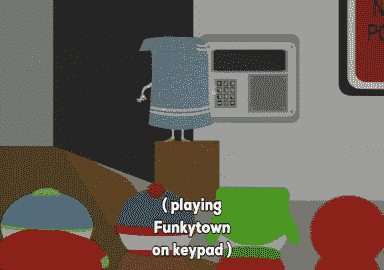
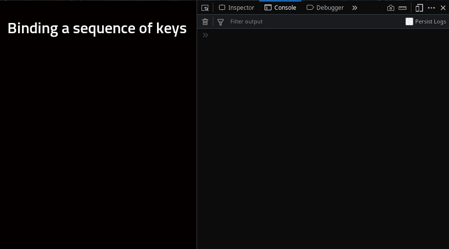

# 如何检测 JavaScript 中的击键序列

> 原文：<https://javascript.plainenglish.io/how-to-detect-a-sequence-of-keystrokes-in-javascript-83ec6ffd8e93?source=collection_archive---------3----------------------->


Photo by [Aleksandar Cvetanovic](https://unsplash.com/@lemonzandtea?utm_source=medium&utm_medium=referral) on [Unsplash](https://unsplash.com?utm_source=medium&utm_medium=referral)

JavaScript 最常用的特性之一是它能够对用户与网页交互时可能发生的各种事件做出反应。事实上，这正是 JavaScript 出现时的想法，通过添加一些交互性来使网页变得动态。有了 JavaScript，我们可以在用户点击页面的特定部分、按键、鼠标移动、页面加载、元素聚焦等情况下做出反应。

> 查看 MDN 页面，获取所有可用 JavaScript 事件的列表[。](https://developer.mozilla.org/en-US/docs/Web/Events)

即使今天 JavaScript 可以用来做更多的事情，这种为网页添加交互性的基本功能仍然被广泛用于为用户提供丰富有趣的体验。

在本文中，我们将研究如何使用 JavaScript 对键盘事件做出反应，特别是如何对用户输入的特定按键序列做出反应。因此，当用户按下一个组合键时，网页可能会显示一些内容，比如打开一个菜单或一个模式，它可以改变页面的样式或执行任何其他你可以想象的 JavaScript 功能范围内的操作。



*在我们开始之前，我只想指出我使用了 ES6 的一些特性，如*`[*const*](https://developer.mozilla.org/en-US/docs/Web/JavaScript/Reference/Statements/const)`*`[*let*](https://developer.mozilla.org/en-US/docs/Web/JavaScript/Reference/Statements/let)`*，* [*传播运算符*](https://developer.mozilla.org/en-US/docs/Web/JavaScript/Reference/Operators/Spread_syntax) *(* `*...*` *)，* [*箭头函数*](https://developer.mozilla.org/en-US/docs/Web/JavaScript/Reference/Functions/Arrow_functions) *，* [*等。如果您不熟悉这些，请查看提供的链接了解更多信息。*](https://developer.mozilla.org/en-US/docs/Web/JavaScript/New_in_JavaScript/ECMAScript_2015_support_in_Mozilla)*

# *我们在建造什么？*

*对于本文，我决定让页面上的一个元素根据用户输入的按键顺序改变其背景图像。所以我们基本上是处理造型，没有太花哨。我们还将添加一些文本更新，以使演示更加丰富，并为用户提供更多信息。*

*我的想法是使用旧 FPS 游戏《毁灭战士 2》中用作作弊代码的关键序列。基本上，当用户键入一个组合键时，游戏会给用户带来一些好处，比如更多的弹药，更多的健康，刀枪不入等等。*

*在我们将要构建的示例中，我们将使页面上某个元素的背景图像根据用户键入的按键序列而改变。你可以在这里看到并尝试演示[。](https://gruximillian.github.io/sequential-keybinding/)*

# *基本项目*

*为了只关注 JavaScript，我为这个项目创建了完整的 HTML 和 CSS，并链接了只包含控制台日志的 JavaScript 文件，以确保它能够工作。你可以在这里下载初始项目文件[或者你可以创建你自己的文件，如果你愿意的话。](https://github.com/Gruximillian/sequential-keybinding/tree/01-project-structure)*

*这是我们最初拥有的 JavaScript 内容的快速分解。*

*这非常简单，我们在文档中添加一个事件监听器，等待 DOM 完全加载，然后调用回调函数。回调函数目前只有`'use strict'`语句和一个控制台日志来验证文件是否正确链接到 HTML 页面。*

> *我们可以省略这个事件侦听器和传递给它的回调，但是脚本文件应该放在`body` HTML 元素的末尾，以确保当 javascript 开始执行时 DOM 被完全加载。如果你选择这样做，请随意。这只是我喜欢的做法，好处是它还将所有 JavaScript 代码封装到一个函数中，避免了全局范围的污染。*

## *聆听关键事件*

*下一步是检测用户何时按键。我们使用与添加`DOMContentLoaded`事件监听器相同的方法，但是现在我们将指定一个不同的事件名称。有三个[键盘事件](https://developer.mozilla.org/en-US/docs/Web/Events#Keyboard_Events)我们可以指定:`keydown`、`keyup`和`keypress`。*

*   *`keydown` -按键时立即触发*
*   *`keyup` -释放按键时触发*
*   *`keypress` -按住键的同时持续发射*

*从这个描述中我们可以立即看出`keypress`绝对不适合我们的目的。那就只剩下`keydown`和`keyup`了。在我们的例子中，这两种方法都很好，但在不同的情况下，其中一种可能比另一种更合适，所以你需要评估情况并做出相应的选择。*

*我们在这里能注意到的唯一区别是，如果我们使用`keyup`，可能会感觉有点滞后，而`keydown`确实感觉反应很快。我会选择`keydown`，但是既然用`keyup`也能达到同样的效果，那就随意使用你更喜欢的事件吧。*

*现在，让我们添加事件监听器并删除控制台日志:*

*这里有两件重要的事情需要注意。首先，我们已经向`addEventListener`提供了`keydown`事件名称，并且我们正在向事件处理程序回调函数提供`event`参数。我们将需要那个`event`参数来检查哪个键被按下了。*

*因此，要获取被按下的键，我们可以访问`event`对象的`key`属性:*

> ***提示:**要查看`event`对象的哪些属性可用，只需执行`console.log(event)`并查看记录的对象。我知道这似乎是显而易见的，但如果你是一个初学者，你可能会尝试在网上寻找可用的选项，这很好，但答案通常只是一个控制台日志。*

*得到`event.key`后，我们将其转换为小写，因为让这些快捷键不区分大小写会很好。不会每次都这样，但这次，完全没问题。*

*如果您打开浏览器控制台，单击页面上的后退并尝试键入一些内容，您可以看到您按下的键已记录到控制台。但是如果你注意的话，你可能会注意到它记录了任何被按下的键，比如`Enter`、`Delete`、`Backspace`等等。也被记录下来。这很好，也很有用，但在这种情况下，我只想使用字母和数字。*

*因此，让我们检查被按下的键是字母还是数字。*

*通过创建包含我们感兴趣的所有字符的`charList`变量，我们能够检查`key`是否出现在`charList`字符串中，如果没有，我们简单地从函数返回而不记录字符。*

*现在我们正在监听按键事件，并且能够只过滤我们感兴趣的按键，是时候看看如何保存输入的按键序列了。*

## *保存输入的按键序列*

*为了保存输入的按键序列，我们需要添加一个变量来存储该序列，并且我们可以在感兴趣的每个按键事件上更新该变量。*

*我们可以使用一个字符串来连接键，但是我们也可以使用一个数组来存储单独的键作为数组项。在这个简单的用例中，我们使用什么并不重要，但是我将使用数组方法。*

*在需要连接大量字符串的情况下，数组方法是字符串连接的一种推荐方法，它还允许我们在需要时使用所有的数组方法。*

*让我们创建一个名为`buffer`的变量，最初是一个空数组，并将新密钥推入其中。*

*如果我们在`keydown`事件监听器中定义了`buffer`数组，它将在每次按键时被重置，输入的按键序列将会丢失。因此，我们需要在`keydown`事件监听器之外定义它。现在我们能够保存所有输入的密钥。*

*但是，如果我们查看日志，我们可以注意到，现在我们一直在保存键，并且数组只是随着新键的按下而增长。查看 gif 下图看结果。*

**

*We are constantly adding keystrokes into the buffer array*

*看看在写入“hello”和一些延迟之后，当我继续输入时，它仍然具有数组中所有先前的值。这对我们想要的东西不是很有用。在用户输入最后一个键之后经过一定时间后，重置输入键的列表将是有益的。*

*为了实现这个条件，我们可以使用最后两次按键之间的时间间隔。如果这个时间间隔长于指定的时间量，那么我们将重置`buffer`数组。让我们接下来做那件事。*

## *限制按键之间的时间间隔*

*为此，我们需要比较上次击键和当前击键发生的时间，然后检查它们之间的时间是否大于某个期望的时间延迟，比如 1 秒、0.5 秒，只要你觉得最方便。*

*因此，我们至少需要一个新变量来保存最后一次击键的时间。为了能够检查该值，我们需要在事件侦听器之外定义变量，然后在击键发生后更新它。*

*我们引入了两个新变量，`lastKeyTime`和`currentTime`。我们可以只用`lastKeyTime`来做，但是有了`currentTime`变量就更容易推理了。让我们看看我们在这里做了什么。*

*首先，我们定义了`lastKeyTime`变量并用一个当前时间值初始化它。我们必须初始化它，因为我们需要一些值来执行下面的计算。我们可以在这里使用零作为值，但是为了保持一致，我们使用当前的时间值。*

*接下来，我们定义了`currentTime`变量，并用当前时间初始化它。此时有人可能会问为什么两个变量有相同的值？！记住这些只是初始值，至少对于`lastKeyTime`是这样的。我们需要在每次击键后更新该值。注意`lastKeyTime`是在事件监听器之外初始化的，也就是说，只初始化一次，而`currentTime`会在每次击键时重新初始化。*

*现在我们有了一个重要的部分，检查击键之间是否经过了足够的时间。如果有，我们要重置`buffer`变量，这个数组保存用户按下的字符。*

*为了进行检查，我们只需从`currentTime`变量中减去`lastKeyTime`，并检查结果是否大于某个数字。在本例中，该数字是 1000，即 1000 毫秒或 1 秒。这是一个很好的起始值，以后可以更改它来更好地调整体验。*

*因此，如果条件`currentTime - lastKeyTime > 1000`为真，我们将`buffer`重置为空数组:`buffer = []`；之后，`buffer`将收到一个新的密钥，但它将是数组中唯一的一个。*

*这里我们需要做的最后一件事是更新`lastKeyTime`值。我们简单地将其值设置为与`currentTime`值相同。在下一次击键时，`lastKeyTime`将保存上一次击键发生的时间，而`currentTime`将获得一个新值。*

## *更新背景图像*

*最后，我们准备做我们想要做的，根据用户输入的按键顺序改变背景。*

*如果用户输入了正确的键序列，我们需要抓取页面上的一个元素，并根据用户输入更新其背景。看来我们需要检查一下正确的按键顺序。*

*虽然在大多数情况下这几乎肯定是对的，但在这种情况下没有必要。这个问题的本质允许我们跳过检查，如果键序列不正确会发生什么。*

*我这么说是什么意思？我来详细解释一下。*

*如果我们想用 CSS 改变背景图片，我们需要更新图片的 url。如果图像的名称与按键序列相同，那么我们需要做的就是读取输入，使其成为一个字符串，并将其设置为背景图像的 url。*

*有趣的是，如果图像不存在，背景就不会显示出来。这意味着，如果我们确实显示了一个图像，然后输入了与现有图像 url 不匹配的内容，背景图像就会消失。*

*在这种情况下，我可以接受，因此不需要检查 url 是否正确。但是如果我们想保留当前显示的图像，那么检查将是必要的。让我们用最简单的方法，也就是不用那张支票。*

*我们已经移除了`console.log`，并添加了一个查询来获取显示背景的元素，在下一行中我们应用了背景 url。*

*该 url 结构将取决于您的项目结构，在这种情况下，图像位于“images”文件夹中，并且是 jpg 格式。这里需要注意的是，我们需要从`buffer`数组中创建一个字符串，这样它就可以在图像 url 中使用。我们只需用一个空字符作为连接字符`buffer.join('')`来连接数组元素。*

*这样我们就实现了本文的主要目标。现在，用户可以尝试输入正确的键序列，如果成功，背景将会改变。我们所做的是简单和功能，可以很容易地纳入任何项目。*

*但是还是有可能做一些改进的。所以，如果你想在代码中有更多的灵活性，请继续阅读。*

# *改进项目*

*从整体上看我们的代码，我们会发现我们使用了一些“全局”变量。全局的意思是，它们在我们脚本的顶层上下文中，包含在`DOMContentLoaded`事件监听器函数中，所有其余的代码都在这里，这意味着它们将与我们脚本的顶层上下文中的其他变量混合在一起。*

*但是变量`buffer`和`lastKeyTime`的声明不能放在`keydown`事件监听器里面，因为那会在每次击键时重置它们并破坏功能。*

## *将代码包装成一个函数*

*为了隔离控制关键事件的代码，我们可以将变量和`keydown`事件监听器放入一个单独的函数中。*

*这样一来，我们的`keyMapper`函数就完全独立于脚本中的其他代码，甚至可以从另一个文件中导入，以使事情更加清晰。但是现在我们有了这个功能，我们可以看到其他改进的可能性。*

## *移除硬编码值*

*为了使函数更加灵活，我们可以做的一件重要事情是删除我们使用的任何硬编码值，而是将它们作为参数传递给函数。*

*我们需要的硬编码的最重要的值是背景容器元素的选择器(`#background`)，图像 url 的组成部分，以及检查中的时间延迟值`if (currentTime - lastKeyTime > 1000)`。还有一个`charList`变量，但是尽管我们也可以将它作为参数传递，并精确地控制允许哪些字符，但为了简化起见，我们可以暂时不使用它。*

*相反，我们可以用`charList`将它从事件监听器中移出，放到`keyMapper`函数中，以避免在每次击键时都声明它。所以，让我们做所有这些改变。*

*现在,`keyMapper`函数有四个参数，这使我们能够更容易地定制它。现在，当一个函数有三个以上的参数时，它开始感觉有点笨拙，很容易忘记或混淆一些。我们稍后会解决这个问题，但是现在让我们先这样做。*

## *创建一个回调函数*

*我们脚本的预期动作是更新页面上元素的背景。这发生在脚本的最后一行。但是也许你希望在用户输入一个特定的按键序列后发生完全不同的事情，也许播放一个声音，打开一个对话框或者你能想到的任何事情。*

*在我们当前版本的脚本中，我们只能更新背景。但是，如果我们能够很容易地告诉我们的脚本我们是否想要做其他事情，也就是说，使用`keyMapper`函数来执行我们已经定义的特定函数，那就太好了。为了做到这一点，我们可以定义一个函数，传递给`keyMapper`函数，然后从那里执行它。*

*如您所见，新的`keyMapper`函数接受了一个参数(dooh！)，`callback`，这是一个按键按下后我们想要执行的功能。在`keyMapper`函数的最后一行，我们调用了`callback`函数，并传递给它一些它需要的变量。当调用`keyMapper`时，我们传递给它名为`updateBackground`的函数，它是在`keyMapper`函数之后声明的。*

*函数`updateBackground`基本上包含了我们已经删除的`keyMapper`的最后两行。这样，我们就完全分离了保存按键序列和获取该序列后执行的操作。*

*如果我们编写一个新函数，并将其作为回调传递给`keyMapper`而不是`updateBackground`函数，我们可以得到完全不同的行为。*

## *后退一步*

*开始困扰我的一件事是，我们现在有五个参数用于`keyMapper`函数，四个参数用于`updateBackground`函数，并且`updateBackground`的所有参数在传递给`updateBackground`函数之前也被传递给`keyMapper`函数。*

*既然我们已经将回调函数从`keyMapper`函数中分离出来，那么在`updateBackground`函数中简单地硬编码所需的值是有意义的，因为这样我们将包含回调函数中所需的所有信息，并且我们可以只用一个参数调用它，即`keyMapper`提供的键序列。*

*这也意味着只有两个参数可以调用`keyMapper`函数，即`keystrokeDelay`和`callback`函数。以下是更新后的脚本:*

*现在，它看起来更清晰了，功能和参数被很好地分开了。*

*不过，我们可以做得比这更好。*

*您可能已经注意到在`keyMapper`函数中还有另一个硬编码的字符串，即`keydown`事件名称。如果我们决定让`keyMapper`处理`keyup`事件，我们需要直接在函数内部修改它。这不一定是一个大问题，但如果我们也能控制波谷参数，那就太好了。*

*所以，我们给`keyMapper`函数添加第三个参数？*

*我们可以这样做，但让我们更进一步，让它只是一个参数。我们来介绍一下…*

## *选项对象*

*为函数提供参数的一个非常好的方法是为对象提供保存参数值的属性。在有许多参数要传递给函数的情况下，尤其是在这些参数是可选的并且表示函数的某种配置的情况下，这是非常有用的。*

*我们需要添加的`keyMapper`函数、`keystrokeDelay`和新的`eventType`的参数看起来确实像配置值。使用对象向函数传递参数的一个额外好处是参数的顺序无关紧要。*

*我们现在可以这样做:*

*`options`对象现在保存要监听的事件的名称和击键之间的时间延迟。在`keyMapper`函数中，我们也有这两行:*

```
*const eventType = options && options.eventType || 'keydown';
const keystrokeDelay = options && options.keystrokeDelay || 1000;*
```

*这是我们使参数可选的地方。如果值是通过`options`对象提供的，它们将被使用，如果不是，我们将使用缺省值。您可以通过更改`options`对象中的值来进行测试。您可以在调用`keyMapper`函数时完全省略`options`对象，它仍将使用默认值。*

*我们也可以通过 options 对象传递回调函数，但是因为没有这个函数，我们就没有任何合理的功能，所以将它作为一个单独的必需参数传递似乎更好。*

*另一个需要注意的变化是`keyMapper`函数的参数顺序颠倒了。没有必要这样做，但是如果一个参数是可选的，它通常在必需的参数之后提供，否则如果你想省略可选的`options`参数，你需要像这样调用`keyMapper`函数:*

```
*keyMapper(null, updateBackground); // null is the value for the options object*
```

## *添加状态管理*

*不，这不会是 redux 或任何其他状态管理库，为这样的小脚本添加整个库是愚蠢的。我们将简单地将保存脚本状态的变量`buffer`和`lastKeyTime`组织到一个对象中，并在每次更改时更新它。*

*现在键序列和最后一次击键的时间被保存为`state`对象的`buffer`属性和`lastKeyTime`属性。在每次击键时，我们将`buffer`属性复制到本地`buffer`变量中，并相应地更新该变量。*

*之后，用本地`buffer`变量和`currentTime`变量更新状态。最后，用当前的`buffer`值调用`callback`。*

*这里需要注意的一点是，我们从不直接更新现有的状态对象及其`buffer`属性，而是总是为`state`创建新对象，为`buffer`创建新数组。这被称为状态的不可变更新，并且是更新状态的优选方式。我们从不改变以前的值/对象，我们总是给状态分配新的值/对象。*

*该行:`buffer = [key];`在击键间隔时间超过`keystrokeDelay`定义的情况下重置`buffer`。*

*第`buffer = […state.buffer, key];`行使用扩展操作符`...`用来自状态缓冲区的值填充新数组，然后我们将当前键添加到数组中。这样，缓冲区就更新了。*

*最后，行`state = {buffer: buffer, lastKeyTime: currentTime};`通过给新对象分配新的`buffer`和`lastKeyTime`值来更新`state`。*

*在最后一个代码示例中，我删除了字符测试，因为它并没有真正改善脚本的功能，但是当然，您可以随时添加自己的检查来控制脚本的行为。*

# *最后一击*

*我们的剧本现在完成了。我们可以设置选项，创建任何我们想要的回调函数，状态不断更新。总的来说，我们的`keyMapper`函数现在非常灵活。*

*如果您仔细查看浏览器中的页面，您会注意到在左侧有一列包含一些信息。在该列的下部，您可以看到用户输入的按键序列(“一些按键”)和用户反馈消息(“还没有任何东西”)的占位符。这些目前都没有用，但我们可以很容易地改变这一点。有多种方法可以做到这一点。*

*最简单的方法是给回调函数`updateBackground`添加更多的功能。但是这将会改变函数的功能，它的名字将不能正确描述它的功能。*

*因此，我们可以在另一个函数中编写新代码，并从`updateBackground`函数中调用该函数。这并不是理想的解决方案，但总比直接把与更新背景无关的新代码添加到`updateBackground`函数中要好。我们是这样做的:*

*另一种方法是简单地用`updateUI`函数作为回调函数第二次调用`keyMapper`:*

*当谈到功能分离时，这稍微好一点，但是我们现在有两个事件侦听器，它们基本上做同样的事情。*

*如果我们对于关键事件只有一个事件监听器，然后在事件发生时调用我们想要的所有函数，那就太好了。*

*我们可以做到这一点，我们只需要将所有这些函数提供给`keyMapper`函数，最好的方法是传递一个数组，该数组将保存我们希望在键事件发生时执行的所有回调函数的引用。更新代码来实现这一点非常简单:*

*因此，`keyMapper`函数现在接收一个函数引用数组:*

```
*keyMapper([updateBackground, updateUI], options);*
```

*然后在每次`buffer`更新时，所有这些函数都会被调用:*

```
*callbackList.forEach(callback => callback(buffer));*
```

*为关键事件添加新功能现在就像编写一个函数来执行我们想要的功能，并在我们调用它时将其引用传递给`keyMapper`函数一样简单。*

## *更新(2019 年 2 月 21 日)*

*评论中提到，用户可以输入一个像`../myimage`这样的路径，这将访问目录结构中上一级的某个文件…如果它存在的话。为了避免使用除字母和数字以外的任何字符，这几行被添加到`updateBackground`功能中:*

```
*const validKeys = keySequence.every(key => !isNaN(parseInt(key)) || key.toLowerCase() !== key.toUpperCase());if (!validKeys) return;*
```

*另外，`keyMapper`函数现在返回没有转换成小写的键。这种转换现在发生在需要这样做的回调函数中，比如`updateUI`函数。*

## ***更新(2019 年 2 月 15 日)——JavaScript 说这是真的(0 ==假)，这(' ==假)***

*在[评论](https://medium.com/@Shrekgrinch/might-want-to-consider-dumping-the-truthy-checking-for-the-options-parameters-4fe666d5909d)中提醒我在 JavaScript 中使用真值求值的危险后，我决定解决这个问题并修复有问题的部分。*

*问题在于以下几个方面:*

```
*const eventType = options && options.eventType || 'keydown';
const keystrokeDelay = options && options.keystrokeDelay || 1000;*
```

*正如我已经提到的，这将使用来自 options 对象的值，如果它存在，如果它不存在，那么它将使用默认值。除了它不会在所有情况下都这样做。如果由于某种原因`options.eventType`和`options.keystrokeDelay`的值被评估为 falsy，那么这些值将不会被使用，它将跳转到默认值。*

*如果这些属性不存在，我们期望得到值`undefined`，这将评估为假，然后我们将使用默认值。值`null`也可以评估为 false，这也是可以的。*

*我们没有考虑变量的类型。这是因为，根据变量的类型，我们可能会出现其他错误值。*

*我们期望第一个属性`options.eventType`是一个字符串。但是如果是空字符串呢？JavaScript 说，在这种比较中，空字符串的计算结果应该是`false`。这意味着，如果我们将一个空字符串传递给`options.eventType`属性，我们仍然会得到默认的`keydown`事件，因为空字符串的计算结果为 false。但是，如果我们什么都不通过，那就行不通了！因此，如果在这种情况下，它实际上对我们有利的工作失败的检查，并使用默认的`keydown`事件类型。那很好。*

*第二个属性`options.keystrokeDelay`应该是一个数字。在数字的情况下，JavaScript 说零应该计算为`false`。如果我们想为延迟值传递零，它将不会被接受，它将回落到默认的 1000 毫秒。但是另一方面，我听到你说“谁能输入得这么快，以至于应该考虑零值呢？”。你是对的，在这种情况下，所有这些都是没有意义的，我们一次只能听一个键。*

*所以，我们在这里也很好，不需要做任何事情？实际上不是。如果提供的数字是负数呢？它当然不会回到过去，在按键发生之前就做出反应，但一旦按键发生，它就会做出反应。基本上，它与将值设置为零是一样的，但是它通过了真实性测试。我们现在看到，我们需要另一个条件，我们需要大于零的数字。现在，我们解决了这个问题，但是如果有人传递像 10 这样的数字呢？10ms 够你连两个键击吗？对我来说不是，这是肯定的。我几乎做不到 250 毫秒的延迟。从我的角度来看，作为这个应用程序的开发者，我认为没有理由让延迟小于我连接两次击键所需的最小延迟。所以我决定将延迟限制在最少 300 毫秒。*

*下面是`keyMapper`函数的更新代码:*

*我添加了一个函数`hasProperty`,它将检查对象上是否存在属性，只有在检查通过后，我们才能继续下一步检查。在`delay`线上，你也可以看到`options.keystrokeDelay >= 300`检查，它将延迟限制在 300 毫秒。*

*我想提到的最后一件事是，如果我们为我们的代码编写适当的测试，我在这一更新部分中谈论的这些问题都可以首先避免。例如，当我们考虑函数可以为`eventType`属性获得什么可能的输入时，我们很容易想到空字符串的问题。对于`keystrokeDelay`属性也是如此，当考虑可能的输入时，我们可以很快意识到使用零、负数甚至太小的数字都不好。*

# *结论*

*尽管对特定按键序列作出反应的基本功能是一项简短而简单的任务，但我想更进一步，展示我们如何真正实现一个灵活的功能，使我们能够进行更多的控制。我们通过将回调函数列表和一个选项对象传递给`keyMapper`函数实现了这一点。*

*但是，您可以通过提供更多选项并将代码添加到与这些新选项相关的函数中，使函数更加可定制。*

*根据你的需要，你可以随意扩展。当然，这样做要合理，因为你希望你的代码可读性强，容易推理。*

*我希望这篇文章给了你一些如何在你的项目中使用它的想法，如果你愿意，请随时在评论中分享它们。*

*感谢您的阅读，新年快乐！*