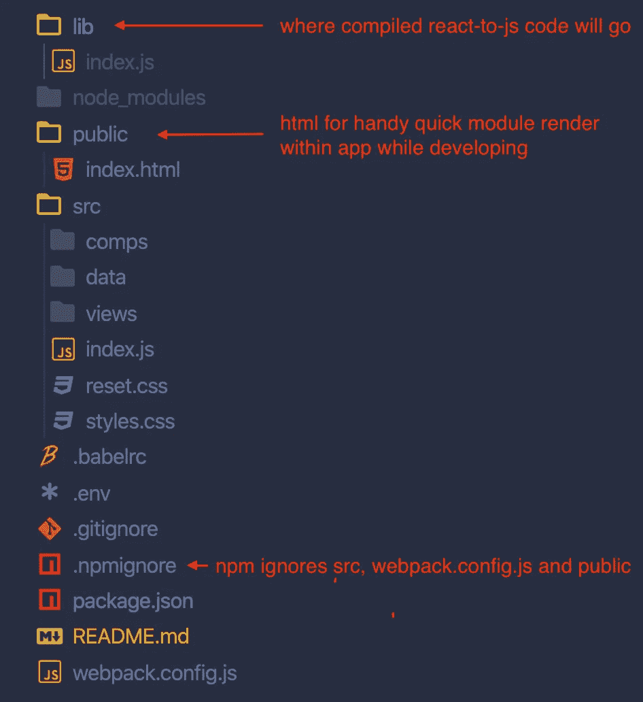
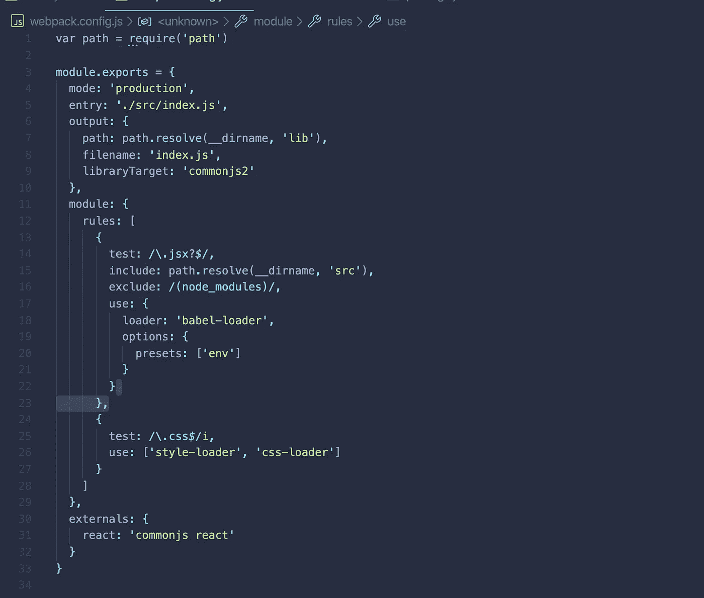
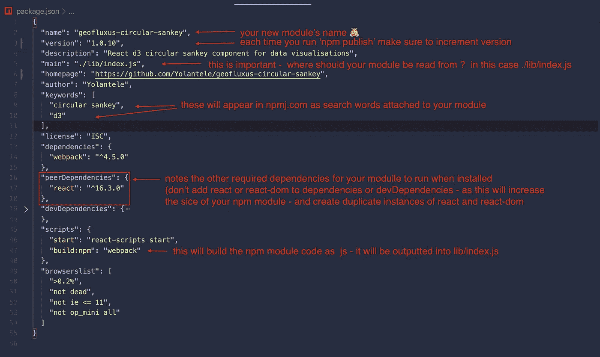
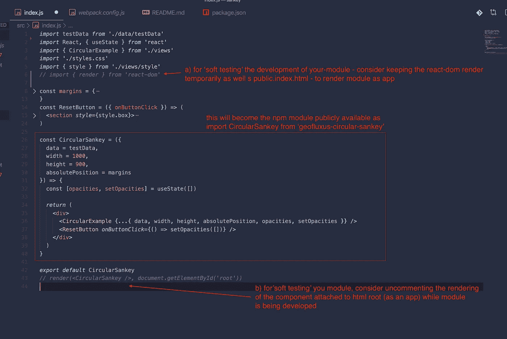
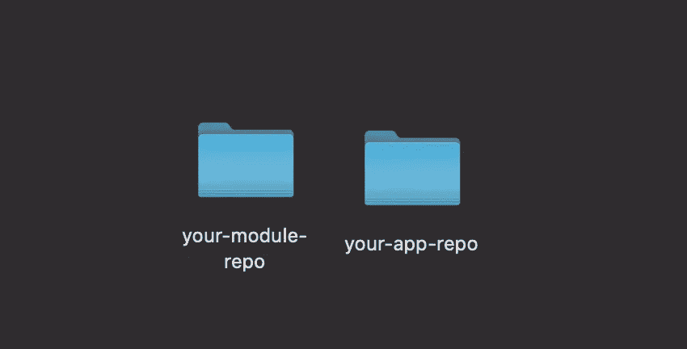
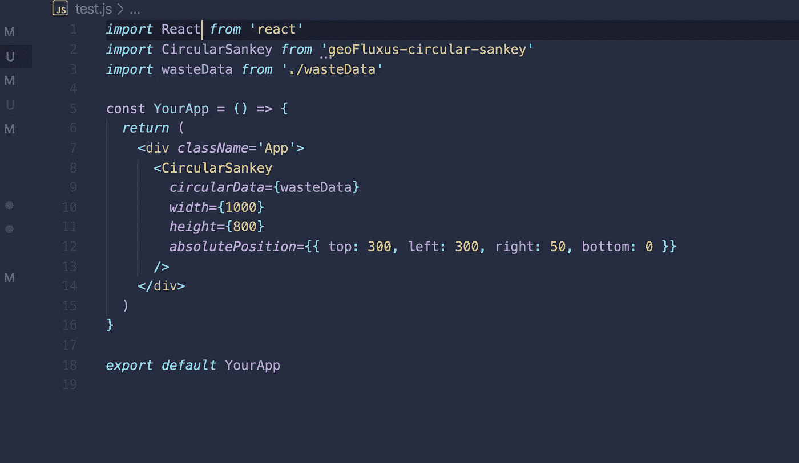

# 如何开发、测试、运行和发布 npm 包

> 原文：<https://javascript.plainenglish.io/how-to-develop-test-run-and-publish-an-npm-module-react-and-webpack-f436adb54bbb?source=collection_archive---------9----------------------->


keep it modular

发布 npm 模块有一些好处。将代码组织成模块化的 **npm** 包将有助于整理代码库，鼓励重用，并且可以成为团队之间甚至不同架构的项目之间更好的共享方式([将 react 组件重新绑定到主干类](https://blog.engineyard.com/integrating-react-with-backbone))！

因此，以下是实现这一目标的关键步骤:

1.  设置一个以 npm 构建为中心的项目——您的模块报告，
2.  使用本地测试运行*和并行测试运行**两种技术，在开发过程中测试运行 npm 模块。

3.将 npm 模块注册并发布到 nmp js。

*临时 react-DOM+index.html 设置，以将其作为应用程序模块目录运行

* *将您的-module 作为 node_module 加载到另一个应用程序的上下文中-您的-app-repo

## 1.设置模块报告—用于发布 npm 模块的 react 项目

使用 yarn 或 npm 设置 **your-module-repo** ，它将包含构建模块的设置。

您不需要 react-dom，因为发布的模块将以组件而不是应用程序的形式出现。但是，对于本地测试运行目的，在作为普通 react 应用程序开发时，使用 react-dom 和 public/index.html 来呈现模块组件是很方便的。

创建一个轻量级 react 项目，并将其结构化为包含 **lib、** **src** 和临时 **public** 文件夹，如下所示:



接下来安装 **webpack** 、 **webpack-cli** (以及您可能用于您的-module-repo 的任何加载程序)。

setup**web pack . config . JS**用于将 react 代码转换为 JS——它将成为 npm 模块(位于 lib/index.js):

```
var path = require('path')module.exports = { mode: 'production',  entry: './src/index.js', output: { path: path.resolve(__dirname, **'lib'**), filename: 'index.js', libraryTarget: 'commonjs2' }, module: { rules: [ // your modules rules, loaders for js, css, and others... ] }, externals: { react: 'commonjs react' }}
```

确保您安装了路径和*其他加载器*，它们在您的-module-repo webpack 设置中作为编译 js、css 和其他文本资源的规则被引用。

这就是我在 **webpack.config.js** 中的配置的最终结果:



Configure your webpack.config.js for npm module build into lib/index.js

接下来—让我们设置**package . JSON**—NPM 发布的主要负载。确保提供主要关键字，例如:**名称、主要、版本、作者、关键字、对等依赖**和构建**脚本。**



configure your package.json for npm module build and publishing

现在让我们用组件填充 **src/index.js** ，该组件应该成为公开可用的 npm 模块。在我的例子中，它看起来像这样:



至此，3 个主 **webpack.config.js** 、 **package.json** 和 **src/index.js** 都已设置好，运行命令时有望顺利运行:

```
yarn build:npm
```

然后检查**lib/index . js**——此时应该填充大量 JS 代码。

## 2.本地测试运行、并行测试运行和测试🚀🚀🚀

希望有时间编写一些单元/集成测试并看到它们通过。

希望您已经使用了临时 react-dom 安装和您的-module-repo 中的 public/index.html 文件来将模块组件本地呈现为 app(如果该部分已经完成，请确保删除 react-dom 和 public/index.html)。最重要的是，希望一切运行、构建和执行顺利。

我很难过打破它——但这些还不足以真正看到当它作为一个小“砖块”被导入到另一个应用程序中时，该模块会播放得很好。


不过不要担心——你可以做一个很好的测试，它会揭示“应用中的模块”的动态，并会节省你很多时间，因为你不需要将模块重新发布到 npmjs.com 100 多次🙃。

## 在并行应用程序(您的应用程序)中测试运行您的模块:

在将模块发布到 npm 之前，使用另一个应用程序项目来模拟安装您的模块:



切换到 **your-app-repo，**从那里**使用*纱添加*和 **your-module-repo 的完整路径。这将把您的-module-repo 添加到 node_modules，就像它是一个 npm 模块一样。所以步骤是:****

a)将您的模块添加到您的应用程序:

在您的-app-repo 的根目录中运行命令，将您的-module-repo 添加为仿 npm 模块:

```
yarn add /Users/<your_name>/Projects/your-module-repo/
```

这将需要一分钟时间，因为您的-module-repo 已添加，并且安装依赖项需要时间。

b)在您的-app-repo 源代码中导入您的-模块。

在 your-app-repo 中，导入 faux-npm 模块，通过 package.json 中给出的名称引用它。

在您的-app-repo/src/index.js 中，我的情况是这样的:



test the integration of your module by adding it to a completely different app and run it locally

现在，运行你的-app-repo 应该可以揭示你的-module 集成得有多好。不要因为错误而气馁…我个人经历了多次调整，直到每个细节都到位🌟。

# 3.向 npmjs.com 注册并发布你的模块

我们快到了😁。感谢本地测试和并行测试——发布模块应该是 1 或 2 个游戏实例😎。

如果你还没有注册，首先去 npmjs.com 注册。请务必确认您收件箱中的电子邮件地址，以便能够发布到 npmjs.com

下一步在你的-模块-回购添加和闪亮的自述文件，将成为你的 npmjs.com/package/your-module-name.的脸

然后，确保您的模块是最新版本:

```
yarn build:npm
```

运行以下命令后，使用相关凭据通过终端登录 npm:

```
npm login
```

并将您的模块发布到 npm:

```
npm publish
```

就这样，希望顺利通过。您可以查看更多信息:

```
npm info your-module-name
```

出版的模块应可在 npmjs.com/package/your-module-name.获得

我希望你喜欢，请鼓掌并订阅🥂

# 来自简明英语团队的说明

简明英语刚刚推出了一个 YouTube 频道！我们希望您现在就通过 [**订阅来支持我们！**](https://www.youtube.com/channel/UCtipWUghju290NWcn8jhyAw)