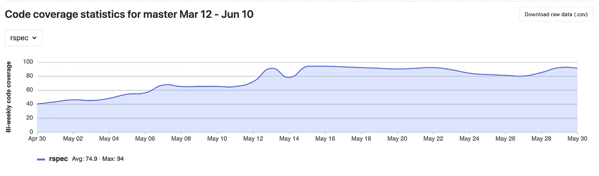
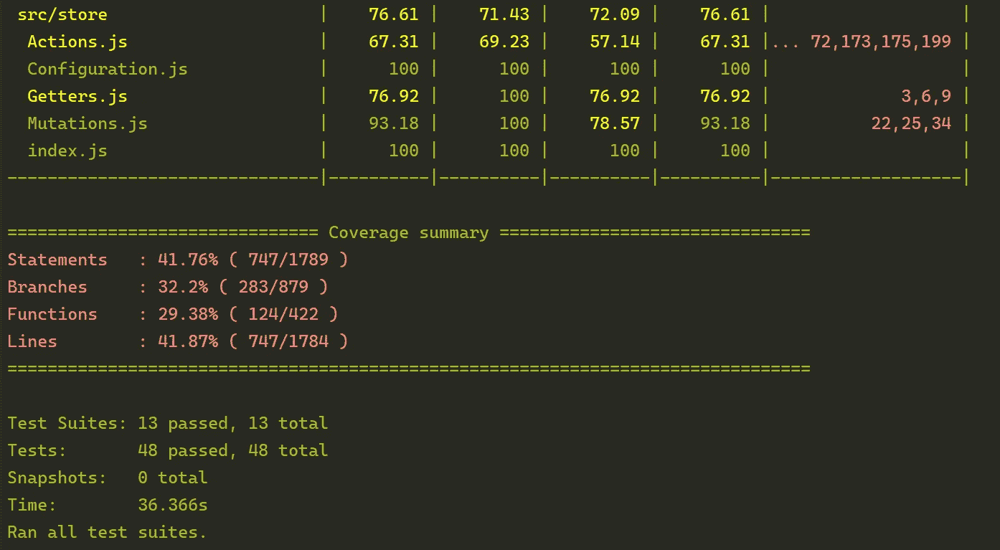
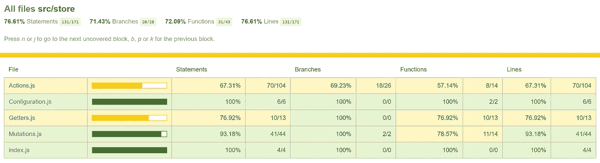
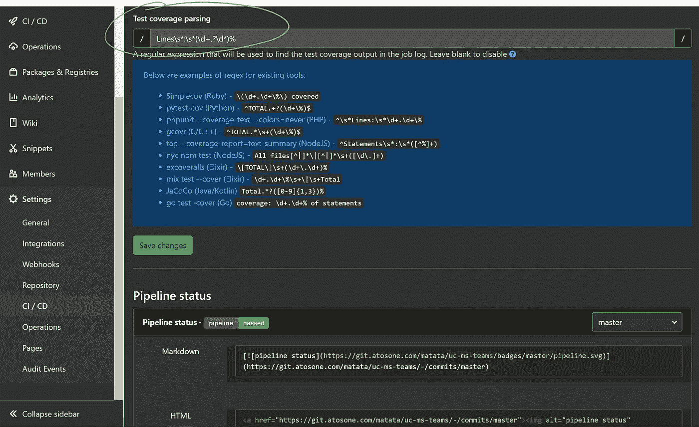
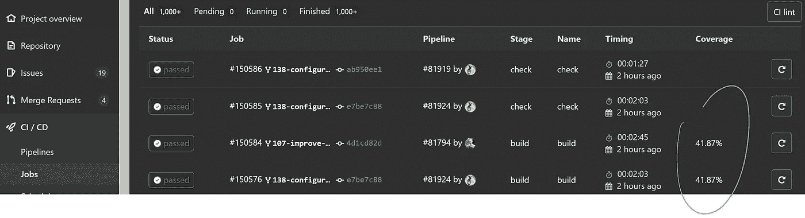

# 如何在 Gitlab 中显示 Vue 项目的代码覆盖率

> 原文：<https://javascript.plainenglish.io/how-to-display-code-coverage-of-a-vue-project-in-gitlab-9d1510a3e794?source=collection_archive---------1----------------------->



有人可能会认为这应该很简单，不需要写文章，至少我是这样认为的。但是当我试图为我的一些项目设置它时，它花费了我比我预期多得多的时间。

为了让它发挥作用，你需要跨越一些障碍。每一个都可以在互联网上的某个地方找到，但是把它们都放在一起有点麻烦。所以我决定写一个快速操作指南，把所有的技巧都放在一个页面上。

# 第一个陷阱

因为您可能已经在运行单元测试，所以您的 package.json 中应该已经有一个类似如下的脚本:

```
"scripts": {
	"serve": "vue-cli-service serve",
	"build": "vue-cli-service build",
	"test:unit": "vue-cli-service test:unit",
	"lint:js": "vue-cli-service lint",
	"lint:css": "stylelint \"src/**/*.scss\""
}
```

第一个窍门来了… Jest，Vue.js 项目中的默认 runner，给控制台输出着色，使其更容易阅读(大多数 runner 都这样做)。不幸的是，颜色与 Gitlab 解析器不兼容。所以你必须通过添加 **—无色**参数来关闭它。

```
"scripts": {
	"serve": "vue-cli-service serve",
	"build": "vue-cli-service build",
	"test:unit": "vue-cli-service test:unit **--no-color**",
	"lint:js": "vue-cli-service lint",
	"lint:css": "stylelint \"src/**/*.scss\""
}
```

# jest 配置

下一步是让 jest 收集覆盖率并生成 Gitlab 能够解析的报告。为此，你必须编辑 **jest.config.js** 文件。
首先通过将 **collectCoverage** 设置为 **true** 来激活覆盖率收集，然后将 **text-summary** 类型添加到 **coverageReporters** 列表中。

```
module.exports = {
	collectCoverage: **true**,
	collectCoverageFrom: ['src/**/*.js', '!**/node_modules/**'],
	coverageDirectory: './coverage',
	coverageReporters: ['html', 'text', '**text-summary**'],
	testMatch: ['**/tests/*.spec.js']
};
```

这将在控制台输出中生成 *coverage summary* 部分，Gitlab 作业可以对其进行解析。



The coverage summary section in the (colored) console reported with the text-summary parameter

此外，上面的设置还会生成一个 HTML 报告，这个报告会更加详细，有助于您找到覆盖范围中的缺口。



The HTML report generated by jest

# 词体

这里显而易见的步骤是让您的 CI 运行测试，以便在 Gitlab 控制台中生成覆盖率输出。这非常简单，因为它只需要用 npm 从 package.json 调用单元测试脚本。

```
image: node

stages:
  - test-unit

test-unit:
  stage: test-unit
  script: **npm run test:unit**
  artifacts:
    when: always
    paths:
      - coverage
    expire_in: 30 days
```

[可选]您可以添加的一个好处是将包含 HTML 报告的 coverage 文件夹上传到 Gitlab artefacts。这样，该工作的每个人都可以获得详细的报告。

在上面的示例中，无论阶段的结果如何(成功或失败),都将始终上传 HTML，并与作业一起存储 30 天。

# 配置 Gitlab

最后一步是配置 Gitlab 解析器，用一个小的正则表达式从控制台中正确地选择我们的覆盖率。不幸的是，Gitlab 默认不支持 Jest，我在网上找不到一个在所有情况下都有效的 Jest，所以我想出了自己的方法:

```
**Lines**\s*:\s*(\d+.?\d*)%
```

你只需要在你项目的 *CI/CD 设置*的*通用管道*区域添加上面的正则表达式。



Regular expression used for test coverage parsing

在我的例子中，我选择使用**行**覆盖，但是如果你更喜欢使用**语句**或者**函数**，你只需要替换正则表达式中的 bold 关键字。

# 包扎

就这样…下次运行您的 CI 时，您应该会看到 Jobs 列表中的 coverage 列开始填充您的结果



Coverage under CI/CD > Jobs

在 *Analytics > Repository* 下也有您的覆盖范围的图形化历史记录

现在唯一要做的就是提高覆盖率😉