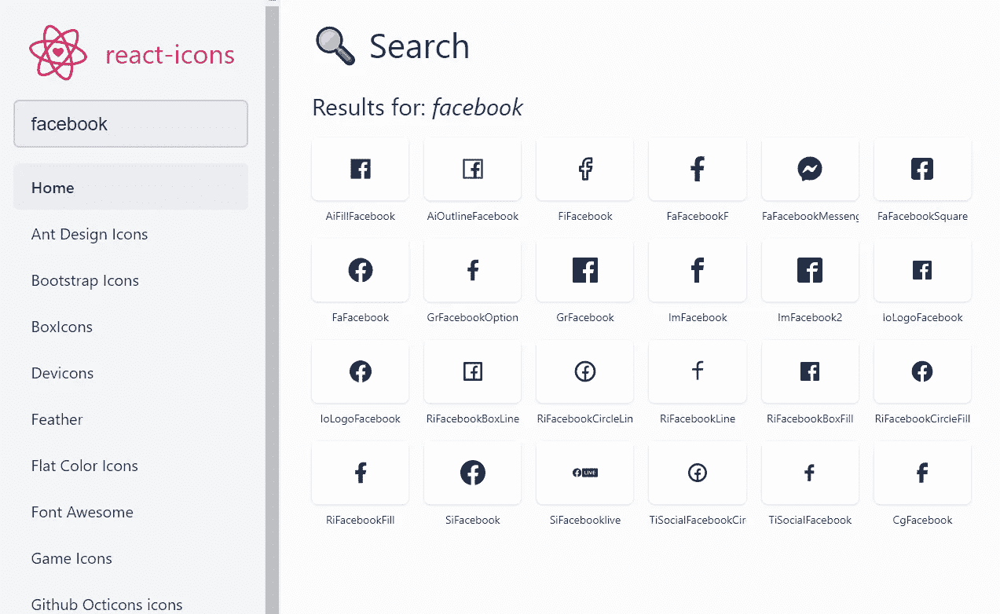
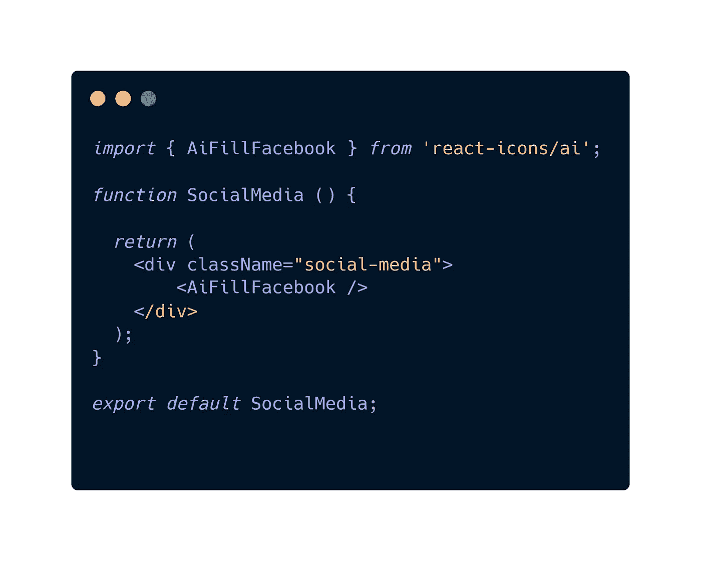
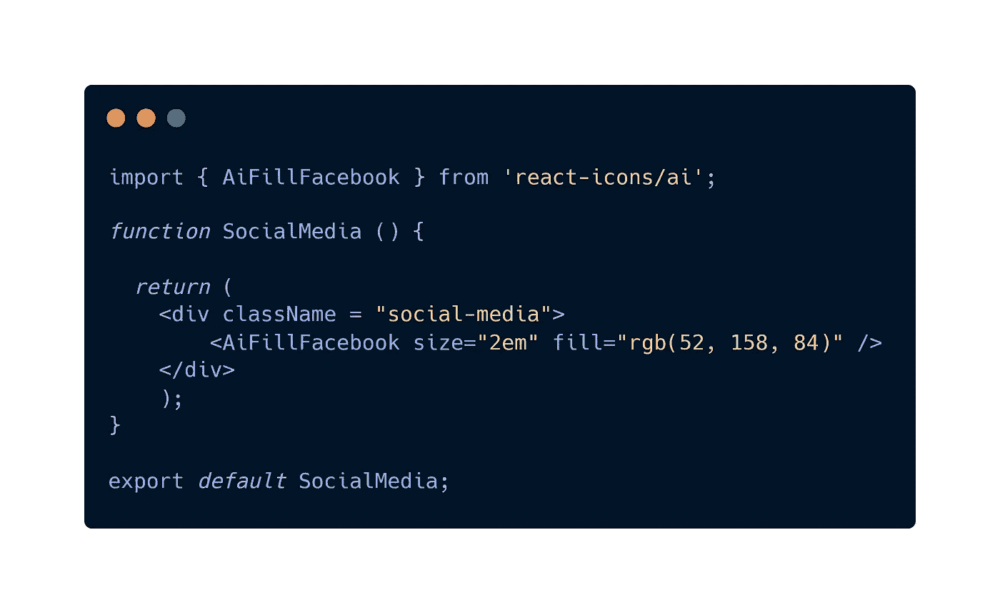

# 如何在 React 中显示图标

> 原文：<https://javascript.plainenglish.io/how-to-display-icons-in-react-e1b650ee8015?source=collection_archive---------5----------------------->

Photo by [Balázs Kétyi](https://unsplash.com/@balazsketyi?utm_source=unsplash&utm_medium=referral&utm_content=creditCopyText) on [Unsplash](https://unsplash.com/s/photos/icons?utm_source=unsplash&utm_medium=referral&utm_content=creditCopyText)

在学习 React.js 的时候，我多次问自己，在我的网站上显示图标的最佳实践是什么？

如果你是一个网页开发者，你应该知道图标是 UI 设计不可或缺的一部分。从社交媒体图标到汉堡菜单，我们几乎在任何地方都使用它们。问自己使用哪组图标并不奇怪。

以前，我们只是使用图像作为图标，但很快就意识到使用图像在分辨率和可扩展性方面表现不佳。JPEG 和 PNG 等图像格式在缩放(放大或缩小)时，渲染质量会大幅下降。此外，我认为最大的缺点是，如果网站使用多个图像作为图标，每个图像都会触发一个新的 HTTP 请求，这严重降低了性能。

现在，我们通常选择图标字体或 SVG 图标(我的偏好)。

## 图标字体

当它们在 2012 年首次出现时，每个人都兴奋不已。图标字体可以放大到任何分辨率，而不会损失视觉质量。它们真的很容易使用，因为它们就是这样——你可以对它们应用任何 CSS 样式规则，并轻松地改变大小、颜色、动画或过渡。真正好的免费图标字体是来自:[字体真棒](https://fontawesome.com/)(现在他们即将推出 v6！)、[材质设计图标](http://google.github.io/material-design-icons/)等。使用图标字体的缺点是，它们会导致生成多个服务器请求，但更令人沮丧的是，它还会导致在字体库仍在加载期间不可见的文本闪烁。此外，如果出于任何原因，浏览器不理解图标字体，而不是图标，将有一个空白空间。

## 那么，为什么选择 SVG 呢？

SVG 代表可缩放矢量图形，SVG 图标系统已经显示出具有较高的渲染质量、较好的性能和良好的定制性。SVG 不是图像或字体，而是直接提供给浏览器的 XML 代码块。当有一个 SVG 时，你可以为 SVG 图标的每一个单独的位设置动画或颜色，不像图标字体，你可以编辑/设置整个图标的动画。使用 SVG 的好处是它只是一段代码，它们的大小比图片(JPEG，PNG)要小得多。在 SVG 和 image 对比的情况下，如果可以的话，你应该总是使用 SVG，但是和图标字体相比，图标字体通常更胜一筹。但是，差异并不显著，可以忽略不计。如果有人关心浏览器支持，SVG 覆盖了 99%+的用户群，因为它们支持 IE9+和 Android 2.3+。

## 反应中的 SVG

我在 React 中显示图标的方法是使用[**React-icons**](https://react-icons.github.io/react-icons/)**包。有了这个包，你可以包含他们支持的库中的任何图标，如果你看一看，他们支持很多图标！一些图标库是:字体真棒，材料设计，离子，羽毛等。只要在他们的网站上搜索你需要的图标，并从中选择一个。**

**例如，我想在我的 React 应用程序中显示一个脸书图标。我在他们的搜索栏中输入脸书，然后回车。这些是我得到的结果:**

****

**假设我喜欢第一个。我按下它，图标的名字就会自动复制——aifill Facebook。前两个字母告诉我应该从哪里导入它们。我们的是“ai”，所以我们的 React 应用应该是这样的:**

****

**如果您想更改大小和颜色，它看起来会像这样:**

****

**那只是我的偏好，你的呢？**