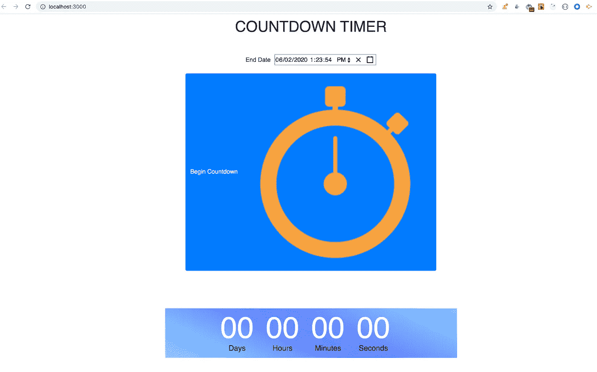
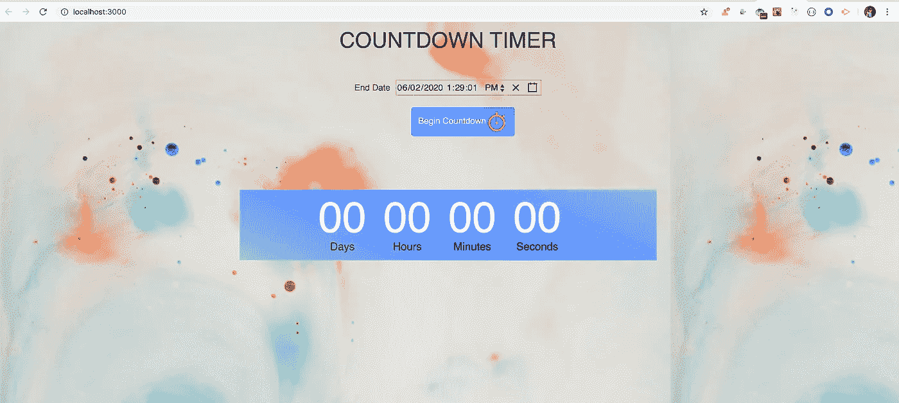
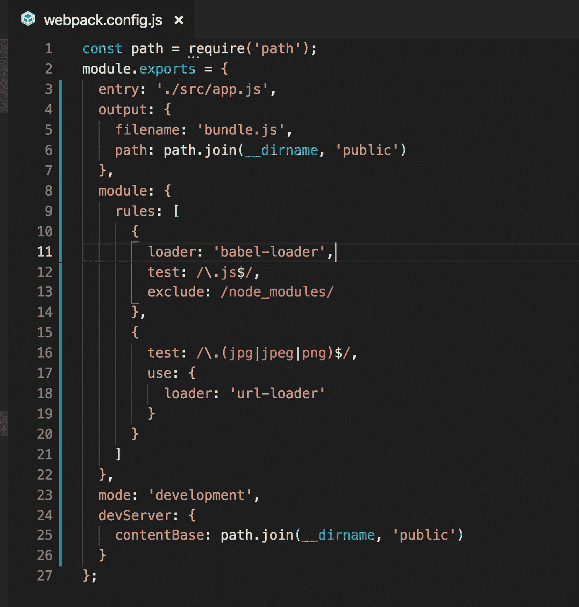

# 使用 React 时如何显示本地资源/图像文件夹中的图像

> 原文：<https://javascript.plainenglish.io/how-to-display-images-from-local-assets-images-folder-when-working-with-react-feb6c5dba526?source=collection_archive---------0----------------------->

## 这并不像看起来那么简单


Photo by [Caspar Camille Rubin](https://unsplash.com/@casparrubin?utm_source=medium&utm_medium=referral) on [Unsplash](https://unsplash.com?utm_source=medium&utm_medium=referral)

在本文中，我们将看到如何在使用 React 时加载本地图像。那么让我们开始吧。

**1。使用 Create React App 时:**

首先，从[这里](https://github.com/myogeshchavan97/countdown_timer)克隆我在[这篇文章](https://medium.com/javascript-in-plain-english/this-is-how-i-created-a-countdown-timer-app-in-react-3644afbaabf6)中创建的倒数计时器存储库代码

克隆完成后，运行以下命令启动应用程序

1.npm 安装
2。npm 开始

现在，从[这里](https://github.com/myogeshchavan97/countdown_timer_updated/tree/master/src/images)下载我们将用来展示的图片。
在项目的 src 目录下创建一个名为 *images* 的新目录，并将这些下载的图像放在 src/images 目录下

现在，打开 Timer.js 并搜索**开始倒计时**按钮，我们将在按钮内添加一个图像

```

```

所以你的按钮代码看起来像这样

```
<Button
 variant="primary"
 type="button"
 onClick={this.calculateCountdown}
>
Begin Countdown

</Button>
```

如果您保存文件并加载应用程序，您将会看到，没有显示图像，但显示了带有 alt 文本的按钮的损坏图标。


因此，要解决这个问题，我们需要使用 require 语法来包含图像

```

```

现在您会看到，图像如下所示加载



但是图像本身太大了，让我们添加一些 css 来使它看起来更好

在 styles.css 中添加以下 css

```
img {
 width: 40px;
 height: 40px;
}.btn-start {
 margin-left: 5%;
}
```

并为按钮添加 *btn-start* 类

```
<Button
 className="btn-start"
 variant="primary"
 type="button"
 onClick={this.calculateCountdown}
>
Begin Countdown

</Button>
```

所以现在按钮和图像看起来会很好


让我们添加一些背景图像到应用程序，使应用程序看起来很好。
在 style.css 中为 body 标签添加背景属性

```
body {
 padding: 10px;
 font-family: sans-serif;
 background: url('./images/background.jpeg');
 text-align: center;
}
```

现在，应用程序看起来会很好。



**注意:**由于背景图像是从 CSS 文件加载的，所以显示正确。只有当我们使用 img 标签加载本地图像时，我们才需要使用 require 语法

Github 源代码:[https://github.com/myogeshchavan97/countdown_timer_updated](https://github.com/myogeshchavan97/countdown_timer_updated)

**2。使用自己的网络包和巴别塔设置时:**

如果您有自己的 webpack 和 babel 设置，如本文[这里](https://medium.com/javascript-in-plain-english/webpack-and-babel-setup-with-react-from-scratch-bef0fe2ae3e7)所述，那么您需要遵循以下步骤

1.  使用以下命令安装 url 加载程序 npm 软件包

```
npm install url-loader@3.0.0
```

2.将 webpack.config.js 中的 url-loader 配置添加为

```
{
 test: /\.(jpg|jpeg|png)$/,
 use: {
  loader: 'url-loader'
 }
}
```



3.将图像导入为

```
import timerImage from './images/timer.png';
```

4.使用 img 标签中的图像

```

```

今天到此为止。希望你今天学到了新东西。

**别忘了直接在你的收件箱** [**这里**](https://yogeshchavan.dev) **订阅我的每周时事通讯，里面有惊人的技巧、诀窍和文章。**