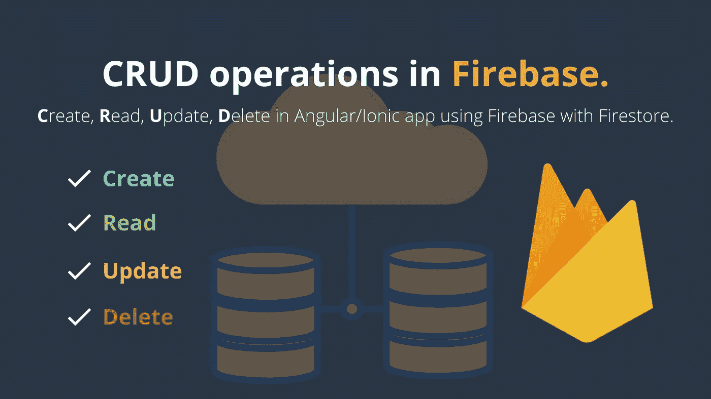
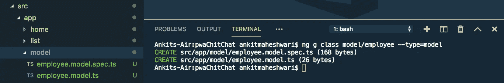
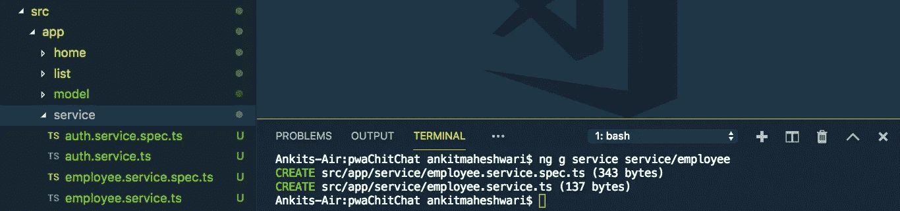
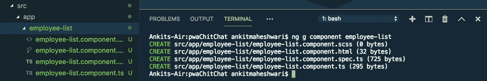

# 如何用 Firestore 在 Firebase 中进行 CRUD 查询操作？(角形/离子形/网状)

> 原文：<https://javascript.plainenglish.io/how-to-do-crud-query-operations-in-firebase-with-firestore-angular-ionic-web-cfd662165fd7?source=collection_archive---------4----------------------->



[奖励:您将学习创建角度模型、服务和组件]。
CRUD — **C** reate， **R** ead， **U** pdate， **D** 在使用 Firebase 和 Firestore 的角度应用或离子应用中删除操作。该数据库是一个 Firestore 数据库，位于云上。


## 📥下载源代码:[克隆 GitHub 库👆](https://github.com/AnkitMaheshwariIn/IonicPWA-WithFirestoreCRUD-WithFirebaseStorageUpload)。
📺查看演示:[点击此处观看演示👆](https://pwachitchat.firebaseapp.com/)。

自己动手…
**好吧，跟我来，我带你看看 Firebase Firestore 里的 CRUD。**

# 第 1 步—设置 Firebase

**在我们的项目中，首先我们需要** [**用 Firestore**](https://medium.com/@AnkitMaheshwariIn/how-to-add-firebase-in-pwa-or-angular-project-using-angularfire-b0379c08249d) **添加 Firebase。**
(点击这里[👆](https://medium.com/@AnkitMaheshwariIn/how-to-add-firebase-in-pwa-or-angular-project-using-angularfire-b0379c08249d))

好的，我假设你已经按照上面的链接↑中的每一步来设置 Firestore 的 Firebase。

# 第 2 步—创建一个角度模型

在我们的项目中用 Firestore 设置了 Firebase 之后，我们可以继续创建一个模型类。在这个例子中，我们假设我们正在为一个雇员创建一个模型类。

让我们为我们的雇员实体创建一个模型如下:
(确保在你的项目根目录下运行下面的命令)

```
ng g class model/employee --type=model
```

这个命令将生成两个类型脚本文件——请看下面👇



接下来，打开`src/app/model/employee.model.ts`文件，并更新如下:

```
export class Employee {
    id: string;
    name: string;
    phone: number;
    designation: string;
    salary: number;
    joinDate: Date;
    address: string;
    extraInfo: string;
}
```

# #3 步骤—创建有角度的服务

Angular 服务允许我们封装需要在项目的许多地方重复的代码。

让我们为我们的员工创建一个服务，如下所示:
(确保在您的项目根目录下运行以下命令)

```
ng g service service/employee
```

这个命令将生成两个类型脚本文件——请看下面👇



接下来，打开`src/app/service/employee.service.ts`文件，逐步更新代码:

1)顶部的`employee.service.ts`文件导入`AngularFirestore`和`Employee`模式如下:

```
import { AngularFirestore } from '@angular/fire/firestore';
import { Employee } from 'src/app/model/employee.model';
```

2)通过其构造函数将`AngularFirestore`注入到我们的服务中:

```
...
export class EmployeeService {

  constructor(private firestore: AngularFirestore) { }
}
```

**重要须知:**

*   Firestore 在集合中存储数据。
*   我们可以把集合看作 SQL 中的表。
*   添加操作每个条目都在集合中创建新文档。
*   文档以 JSON 对象的形式存储数据。

**在我们的例子中:**
【员工】将是 Firestore DB 中的集合名称。

3)在 Firestore 集合中为**添加**新员工(新文档)添加`addEmployee()`方法:
在`employee.service.ts`文件中添加如下函数

```
...
export class EmployeeService {

  constructor(private firestore: AngularFirestore) { }

  ...
  // this method takes an employee object and 
  // add a new employee to Firestore database collection
  addEmployee(employee: Employee) {
    // convert object of type Employee to JSON object
    // because Firestore understand JSON
    const employeeObject = {...employee};
    return this.firestore.collection('Employees').add(employeeObject);
  }
}
```

4)添加`getEmployees()`方法到**从 Firestore 集合中检索**员工:

```
export class EmployeeService {

  constructor(private firestore: AngularFirestore) { }

  ...
  // this method returns list of employees document,
  // fetched from Firestore database collection
  getEmployees() {
    return this.firestore.collection('Employees').snapshotChanges();
  }
}
```

5)添加`updateEmployee()`方法到**更新 Firestore 集合中一个员工的**信息(更新文档):

```
...
export class EmployeeService {

  constructor(private firestore: AngularFirestore) { }

  ...
  // this method takes an employee object and
  // update an object of employee to the Firestore document
  updateEmployee(employee: Employee) {
    // convert object of type Employee to JSON object
    // because Firestore understand JSON
    const employeeObject = {...employee};
    this.firestore.doc('Employees/' + employee.id).update(employeeObject);
  }
}
```

6)添加`deleteEmployee()`方法到**删除**Firestore 集合中的一个员工文档:

```
...
export class EmployeeService {

  constructor(private firestore: AngularFirestore) { }

  ...
  // this method takes an employee Id and
  // delete an employee document from the Firestore collection
  deleteEmployee(employeeId: string) {
    this.firestore.doc('Employees/' + employeeId).delete();
  }
}
```

`src/app/service/employee.service.ts`文件的**最终代码**:

# 到目前为止，我们已经创建了一个“模型”和一项“服务”。
增加了对 Firebase 执行 CRUD 操作的方法。

现在是利用这些方法的时候了。跟我来..

# #4 步骤-创建一个角度组件

我们将在这个**组件中测试 CRUD 操作。为此，我们将使用我们在员工服务中创建的方法。**

让我们为我们的雇员创建一个组件如下:
(确保在你的项目根目录下运行下面的命令)

```
ng g component employee-list
```

这个命令将生成四个类型脚本文件——请看下面👇



# 重要的

不要忘记为这个新的`component` `employee-list`做路由。
**分两步做:**
**#1。**在`app-routing.module.ts`文件中定义您的`component`路线。
**#2。**在`app.module.ts`文件中声明你的`component`。

# 让我们这样做…

**#1。**打开您的`src/app/app-routing.module.ts`文件，并更新如下:

```
...

import { EmployeeListComponent } from './employee-list/employee-list.component';

const routes: Routes = [
  ...
  {
    path: 'employees',
    component: EmployeeListComponent
  }
];

...
```

**#2。**打开您的`src/app/app.module.ts`文件，并更新如下:

```
...

import { EmployeeListComponent } from './employee-list/employee-list.component';

@NgModule({
  declarations: [
    AppComponent,
    EmployeeListComponent
  ],
  ...
})

...
```

更深入地了解角度组件的'[路径选择'](https://medium.com/@AnkitMaheshwariIn/routing-of-an-angular-component-angular-routing-2b7e53046542) '
( [点击此处)👆](https://medium.com/@AnkitMaheshwariIn/routing-of-an-angular-component-angular-routing-2b7e53046542))

**下一个**，打开`src/app/employee-list/employee-list.component.ts`文件，更新如下:

在 Angular **中，组件初始化时，将首先调用构造函数**，稍后在构造函数方法之后调用 **ngOnInit** 。
进一步了解**构造器**与 **ngOnInit** **的[区别。](https://medium.com/@AnkitMaheshwariIn/difference-between-constructor-and-ngoninit-in-angular-537ecfa6ce1e)**
( [点击这里👆](https://medium.com/@AnkitMaheshwariIn/difference-between-constructor-and-ngoninit-in-angular-537ecfa6ce1e))

接下来，打开`src/app/employee-list/employee-list.component.html`文件并按如下方式更新它:

# 奖金🤩Firebase Firestore 中的高级查询:

*   **A)单笔 where 语句查询。**
*   **B)多个 where 语句查询。**
    1)查询“多个”where 语句。
    2)查询范围'> = '运算符。
    3)按‘升序’查询订单。
    4)按日期或字符串“降序”查询订单。5)对查询结果应用限制。通过属性进行偏移，假设我们想要名字以' An '开头的雇员，然后应用 startAt('An ')

→阅读以下代码文件的注释非常重要。
→在测试此代码以读取查询错误时，也要打开浏览器控制台。

**现在**，打开`src/app/service/employee.service.ts`文件，更新如下:

## 查询的快速摘要👇我们在上面的代码中使用 Firebase Firestore:

# 搞定了。🤩用 Firestore 在 Firebase 中进行 CRUD 操作就是这么简单。

再见👋👋

# 接下来，您可以涵盖:

1.  如何使用 AngularFire 在 PWA 或 Angular project 中添加 Firebase。([点击这里👆](https://medium.com/@AnkitMaheshwariIn/how-to-add-firebase-in-pwa-or-angular-project-using-angularfire-b0379c08249d))
2.  [使用 AngularFire 将 Firebase 认证](https://medium.com/@AnkitMaheshwariIn/how-to-add-firebase-authentication-to-pwa-or-angular-project-using-angularfire-83a8f61d367c)添加到 PWA 或 Angular 项目。([点击这里👆](https://medium.com/@AnkitMaheshwariIn/how-to-add-firebase-authentication-to-pwa-or-angular-project-using-angularfire-83a8f61d367c))
3.  [将项目](https://medium.com/@AnkitMaheshwariIn/deploy-project-to-firebase-hosting-ce6acbd06435)部署到 Firebase 主机。([点击这里👆](https://medium.com/@AnkitMaheshwariIn/deploy-project-to-firebase-hosting-ce6acbd06435))

> 请在评论框中随意评论…如果我错过了什么，或者什么是不正确的，或者什么对你不起作用:)
> 
> 更多文章敬请关注:【https://medium.com/@AnkitMaheshwariIn】

如果你不介意给它一些掌声👏 👏既然有帮助，我会非常感谢:)帮助别人找到这篇文章，所以它可以帮助他们！

永远鼓掌…


*原载于 2019 年 12 月 26 日*[*https://www.codewithchintan.com*](https://www.codewithchintan.com/crud-in-firebase-with-firestore/)*。*