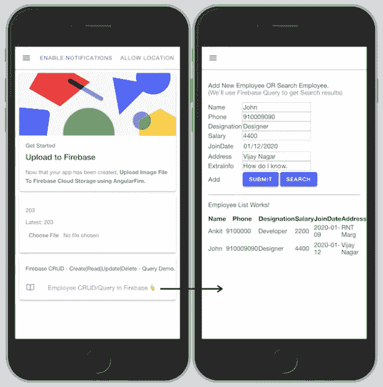
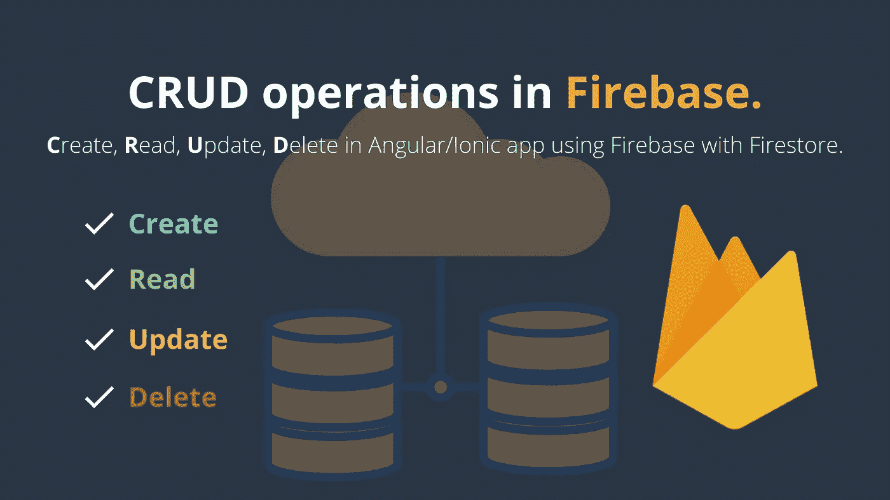
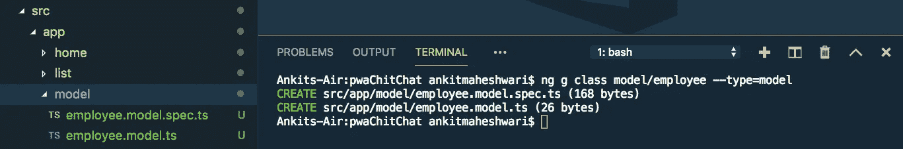
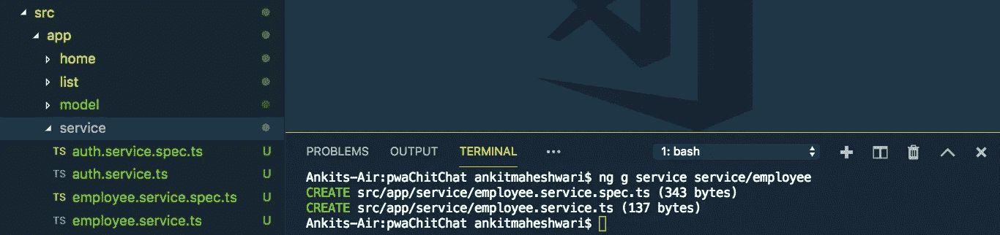
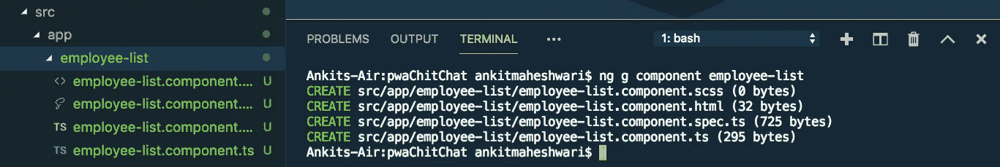

# 如何用 Firestore 在 Firebase 中进行 CRUD 与查询操作？(角形/离子形/网状)

> 原文：<https://javascript.plainenglish.io/how-to-do-crud-with-query-operations-in-firebase-with-firestore-angular-ionic-web-9c9e3db4ce72?source=collection_archive---------2----------------------->

[奖励:您将学习创建角度模型、服务和组件]。
CRUD — **C** reate， **R** ead， **U** pdate， **D** elete 操作在角度应用程序或 Ionic app 中使用 Firebase with Firestore。该数据库是一个 Firestore 数据库，位于云上。

[](https://medium.com/codechintan/everything-you-need-to-know-about-angular-framework-typescript-10049b858ae0) [## 关于 Angular framework/TypeScript 你需要知道的一切。

### 完整的角度系列-什么是角度/类型脚本？|为什么我们需要有棱角？|使用 Angular 的好处？|…

medium.com](https://medium.com/codechintan/everything-you-need-to-know-about-angular-framework-typescript-10049b858ae0) 

## 📥下载源代码:[克隆 GitHub 库👆](https://github.com/AnkitMaheshwariIn/IonicPWA-WithFirestoreCRUD-WithFirebaseStorageUpload)。
📺查看演示:[点击此处观看演示👆](https://pwachitchat.firebaseapp.com/)。



# 好吧，跟我来，我带你看看火焰基地的垃圾。接下来，[在 Firebase Firestore 中进行查询操作](https://www.codewithchintan.com/crud-in-firebase-with-firestore/#FSQuery)。

# 第 1 步—设置 Firebase

**在我们的项目中，首先我们需要** [**用 Firestore**](https://www.codewithchintan.com/how-to-add-firebase-to-pwa-or-an-angular-project-using-angularfire/) **添加 Firebase。**
(点击此处)👆)

好的，我假设你已经按照上面的链接↑中的每一步来设置 Firestore 的 Firebase。

# 第 2 步—创建一个角度模型

在我们的项目中用 Firestore 设置了 Firebase 之后，我们可以继续创建一个模型类。在这个例子中，我们假设我们正在为一个雇员创建一个模型类。

让我们为我们的雇员实体创建一个模型如下:
(确保在你的项目根目录下运行下面的命令)

```
ng g class model/employee --type=model
```

这个命令将生成两个类型脚本文件——请看下面👇



接下来，打开`src/app/model/employee.model.ts`文件，并更新如下:

# #3 步骤—创建有角度的服务

Angular 服务允许我们封装需要在项目的许多地方重复的代码。

让我们为我们的员工创建一个服务，如下所示:
(确保在您的项目根目录下运行以下命令)

```
ng g service service/employee
```

这个命令将生成两个类型脚本文件——请看下面👇



接下来，打开`src/app/service/employee.service.ts`文件，逐步更新代码:

1)在`employee.service.ts`文件的顶部导入`AngularFirestore`和`Employee`模型如下:

```
import { AngularFirestore } from '@angular/fire/firestore'; 
import { Employee } from 'src/app/model/employee.model';
```

2)通过构造函数将`AngularFirestore`注入我们的服务:

```
...
export class EmployeeService {

  constructor(private firestore: AngularFirestore) { }
}
```

**重要须知:**

*   Firestore 在集合中存储数据。
*   我们可以把集合看作 SQL 中的表。
*   添加操作每个条目都在集合中创建新文档。
*   文档以 JSON 对象的形式存储数据。

**在我们的案例中:**
‘员工’将是 Firestore DB 中的集合名称。

3)将`addEmployee()`方法添加到**在 Firestore 集合中添加**新员工(新文档):

4)添加`getEmployees()`方法到**从 Firestore 集合中检索**雇员:

5)在 Firestore 集合中添加`updateEmployee()`方法到**更新**一个员工的信息(更新文档):

6)添加`deleteEmployee()`方法到**删除**Firestore 集合中的一个员工文档:

`src/app/service/employee.service.ts`文件的**最终代码**:

# 到目前为止，我们已经创建了一个“模型”和一项“服务”。
增加了对 Firebase 执行 CRUD 操作的方法。

现在是利用这些方法的时候了。跟我来..

# #4 步骤-创建一个角度组件

我们将在这个**组件中测试 CRUD 操作。为此，我们将使用我们在员工服务中创建的方法。**

让我们为我们的雇员创建一个组件如下:
(确保在你的项目根目录下运行下面的命令)

```
ng g component employee-list
```

这个命令将生成四个类型脚本文件——请看下面👇



# 重要的

不要忘记对这个新的`component` `employee-list`进行布线。
**分两步做:**
**#1。**在`app-routing.module.ts`文件中定义你的`component`路线。
**#2。**在`app.module.ts`文件中声明你的`component`。

# 让我们开始吧…

**#1。**打开您的`src/app/app-routing.module.ts`文件，并更新如下:

```
...

import { **EmployeeListComponent** } from './employee-list/employee-list.component';

**const routes: Routes = [
  ...
  {
    path: 'employees',
    component: EmployeeListComponent
  }
];**

...
```

**#2。**打开您的`src/app/app.module.ts`文件，并更新如下:

```
...

import { **EmployeeListComponent** } from './employee-list/employee-list.component';

@NgModule({
  declarations: [
    AppComponent,
    **EmployeeListComponent**
  ],
  ...
})

...
```

深入了解关于角形部件的[布线的更多信息——](https://www.codewithchintan.com/angular-routing/)[点击此处👆](https://www.codewithchintan.com/angular-routing/)

**下一个**，打开`src/app/employee-list/employee-list.component.ts`文件，更新如下:

在 Angular **中，组件初始化时，将首先调用构造函数**，稍后在构造函数方法后调用 **ngOnInit** 。
了解更多关于**构造器**和 **ngOnInit** — [的区别点击此处👆](https://www.codewithchintan.com/difference-between-constructor-and-ngoninit/)

接下来，打开`src/app/employee-list/employee-list.component.html`文件并按如下方式更新它:

# 奖金🤩Firebase Firestore 中的高级查询:

*   **A)单一 where 语句查询。**
*   **B)多个 where 语句查询。**
    1)查询“多个”where 语句。
    2)查询范围“> =”运算符。
    3)按‘升序’查询订单。
    4)按日期或字符串“降序”查询订单。5)对查询结果应用限制。
    6)通过属性偏移，假设我们想要名字以‘An’开头的雇员，然后应用 startAt(‘An’)

→阅读以下代码文件的注释非常重要。
→在测试此代码以读取查询错误时，也要打开浏览器控制台。

**现在**，打开`src/app/service/employee.service.ts`文件，更新如下:

## 这就是全部👇我们在 Firebase Firestore 中提前讨论了查询:

# 搞定了。🤩用 Firestore 在 Firebase 中进行 CRUD 操作就是这么简单。

再见👋👋

# 接下来，您可以涵盖:

1.  如何使用 AngularFire 在 PWA 或 Angular project 中添加 Firebase。([点击这里👆](https://www.codewithchintan.com/how-to-add-firebase-to-pwa-or-an-angular-project-using-angularfire/))
2.  [使用 AngularFire 将 Firebase 认证](https://www.codewithchintan.com/how-to-add-firebase-authentication-to-pwa-or-angular-project-using-angularfire-with-ionic4-and-angular/)添加到 PWA 或 Angular 项目。([点击这里👆](https://www.codewithchintan.com/how-to-add-firebase-authentication-to-pwa-or-angular-project-using-angularfire-with-ionic4-and-angular/))
3.  [部署项目](https://www.codewithchintan.com/deploy-project-to-firebase-hosting/)到 Firebase 托管。([点击这里👆](https://www.codewithchintan.com/deploy-project-to-firebase-hosting/))

> 欢迎在评论框中发表评论…如果我错过了什么，或者有什么是不正确的，或者有什么不适合你:)
> 保持联系，获取更多文章。
> 
> 更多文章敬请关注:
> [https://medium.com/@AnkitMaheshwariIn](https://medium.com/@AnkitMaheshwariIn)

如果你不介意给它一些掌声👏 👏既然有帮助，我会非常感谢:)帮助别人找到这篇文章，所以它可以帮助他们！

永远鼓掌…


*原载于 2019 年 12 月 26 日*[*https://www.codewithchintan.com*](https://www.codewithchintan.com/crud-in-firebase-with-firestore/)*。*

# 了解更多信息

[](https://www.codewithchintan.com/javascript-callbacks-promises-async-await/) [## 使用' Promises' | Async/Await |代替 JavaScript 回调。

### 我们应该使用允许我们访问异步方法并将值返回给同步方法的承诺。还有…

www.codewithchintan.com](https://www.codewithchintan.com/javascript-callbacks-promises-async-await/) [](https://www.codewithchintan.com/two-way-data-binding-in-angular/) [## Angular 中双向数据绑定的背后是什么？

### 数据绑定允许组件和 DOM (HTML 模板)之间的通信。数据绑定有四种形式…

www.codewithchintan.com](https://www.codewithchintan.com/two-way-data-binding-in-angular/) [](https://www.codewithchintan.com/angular-async-pipe/) [## Angular:使用异步管道来管理可观察的订阅并防止内存泄漏。

### Async-Pipe 是一个 Angular 内置工具，用于管理可观察订阅。我们可以轻松简化的功能…

www.codewithchintan.com](https://www.codewithchintan.com/angular-async-pipe/) [](https://www.codewithchintan.com/angular-route-guards/) [## 使用角形护线板保护角形页面。允许/拒绝/重定向。

### 路由保护是 Angular 路由器的一个重要功能，它允许或拒绝用户访问路由页面…

www.codewithchintan.com](https://www.codewithchintan.com/angular-route-guards/) [](https://www.codewithchintan.com/angular-routing/) [## 角度组件的布线|角度布线。

### 路由意味着从一个页面移动到另一个页面。角度使用户能够从一个视图导航到下一个视图…

www.codewithchintan.com](https://www.codewithchintan.com/angular-routing/)