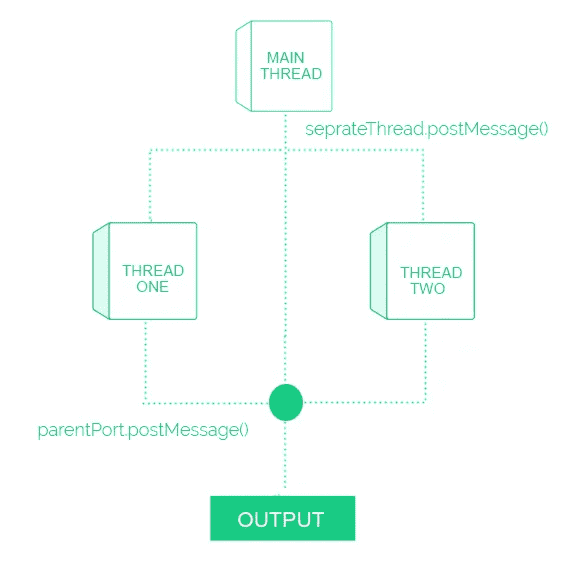

# 如何使用 Node.js 实现多线程

> 原文：<https://javascript.plainenglish.io/how-to-do-multithreading-with-node-js-207aabdaddfb?source=collection_archive---------2----------------------->

随着版本 13 的发布，Node.js 能够进行多线程处理。


This cover has been designed using resources from [Freepik.com](https://www.freepik.com/)

# 介绍

大多数 JavaScript 开发人员认为 Node.js 是单线程的，它通过非阻塞异步回调进程来处理多个操作，并且不支持多线程，但是它不再有效了。在 Node.js 版本 13 中，有一个名为工作线程的新模块来实现多线程。

尽管非阻塞异步回调可以非常有效地处理多个操作，但是像加密这样需要大量 CPU 利用率的函数会阻塞其他进程，对于这种情况，Node.js 的性能是很弱的。工作线程模块通过隔离该函数克服了这个弱点，该函数将较高的 CPU 使用率放入一个单独的线程中，并在后台处理它，不会阻塞任何其他进程。

# **实施**

通常在 Node.js 中，主线程处理所有的操作。借助一个例子，这里演示了如何创建另一个线程来处理一个操作。这个例子有两个 API，第一个 API 将在主线程上处理函数，另一个 API 将在单独的线程上处理函数。下面的代码片段显示了该示例的基本结构。

```
/*
*  File Name: index.js
*  Description: This is the main thread
*/const express = require("express");const app = express();
const port = 3000;app.get("/", (req, res) => {
res.send("Process function on main thread.");
});app.get("/seprate-thread", (req, res) => {
res.send("Process function on seprate thread.");
});app.listen(port, () => {
console.log(`Example app listening at [http://localhost:${port}`);](http://localhost:${port}`);)
});
```

作为第一步，我们在主线程上添加一个函数，作为下一步，我们在另一个线程上添加相同的函数。使用的函数将是 getSum，它将返回作为参数给出的极限值的累计总和。将 getSum 函数添加到主线程后，代码片段如下所示。

```
/*
*  File Name: index.js
*  Description: This is the main thread
*/const express = require("express");const app = express();
const port = 3000;const getSum = (limit) => {
let sum = 0;
for (let i = 0; i < limit; i++) {
     sum += i;
}
return sum;
};app.get("/", (req, res) => {const result = getSum(1000);
res.send(`Processed function getSum on main thread and result: ${result}`);});app.get("/seprate-thread", (req, res) => {
res.send("Process function getSum on seprate thread.");
});app.listen(port, () => {
console.log(`Example app listening at [http://localhost:${port}`);](http://localhost:${port}`);)
});
```

下一步是在另一个线程上添加相同的函数，它可以如下进行。

*   将工作线程模块导入主线程。

```
const { Worker } = require("worker_threads");
```

*   创建另一个文件，seprateThread.js，用于定义在另一个线程上运行的函数 getSum。
*   创建工作线程模块的实例，并提供新创建文件的路径名。

```
const seprateThread = new Worker(__dirname + "/seprateThread.js");
```

*   开始新的线程

```
seprateThread.on("message", (result) => {
res.send(`Processed function getSum on seprate thread:  ${result}`);
});
```

*   向新线程发送数据。

```
seprateThread.postMessage(1000);
```

最后，主线程将像下面的代码片段一样。

```
/*
*  File Name: index.js
*  Description: This is the main thread
*/const express = require("express");
const { Worker } = require("worker_threads");const app = express();
const port = 3000;const getSum = (limit) => {
let sum = 0;
for (let i = 0; i < limit; i++) {
     sum += i;
}
return sum;
};app.get("/", (req, res) => {const result = getSum(1000);
res.send(`Processed function getSum on main thread and result: ${result}`);});app.get("/seprate-thread", (req, res) => {const seprateThread = new Worker(__dirname + "/seprateThread.js");
seprateThread.on("message", (result) => {
res.send(`Processed function getSum on seprate thread: ${result}`);
});
seprateThread.postMessage(1000);});app.listen(port, () => {
console.log(`Example app listening at [http://localhost:${port}`);](http://localhost:${port}`);)
});
```

因此，从主线程创建了一个新的线程。让我们把 getSum 函数放在新创建的线程上，这样就在文件 seprateThread.js 上定义了该函数。检查以下代码以供参考。

```
/*
*  File Name: seprateThread.js
*  Description: This is another thread
*/const { parentPort } = require("worker_threads");const getSum = (limit) => {
  let sum = 0;
  for (let i = 0; i < limit; i++) {
    sum += i;
  }
  return sum;
};parentPort.on("message", (limit) => {
 const result = getSum(limit);
 parentPort.postMessage(result);
});
```

在上面的例子中，您可以看到主线程用来与子线程通信的`seprateThread.postMessage()`函数。同样，子线程使用`parentPort.postMessage()`与主线程通信。下图说明了子线程和主线程之间的通信。



# 特征

*   每个线程都有独立的 v8 引擎。
*   子线程可以相互通信。
*   子线程可以共享相同的内存。
*   启动新线程时，初始值可以作为选项传递。

# 结论

本文的目的是简要介绍 Node.js 上多线程的基本实现。Node.js 中的多线程与传统的多线程略有不同。建议对于大量 I/O 操作，主线程比工作线程做得更好。要了解关于多线程的更多信息，请参考 Node.js 官方[文档](https://nodejs.org/api/worker_threads.html)和此处可用示例的源代码。

[](https://github.com/krishheii/Multithreading) [## krish heii/多线程

### 多线程使用 Node.js .通过在 GitHub 上创建一个账号，为 krish heii/多线程开发做贡献。

github.com](https://github.com/krishheii/Multithreading)