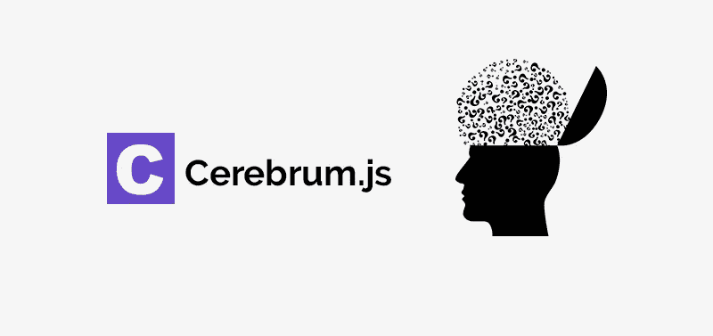
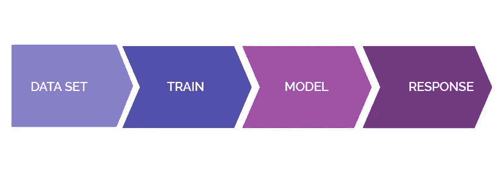
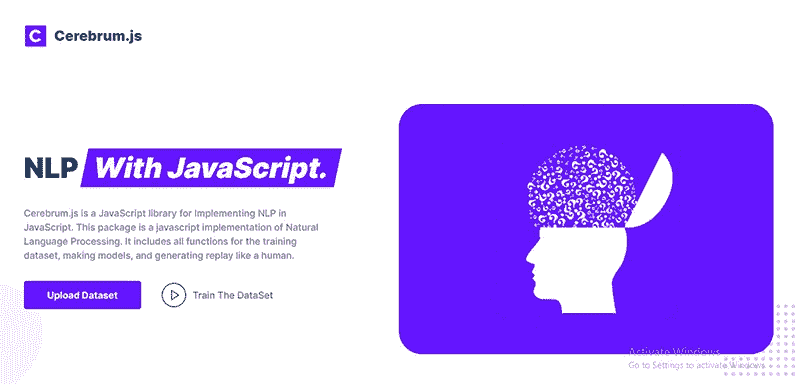

# 如何用 JavaScript 做自然语言处理

> 原文：<https://javascript.plainenglish.io/how-to-do-natural-language-processing-with-javascript-a934018d03d4?source=collection_archive---------2----------------------->

通过使用 Cereberum.js，可以在 JavaScript 项目中实现自然语言处理，而无需集成外部 API。



## 关于 Cereberum.js

Cereberum.js 是一个开源的 npm 包，旨在执行高级的机器学习操作，如 JavaScript 项目中的自然语言处理。NLP 主要用于在 web 应用程序中制作聊天机器人。如果 web 应用程序建立在 JavaScript 之上，那么就需要使用外部 API 来实现聊天机器人。这些 API 可能很昂贵；我们将我们的数据转移到外部服务器进行处理，这可能违反隐私政策。Cerberum.js 允许我们在您的 JavaScript 项目本身中处理数据，Cereberum.js 使 NLP 实现尽可能简单。

## **大脑的基本用法. js**

在您的项目中实现 Cerebrum.js 非常简单，只需五个步骤。

*   **安装:**使用下面的命令将 Cerebrum.js 包安装到您的项目中。

```
npm i cerebrum.js
```

*   **导入包:**为了使用 Cerebrum.js 内置函数，您需要导入一个包，在这个包中您假定要使用 NLP 相关操作的文件，并创建一个实例。在代码下面，代码片段显示了如何导入。

```
const Cerebrum = require("cerebrum.js");

const newCerebrum = new Cerebrum();
```

*   **创建数据集:**这是 NLP 实现的关键步骤，因为它应该是准确的；否则，你得不到想要的结果。Cerebrum.js 将一组对象作为数据集，用于训练和制作模型。数组的长度必须大于 3。数组中的每个对象都有以下属性:意图、话语和答案。每个属性的用法如下。
    **意图:**在制作数据集的过程中，意图用于类似的分组类问题，例如“你好吗？”、
    “感觉如何？”以及“你还好吗？”这些问题归入一个单一的意图。作为 intent 属性值，我们必须提供一个名称，就像如果商家向客户询问一组问题，我们可以将其命名为“client . how you”。
    **话语:**这是一个字符串数组，其中包含特定意图中的所有问题，我们提供的问题越多，该特定上下文的模型就越准确。
    **答案:**它也是一个字符串数组，包含特定意图的所有答案。当用户问类似的问题时，Cereberum.js 将从数组中选择每个答案并作出回应。提供更多的答案将避免对相同的问题重复相同的答案。
    下面是 Cerebrum.js 所需的样本数据集的代码片段

```
const dataset = [
  {
    intent: "agent.creator",
    utterances: ["who build me", "who create me"],
    answers: [
      "You build me",
      "Its You",
      "You created me"
    ]
  },
  {
    intent: "agent.sing",
    utterances: [
      "do you sing song",
      "will you sing song"
    ],
    answers: [
      "Yes I do",
      "Yes I will"
    ],
  },
];
```

*   **训练数据集:**创建数据集后，下一步是用它制作模型；为此，我们必须训练数据集。js 有一个名为 trainCerebrum()的函数来训练准备好的数据集，我们将数据集作为参数传递给 trainCerebrum(dataSet)函数来创建模型。此函数是异步的，如果成功完成训练，将返回字符串“Success”。下面是如何使用 trainCerebrum()训练数据集的代码片段。

```
const train = async () => {
  const response = await newCerebrum.trainCerebrum(dataset);
  return response;
};
```

*   **从模型中获得响应:**如果训练成功，将在您的根文件中创建一个名为 model.nlp 的文件。使用 cerebrumReplay()函数，我们可以得到问题的答案。cerebrumReplay()将一个字符串作为参数，可以将我们要问的问题传递给函数，函数将从训练好的模型中返回该问题的正确答案。下面是如何从模型获得响应的代码片段。

```
const response = async (question) => {
  const answer = await newCerebrum.cerebrumReplay(question);
  return answer;
};
```

## Cerebrum.js 实现演示代码

为了理解 cereberum.js 的基本工作原理，上述所有步骤合并成一个代码片段

在上面的代码片段中，导入到 sampleCerebrumCode.js 的包创建了一个实例，然后将其保存到常量 newCerebrum 中。然后，另一个常量数据集将存储训练所需的准备好的数据集，然后创建一个名为 train()的函数来调用 Cerebrum.js 提供的异步函数 trainCerebrum()，在调用 train()函数的同时，模型被创建。另一个函数 response()从模态中获取经过训练的答案。在那个函数中，我们调用异步函数 cerebrumReplay()并得到答案。上面的代码片段只调用了一次 train()函数，因为模型保存在创建的实例 newCerebrum 中，可以使用它来获得进一步的响应，而不需要每次都进行训练来获得答案。

## 包装的基本包装



This cover has been designed using resources from Freepik.com

## Cereberum.js 现场演示

要体验 Cerebrum.js 实现的现场演示，请访问其[主页](https://cerebrumdemoapp.herokuapp.com/)，在那里您可以上传一个数据集作为 JSON 并训练您的模型。它们还提供了一个聊天选项，可以与您的训练数据进行聊天。



关于这个包和源代码的更多信息可以在 [npm 页面](https://www.npmjs.com/package/cerebrum.js)上找到。