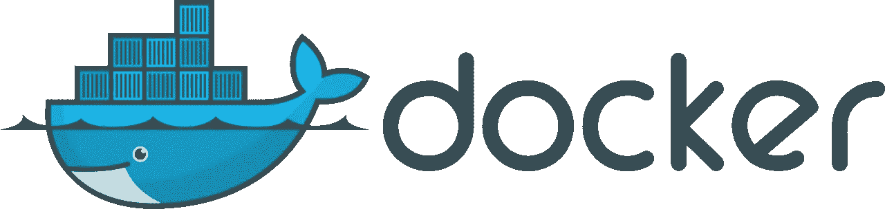
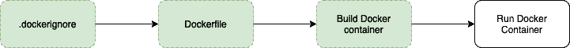

# 如何在几分钟内完成你的 React 应用程序

> 原文：<https://javascript.plainenglish.io/how-to-dockerize-your-react-application-in-minutes-66ddd773f833?source=collection_archive---------9----------------------->

## 使用 React 和 Docker 进行设置

Docker 是一个很棒的工具，可以简化应用程序的部署和创建。Docker 基本上将你的代码注入到一个叫做容器的东西中。容器是一个微小的独立环境。将容器中的应用程序想象成一个可移动的房子。您的应用程序需要的一切都包含在其中。

# 为什么是 Docker？

我使用 Docker 已经有一段时间了。它为我节省了几个小时的故障排除时间。它几乎消除了管理在我的机器上运行的依赖项的需要，但奇怪的是在一个对等机器上崩溃了应用程序。它结束了相当大的可变性，消除了许多麻烦，让您专注于作为开发人员的主要任务。

因为 Docker 本质上是一个承载应用程序的容器，所以框架或语言不是一个约束。在本文中，让我们在 Docker 上获得 React 应用程序。

**注意:**本文主要关注使用`create-react-app`创建的 React 应用程序

# 在 Docker 上获得 React 应用程序

从在电脑上安装 Docker 开始。安装 Docker 相当简单。可以从他们的官方网站[下载](https://www.docker.com/products/docker-desktop)。

如果您还没有 React 应用程序，您可能想使用`create-react-app <application_name>`创建一个

# 从……开始。dockerignore

一旦你有了一个工作的 React 应用程序，在你的项目的根目录下，你可能想从创建`.dockerignore`文件开始。这个文件类似于现在流行的`.gitignore`。你添加到`.dockerignore`的任何文件或文件夹都会被 Docker 忽略。将`node_modules`放在这个文件中是个好主意。我的 Dockerignore 如下所示

# 移动到 Dockerfile

接下来，创建一个`Dockerfile`。这个文件是创建图像的配方。它是独立命令的集合，这些命令按顺序执行以获得最终图像。

Dockerfile 文件的内容如下

Dockerfile

打开终端或命令提示符，并导航到项目文件夹。Dockerfile 文件可以总结为 8 个步骤。

*第 2 行*:我们从指定节点版本开始。这就是我们想要的容器的基础。

*第 5 行*:然后我们在 Docker 环境中创建一个目录，并将其指定为工作目录。

*第 8 行*:然后我们将`package.json`复制到 Docker 容器中的`package.json`。

json 是应用程序成功执行所需的所有第三方模块的集合。

*第 11 行*:为了安装上面提到的模块，我们运行`npm install``RUN`命令告诉 Docker 运行下面的命令

*第 17 行*:我们将所有文件从你的项目目录中复制到 Docker 容器中的工作目录，包括源代码、资产等。我们在第 5 行制作了这个工作目录。

*第 20 行*:然后我们公开我们的应用程序将要运行的端口。因为 React 默认端口为 3000，所以我们在 Docker 文件中公开端口 3000。

最后，我们用我们心爱的`npm start`启动轮子

这差不多就是我们要做的全部了。我们现在可以继续用 Docker 构建应用程序了。

# 码头工人建造

为了使用上面创建的 docker 文件构建 docker 容器，我们运行

`docker build -t <identifier-for-your-app> .`

该命令是 docker build。`-t`是用来给 React 项目容器赋值的标签，以将它与您以后可能构建的任何其他容器区分开来。把它想象成你的容器的名字。我将我的容器命名为`market-react-app`

`docker build -t market-react-app .`

最后的`.`表示当前上下文。它告诉 docker 从你当前的目录开始构建。当前目录应该是项目的根目录。

# 最后的步骤

到目前为止，我们已经创建了一个可选但推荐的`.dockerignore`文件，一个`Dockerfile`，构建了 docker 容器。现在，我们将使用

`docker run -p 8000:3000 market-react-app`

上面的命令绑定了两个端口。根据文档，它向主机发布容器端口。

最后，启动您的 web 浏览器并导航到`localhost:8000`您应该会看到 React 应用程序的辉煌。

## 简单英语的 JavaScript

喜欢这篇文章吗？如果有，通过 [**订阅我们的 YouTube 频道**](https://www.youtube.com/channel/UCtipWUghju290NWcn8jhyAw) **获取更多类似内容！**