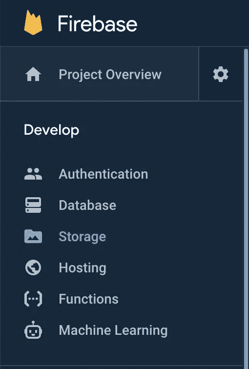

# 如何从 Node.js 中的 Firebase 存储下载文件

> 原文：<https://javascript.plainenglish.io/how-to-download-files-from-firebase-storage-in-node-js-d5ffe798728?source=collection_archive---------3----------------------->

# 什么是 Firebase 存储？

Firebase 为我们提供了一个存储机制，在这里我们可以创建不同的桶(在短房间里)来存储各种各样的物品。

例如，一个桶可以用来存储猫的图像，另一个桶可以用来存储狗的图像。简而言之，你可以在 Firebase 存储器上存储任何类型的文件。

要了解如何将文件上传到 Node.js 中的 Firebase 存储，下面是文章的链接。

 [## 如何将文件上传到 Node.js 中的 Firebase 存储

### Firebase 为我们提供了一个存储机制，在这里我们可以创建不同的桶(在短房间里)来存储…

medium.com](https://medium.com/javascript-in-plain-english/how-to-upload-files-to-firebase-storage-in-node-js-e19b2b5e5cf9) 

# 为什么我们需要使用 Firebase 存储？

因为**Firebase**Cloud**Storage**是一个强大而又易于**使用的**工具，用于存储各种对象。我们可以存储图像、音频、视频和其他类型的用户内容。

在简单介绍了 Firebase 存储之后，让我们跳到今天这篇文章背后的主要思想，我们将研究如何将 Node.js 与 Firebase 存储集成，并将文件上传到云上。

# 我们需要开始做些什么？

1.  Gmail 账户。
2.  javascript 基础知识。
3.  熟悉 Node.js 和 npm 的工作方式。

好了，别浪费时间了，让我们进入正题。

**安装所需的依赖项**

创建一个任意名称的文件夹并运行命令`npm init`。这将创建一个 package.json 文件和一些其他与配置相关的文件。现在，要安装依赖项，请在刚刚创建的文件夹中运行下面的命令。

*   NPM I @ Google-云/存储
*   npm i express

**启动 Firebase 项目的步骤**

1.  打开**火焰基座**控制台。
2.  点击**新建项目**。
3.  “**创建**一个**项目**窗口打开。
4.  **Firebase** 控制台的开始屏幕打开。
5.  “输入应用程序详细信息”屏幕打开。
6.  按照屏幕上的说明继续配置。
7.  在**项目**被**创建**后检查服务器密钥。
8.  下载服务器密钥并暂时将其存储在您的本地驱动器上。

现在我们已经安装了依赖项并创建了 Firebase 项目，只需创建一个 ***index.js*** 文件并粘贴下面的代码。不要担心，我们将详细检查代码，以了解发生了什么。

使用命令`node index.js`运行上面的代码。之后，导航到您的存储选项卡，在这里您可以看到您在用户提供的存储桶名称中显示的所有文件。

**让我们演练一下代码的要点:-**

*   在顶部，我们导入所有的依赖项。
*   之后，在第 7 行**,我们导入在上面部分创建并下载的 firebase 服务器密钥文件。**
*   在**的第 11 行**，我们提供了一个想要在 Firebase 云存储上创建的 bucket 名称。
*   **下载文件**基本上负责连接到 Firebase 云存储，连接到上面步骤中提供的名称的 bucket，如果它不存在，然后下载 **destFilename。**
*   然后，我们调用该方法，并在端口-8088 上本地运行我们的服务器。

这总结了我们博客的结尾。Google Firebase 团队为我们提供了一个非常简单的程序，以便连接和使用存储。

希望这篇文章是有帮助的！