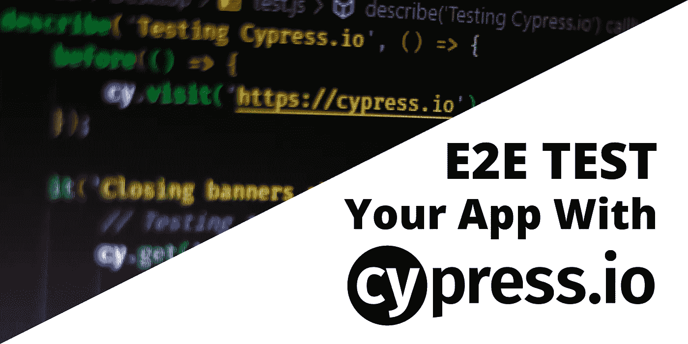
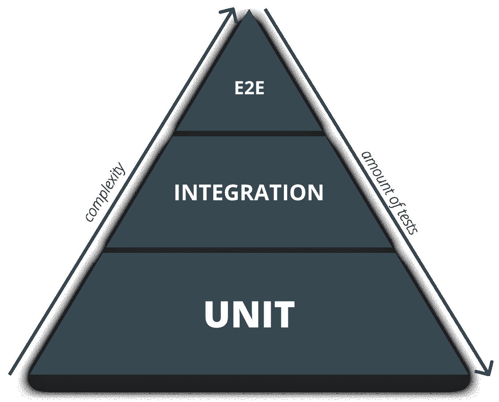
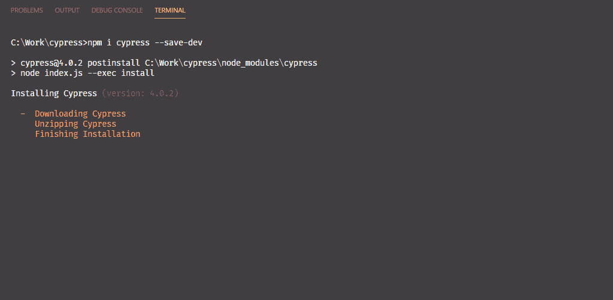
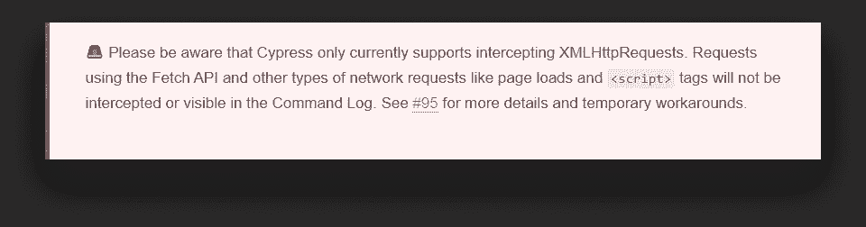
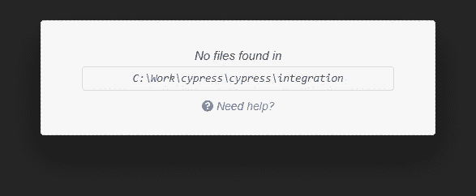
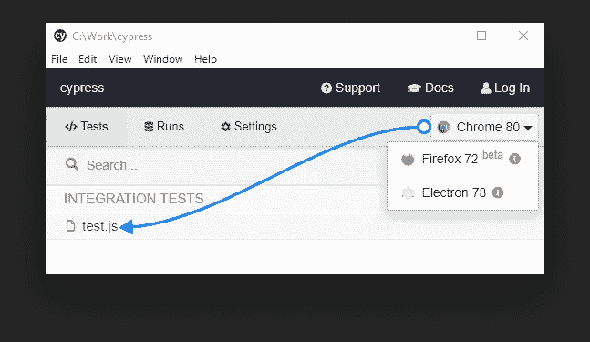
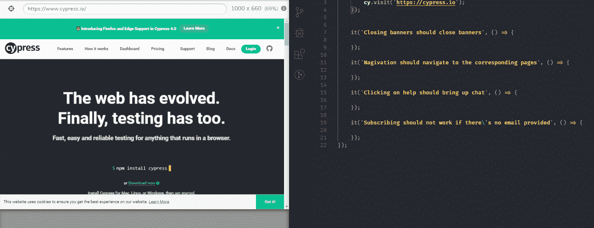
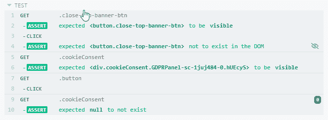
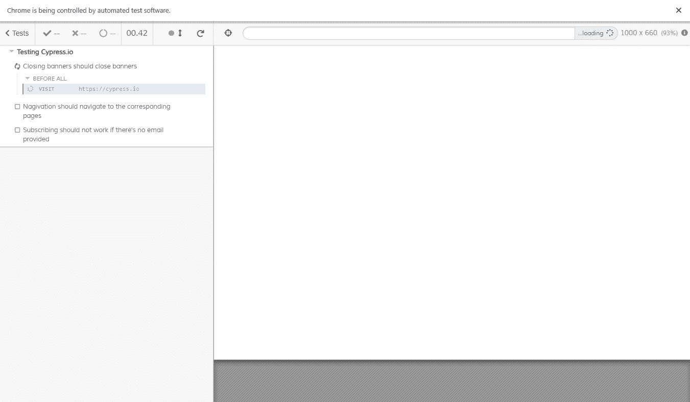
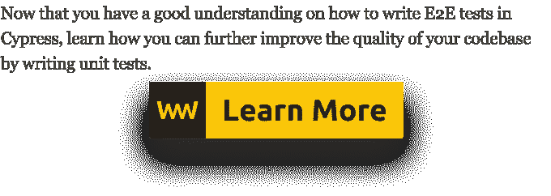

# 如何用 Cypress 对你的应用程序进行 E2E 测试

> 原文：<https://javascript.plainenglish.io/how-to-e2e-test-your-application-with-cypress-162f4bafe376?source=collection_archive---------0----------------------->

## 无硒一体化测试框架

您已经完成了所有工作，您的应用程序已经准备好最终投入生产。然而，你还没有完成。测试即将开始。

如果我说测试是开发人员中最讨厌的部分，我可能比我相信的更接近事实。但这是开发周期中必不可少的一部分。为了让您的应用程序防弹防错，您需要有一个测试套件。

你可以从编写尽可能多的[单元测试](https://www.webtips.dev/writing-your-very-first-unit-test-with-jest)开始，以增加代码覆盖率。但是之后呢？难道不应该对整个用户流量进行端到端的测试吗？

这就是 E2E 测试发挥作用的地方。这次我想给大家介绍一下 [Cypress](https://www.cypress.io/) ，一体化 E2E 测试框架。

在本教程结束时，您应该能够编写自己的测试用例，并充分发挥 Cypress 的潜力。我们将研究如何设置一切，Cypress 是如何构建的，以及我们如何使用它来创建基本的用户场景。因此，让我们首先将 Cypress 引入我们的项目并设置好一切。

# 树立柏树

首先也是最重要的，你需要用`[npm i cypress --save-dev](https://www.npmjs.com/package/cypress)`拉倒柏树。这可能需要一些时间，但可能是建立框架最长的一步。

Downloading Cypress

安装完成后，现在运行`node_modules\.bin\cypress open`就可以打开 Cypress 了。为了使事情变得简单，让我们将它作为一个 npm 脚本添加到您的`package.json`文件中:

确保你逃脱了反斜杠。现在，您应该能够通过在命令行中键入`npm run cypress`来运行 Cypress 了。

Cypress 将在您的项目根目录下为您生成一个`cypress.json`配置文件，以及一个包含多个子文件夹的 cypress 文件夹。让我们来看看这些文件夹的作用。

# 柏树的结构

首先是配置文件`cypress.json`——在这里您可以修改 Cypress 的默认行为。比如设置一个基本的 URL，env 变量，或者测试文件所在的文件夹的路径。有关选项的完整列表，您可以参考官方文档下的[配置页面](https://docs.cypress.io/guides/references/configuration.html)。我们还有四个不同的文件夹:

## [夹具](https://docs.cypress.io/api/commands/fixture.html)

Fixtures 用于加载一组固定的数据。这对于嘲笑回应很有用。假设您的应用程序与一个 API 进行通信。您可以使用[修复](https://docs.cypress.io/guides/guides/network-requests.html#Fixtures)来模拟网络响应。

有一点要注意；Cypress 目前仅支持拦截 XHR 请求，如果您使用 Fetch API，您需要变通办法:

Warning from the official website on Cypress. [#95](https://github.com/cypress-io/cypress/issues/95) for reference

## [整合](https://docs.cypress.io/guides/core-concepts/writing-and-organizing-tests.html#Test-files)

这是您所有测试文件的存放位置。您可以将该位置配置到您的`cypress.json`文件的另一个目录中。您还将获得一些生成的示例测试，以便熟悉语法和可用的命令。

## [插件](https://docs.cypress.io/guides/tooling/plugins-guide.html)

plugins 文件夹用于修改或扩展 Cypress 的功能。假设您的应用程序使用 TypeScript，并使用 Webpack 构建。通过挂钩到`file:preprocessor`事件，您可以以正确的方式解析您的模块。

## [支持](https://docs.cypress.io/api/cypress-api/custom-commands.html)

最后，support 文件夹用于向 Cypress 添加定制命令— *或修改现有命令* —这些命令可以在整个测试中使用。

这种文件夹结构只是一个例子。你可以随时通过`cypress.json`改变和配置位置。现在我们已经熟悉了 Cypress 是如何构建的，我们可以开始研究如何编写测试用例了。

# 编写您的第一个测试

首先，让我们删除集成文件夹中的所有内容，并通过运行`npm run cypress`启动 Cypress。您将看到它没有找到任何文件。所以让我们创建一个。

创建一个名为`test.js`的新文件。它应该会立即出现在赛普拉斯。假设我们要测试 Cypress 的官网。您可以像编写单元测试一样编写测试用例。让我们从概述我们想要测试的不同交互开始:

首先我们需要导航到 [cypress.io](https://www.cypress.io/) 。我们可以通过指定一个将在所有测试之前执行的`before`块来做到这一点:

全局`cy`对象可以用来为我们做繁重的工作。除了访问页面或获取元素，它还用于各种用户交互。比如点击、键入甚至验证断言。

当您打开首页时，会出现两个横幅。比如说我们想测试一下是否可以关闭它们。点击 Cypress 内部的`test.js`来运行它。您也可以选择使用不同的浏览器。

要关闭横幅，您需要测试元素的存在并触发一个点击事件。除了传统的方法之外，你还可以使用*内置的*选择器操场*按钮来获取元素。*

将它复制到剪贴板会为您生成一个 cypress 选择器。触发一个点击甚至就像在它上面调用`click()`一样简单。保存文件后，Cypress 自动重新运行测试，我们可以看到底部的横幅消失了。因此，让我们对顶部的横幅做同样的事情，并验证它是否确实被隐藏。

如你所见，我们可以一个接一个地连锁行动。我们可以通过调用`should`来验证预期。断言也会出现在浏览器的左侧。

您可以与它们进行交互，并查看浏览器中反映的事件。继续，我们有导航。为了测试导航，我们需要获得导航按钮，并检查 URL 是否包含正确的单词。

当我们想要获得具有相同类名的不同元素时，我们可以使用类似于 CSS 中的`nth-child`选择器的`eq(n)`。我们可以对最后一个测试使用相同的逻辑。我们需要单击 subscribe 按钮，然后我们可以验证它旁边的 input 元素是否接收了一个类:

如果我们运行测试，我们可以看到站点是如何被模拟用户控制和交互的:

# 摘要

你刚刚用柏树创造了你的第一个 E2E！柏树提供了很多。我使用它已经有一段时间了，广泛的功能选择让您可以测试一些真正高级的场景。它也有很棒的文档和一个庞大的社区支持。因此，如果你碰巧遇到了困难，你很可能会找到解决问题的方法。

最后，我想让你注意一下我们在整个教程中做的一件事，它被认为是反模式。尽量避免使用类选择器来获取元素。这些经常会改变，这会破坏你的测试。相反，我建议使用自定义数据属性，其唯一目的是作为测试的挂钩。

我希望你能试一试 Cypress，它会让你的测试工作流程变得简单一点，就像我做的那样。如果你想看看完成的项目，你可以从 [GitHub](https://github.com/flowforfrank/cypress) 中克隆它。保重，祝测试愉快。

