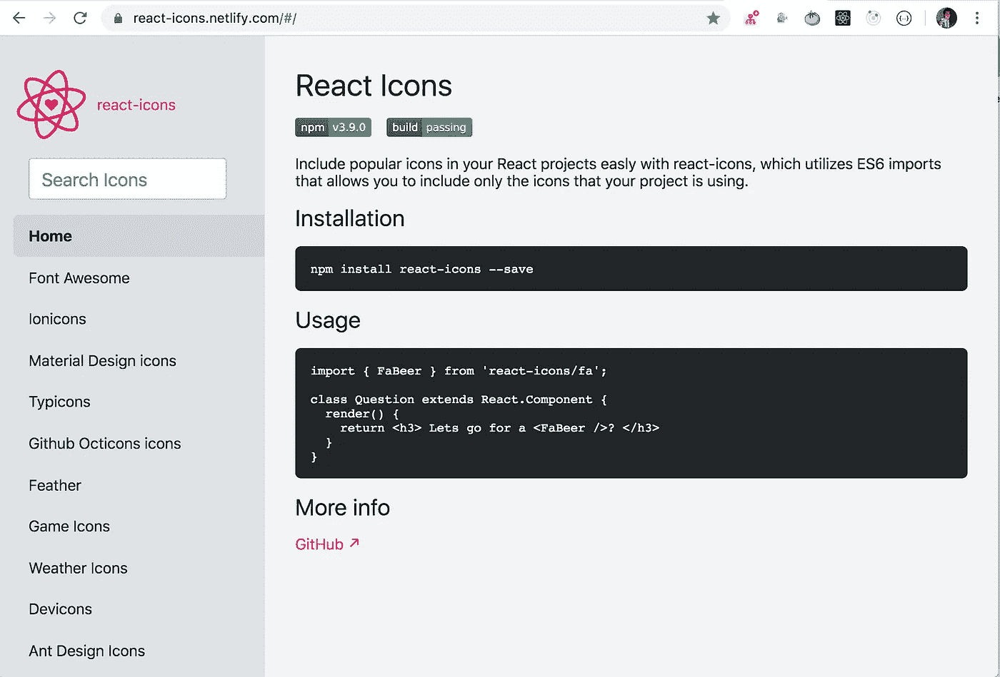

# 在 React 中添加字体图标，无需额外的 CSS 文件

> 原文：<https://javascript.plainenglish.io/how-to-easily-integrate-font-icons-in-react-without-including-additional-css-files-5c7d59d8ca0a?source=collection_archive---------8----------------------->

## 学习使用字体牛逼，离子图标，材料图标和许多其他图标的最佳方式


Photo by [Harpal Singh](https://unsplash.com/@aquatium?utm_source=medium&utm_medium=referral) on [Unsplash](https://unsplash.com?utm_source=medium&utm_medium=referral)

很多时候我们需要在项目中使用一些图标，比如`hamburger menu`、`social media icons`、`search icon`等等。

如果我们想使用`font-awesome`图标，那么我们需要在我们的 HTML 文件中包含 CSS 文件，它提供了对图标字体的访问。

如果我们使用 React，那么我们通常不会在`index.html`文件中包含 CSS 文件，而是使用 npm 包。很难在一个 npm 包中找到所有需要的图标。

所以要解决这个问题，我们可以使用`react-icons` npm 包。

它提供了`ion-icons`、`font-awesome icons`、`material icons`和许多其他的图标，我们可以不用包含任何 CSS 就可以使用。

所以让我们开始吧。

运行以下命令安装`react-icons` npm 包

```
npm install react-icons
```

要使用字体出色的图标，请使用以下语法

```
import { ICON_NAME } from "react-icons/fa";
```

要使用离子图标，请使用以下语法

```
import { ICON_NAME } from "react-icons/io";
```

要使用材质图标，请使用以下语法

```
import { ICON_NAME } from "react-icons/md";
```

`react-icons`的主页提供了一个有用的搜索，让我们可以轻松地搜索图标并使用它



演示:

今天到此为止。我希望你学到了新东西。

**别忘了订阅我的每周时事通讯，里面有惊人的技巧、诀窍和文章，直接在这里的收件箱** [**订阅。**](https://yogeshchavan.dev/)

## **用简单英语写的 JavaScript 笔记**

我们总是有兴趣帮助推广高质量的内容。如果你有一篇文章想用简单的英语提交给 JavaScript，用你的中级用户名发邮件到 submissions@javascriptinplainenglish.com[](mailto:submissions@javascriptinplainenglish.com)**，我们会把你添加为作者。**

**我们还推出了三种新的出版物！请关注我们的新出版物:[**AI in Plain English**](https://medium.com/ai-in-plain-english)，[**UX in Plain English**](https://medium.com/ux-in-plain-english)，[**Python in Plain English**](https://medium.com/python-in-plain-english)**——谢谢，继续学习！****