# 如何用 Google Sheets 轻松制作一个实时仪表盘

> 原文：<https://javascript.plainenglish.io/how-to-easily-make-a-live-dashboard-with-google-sheets-8da61ddb73e0?source=collection_archive---------1----------------------->

好吧，这是一个有点厚脸皮的标题，因为博客不会涵盖如何制作一个完整的仪表板。

而是如何制作一个连接到 Google Sheets 的实时条形图。


Photo by [Luke Chesser](https://unsplash.com/@lukechesser?utm_source=medium&utm_medium=referral) on [Unsplash](https://unsplash.com?utm_source=medium&utm_medium=referral)

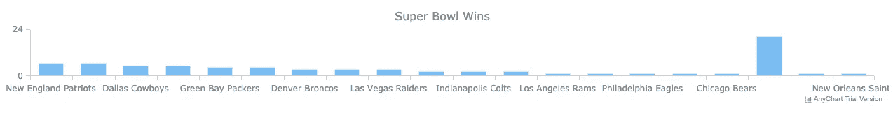

您可以利用这些知识，通过对前端开发的更多了解，您可以将其扩展为一个复杂的组织仪表板。

我们开始吧！

我们将介绍三种简化这一过程的工具:

1.  使用我们的产品 [API 电子表格](http://www.apispreadsheets.com)创建一个谷歌表单 API
2.  使用 [Any Chart](https://www.anychart.com/blog/2017/10/25/javascript-bar-chart-tutorial/) 创建一个带有条形图代码的 HTML 文件，并连接到 Google Sheets 数据
3.  使用 [GitHub 页面](https://pages.github.com/)在 GitHub 上部署 HTML 文件

# **使用 API 电子表格创建一个 Google Sheet API**

*免责声明:API 电子表格是我们的产品。你也可以直接使用 Google Sheets，但是这个过程要麻烦得多*

1.  **在你的谷歌账户中创建一个谷歌表单**

由于这周末是超级碗，我们将与赢得超级碗的**队**和**队**一起创建一个。

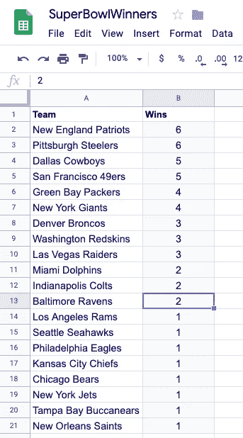

**2。使用** [**API 电子表格**](http://www.apispreadsheets.com) 将其转换为 API

去 www.apispreadsheets.com 注册一个账户。

点击 Google Sheets 并选择您的 SuperBowlWinners Google Sheet。选择文件后，您应该会看到以下内容

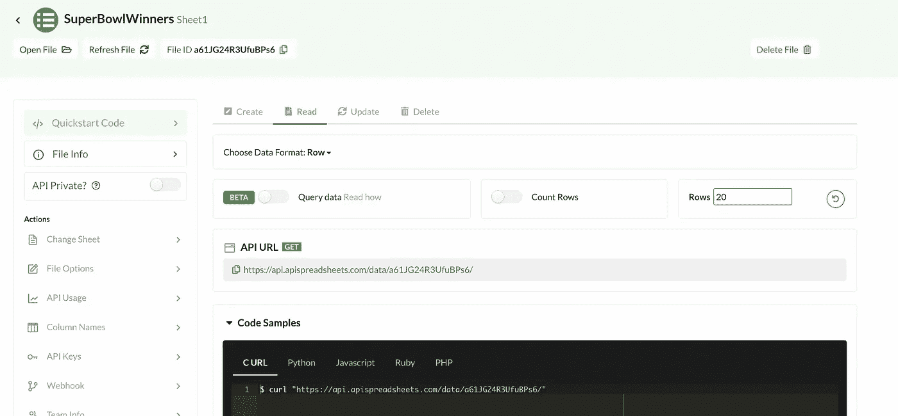

3.**改变数据格式&复制网址**

由于我们使用任何图表库来制作图表，我们需要特定格式的数据。

所以我们要把数据格式改成**矩阵**并复制 API URL。

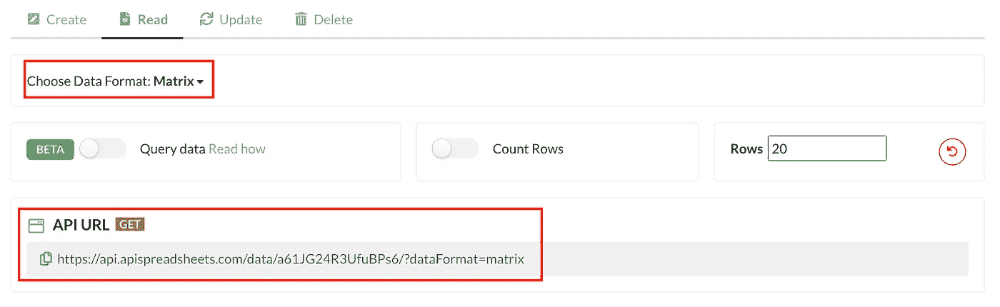

请将此 URL 放在手边，因为我们将在下一节中使用它。

# **使用任何图表创建带有条形图代码的 HTML 文件**

*这一节是从* [*任何图表网站*](https://www.anychart.com/blog/2017/10/25/javascript-bar-chart-tutorial/) *转述而来的，所以请随意阅读该教程以更深入地了解这一节。*

*你也可以在我的 GitHub repo 查看完整的 HTML 文件:*[https://GitHub . com/as harma 327/LiveBarGraphDemo/blob/master/index . HTML](https://github.com/asharma327/LiveBarGraphDemo/blob/master/index.html)

1.  **创建一个空文件夹，你可以随意命名。**

我将把它命名为 ***LiveBarGraphDemo*** ,所以无论你在教程中看到什么地方，都要把它改成你所称的样子

2.**在文件夹内创建一个名为*index.html*的文件**

3.**在*index.html*中编写以下代码**

```
<!DOCTYPE html>
<html>
  <head>
    <title>Super Bowl Bar Chart</title>
    <script src="[https://cdn.anychart.com/releases/8.0.0/js/anychart-base.min.js](https://cdn.anychart.com/releases/8.0.0/js/anychart-base.min.js)"></script>
  </head>
  <body>
    <div id="container" style="width: 100%; height: 100%"></div>                                   
    <script> <!--chart code -->  </script>
</body>
</html>
```

这段代码设置了 HTML 文件，并引用了我们将用于条形图的 Any Chart Javascript 库。

它还有一个称为*容器*的

，其宽度和高度为 100%。这是我们的条形图将出现的地方。

在

之后有一个

**4。在 *<脚本>* 标签**中编写以下代码

```
<!DOCTYPE html>
<html>
  <head>
    <title>Super Bowl Bar Chart</title>
    <script src="[https://cdn.anychart.com/releases/8.0.0/js/anychart-base.min.js](https://cdn.anychart.com/releases/8.0.0/js/anychart-base.min.js)"></script>
  </head>
  <body>
    <div id="container" style="width: 100%; height: 100%"></div>
    <script>
      anychart.onDocumentReady(function() {                                         // Fetch Data from the API
        fetch('[https://api.apispreadsheets.com/data/422/?dataFormat=matrix'](https://api.apispreadsheets.com/data/422/?dataFormat=matrix'))
        .then((response) => {
            return response.json();
        })
        .then((myJson) => { // create data variable for the chart
          var data = {
            header: ["Team", "Wins"],
            rows: myJson.data
          } // create the chart
          var chart = anychart.column(); // add the data
          chart.data(data); // set the chart title
          chart.title("Super Bowl Wins"); // draw
          chart.container("container");
          chart.draw();
        });
      });
    </script>
  </body>
</html>
```

让我们浏览一下

*   我们首先从上一步创建的 API 中获取数据。
*   然后我们创建一个名为**数据**的变量，它有*标题*和*行*。我们手动指定我们的*标题*为**团队**和**获胜**。*行*直接从 API 获得
*   我们使用 [Any Chart](https://www.anychart.com/blog/2017/10/25/javascript-bar-chart-tutorial/) 引用创建一个图表，提供数据，给出标题，告诉容器在哪里(在本例中我们的< div >称为容器),最后绘制它

**5。在你的浏览器**中打开*index.html*文件

您应该会看到一个条形图，显示了各队及其超级碗冠军

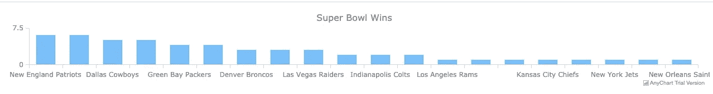

# 在 GitHub 页面上部署图表

现在，我们将把它部署在一个可以从任何地方访问的实时网站上。

> 由于我们的数据在谷歌工作表中，我们可以手动更改它，我们的图表将实时更新！

我们将使用 GitHub 页面来做到这一点，因为这是最简单的。如上所述，我将大量转述官方 [GitHub 页面教程](https://pages.github.com/)的内容，所以请随意查看以获得更深入的指导

此外，还有其他方法可以做到这一点，但我会用下面的版本，因为涉及的代码最少。

1.  **如果你没有 GitHub 账户，创建一个**

去[www.github.com](http://www.github.com)创建一个账户

2.**创建新的存储库**

我调用我的 ***LiveBarGraphDemo*** 来保持它的一致性，并使用以下设置创建它

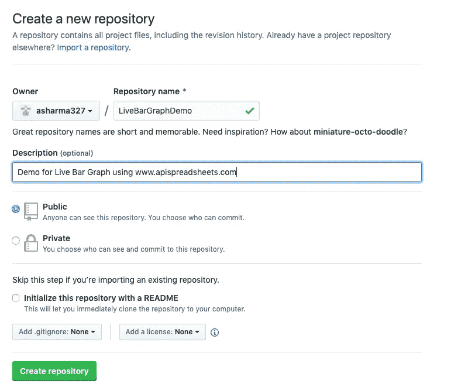

3.**点击*上传现有文件，*选择并提交*index.html*文件**

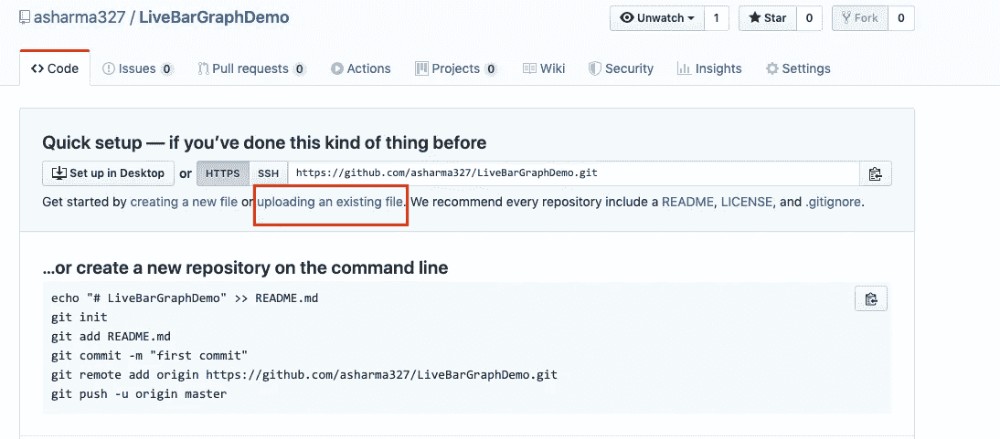

Click uploading an existing file to go on to the next screen

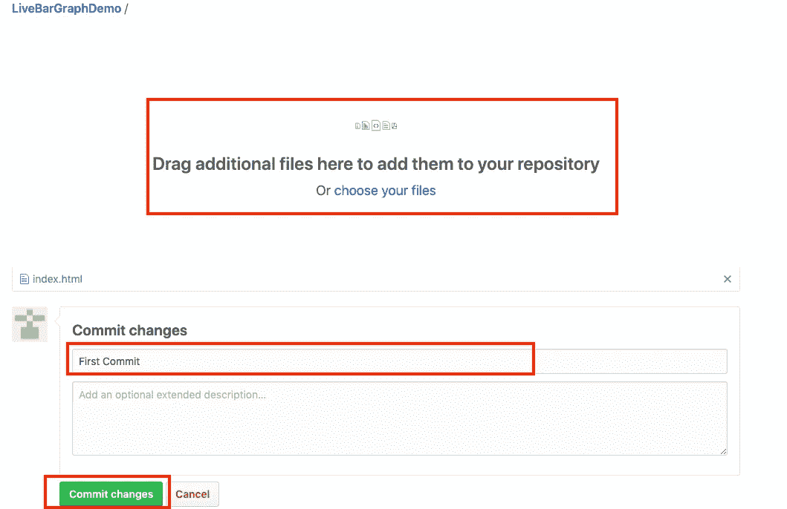

Choose file, give a commit message and click on commit changes

**4。启用 GitHub Pages 来跟踪您的文件**

现在我们将告诉 GitHub pages 在线部署我们的文件和回购。

**点击设置**

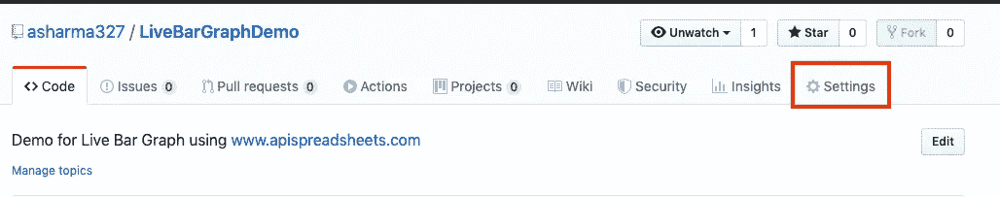

现在向下滚动到 **Github 页面下，**将**源**更改为**主分支**

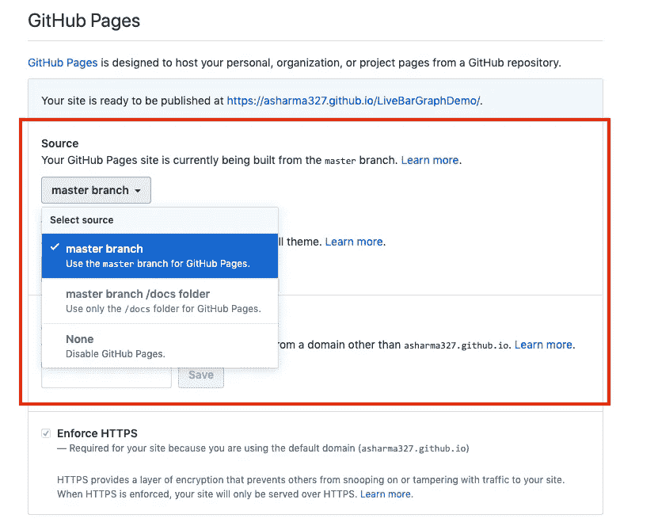

# 享受您的实时条形图

你的条形图将在网站上直播

**https://your-github-username . github . io/your-respository-name**

比如我的在

**https://asharma327.github.io/LiveBarGraphDemo**

# 改变价值观

现在有趣的部分是，你可以很容易地改变谷歌工作表中的值，并在你的网站上看到它们实时反映在图表上。

图表现在是这样的:


我将把纽约喷气机队的 20 场超级碗胜利记录在谷歌表单上

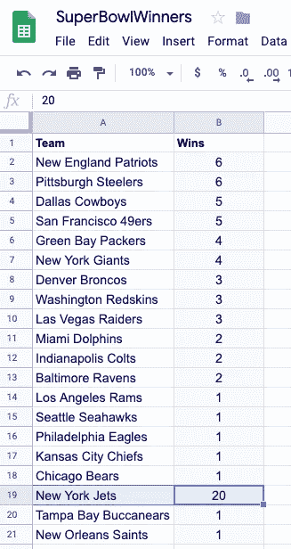

现在，当我查看网站时，规模已经发生了变化，喷气机队酒吧赢得了最多的胜利！

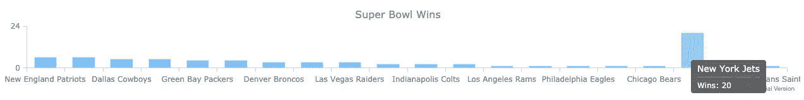

# 后续步骤

随着对 HTML、CSS 和 Javascript 的进一步掌握，你可以使用 Google Sheets 作为你的数据源来创建一个完整的实时仪表盘。

如果你想要一个定制的应用程序，清理数据，或者使用电子表格建立一个项目，你可以在这里查看我们的咨询服务:[https://www.lovespreadsheets.com](https://www.lovespreadsheets.com/)！

*更多内容请看*[***plain English . io***](https://plainenglish.io/)*。报名参加我们的* [***免费周报***](http://newsletter.plainenglish.io/) *。关注我们关于*[***Twitter***](https://twitter.com/inPlainEngHQ)[***LinkedIn***](https://www.linkedin.com/company/inplainenglish/)*[***YouTube***](https://www.youtube.com/channel/UCtipWUghju290NWcn8jhyAw)***，以及****[***不和***](https://discord.gg/GtDtUAvyhW) *对成长黑客感兴趣？检查* [***电路***](https://circuit.ooo/) ***。*****