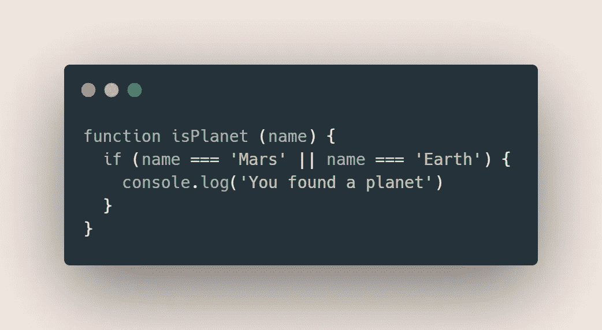
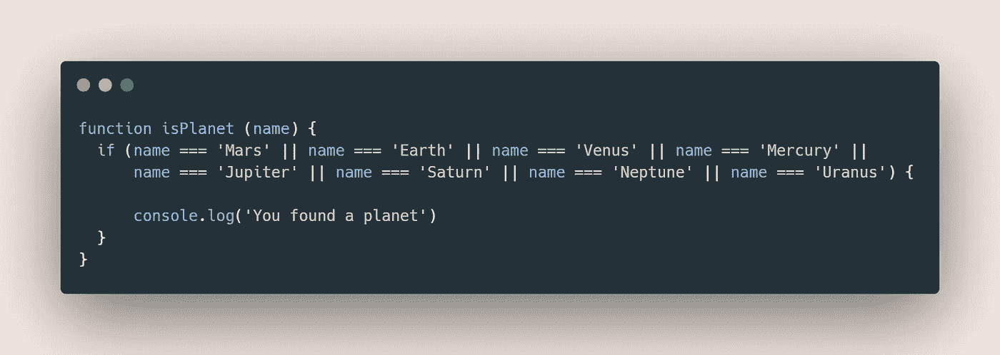
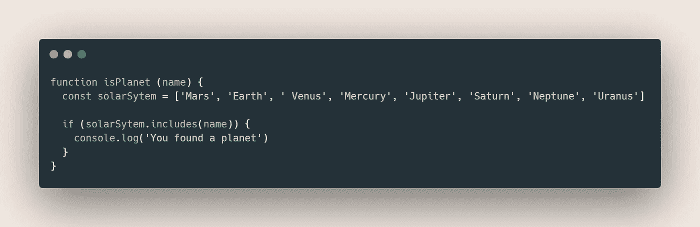

# 如何在代码中轻松缩短长串 OR(||)操作符

> 原文：<https://javascript.plainenglish.io/how-to-easily-shorten-long-lists-of-or-operators-in-your-code-f095b9c06a28?source=collection_archive---------7----------------------->

让你的条件再次可读

Illustration by Icons 8 from [Icons8](https://icons8.com/)

就像每个开发人员一样，您可能每天都在用 JavaScript 编写条件语句。然而，即使每天都练习，它们仍然是编码中非常棘手的部分。

其原因在于**你可以用十种不同的方式来写一个条件**。那么如何最大限度的改善自己的条件呢？

我发现了一个小技巧，当你有一个很长的`||`操作符列表时，你可以特别使用。当您将一个值与一组特定的*标准*进行比较，并且您希望仅当这些*标准*中的一个被考虑时，就会发生这种情况。

例如，在一个空间应用程序中，您可能希望编写一个函数来检查一个天文实体是否实际上是一颗行星(不是在和您说话冥王星！).你可以这样开始写你的程序:

Checking if a space object is a planet

这很管用，对吧？除了你忘记了太阳系的很大一部分。如果你想把所有的行星都加到你的支票里呢？

当然，您可以进一步增加您的`||`条件列表的大小。但是这样做很快就会导致一些不可读的代码和令人尴尬的长长的编辑器行。

A lame way to check against multiple criteria

这段代码并没有变得一团糟。如果你写这样的东西，你应该认真考虑可读性的后果。

## 更好的解决方案

幸运的是，对于这种情况有更好的解决方案。因为您有一堆代表输入条件的标准的值，您可以将它们存储在一个数组中，然后让 T2 方法为您完成剩下的工作。

> array.includes()方法确定数组是否包含指定的元素。

 [## Array.prototype.includes()

### 方法 includes()确定一个数组包含一个 certo 元素，ritor 和 true 或 false second del caso

developer.mozilla.org](https://developer.mozilla.org/it/docs/Web/JavaScript/Reference/Global_Objects/Array/includes) 

看一看提议的代码

如你所见，这比上面写的要干净得多。特别是，您可以注意到:

*   所有的行星都在一个地方被定义了一个有意义的名字，最好地表达了它们所代表的东西。
*   我们可以依靠一个本地函数来完成这项工作，从而有效地避免令人难以置信的长时间情况。

## 结论

写作条件真不容易。做这件事有许多方法，有些好，有些不好。希望这篇文章能帮助你发现解决某些长期条件问题的新方法。

一如既往，感谢你花时间阅读它，并保持评论在下面的部分流动！

— *皮耶罗*