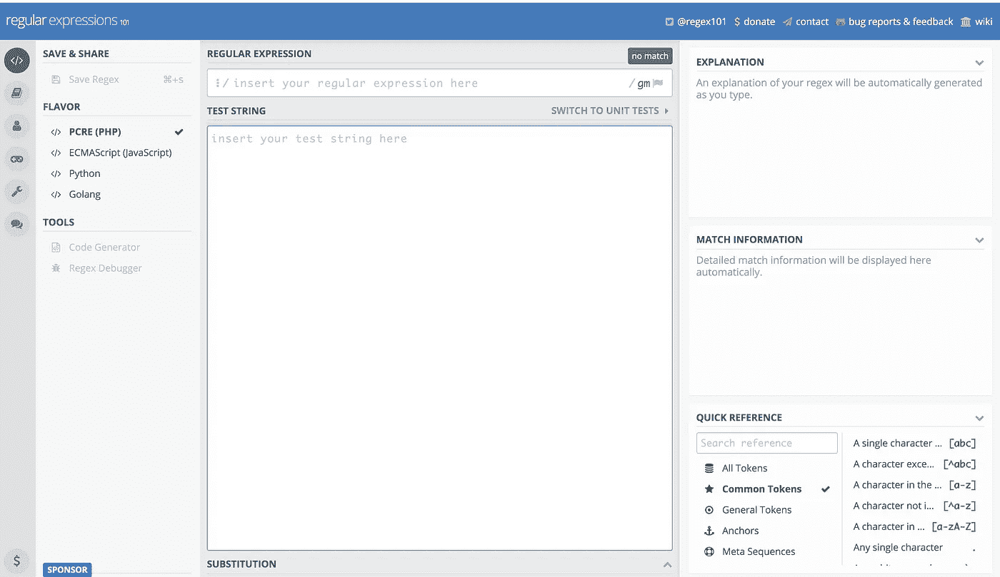
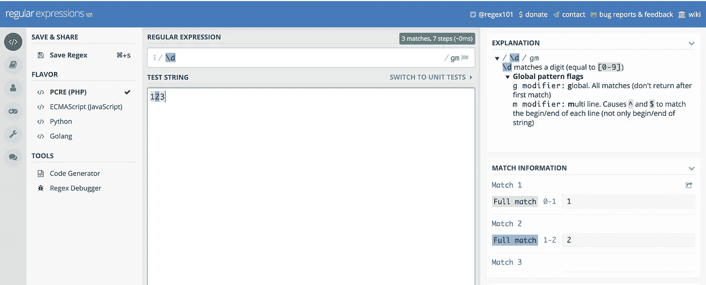
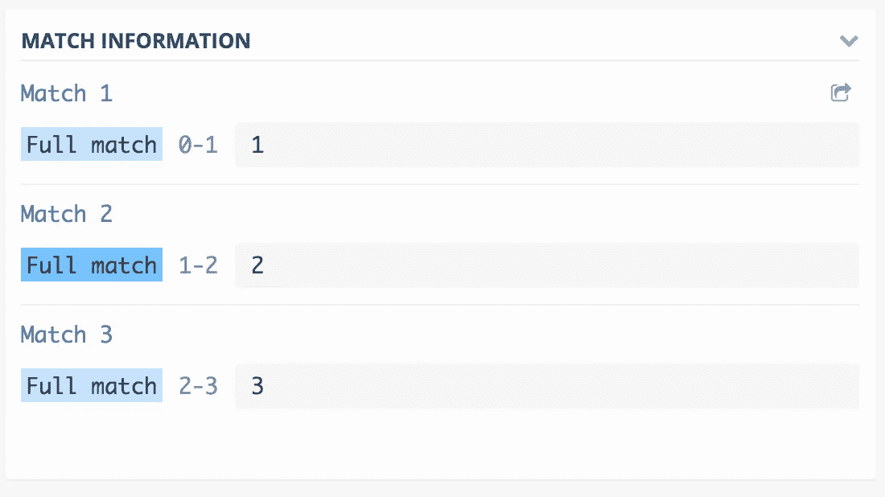
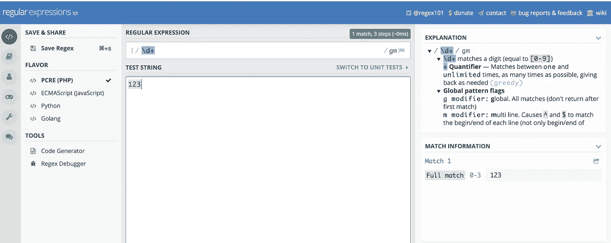
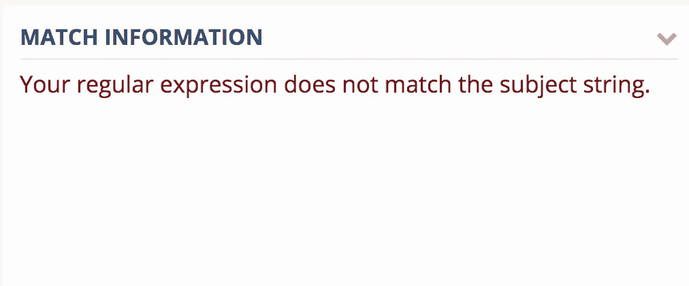
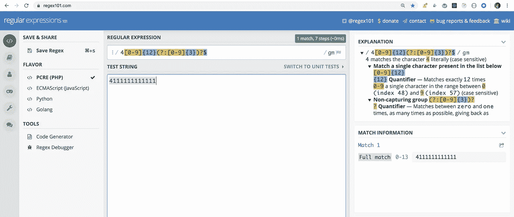

# 如何轻松理解世界上任何正则表达式

> 原文：<https://javascript.plainenglish.io/how-to-easily-understand-any-regular-expression-in-the-world-46ff6a5f551c?source=collection_archive---------1----------------------->

## 放弃对正则表达式的恐惧


Photo by [Zan](https://unsplash.com/@zanilic?utm_source=medium&utm_medium=referral) on [Unsplash](https://unsplash.com?utm_source=medium&utm_medium=referral)

今天我们将看到如何轻松理解任何 JavaScript 正则表达式或轻松编写自己的正则表达式。

为此，导航至[https://regex101.com/](https://regex101.com/)

用户界面如下所示



考虑一下，我们想要检查输入是否包含数字，因此我们将在**正则表达式**搜索框部分添加 **\d** ，并在**测试字符串**部分添加我们想要测试表达式的输入。你会看到类似这样的东西



如果您检查右侧的**匹配信息**部分，您可以看到正则表达式分别匹配每个数字的测试字符串。



如果您想要匹配整个输入 123，您需要在\d 后面加上+(为了
匹配一个或多个出现的数字),您将看到如下输出



在**匹配信息**部分可以看到，现在是完全匹配。

*你还可以看到右上角的解释部分，它显示了正则表达式的每个部分的作用，如果你不知道一些东西是如何工作的，这将非常有帮助。*

如果**测试字符串**与正则表达式不匹配，将显示如下



现在，让我们用一个正则表达式来检查 visa 信用卡(所有 Visa 卡号都以 4 开头。新卡有 16 位数。老卡有 13 位数。)

```
4[0-9]{12}(?:[0-9]{3})?$
```

如果你在正则表达式搜索框中添加了上面的正则表达式，那么你可以看到，解释部分更新后显示了表达式的解释，如下所示



*所以使用这种方式，你可以使用世界上任何一个正则表达式，检查它做什么，同时也验证输入字符串。*

*这也将节省您的时间并提高生产率，因为您可以快速更改正则表达式或输入字符串并测试其匹配度*

今天到此为止。希望你今天学到了新东西

**别忘了直接在你的收件箱** [**这里**](https://yogeshchavan.dev) **订阅我的每周时事通讯，里面有惊人的技巧、诀窍和文章。**