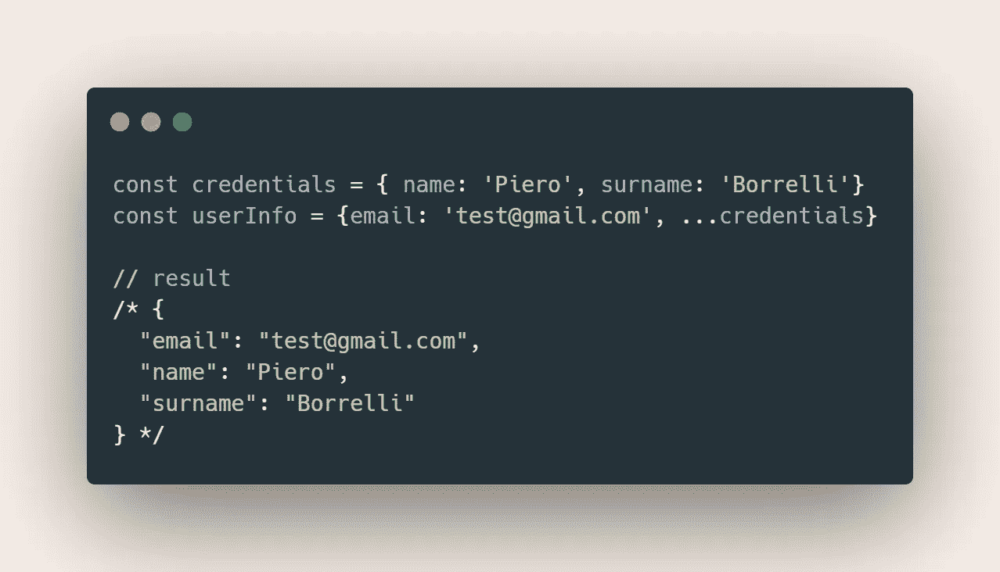
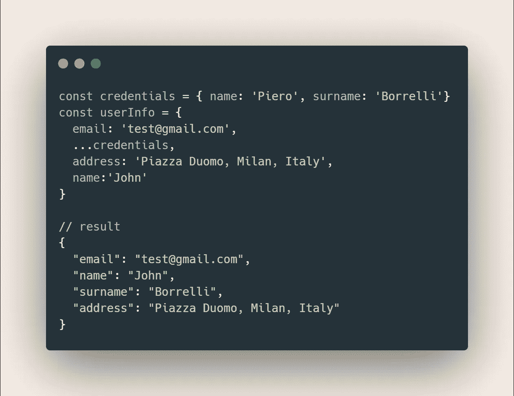
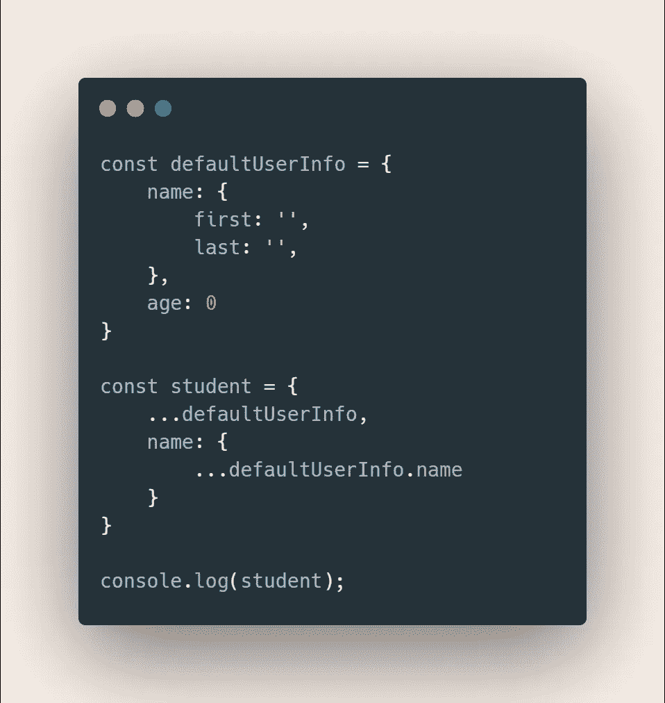

# 如何使用 Spread 操作符轻松更新对象

> 原文：<https://javascript.plainenglish.io/how-to-easily-update-your-objects-with-the-spread-operator-8f3dfdbcf956?source=collection_archive---------0----------------------->

## 随心所欲地塑造、修改和更新它们

Illustration by [Ivan Haidutski](https://dribbble.com/Ivan_Haidutski)
from [Icons8](https://icons8.com/)

[*传播算子*](https://developer.mozilla.org/it/docs/Web/JavaScript/Reference/Operators/Spread_syntax) 已经在 JavaScript 界有点地震了。它允许你执行安全的数组突变，创建新的数组，甚至管理[函数参数](https://javascript.info/rest-parameters-spread)。

这个特性变得如此有用和流行，以至于这种语法在处理对象时也变得流行起来**。**

## 传播对象

*【传播】*你的对象是一个简单的操作。它的工作方式与普通阵列相似。在这种情况下，您将展开*键值*对，而不是“*展开”*数组项。

你可以将这些数据传播到其他物体中，以便按照你的喜好来修改和塑造它们。

Spreading key-value pairs into objects

从例子中可以看出，`credentials` **中包含的数据已经被传播到了** `userInfo`中，产生了一个有三个*键-值*对的数组。

并且，正如您可能正确想象的那样，您还可以添加其他键值属性，即使它们没有像这样存储在任何地方

但是，请记住:

> 当分布键值对的结果包含一些同名的属性时，将使用最后定义的属性。

这里，值`John`被用于道具`name`。因为他们中有两个人在场，但是`name:'John’`是这种道具的最后一个定义。

## 两种常见用途

散布对象的两个最常见的用途是**更新它们**和**修复深层拷贝问题。通常，你会使用`Object.assign()`,但是有了对象扩展，一切都变得更容易，可读性更好，编写也更容易。**

不使用展开操作符指定对象

Assigning objects without the spread operator

使用扩展操作符指定对象

Assigning objects with the spread operator

不使用 spread 运算符深度复制对象

Deep copying objects without the spread operator

现在通过使用 spread 操作符使它变得更容易

Deep copying objects with the spread operator

## 关键要点

*   不仅可以传播数组元素。也是物品道具，按照你的意愿塑造和摆放你的物品
*   记住:对于两个同名的" *spread "* props 到一个对象中，将使用最后定义的那个
*   在解决[深度复制问题](http://Assigning objects without the spread operator)和相互之间分配对象时采用对象道具传播

一如既往，感谢阅读，并在评论区保持建设性的想法！

— *皮耶罗*