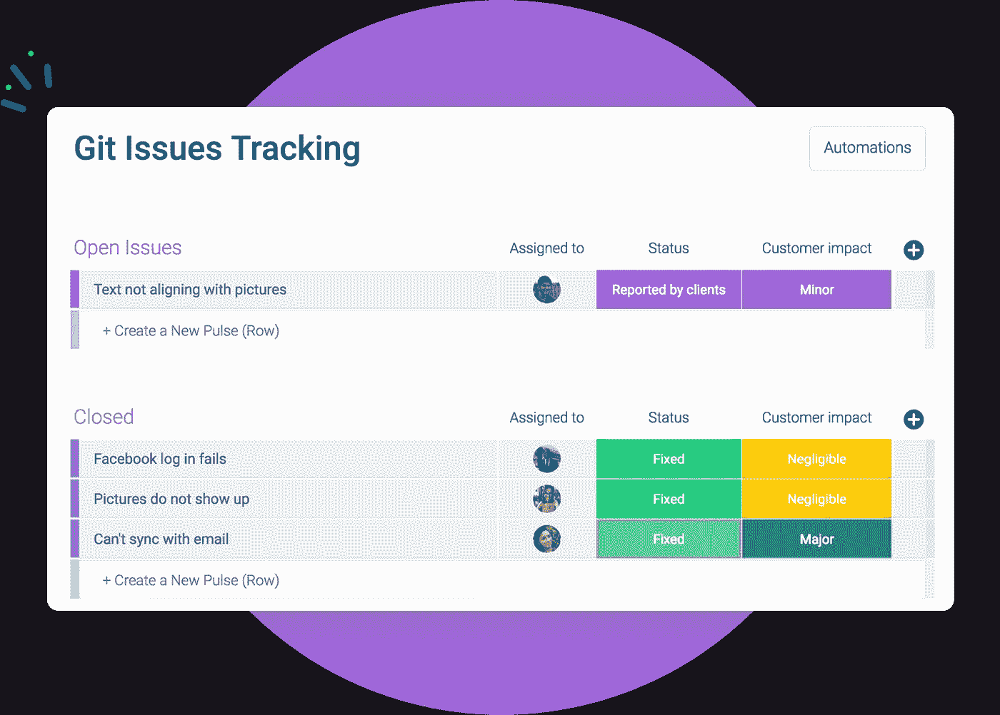

# 作为开发人员，如何有效管理您的工作日

> 原文：<https://javascript.plainenglish.io/how-to-effectively-manage-your-work-day-as-a-developer-70ecd97331d7?source=collection_archive---------13----------------------->

## 如何减少时间浪费并大幅提高工作效率

Photo by [Fabrizio Verrecchia](https://unsplash.com/@fabrizioverrecchia?utm_source=medium&utm_medium=referral) on [Unsplash](https://unsplash.com?utm_source=medium&utm_medium=referral)

想象一下，如果你能在编码的时候不浪费一分钟的时间，你的日常工作会是什么样子。

我想你可以完成更多的任务，更有效率。您可以将更多的时间花在代码质量和学习新东西上。我相信这样的生产力水平也能保证你将来的晋升。

不幸的是，不浪费你花在编码上的一分钟时间是不可能的。但是您可以随时改进您的管理方式。非常接近富有成效的一天。

让我们看看实现这一点的一些技巧。

## 制定每日计划

每天你坐在办公室的椅子上，确保你知道那天你要做什么。当然，意想不到的任务是不可能预测的，但是你应该努力清楚地了解你将在做什么。

这样，你就可以决定把你的努力分配到哪里，什么需要更多的时间和优先顺序，甚至更有动力去提高效率，因为你不会因为一天必须完成的工作量而感到不知所措或分心。

我强烈建议你采用你个人的方式来存储任务和相关信息。我个人使用一种叫做[Monday.com](https://monday.com/)的免费工具。

在这个平台上，您可以创建管理任务的板，根据您的需要对它们进行逻辑分离。我觉得这很神奇，尤其是因为它与 GitHub 和 Slack 进行了[集成，你可以直接从你的个人留言板中创建问题或者管理 Slack 消息。](https://monday.com/integrations)

下面是一个电路板示例:

An example of tracking developer’s tasks using Monday.com

其他管理时间的应用包括:

*   [todost](https://todoist.com/)
*   [nTask](https://www.ntaskmanager.com/)
*   [循环习惯跟踪器](https://loophabits.org/)

## 永远寻找你能做的事情

这是在我的职业生涯中对我个人影响很大的事情。在开始的时候，我有时会被一项任务困住，我记得我会尽全力去解决问题，不去想其他任何事情。

对你来说，这听起来可能不是问题，但问题是我总是会忽略我能做的其他事情，然后回到最初的问题上来。

例如，如果您不知道如何测试您的应用编程接口，因为您的同事还没有为您提供这样的套件，您可以同时创建一个微版本，而不是浪费时间耐心等待套件的到来。

努力集中精力解决问题是很重要的，但是不要忘记你总会有你能做的事情，然后当你觉得准备好了或者有工具能更好地解决问题时，再回到这个问题上来。

## 不要害羞，寻求帮助

你有没有感受过想向同龄人求助却又怕不合适的挣扎？

[也许你不想问他们太多事情](https://codeburst.io/how-do-you-get-the-most-meaningful-relationship-with-senior-developers-2be8e0c673f5)。或者你不想觉得自己很蠢。好吧，事实是人们在做某些事情上比我们更好，或者也许他们已经遇到了一些情况。所以，如果你在某件事情上已经坚持了 20 分钟，而且你自己已经很努力了，那就去做吧，问问你的同龄人。

## 结论

生活中总是如此，完美是不可企及的。然而，你可以一直努力让你的编码日成为你能做到的最好的、更有效率的时间。你只需要一些好的工具和大量的训练。

一如既往，感谢阅读。

— *皮耶罗*

## 资源

你喜欢你读到的东西吗？你想知道更多吗？在下面找到一些很酷的资源:

*   [Todoist](https://todoist.com/)
*   [任务](https://www.ntaskmanager.com/)
*   [回路习惯跟踪器](https://loophabits.org/)
*   [如何和你的高级开发人员搞好关系？](https://codeburst.io/how-do-you-get-the-most-meaningful-relationship-with-senior-developers-2be8e0c673f5)
*   [Monday.com](https://monday.com/)
*   [Monday.com 与开发者工具的集成](https://monday.com/integrations)。