# 如何有效地将类组件重构为钩子

> 原文：<https://javascript.plainenglish.io/how-to-efficiently-refactor-class-components-into-hooks-932b40c49bbe?source=collection_archive---------7----------------------->

## 理解 useCallback 和 useRef 的重要性


Photo by [Kari Shea](https://unsplash.com/@karishea?utm_source=medium&utm_medium=referral) on [Unsplash](https://unsplash.com?utm_source=medium&utm_medium=referral)

在本文中，我们将探讨如何将类组件转换为基于钩子的组件，并理解一些内置钩子的重要性。

如果你是钩子的新手，可以看看我以前的文章[这里的](https://levelup.gitconnected.com/an-introduction-to-react-hooks-50281fd961fe)来了解 React 钩子的介绍。

## **我们开始吧**

从[这里](https://github.com/myogeshchavan97/class-components-to-hooks)克隆初始项目代码

要运行该应用程序，请按顺序执行以下命令

1.纱线安装
2。纱线起点

您可以在此找到现场工作演示

在本项目中，主要组件代码在`src/components/Profile.js`中

在这里，我们显示用户配置文件与认证填充值，并允许用户对配置文件信息进行修改，并将其存储在 redux。

对于这个演示，为了简单起见，我在`src/utils/ api.js`中创建了一个假的 API，而不是创建一个单独的 Nodejs 服务器来处理请求。

让我们来理解来自`Profile`组件的代码

在这个组件中，当组件被挂载时，我们进行 API 调用来获取用户配置文件细节

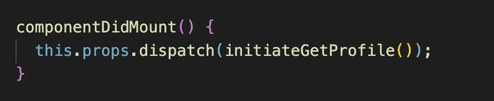

componentDidMount

一旦用户配置文件数据被添加到 redux store 中，我们将通过实现`componentDidUpdate`方法并将其设置为本地状态来获取该数据。

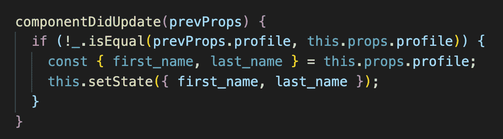

componentDidUpdate

数据在`this.props.profile`可用，因为我们在`Profile.js`中增加了`mapStateToProps`方法

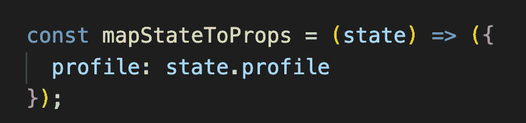

mapStateToProps

当我们更改名字或姓氏时，我们调用`handleOnChange`方法来更新本地状态。

当我们提交表单时，我们调用`handleSubmit`方法来检查是否输入了所有的值，然后分派动作用更新的数据更新存储。

这就是使用基于类的方法的`Profile`组件的所有功能。

现在我们将把它转换成使用钩子。

将`Profile`声明为功能组件

```
const Profile = (props) => {
  //some code 
};
```

为了存储名字和姓氏，使用`useState`钩子创建一个状态对象，并为`useState`钩子添加导入。

另外，为`errorMsg`和`isSubmitted`状态值添加单独的`useState`调用。

现在，将`Profile`类的 render 方法返回的 JSX 复制到`Profile`功能组件中。

将每个输入字段的值属性从`this.first_name`更改为`state.first_name`，将`this.last_name`更改为`lastname`，并将`this.handleOnChange`更改为`handleOnChange`

将`this.handleSubmit`改为`handleSubmit`

现在，我们将添加 handleSubmit 和`handleOnChange`处理程序

在这些处理程序中，我们已经将`this.state`更改为`state`并将`this.props`更改为`props`，并且更新了各自的状态值。

现在，通过运行`yarn start`命令启动应用程序，您将看到应用程序显示在控制台中，没有任何错误，输入值也在改变


Initial Screen

现在，当组件被挂载时，将调用 API 来获取用户数据。

为了在钩子中实现`componentDidMount`方法，我们需要将空数组作为第二个参数传递给`useEffect`钩子。

```
useEffect(() => {    
 props.dispatch(initiateGetProfile());  
}, []);
```

现在，如果您检查应用程序，您将在控制台和终端中看到警告

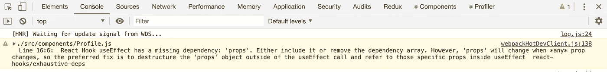

Console warning

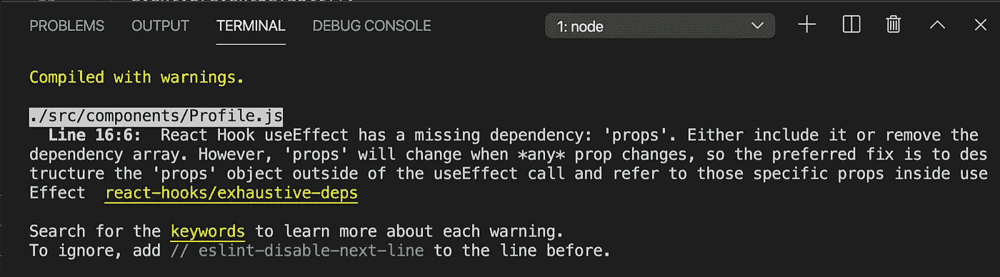

Terminal warning

这是因为每当我们在`useEffect`中使用任何在`useEffect`钩子外声明的变量时，我们都需要在依赖数组中提到它。在这种情况下，它是道具。

所以让我们在依赖数组中添加道具

```
useEffect(() => {
 props.dispatch(initiateGetProfile());
}, [props]);
```

现在，如果你看到终端，它是干净的，没有错误，但我们的组件不断得到重新呈现。

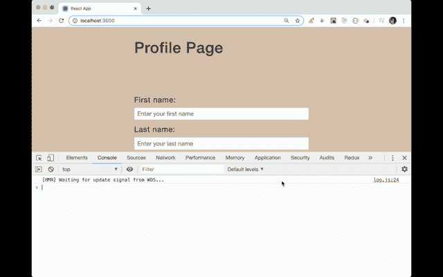

App re-rendering

这就是为什么我们需要在做出任何改变之前提及`componentDidUpdate`方法中的条件

```
componentDidUpdate(prevProps) {
  if (!_.isEqual(prevProps.profile, this.props.profile)) {
    const { first_name, last_name } = this.props.profile;
    this.setState({ first_name, last_name });
  }
}
```

所以这个动作不只是被调度一次，而是被无限期调用。

为了解决这个问题，我们需要使用`useCallback`钩子。它接受与`useEffect`钩子相同的参数，但是它将返回一个函数的`memoized`版本。

```
const processOnMount = useCallback(() => {
    props.dispatch(initiateGetProfile());
}, [props]);useEffect(() => {
  processOnMount();
}, [processOnMount]);
```

但是由于`useCallback`中传递的道具，这个 will 还是一样的。要真正解决这个问题，我们需要添加条件，使用`useRef`钩子只运行一次。

默认情况下，我们会将`useRef`初始化为 false，当动作被调度一次后，我们会将其设置为 true。由`useRef`创建的 Ref 包含`current`属性，该属性实际保存传递给`useRef`的值。

```
const processOnMount = useCallback(() => {
  if (!propsRef.current) { // check if current value is false
    props.dispatch(initiateGetProfile());
    propsRef.current = true;
  }
}, [props]);useEffect(() => {
  processOnMount();
}, [processOnMount]);
```

现在，如果您检查应用程序，您将看到该动作只被调度一次，因为只显示了一个`console.log`。

> 所以将类组件转换成钩子有时很棘手，但是一旦你有了这个想法，你就可以很容易地编写钩子了。

现在，我们将获取更新后的 redux store 值，并通过添加另一个`useEffect`钩子显示在输入字段中。

```
seEffect(() => {
 setState(props.profile);
}, [props, props.profile]);
```

现在，每当 redux 存储更新时，我们将获得设置为 state 的更新值。

这里我们需要提到依赖数组中的`props`和`props.profile`。

现在，如果您运行该应用程序，您将看到该应用程序正在按预期工作。用户详细信息会显示在页面加载中，并且在发生变化时也会在商店中更新。

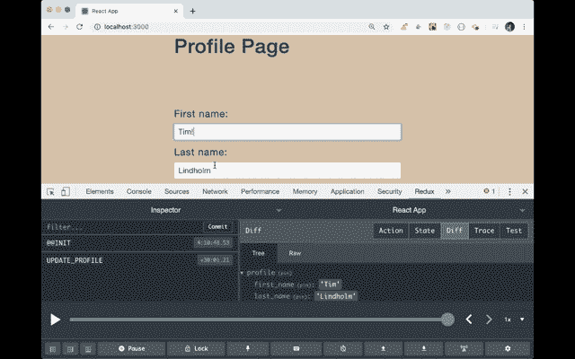

Updated store

但是，您会在控制台中看到警告。

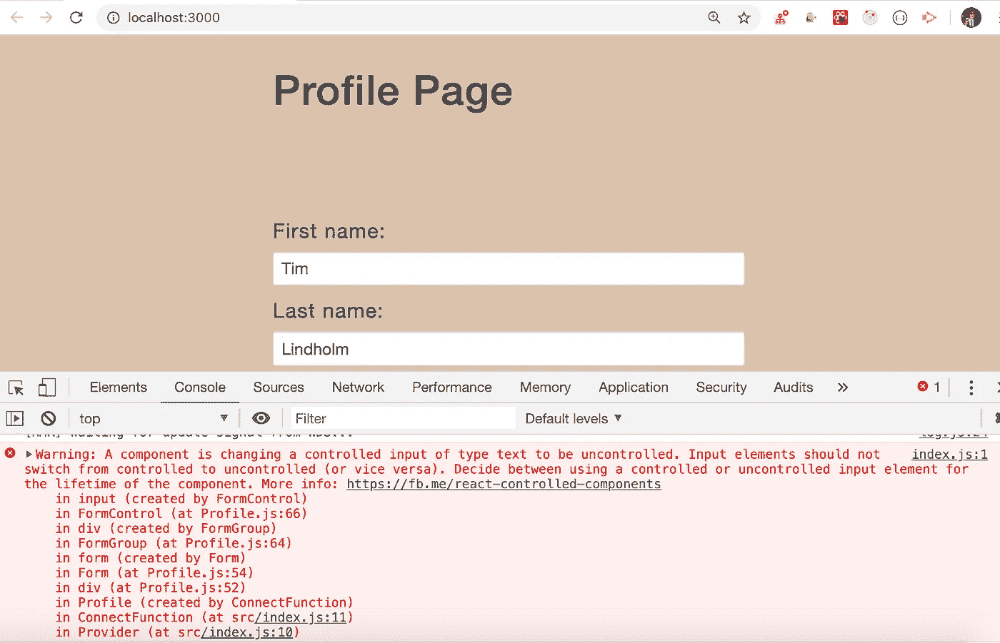

Warning

您可能会感到惊讶，因为我们已经有了受控输入，因为我们使用的是最初正确设置为空字符串的值属性，并且还有正确更新状态的`onChange`处理程序。仍然认为我们正在从`controlled`向`uncontrolled`转变，反之亦然。

这是因为当我们加载组件时，即使我们用`first_name`和`last_name`属性将状态设置为对象，它在组件加载时仍是一个空对象，如下图所示。

请仔细查看 react dev 工具中的钩子部分。

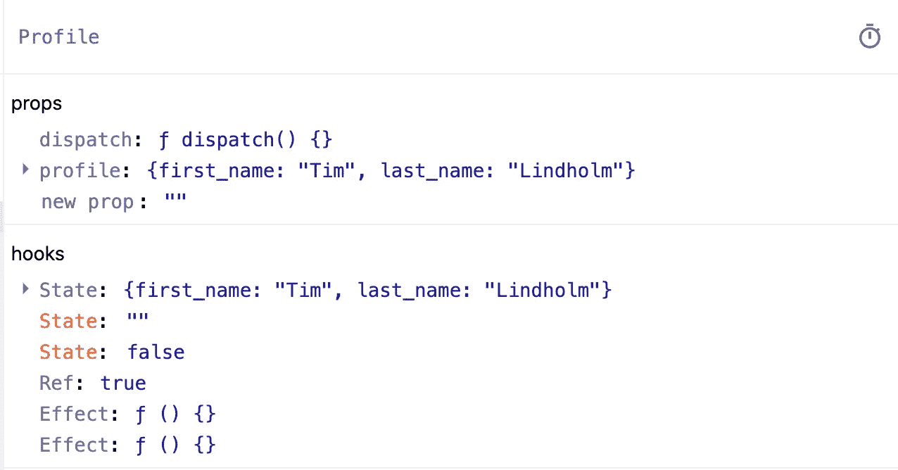

您将看到，在几分之一秒内，状态从`state: {}`变为`state: {first_name: "Tim", last_name: "Lindholm"}`

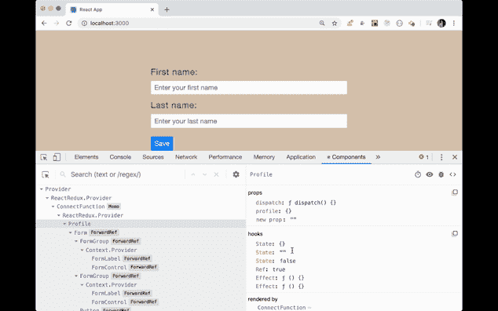

Empty state change

因此，当状态最初为空对象时，`state.first_name`和`state.last_name`将变为`undefined`，并被设置为输入字段的值属性。

因此，输入从`uncontrolled`变为`controlled`。所以要解决这个问题，我们需要初始化值 prop 为空字符串，如果它是`undefined`

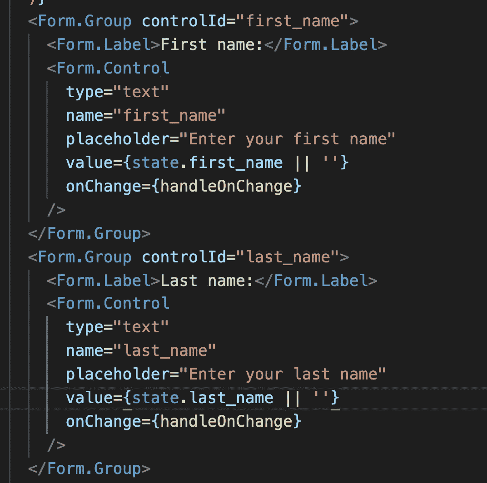

Initialize to empty value

你可以通过钩子[这里](https://github.com/myogeshchavan97/class-components-to-hooks/tree/using-hooks)和现场演示[这里](https://class-components-to-hooks.now.sh/)找到完整的源代码

今天到此为止。我希望你学到了新东西。

**别忘了直接在你的收件箱** [**订阅我的每周简讯，里面有惊人的技巧、窍门和文章。**](https://yogeshchavan.dev/)

# **用简单英语写的便条**

你知道我们有四份出版物和一个 YouTube 频道吗？你可以在我们的主页[**plain English . io**](https://plainenglish.io/)找到所有这些内容——关注我们的出版物并 [**订阅我们的 YouTube 频道**](https://www.youtube.com/channel/UCtipWUghju290NWcn8jhyAw) **来表达你的爱吧！**