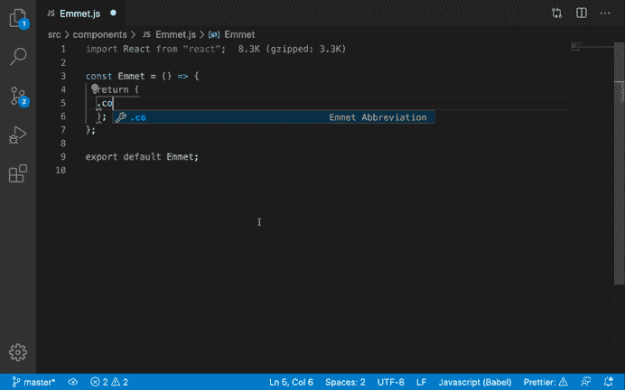
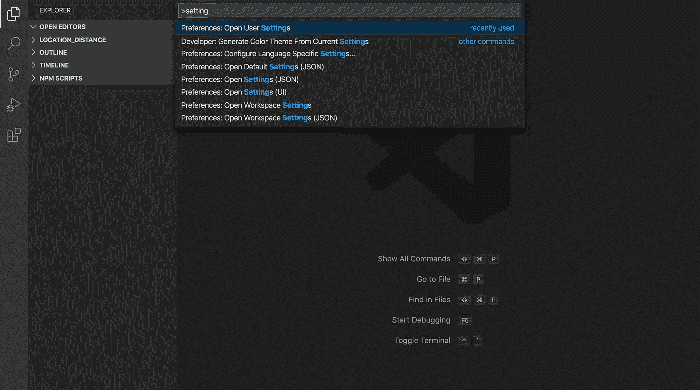
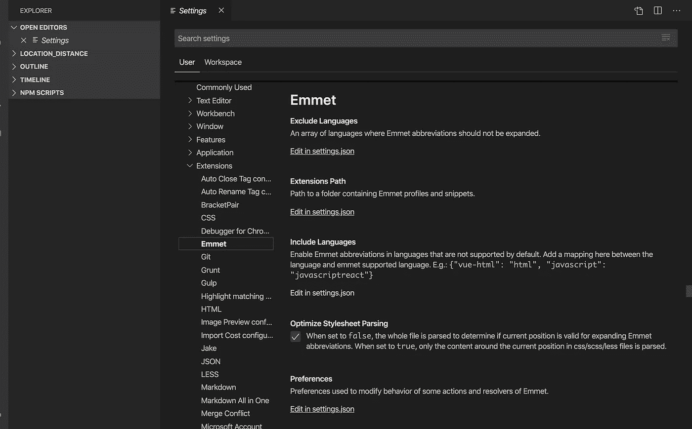
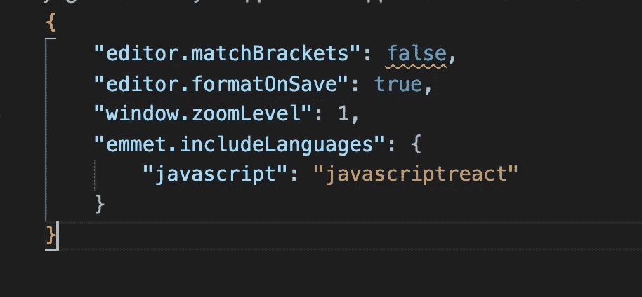

# 如何启用 emmet for React 来提高您的工作效率

> 原文：<https://javascript.plainenglish.io/how-to-enable-emmet-for-react-to-improve-your-productivity-6fae59000294?source=collection_archive---------3----------------------->

## 启用 emmet 进行 React 的简单方法



如果您是 HTML/CSS 开发人员，那么您可能已经知道 emmet 插件。

它通过减少额外输入的需要，为 HTML 和 CSS 代码提供了自动完成功能。

默认情况下，它已经包含在 VS 代码中的所有 HTML 和 CSS 文件中，但是我们需要做一些额外的配置来启用它。

1.  在 Visual Studio 代码中，按`Control + Shift + P`或`Command + Shift + P (Mac)`打开命令面板，键入`setting`，然后选择`Preferences: Open User Settings`选项



2.在左侧，展开`extension`菜单并点击`emmet`



3.然后点击“`Include Languages`部分下的“`Edit in settings.json`链接

4.打开后，在`emmet.includeLanguages`下添加`"javascript": "javascriptreact"`，保存文件。

```
"emmet.includeLanguages": {
  "javascript": "javascriptreact"
}
```



5.你完了。

现在在 React 中打开任何组件文件，键入`.container`并按 tab 键，它将自动完成它

```
<div className="container"></div>
```

这个小配置将节省您的大量时间，因为它消除了每次在 React 中添加新类时复制粘贴 div 或键入`className`的需要。

**温馨提示:**

1.  如果你已经创建了一个新的`.html`文件，那么不用自己输入`doctype`、`head`、`meta`和`body`标签，只需输入感叹号`!`并按 tab 键，emmet 就会添加默认的 html 代码
2.  如果你想生成一些随机的`lorem ipsum`文本，那么只需输入`p*4>lorem`并按 tab 键，emmet 就会添加 4 段随机的`lorem ipsum`文本
3.  要将多个类如`list`和`item`添加到同一个元素中，键入`.list.item`并按 tab 键，这将被转换为

```
<div className="list item"></div>
```

4.如果你在一个 CSS 文件中，要添加任何属性，你可以使用简写语法。例如，要添加 10px 的`letter-spacing`，只需键入`ls10`并按 tab 键，它将被转换为`letter-spacing: 10px`

要了解更多关于 emmet 快捷方式的信息，请点击[这里](https://docs.emmet.io/)

今天到此为止。我希望你学到了新东西。

**别忘了订阅我的每周简讯，里面有惊人的技巧、诀窍和文章，直接在你的收件箱** [**这里。**](https://yogeshchavan.dev/)

## **用简单英语写的 JavaScript 笔记**

我们已经推出了三种新的出版物！请关注我们的新出版物:[**AI in Plain English**](https://medium.com/ai-in-plain-english)[**UX in Plain English**](https://medium.com/ux-in-plain-english)[**Python in Plain English**](https://medium.com/python-in-plain-english)**——谢谢，继续学习！**

**我们也一直有兴趣帮助推广高质量的内容。如果您有一篇文章想要提交给我们的任何出版物，请发送电子邮件至[**submissions @ plain English . io**](mailto:submissions@plainenglish.io)**，并附上您的 Medium 用户名，我们会将您添加为作者。另外，请让我们知道您想加入哪个/哪些出版物。****