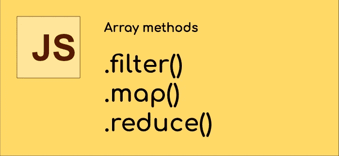

# 如何解释 JavaScript？过滤器()。map()和。将()减少到 SQL 用户

> 原文：<https://javascript.plainenglish.io/how-to-explain-javascript-filter-map-and-reduce-to-sql-users-8f5b2d9726e6?source=collection_archive---------4----------------------->



我发现使用**。**滤镜()**。map()** 和**。reduce()** *数组方法*有助于降低代码复杂度，简化许多典型的数组数据处理任务。查看[http://kangax . github . io/compat-table/es5/# test-Array _ methods](http://kangax.github.io/compat-table/es5/#test-Array_methods)，可以确认这些方法几乎兼容任何现代桌面/移动浏览器。

理解如何使用**的好方法。过滤器()。map()** 和**。reduce()** 是比较 SELECT 语句中每一条到 ***的 SQL 数据操作*** 。考虑以下 SQL 查询:

```
SELECT
category, SUM(amount) as total
FROM transactions
WHERE status = 'active'
GROUP BY category
```

一个通用 SQL 命令可以有三种类型的数据操作:**映射**或选择要显示的字段(*类别、总计*)，**使用条件过滤**数据(*状态=‘活动’*)，以及**减少**结果，使用指定一些*聚集组* ( *类别**的*聚集函数* ( *总和*)生成汇总数据在 Javascript 中，这些操作可以使用**来执行。**滤镜()**。map()** 和**。reduce()*****

给定对象的 Javascript *数组中的以下数据集，我将解释并向您展示每个数组方法的一些用法示例:*

```
var transactions = [
{ id: 4534, date: "2019–01–08", product: 112, price: 21, quantity: 2, taxes: 1.12, declined: false },
{ id: 4535, date: "2019–01–08", product: 232, price: 32, quantity: 3, taxes: 2.19, declined: false },
{ id: 4536, date: "2019–01–08", product: 554, price: 7, quantity: 100, taxes: 10.55, declined: true },
{ id: 4537, date: "2019–01–08", product: 433, price: 21, quantity: 2, taxes: 1.12, declined: false },
{ id: 4538, date: "2019–01–08", product: 112, price: 21, quantity: 4, taxes: 2.24, declined: false }
];
```

## **滤镜()**

我们使用 **filter()** 作为要执行的第一个操作，因为它减少了处理信息的行数。

`result = myArray.**filter**( *filterFunc* )`

***filterFunc*** 每次取*数组*中的一个元素，并且必须从结果中返回 **true** 到 *include* (或 **false** 到 *exclude)* 该项。

例如:

```
var activeTransactions = transactions.**filter**(function(*item*){
  return !*item*.declined
})
```

现在`activeTransactions`将只包含`declined`为`true`的交易。在本例中，是 5 分之 4。这相当于以下 SQL 查询:

```
SELECT * FROM transactions WHERE NOT declined
```

## 地图()

我们可以用 **map()** to ***选择*** ***哪些字段*** 将是结果的一部分。

`result = myArray.**map**( *mapFunc* )`

***mapFunc*** 每次取`myArray`的一个元素，必须返回一个值或者对象映射元素属性。

```
var totals = transactions.**map**(function(*item*){
  return { 
    productId: *item*.product, 
    totalAmount : *item*.price * *item*.quantity + *item*.taxes 
  }
})
```

现在`totals`将包含一个对象数组，每个对象只有两个字段*:product id(别名`.product`)和 totalAmount(根据`.price` `.quantity`和`.taxes`计算)。这相当于以下 SQL 查询:*

```
*SELECT product as productId, price*quantity+taxes as totalAmount 
FROM transactions*
```

## *减少()*

*最后，我们可以从数据集中得到一个值的**汇总**(或者只是一个最终值)，将行减少到一个元素。*

*`result = myArray.**reduce**( reduceFunc, initialAccum )`*

****reduceFunc*** 取一个*累加器*和*myArray 的每个元素*，累加值，返回最终汇总。`initialAccum`是你的结果的初始值，从要累加的值开始(比如从 ***零*** 开始)。*

```
*var total = transactions.**reduce**(function(*accum*, *item*){
  return { 
    total: *accum*.total + *item*.quantity**item*.price+*item*.taxes,
    count: *accum*.count + 1
  }
}, {total: 0, count: 0} )*
```

*现在`total`将包含总计金额`total`和处理了多少交易(`count`)。这相当于以下 SQL 查询:*

```
*SELECT 
SUM(price*quantity+taxes) as '**total'**, count(1) as '**count'** 
FROM transactions*
```

*有时，你只需要返回一个 ***单个最终值*** ，在这种情况下你的累加器必须是单个值(下例中的`0`):*

```
*var total = transactions.reduce(function(accum, item){
  return accum + item.quantity*item.price+item.taxes
}, 0 )*
```

## *混合在一起*

*最后，因为**。**滤镜()**。地图()**和**。reduce()** 返回数组，你可以把所有的东西放在一个调用链中，得到一个最终的结果，如下所示:*

```
*// Total amount of transactions not declined
var total = 
   transactions
   **.filter**(function(item){ 
     return !item.declined 
   })
   **.map**(function(item){ 
     return { 
       totalAmount : item.price * item.quantity + item.taxes 
     }
   })
   **.reduce**(function(accum, item){
     return accum + item.totalAmount
   }, 0 )*
```

*这相当于以下 SQL 查询的结果:*

```
*SELECT 
SUM(*price***quantity*+*taxes*) 
FROM transactions
WHERE NOT *declined**
```

## *自己做*

*您可以自己尝试运行和修改以下 Javascript 演示，并提供更多示例:*