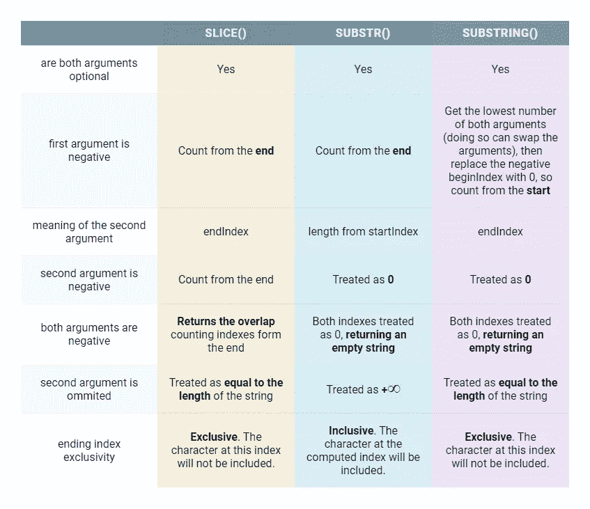

# 如何在 JavaScript 中提取字符子集

> 原文：<https://javascript.plainenglish.io/how-to-extract-a-subset-of-characters-in-javascript-9ea482e512bd?source=collection_archive---------15----------------------->

## 让我们看看我们的朋友 slice()，它试图提取 JavaScript 中的一个字符子集。


Image by [Rudy and Peter Skitterians](https://pixabay.com/users/skitterphoto-324082/?utm_source=link-attribution&amp;utm_medium=referral&amp;utm_campaign=image&amp;utm_content=1930518) from [Pixabay](https://pixabay.com/?utm_source=link-attribution&amp;utm_medium=referral&amp;utm_campaign=image&amp;utm_content=1930518)

正如迷你系列的第一部分所述，我们将看看从字符串中获取字符子集的另一种方法。现在，在 **String.prototype** 上使用 **slice()** 。

我们将介绍定义、用法，以及该方法与第一部分中描述的类似方法 **substr()** 和 **substring()** 有何不同。

# 让我们从定义开始

方法 **slice()** 有这两个参数: **beginIndex** ，它定义了要包含在返回的子字符串中的第一个字符的索引，以及 **endIndex** ，它是可选的，说明直到哪个索引提取字符。该选择是排他的，这意味着 endIndex 不是返回字符串的一部分。这并不改变原来的字符串，而是返回一个新的字符串，使它成为不可变的。

让我们来看一些例子，以获得更好的概述:

Using slice()

这些结果可能会让你大吃一惊。尤其是如果你已经习惯了 **substr()** 或者 **substring()** 的工作方式。别担心。负索引很容易让人迷惑。

# 一些特殊情况下的规则

## 1.负开始指数

在负的 **beginIndex** 的情况下，索引从字符串的末尾开始，在字符串的开头结束。如果我们想把目标人物放在最后，这会很有用。

```
let **myString** = 'LostInTheSubstring';console.log(**myString**.slice(-6)); // *string*
```

注意，在示例中，我们省略了 **endIndex** 。这样做是可以的，因为 endIndex 是可选的。接下来我们将讨论它到底是如何工作的。

## 2.省略 endIndex

这个很简单。如果没有提供，缺省值是字符串长度，导致从 **beginIndex** 返回一个字符串，直到结束。

```
let **myString** = 'LostInTheSubstring';console.log(**myString**.slice(4));  // *InTheSubstring*
console.log(**myString**.slice(-4)); // *ring*
```

## 3.负 endIndex

类似于第一种情况，如果 **endIndex** 为负，则从字符串的末尾开始计数。

```
let **myString** = 'LostInTheSubstring';console.log(**myString**.slice(4, -9));  // *InThe*
console.log(**myString**.slice(-9, -6)); // *Sub*
```

## 4.其他有趣的案例

在这里，我们将研究一些不寻常的组合，结果可能是大部分是空字符串。本节也适合使用 **slice()** 方法。正如您将在后面看到的，使用带有相同参数的 **substr()** 和 **substring()** 会产生非常不同的结果。事不宜迟，我们上车吧。

**begin index 高于 endIndex。** 这里我们没有字符，因为索引不重叠。

```
let myString = 'LostInTheSubstring';console.log(myString.slice(4, 0)); // ''
```

有趣的是，这个逻辑同样适用于负的 **beginIndex** ，我们从字符串的末尾选择一个索引。为什么它是真的是因为在负的 **beginIndex** 的情况下，公式是`string.length + beginIndex`，这就是为什么上面相同的逻辑被应用。要记住一个简单的规则:没有重叠，就没有结果。

```
let myString = 'LostInTheSubstring';console.log(myString.slice(-4, 4)); // ''console.log(myString.length)        // 18
console.log(myString.slice(-1) === myString.slice(17)) // true
```

**begin index 等于或大于字符串长度。** 当提取的起点等于或大于字符串长度时，不返回任何字符(即使使用负的 **endIndex** )。没有其他的数学在进行。一旦你超过了弦的长度，就是这样。

```
let myString = 'LostInTheSubstring';console.log(myString.slice(100));      // ''
console.log(myString.slice(100, 0));   // '' console.log(myString.slice(100, -99)); // ''
```

既然我们已经了解了 **slice()** 是如何工作的，让我们将这个方法与前面提到的类似方法 **substr()** 和 **substring()** 进行比较，这两个方法都出现在 **String.prototype** 上。

为了便于阅读，下表显示了不同之处:



Comparison table (image by author)

但是等等，MDN 和 W3Schools 都说只有第二个参数是可选的。好吧，让我们看看 EMCA-262 的规格。

这里我们可以看到，如果我们不提供这两个参数中的任何一个，第一个参数将获得默认值 0，第二个参数将获得字符串长度的默认值。

在你的浏览器里试一下，不会崩溃。

在使用兼容性方面，它在 caniuse.com 的所有跟踪用户中获得了 97.67%的优势。

# 结论

**string . prototype . slice()**是我在本系列第一部分[中提到的其他字符串提取方法之间的有效选项。](https://medium.com/@maros.karasek/lost-in-the-substring-c7871d2dad4b)

在所有主流浏览器桌面和手机上使用都是安全的。

尽管这些差异看起来很微妙，但是了解各种方法之间的差异可以扩展您的 JavaScript 知识，让您知道什么时候使用什么方法，并在看到它被使用时快速理解发生了什么。

谢谢你的时间。上帝保佑。

# 了解更多信息

[](https://developer.mozilla.org/en-US/docs/Web/JavaScript/Reference/Global_Objects/String/slice) [## String.prototype.slice()

### slice()方法提取一个字符串的一部分，并将其作为一个新的字符串返回，而不修改原来的…

developer.mozilla.org](https://developer.mozilla.org/en-US/docs/Web/JavaScript/Reference/Global_Objects/String/slice) [](https://www.w3schools.com/jsref/jsref_slice_string.asp) [## JavaScript String slice()方法

### 下面有更多“自己尝试”的例子。slice()方法提取字符串的一部分，并将提取的部分返回给…

www.w3schools.com](https://www.w3schools.com/jsref/jsref_slice_string.asp)  [## ECMAScript 2020 语言规范

### 编辑描述

www.ecma-international.org](https://www.ecma-international.org/ecma-262/#sec-string.prototype.slice)  [## 我能用吗...HTML5、CSS3 等的支持表

### “我可以使用吗”提供了最新的浏览器支持表，以支持桌面和移动设备上的前端 web 技术…

caniuse.com](https://caniuse.com/mdn-javascript_builtins_string_slice) [](https://medium.com/@maros.karasek/lost-in-the-substring-c7871d2dad4b) [## 在子串中丢失

### 以正确的方式在 JavaScript 中找到子串

medium.com](https://medium.com/@maros.karasek/lost-in-the-substring-c7871d2dad4b)