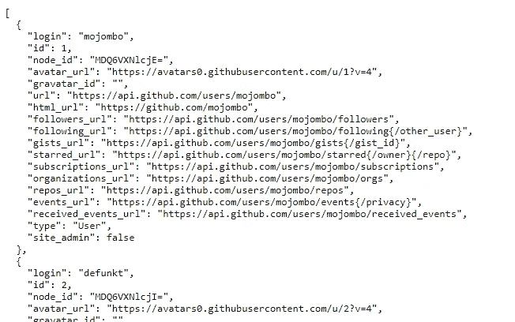
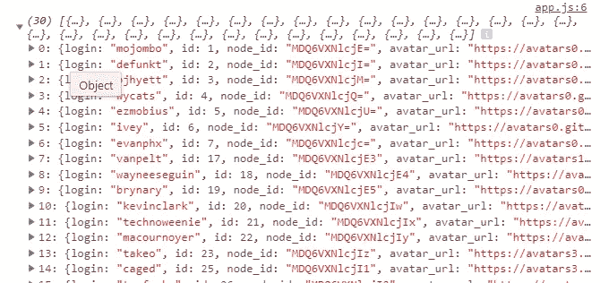

# 如何在 JavaScript 中从 API 获取数据

> 原文：<https://javascript.plainenglish.io/how-to-fetch-data-from-an-api-in-javascript-dccde83619b2?source=collection_archive---------1----------------------->

## 通过实例了解 fetch API


Photo by [Joshua Aragon](https://unsplash.com/@goshua13?utm_source=medium&utm_medium=referral) on [Unsplash](https://unsplash.com?utm_source=medium&utm_medium=referral)

# 什么是 Fetch API？

fetch API 是一个内置的 JavaScript ES6 promise，用于使 XMLHttpRequests 更简单、更容易地异步获取或发送数据。它提供了一个从服务器获取资源的接口，具有更加强大和灵活的特性集。除了 IE 之外，所有现代浏览器都支持 fetch API。获取数据的简单性和更简洁的方式使得这个 API 在 JavaScript 社区中更加强大和流行。

在这篇短文中，我们将了解如何在 JavaScript 中使用 Fetch API 从资源中获取数据。


Image Created with ❤️️ By Mehdi Aoussiad.

# 使用 Fetch 从 API 获取数据

方法`**fetch()**`带有一个强制参数，即您想要获取的资源的路径。它返回一个 JavaScript 承诺，该承诺解析对该请求的响应，无论成功与否。

为了更加实用，我们将使用 Fetch API 从 Github users API 获取数据，并显示在页面上。



The Github Users Data.

正如您在上面看到的，如果我们转到 Github 用户 API 的链接:

```
**https://api.github.com/users**
```

你会发现这是一个包含前 30 名 Github 用户所有信息的对象数组(名字-图片-关注者……)。因此，让我们使用 fetch 来获取一些数据，并在页面上显示它们:

首先，我们将创建一个 HTML 文件:

```
<!DOCTYPE html><html lang="en"><head><meta charset="UTF-8"><meta name="viewport" content="width=device-width, initial-scale=1.0"><title>Fetch</title><link rel="stylesheet" href="style.css"><script src="app.js" defer="true"></script></head><body> <h1>Here we will put the name of the Github User.</h1></body></html>
```

在我们的 JavaScript 中，我们将首先把数据打印到控制台。只是看看我们有什么。

```
fetch('https://api.github.com/users').then(res => res.json()).then(data => console.log(data));
```



Github users API.

如您所见，它在控制台中打印了所有前 30 个用户的数据。现在，让我们看看如何获取这些数据并在页面上显示它们。考虑下面的例子:

```
const body = document.querySelector('body');const h1 = document.querySelector('body h1');fetch('https://api.github.com/users').then(res => res.json()).then(data => {h1.innerHTML = data[0].login;// Create an Image.const img = document.createElement('img');body.appendChild(img);// Set the image source to an image url from the API data.img.src = data[0].avatar_url;});
```

上面的例子显示了页面上第一个 Github 用户的名字和图像。看看下面的例子:

Simple Example.

如您所见，这只是使用 fetch 从 API 获取数据的一种简单方式。

# 结论

fetch API 比`**XMLHttpRequest**`有了巨大的改进，有一个简单、优雅、易用的接口。请确保我们没有涵盖它的所有内容，您需要从其他资源了解更多信息。

感谢您阅读本文，希望您觉得有用。

## 进一步阅读

[](https://medium.com/javascript-in-plain-english/5-fun-apis-for-your-next-javascript-projects-1834626864c) [## 为您的下一个 JavaScript 项目准备的 5 个有趣的 API

### 您可以在 JavaScript 项目中使用的 5 个有用的 API

medium.com](https://medium.com/javascript-in-plain-english/5-fun-apis-for-your-next-javascript-projects-1834626864c)