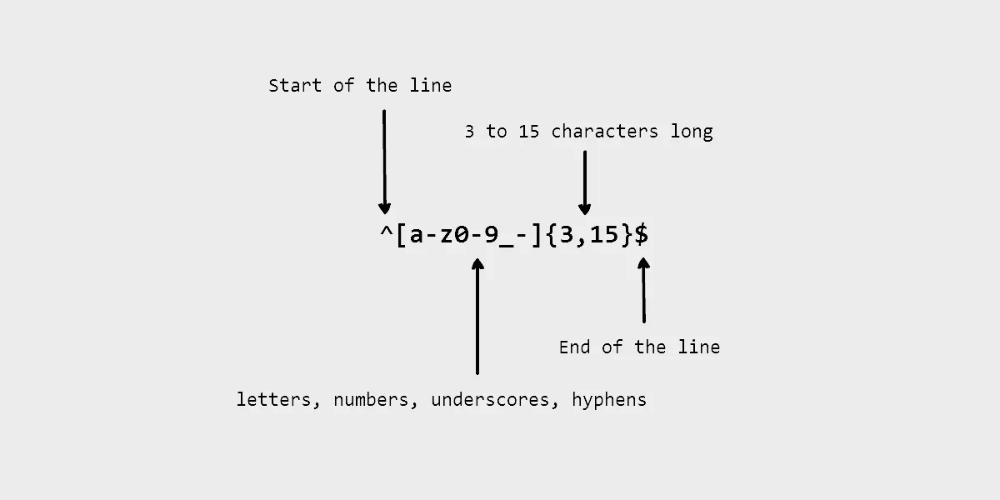

# 如何在 JavaScript 中找到文本模式

> 原文：<https://javascript.plainenglish.io/how-to-find-patterns-of-text-in-javascript-bc9aaff3943e?source=collection_archive---------5----------------------->

## 有和没有正则表达式

a regular expression

假设您想要验证一个字符串中的美国电话号码。标准模式是 XXX-XXX-XXXX。这里有一个例子:098–777–6666。让我们使用一个名为 isUSAPhoneNumber()的函数来检查一个字符串是否匹配这个模式，返回“真”或“假”。

当函数返回 false 时。我们将进行几次检查，看看该字符串是否是美国的有效电话号码。

*   字符串的长度不等于 12。
*   前三个字符(称为区号)仅由数字字符组成。
*   电话号码必须在区号后面有第一个连字符。
*   后三个字符是数字，然后是另一个连字符。
*   最后四个字符是更多的数字。

如果以上任何一项检查失败，该函数返回“false”，否则返回“true”。

# 没有正则表达式

创建一个新文件(名为 isUSAPhoneNumber.js ),并输入以下代码。

# 使用正则表达式

上面的电话号码查找工作，但它使用了很多代码来做一些有限的事情。 *isUSAPhoneNumber(text)* 函数将无法验证另一种格式，如 123.123.4242 或(123)123–4242。

让我们用一个正则表达式(简称 regexes)来解决这个问题。regex / `^[0-9]{3}-[0-9]{3}-[0-9]{4}$` */* 用于匹配与前面的 *isUSAPhoneNumber(text)* 函数相同的文本模式。

但是如何验证以下所有格式:*(123)123–4242，(123)123–4242，123–123–4242 和 123.123.4242* 。我们将正则表达式改为*/^((\([0–9]{3}\))|[0–9]{3})[\s\-\.]?[\ 0–9]{ 3 }[\ s \-\。]?[0–9]{4}$/.*

# 探索 egrep 元字符

大部分角色都符合自己。唯一的例外是特殊字符，如*、+、？, \, .、^、[]、$、&和|。

## 线的起点和终点

ˇ(*脱字符号*)和$ ( *美元*)，它们分别表示被检查的文本行的开始和结束。

*   如果插入符号(`^`)位于整个正则表达式的开头，则它匹配一行的开头。
*   如果一个美元符号(`$`)在整个正则表达式的末尾，它匹配一行的末尾。
*   如果一个完整的正则表达式被一个脱字符和美元符号(`^abc$`)括起来，那么它匹配一整行。

## 匹配几个字符中的任何一个

方括号中的字符串(`[]`)匹配该字符串中的任何一个字符。但是如果使用[ˇ]而不是[ ]，该类将匹配任何未列出的字符。

*   例如，`[abc]`匹配 a、b 或 c，但不匹配 x、y 或 z。
*   然而，`[^abc]`匹配 x、y 或 z，但不匹配 a、b 或 c。

## 匹配任何字符

如果您想验证电话号码，例如 123 123 4242、123–123–4242，甚至 123.123.4242，您可以使用“s”、“-”或“.”每个数字之间，如*[0-9]{ 3 }*[\-\。\s]？*[0-9]{ 3 }*[\-\。\s]？*[0-9]{ 4 }*。

*   为了匹配一个特殊的字符，在它前面加一个反斜杠，像这样`\.`
*   使用(`?`)匹配零个或一个出现的单字符正则表达式)。
*   {n}与前一组的 *n* 完全匹配。

现在您已经知道了使用正则表达式查找文本模式的基本步骤。

谢谢你的阅读！