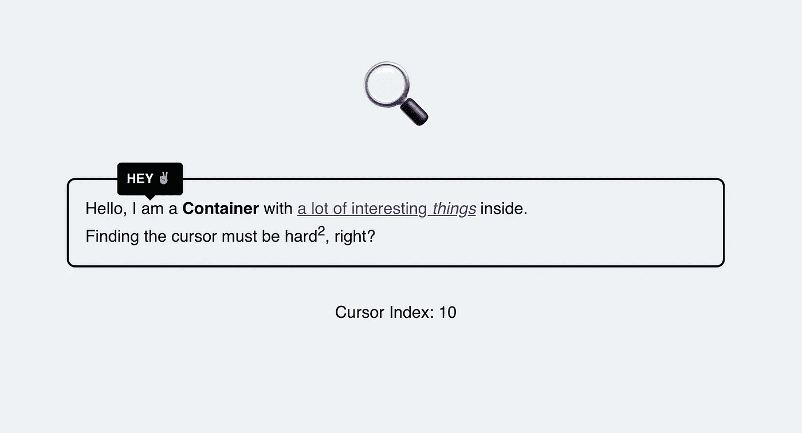

# 如何在 Contenteditable 元素中查找插入符号

> 原文：<https://javascript.plainenglish.io/how-to-find-the-caret-inside-a-contenteditable-element-955a5ad9bf81?source=collection_archive---------1----------------------->

## 获取光标坐标和索引位置以显示交互式 UI 元素！

You can find this working example at the end of this article.

是的，我知道…当然有比处理网页上的光标更令人兴奋的话题可以写。但是因为在我最近的项目中，我在这个问题上挣扎了很久，所以我决定分享我的方法——希望它能帮助其中一方。

在本文中，我们将创建两种定位插入符号的方法:一种获取 X/Y 坐标，另一种获取内容中的索引位置。

# 问题是

最近，我构建了一个文本编辑器，用户可以在其中编辑一个`contenteditable`元素中的 HTML 内容。为了调整内容的样式，我想在光标上方显示一个上下文菜单。

为此，我们需要知道插入符号的确切位置。但是我们怎么知道呢？

如果您使用一个`input`或`textarea`元素，那么获取该信息相对容易，因为表单元素本身有一个`selectionStart`和`selectionEnd`属性。

但是对于`contenteditable`元素，你没有这些属性。此外，可编辑元素内部可以有嵌套的 HTML 元素(例如在`div`中有一个`strong`标签)。这就更难了。

幸运的是，我们可以轻松解决这两个问题。

# 解决方案

## 获取插入符号坐标

在上面提到的例子中，我想在插入符号的正上方显示一个上下文菜单。因此，我们需要知道它的 X 和 Y 坐标。如果我们有了这些，我们可以显示一个具有`position: absolute;`属性和适当的顶部和左侧定位的`div`。

为了获得插入符号坐标，我们首先从`window`对象中获得选择。所选内容包含关于光标的信息:光标是否被放置、被放置在哪里以及在屏幕上选择了多少内容。

我们使用该信息来检查是否有光标设置(第 7 行)。如果这是真的，我们克隆当前范围。范围是选择的基本概念。每个范围代表一对边界点，即选择的起点和终点。

如果我们的文本编辑器中有一个跨多个字符的范围，我们将该范围折叠到开始处(第 9 行)。最后，我们可以调用`getClientRects`来获取上下文菜单所需的所有定位数据(第 10–13 行)。该方法与`getBoundingClientRect`类似。它返回元素相对于其视口的坐标。

然后，我们可以返回定义插入符号左上角的`x`和`y`。

## 获取插入符号索引位置

除了上下文菜单示例之外，可能还有不需要 X 和 Y 坐标而是需要插入符号的索引位置的用例。当`input.selectionStart`返回`input`元素中的插入符号位置时，您可能需要一个与`contenteditable`元素等效的方法。

这也可以通过几行代码来实现:

我们从一个和以前相似的方法开始。获取选择，检查光标是否就位，并克隆范围。现在下一步，我们选择`contenteditable`节点的所有文本内容。

想象一下，您将在可编辑元素内按下键盘上的`cmd + a` / `ctrl + a`。这正是我们在内部所做的。然后，我们将选择的结束边界点更改为我们设置的插入符号的索引位置。

最后，我们可以通过检查所选内容的长度来返回插入符号的索引位置。

# 资源

如您所见，将光标定位在`contenteditable`元素中只比常规表单元素稍微困难一点。如果你想了解更多关于浏览器中的选择和范围，我真的建议阅读这篇文章。这对我帮助很大！

 [## 选择和范围

### 在本章中，我们将介绍文档中的选择，以及表单域中的选择，例如。JavaScript 可以…

javascript.info](https://javascript.info/selection-range) 

关于浏览器支持的附加说明:只有当浏览器支持`window.getSelection`时，这两种方法才有效。您可以在[Caniuse.com](https://caniuse.com/?search=window.getselection)上查看浏览器支持。我希望这对你的项目没问题。

## 工作示例

您可以在 CodeSandbox 上找到一个工作示例。请随意将其用于您自己的项目。它使用了与我向您展示的完全相同的方法。

像往常一样，谢谢你的阅读！如果你知道更好的方法在浏览器中找到 carets 和游标，请让我知道或在评论部分分享。

## 进一步阅读

 [## 满足组件驱动的内容:适用、可组合

### 自从反应和角度等技术出现以来，我们经常把术语“组件”与…联系起来

bit.cloud](https://bit.cloud/blog/meet-component-driven-content-applicable-composable-l24cw7ku) 

*更多内容请看*[***plain English . io***](https://plainenglish.io/)*。报名参加我们的* [***免费周报***](http://newsletter.plainenglish.io/) *。关注我们关于*[***Twitter***](https://twitter.com/inPlainEngHQ)[***LinkedIn***](https://www.linkedin.com/company/inplainenglish/)*[***YouTube***](https://www.youtube.com/channel/UCtipWUghju290NWcn8jhyAw)***，以及****[***不和***](https://discord.gg/GtDtUAvyhW) *对成长黑客感兴趣？检查* [***电路***](https://circuit.ooo/) ***。*****