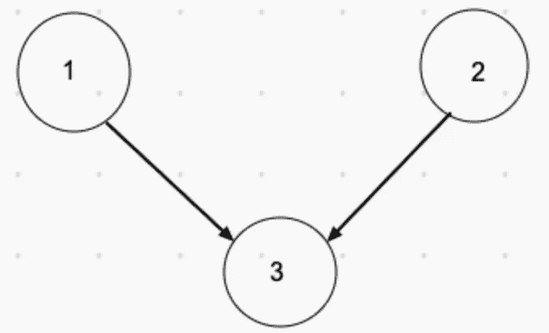
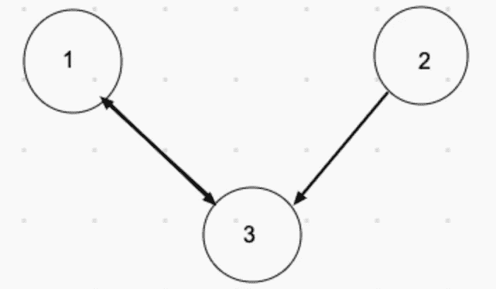

# JavaScript 算法:如何找到镇法官

> 原文：<https://javascript.plainenglish.io/how-to-find-the-town-judge-92f07c5b7570?source=collection_archive---------1----------------------->


Photo by [Tingey Injury Law Firm](https://unsplash.com/@tingeyinjurylawfirm?utm_source=medium&utm_medium=referral) on [Unsplash](https://unsplash.com?utm_source=medium&utm_medium=referral)

# **问题**

```
In a town, there are N people labelled from 1 to N.  There is a rumor that one of these people is secretly the town judge.If the town judge exists, then:1\. The town judge trusts nobody.
2\. Everybody (except for the town judge) trusts the town judge.
3\. There is exactly one person that satisfies properties 1 and 2.You are given trust, an array of pairs trust[i] = [a, b] representing that the person labelled a trusts the person labelled b.If the town judge exists and can be identified, return the label of the town judge.  Otherwise, return -1.
```

**例 1:**

```
**Input:** N = 2, trust = [[1,2]]
**Output:** 2
```

**例 2:**

```
**Input:** N = 3, trust = [[1,3],[2,3]]
**Output:** 3
```

**例 3:**

```
**Input:** N = 3, trust = [[1,3],[2,3],[3,1]]
**Output:** -1
```

**例 4:**

```
**Input:** N = 3, trust = [[1,2],[2,3]]
**Output:** -1
```

**例 5:**

```
**Input:** N = 4, trust = [[1,3],[1,4],[2,3],[2,4],[4,3]]
**Output:** 3
```

**约束:**

*   `1 <= N <= 1000`
*   `0 <= trust.length <= 10^4`
*   `trust[i].length == 2`
*   `trust[i]`都不一样
*   `trust[i][0] != trust[i][1]`
*   `1 <= trust[i][0], trust[i][1] <= N`

# 解决办法

输入是整数形式的 *N* 和二维数组形式的 *trust* 。

为了更好地理解镇法官和每个人之间的关系，我们可以抽出这个例子:

示例 1:

1 与 2 单向连接，2 与其他人没有连接。2 不相信任何人，其他人都相信 2，所以 2 是镇上的法官。这是一个有向图。


**Input:** N = 2, trust = [[1,2]]
**Output:** 2

示例 2:

1 和 2 都有到 3 的单向连接，3 没有连接到其他的传出指针。所以 3 号是镇上的法官。



**Input:** N = 3, trust = [[1,3],[2,3]]
**Output:** 3

示例 3:

2 与 3 单向连接，而 1 与 3 双向连接。没有不信任任何人的元素，所以我们返回-1。



**Input:** N = 3, trust = [[1,3],[2,3],[3,1]]
**Output:** -1

因此，为了使事情更容易理解，我们可以说我们正在试图找到一个元素，他不喜欢任何人，但却被镇上的 N-1 个人喜欢。怎样才能跟踪一个元素喜欢和被喜欢的次数？我们使用哈希。

为了计算喜欢和被喜欢这两个不同的数字，我们将哈希的键设置为从 1 到 N，这样我们就不会错过任何数字。我们遍历信任数组，根据子数组的元素顺序增加喜欢和被喜欢的计数。代码如下所示。

整体时间复杂度为 O(n)，空间复杂度为 O(n)。

我希望这能给你一些如何解决类似问题的思路。

**资源:资源:**

[](https://leetcode.com/problems/find-the-town-judge/) [## 找到镇法官-李特考德

### 在一个城镇里，有 N 个人被标记为从 1 到 N。有传言说这些人中的一个正在秘密地镇…

leetcode.com](https://leetcode.com/problems/find-the-town-judge/) [](https://medium.com/weekly-webtips/graph-in-javascript-a30c154cf7cf) [## JavaScript 中的图形

### 图表基础

medium.com](https://medium.com/weekly-webtips/graph-in-javascript-a30c154cf7cf)