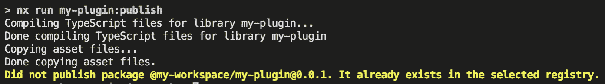
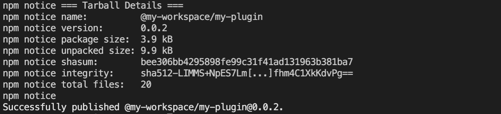

# 如何在 Angular 中打造强大的定制构建器

> 原文：<https://javascript.plainenglish.io/how-to-forge-a-powerful-custom-builder-in-angular-67370ad3bb17?source=collection_archive---------5----------------------->

## 虽然 Nrwl、Nest.js 和 Angular 提供的所有构建器都很棒，但我们大多数人都忽略了定制构建器的巨大威力。从捆绑到部署，一切皆有可能。

*本文假设你已经对*[](https://angular.io/)**[*Nx*](https://nx.dev/angular)*有一些常识。***

****

**Photo by [Dane Deaner](https://unsplash.com/@danedeaner?utm_source=medium&utm_medium=referral) on [Unsplash](https://unsplash.com?utm_source=medium&utm_medium=referral)**

## **构建 NPM 发布构建器**

**我们的目标是编写一个生成器，为我们发布我们的库。构建器应该只在版本号改变时发布。它将执行以下操作:**

*   **执行常规构建目标，它将定期构建`my-lib`。**
*   **从先前构建的`package.json`中检索本地版本。**
*   **检查版本号是否增加。我们可以调用 npm CLI 来检查软件包版本。**
*   **通过再次调用 npm CLI 发布程序包。**

# **1.设置工作空间、插件和构建器**

**虽然在 Angular 存储库中这肯定不是那么直接，但是如果您使用 Nx 提供的工具，创建一个定制的构建器是非常容易的。首先，如果您还没有，使用 Nx 创建一个存储库:**

```
**npx create-nx-workspace my-workspace**
```

**选择任何适合你需要的选项。我们将使用`OSS`选项——开源工作区的配置。**

**接下来，使用另一个原理图创建一个新插件。该插件将创建一个我们可以使用的示例生成器:**

```
**cd my-workspacenpm i [@nrwl/nx-plugin](http://twitter.com/nrwl/nx-plugin)nx g [@nrwl/nx-plugin](http://twitter.com/nrwl/nx-plugin):plugin my-plugin --importPath=my-plugin**
```

**第一个`my-plugin`是您工作区中插件的名称。`--importPath=my-plugin`表示你将以哪个名字发布你的插件。这可能是`@user/plugin-name`或任何有效的包名。**

**如果你打算向 npm 这样的公共注册中心发布，请确保该名称仍然可以自由使用。**

# **2.配置生成器输入**

**让我们看一下刚刚生成的文件。`packages`中的`my-plugin`文件夹包含我们新生成的插件。我们主要在构建器上工作，因此您可以放心地忘记 schematics 文件夹。**

**`build/schema.d.ts`文件包括一个定义我们的构建器输入的接口。在这种情况下，我们希望有两个输入:**

*   **`buildTarget` —告诉我们在发布包之前需要执行的构建目标。将发布此生成目标的输出。**
*   **`failOnDuplicate` —指示如果版本已经存在，构建是否应该失败。**

**`schema.d.ts`文件现在看起来像这样:**

**除了`schema.d.ts`文件之外，还生成了一个`schema.json`。这个被用作一个 [JSON 模式](https://json-schema.org/)来验证输入。我们将添加一些与我们之前的信息相匹配的简单信息:**

# **3.实现构建器**

**现在我们可以开始实现构建器了。实际的实现发生在`builder.ts`文件中。我们将使用来自节点和`@angular/devkit`的一些依赖关系。有时 IDE 不记得它们，所以我在这里为您列出了它们:**

## **执行输入构建目标**

**首先，构建器需要执行前面的构建目标。我们可以从提供所有输入属性的`options`对象接收目标字符串。**

**为了接收实际的目标信息，我们可以执行`targetFromTargetString`函数。之后，我们执行目标。我们可以简单地在上下文对象上调用`scheduleTaget(target)`。**

**当我们与目标互动时，我们已经可以保存`outputPath`。下一步，我们将从这里构建到`package.json`的路径。**

## *****检查版本是否已经存在*****

**现在是时候创建一个助手函数来检索本地包信息了。一个`package.json`文件的路径被解析成一个 JSON，如下所示:**

**我们需要一个函数来检查版本是否已经存在于 npm 上。命令`npm show my-package@my-version version`检索包的特定版本。现在将它与我们的输入变量进行比较:**

**Don’t forget to call `.trim()` on the output of the child process!**

**有了这两个助手函数，我们现在可以将它们集成到我们的构建函数中。将名称和版本直接传递给我们的验证函数:**

**如果验证失败，我们会向控制台记录一条警告。构建器的结果取决于`failOnDuplicate`输入。**

## **发布包**

**发布这个包真的很简单。只需在输出目录中运行`npm publish`。**

**现在，通过从 build 函数调用 publish 函数来完成您的定制构建器。记住将它包装在一个 try-catch 块中，以处理发布期间可能发生的错误。**

# **4.在本地注册表中尝试您的软件包**

**现在我们可以试用我们自己的构建器了。我们将尝试向我们构建的插件添加一个发布目标，这样我们就可以使用它本身来发布它。疯了！**

**首先，安装 [Verdaccio](https://github.com/verdaccio/verdaccio) 来创建一个本地包注册表——只是为了试用。安装并在第二个终端窗口中启动它:**

```
**npm i -g verdaccio
verdaccio**
```

**在 Verdaccio 运行之后，配置您的本地工作区，将其用作主注册表:`npm set registry http://localhost:4873`**

**构建并发布您的插件:**

```
**nx run my-plugin:build
npm publish ./dist/packages/my-plugin/**
```

**使用我们的构建器之前的最后一步是将其添加到我们的`workspace.json`中。在你的建造目标上方添加你自己的目标`publish`。**

**现在安装并执行它！**

```
**npm i [@my](http://twitter.com/my)-workspace/my-pluginnx run my-plugin:publish**
```

****

**输出显示这个包之前已经发布过了。太好了！我们现在知道我们的版本检查正在工作。把`package.json`里面的版本撞一下再发布:**

****

> **恭喜你，你刚刚在 Angular 内部编写了一个完整的定制构建器。使用 Nx，你还可以为 Node、Express、Nest.js 和许多其他框架构建构建器。**
> 
> **现在出去做点什么吧！**

**感谢您花时间了解 Angular & Nx 定制构建器。如果你有任何公开的问题，请随时在 Twitter [@niklaspor](https://twitter.com/niklaspor) 上给我发消息或留下评论。**

**祝你愉快。
-尼克拉斯**

***差点忘了——代码可用* [*此处*](https://github.com/nx-boost/nx-boost/tree/main/packages/workspace/src/builders/publish) *。***