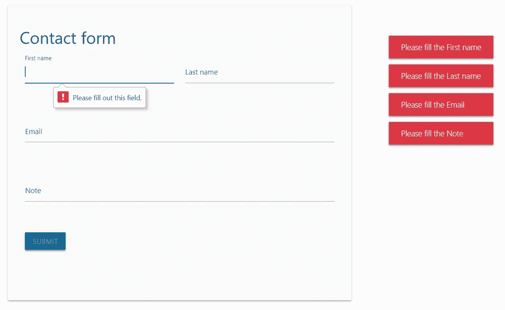
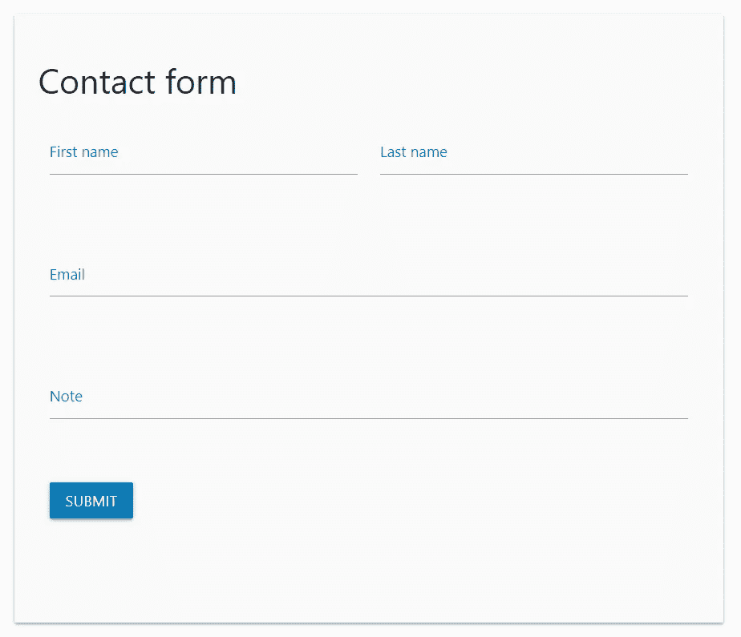
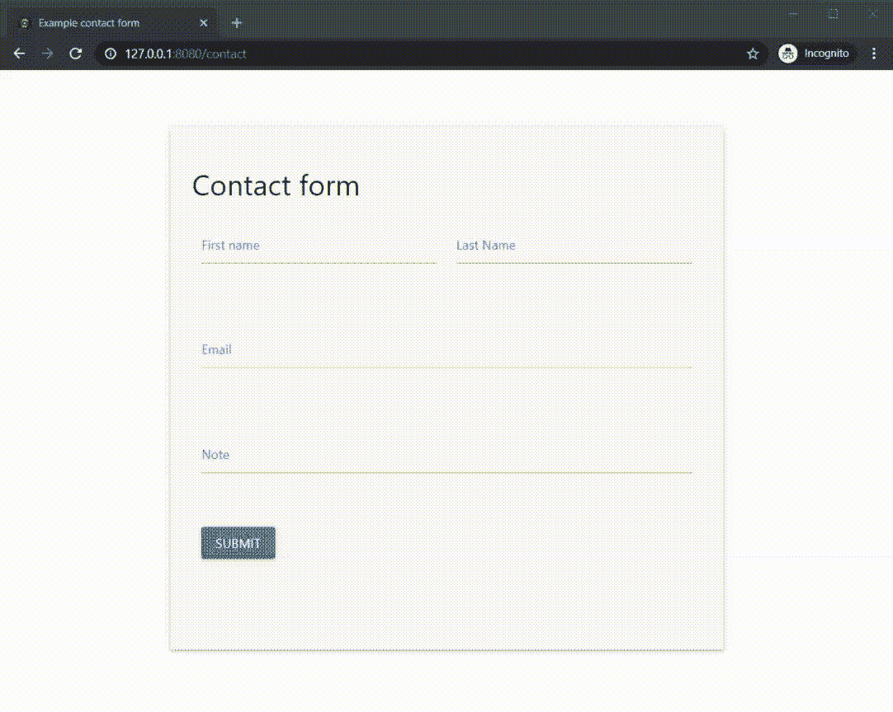

# 如何用 Flask 和 AJAX 形成提交

> 原文：<https://javascript.plainenglish.io/how-to-form-submissions-with-flask-and-ajax-dfde9891c620?source=collection_archive---------0----------------------->



Contact form with HTML5 and JS form validation and an AJAX post request.

## 根据最新的 HTML5 标准和安全措施提交和验证表单，无需重新加载网页

在某种程度上，你会希望让你的 web 应用程序动态化，允许用户提供输入，并以安全和正确的方式进行处理。这意味着您将处理表单和表单提交，同时保持信息传输的安全性。

在这个故事中，我将尝试向你展示如何使用异步 javascript 执行(AJAX)将用户输入从前端(HTML)发送到后端(Flask)，即无需重新加载网页。使用 CSRF 令牌可以保护这种信息传输免受恶意攻击。我还加入了一些噱头，比如 HTML5 表单验证和用户反馈。

> AJAX 非常适合在同一网页上动态加载内容，而不需要重新加载，以此为指导，您可以使其安全可靠，并在整个过程中提供用户反馈。

我们将讨论的技术堆栈是:

*   带有引导(HTML)和物化(CSS)框架的表单
*   Javascript 和 jQuery:用 FormData 对象提交 AJAX 表单
*   HTML5 和 JS 表单验证
*   在 Flask 路由上发送请求:捕捉响应并返回
*   用烧瓶保护 CSRF-WTF

在这个故事中，我们将构建一个简单的联系表单，但这个架构可以扩展为更复杂的表单、文件上传或任何其他可以想象的 HTTP 请求。让我们开始吧，从前面(HTML)到后面(Flask)。

## 前端 HTML

Simple contact form in Flask’s jinja2 HTML template.

这是一个简单的 HTML 表单，通过 POST 请求指向 Flask 后端的/contact 路径。您可能还注意到在`line 2`上有一个隐藏的输入类型，包含我们的 **CSRF 令牌**，它被证明对于保护表单提交免受恶意攻击是不可或缺的。

众所周知的 [Bootstrap](https://getbootstrap.com/) 框架用于水平划分网页上的内容，并实现了一个附加的[物化](https://materializecss.com/)框架用于样式化。这意味着不同类名的所有样式都有意义，比如`input-field col s6`、`validate`、`helper-text`、`waves-effect`和`waves-light`，因为它们是在引导和物化框架中定义的。注意，`class="<element1> <element2>"`之间的空格表示正在调用多个类。最后，值得注意的是`line 31`上的提交按钮有一个`id="contact-form-button"`，这就是我们如何**将 jQuery 中的一个事件绑定到这个表单。当从前端向后端来回发送请求时，带有`id="form-response"`的最后一个`div`元素将显示一个预加载器，反之亦然。**

Loading necessary scripts for format and styling.

依赖关系的链接在`<head></head>`标签中，脚本在``之间，这是 Flask 中划分内容位置的一种很好的方式。一个通用的启发是有一个`base.html`，它包含每一个其他 HTML 页面所必需的 HTML 代码，比如`header`、`navbar`和`footer`，但也包括链接和脚本。然后，通过在 HTML 页面前面加上``,您可以在每个其他 HTML 页面上扩展这个`base.html`,在我们的示例联系人页面中也是这样做的。

> 一个通用的启发是有一个`base.html`，它包含每一个其他 HTML 页面所必需的 HTML 代码。

同样重要的是要注意，这些脚本有一个特定的**顺序**，必须按照这个顺序加载才能正常工作。我相信顺序是`(1) jQuery (2) Popper (3) Bootstrap`。



The form’s formatting is provided by Bootstrap and Materialize.

## Javascript 文件和 jQuery 方法

我们使用 Javascript 文件来使用 jQuery 的 AJAX 方法。AJAX 使得向我们的 Flask route `/contact`发送 POST 请求成为可能，而不必重新加载整个 HTTP 网页。这将是这个故事的核心，也是最难解释的部分。首先，我们需要在用户点击表单上的提交按钮时进行捕捉，这将通过使用它的`id`属性和一些 jQuery 来实现。

jQuery 是 Javascript 的包装器，本质上使它更加用户友好，可以用在。js 文件与 Javascript 代码交织在一起。jQuery 选择器`$('#theID')`和 JS 选择器`document.getElementById('theID')`之间的一个相关区别是，对于 jQuery 来说，普通的属性和方法是不可用的，但是 jQuery 特有的一组不同的方法是:`$('#theID').get(0)`或`$('#theID')[0]`。这种差异很重要，在这里会有更详细的解释。

Catching user event and setting variables for AJAX form submission.

`$('#contact-form-button').click()`每当用户点击表单的提交按钮时捕捉。然后，我们设置一些变量并创建我们的 FormData 对象。FormData 对象编译一组键/值对，通过提议的`method`发送到`url`。这些来自 HTML 表单，在表单的`action` ( `/user`)和`method` ( `POST`)属性中的`contact.html`的`line 1`上定义。

如您所见，click 事件还调用了函数`getContactFormData`，该函数在它下面定义，并使用 JS DOM 选择器`getElementById`，因为我们需要内部属性:键`input fields id's`和值`text that the user typed`来填充我们的 FormData 对象，并将该信息发送到 Flask route `/contact`。使用 FormData 对象是自动封装用户在表单中填写的所有信息的简单方法。



AJAX form submission and HTML5 validation in action.

## 表单验证

在我们实际发送 AJAX 请求之前，我们将通过 HTML5 和 JS 进行一些表单验证。以黄色感叹号开头的指示`Please fill out this field.`的消息是 HTML5 表单验证的一个例子，右边的消息(祝酒词)是 JS 表单验证。

HTML5 and JS form validation!

`form[0].checkValidity()`检查是否所有的`required`表单域都已填写完毕，我们自己的函数`isFormDataEmpty`检查 FormData 对象是否为非空。因为我们使用的是 CSRF 令牌，它包含在 FormData 中，所以在`line 44`中我们跳过了 FormData 的`csrf_token`键。如果所有键值对都为空，则`isFormDataEmpty`返回`true`，如果至少有一个非空，则`false`返回。如果不满足`line 4`中的任一条件，我们将不得不显示一些错误。

HTML5 表单验证是在表单的默认`submit event`下只**启用，这也会重新加载整个网页。我们想通过使用`preventDefault(), line 5`来防止这种情况，但我们确实希望表单通过 HTML5 验证。这就是为什么只有在`line 4`中确认了表单的有效性后才调用`preventDefault()`。这样，如果表单无效，就不会阻止默认的`submit event`，并且可以向用户显示 HTML5 表单验证。**

> **HTML5 表单验证是在表单的默认`submit event`下只**启用**，这也会重新加载整个网页。**

**`lines 12 until 20`将为每个有标签的表单域创建一个方法`.label`，例如`line 6`为名字，`line 11`为姓氏。然后，这个方法可以在所有具有`invalid`类的项目上调用。该`invalid`类被附加到用户在调用`form[0].checkValidity() in line 4`时无效填写的每个表单字段中(例如，是`required`但未填写或有`pattern`要求未满足)。**

**然后我们可以显示一条错误消息，一条 [toast](https://materializecss.com/toasts.html) ，通过物化框架显示哪个表单字段无效，要求用户`please fill out the <label of class invalid input field>`。在我们的联系表单中，所有的表单字段都是必填的，但是没有一个字段被填写，这就是为什么会出现四条错误消息的原因。如果出现其他问题，我们可以显示一般的错误消息:**

```
M.toast({html: "Another error occured, please try again.", classes: 'bg-danger text-white'});
```

**`M.toast()`接受多个参数，包括`html`，它是要返回的文本，还有`classes`，它们在 Materialize 和 Bootstrap 中再次定义:类`bg-danger`给出红色背景，类`text-white`，使(呃)文本变成白色。**

## **AJAX 请求**

**这就是神奇的地方:通过表单提交发送用户输入，而无需重新加载网页，也不会丢失所有已填写的信息！在这一点上，注意到目前为止我们通过不同 JS 函数的流程是:**

**`(1) catching the click event -> (2) send_form() with modular_ajax (a function) as an argument -> (3) calling inner_ajax()`**

**本例中的`inner_ajax()`是在`send_form()`中作为参数发送的`modular_ajax()`作为`4th argument`。**

**23AJAX function.**

**`url`是`/contact`，信息要去的 Flask route，数据是`type` `POST`和 formData 对象。表单数据对象不应被处理(`processData`)并且已经被转换，因此不需要`contentType`。AJAX 函数的流程如下:**

1.  **`beforeSend:`在发送 AJAX 请求之前执行。在这种情况下，我们希望显示一个[物化](https://materializecss.com/preloader.html)不确定预加载器，表明我们正在处理请求。**
2.  **一旦 AJAX 函数完成了它的动作:我们想要删除预加载程序。**
3.  **`success:`如果有响应，将`data`作为参数。在这种情况下，我们想用`!$.trim(data.feedback)`检查响应是否为空(例如`''`)。**
4.  **`error:`如果没有响应，将`xhr` (XMLHttpRequest)作为参数，该对象包含请求的所有元数据(例如错误，我们在[浏览器控制台](https://developers.google.com/web/tools/chrome-devtools/console)中显示)。**
5.  **`.done()`当整个`.ajax({})`功能执行完毕。我们总是给用户反馈，用`toast_error_msg`和`toast_category`中消息的颜色来指示 AJAX 请求是否成功。**

**`success:`函数将`data`作为一个参数，它包含`feedback`和`category`，但是它也可以包含另一个元素`<results>`，该元素包含您想要在 HTML 表单中显示的数据。例如在`<div id="form-response"></div>, html.form line 35`中，下面的代码`$('#form-response').html(data.results)`在`line 22–24, ajax.js`之间。名称`feedback`和`category`在我们的 Flask 后端中定义，我们也在这里用内容填充这些键。**

**我们现在来看看接收 AJAX 请求的 Flask route，在那里我们可以对用户填写的元素做些什么，比如将它保存在数据库中或发送电子邮件。**

## **烧瓶路线**

**Flask backend code.**

**在我们的 Flask 应用程序中，有一个路由`/contact`接受`GET`请求(用于查看联系表单)和用户填写联系表单时的`POST`请求。请求通过`request.form`传入，它的键是表单`contact.html`的`input`元素的`id=""`。因此，我们的联系人表单的名字输入字段 request.form 的键是`id="first-name", contact.html line 7`，并通过`request.form['first-name'], app.py line 18`访问。**

**在这种情况下，我们发送一封电子邮件，内容是用户使用 [flask-mail](https://pythonhosted.org/Flask-Mail/) 在我们的联系表单中填写的。无论邮件是否发送，我们总是向用户返回反馈。`resp, line 30`是包含在`ajax.js, line 23-24`中提取的`feedback`(文本)和`category`(颜色)键的字典。我们需要用`jsonify()`将这个字典转换成 JSON 数组，然后使用 Flask 的`make_response`发送那个响应对象。就是这样！我们使用 AJAX 请求将用户输入从前端发送到后端，并在 Flask route `/contact`中捕获该请求。**

**接下来，我们将研究**保护**前端到后端的信息传输免受恶意攻击。**

## **使用烧瓶保护 CSRF-WTF**

**[跨站点请求伪造](https://cheatsheetseries.owasp.org/cheatsheets/Cross-Site_Request_Forgery_Prevention_Cheat_Sheet.html)是一种攻击，当用户通过身份验证后，恶意网站、电子邮件、博客、即时消息或程序会导致用户的 web 浏览器在受信任的站点上执行不必要的操作。对于大多数提交表单，用户需要登录或验证(比如更新数据库值或更改密码)。但是，如果用户通过了站点的身份验证，站点就无法再区分合法请求或伪造请求。这是因为所有的身份验证凭证(如会话变量)都已经包含在请求中。因此，需要另一个标识符，它由后端应用程序设置，随每个请求一起发送，并由后端应用程序再次验证:所谓的`X-CRSFToken`头。**

**为了防止跨站点请求伪造的信息传输，我们在我们的`form.html, line 2`中添加了一个`<input type="hidden" name="csrf_token" value="{{ csrf_token() }}"/>`。`{{ csrf_token() }}`是一个被`render_template(), app.py line 35`理解的 Jinja2 语法表达式。这个字符串令牌是在`csrf_token()`中生成的，Flask-WTF 的一个方法。Flask-WTF 是流行的 [WTForms](https://wtforms.readthedocs.io/en/stable/) 的包装器。他们有一份非常好的 CSRF 保护流程文档[在这里](https://flask-wtf.readthedocs.io/en/stable/csrf.html)。**

**Using CSRF protection for our AJAX requests.**

**我们需要使用`$.ajaxSetup({})`将上面的代码添加到每个 AJAX 请求的设置中。我们只需要使用`$.ajaxSetup({})`一次，因为它会为每个 AJAX 请求初始化并运行这段代码。在`$.ajaxSetup({})`中，我们将`csrf_token`附加到 XMLHttpRequest 头`"X-CSRFToken"`中的每个请求。这就是浏览器如何理解请求来自我们的应用程序，而不是任何其他网站。然后在我们的应用程序中使用 Flask-WTF 验证这一点，并在我们的`app.py`中使用以下代码。**

```
**from** flask_wtf.csrf **import** CSRFProtect

csrf = CSRFProtect**(**app**)**
```

## **结论**

****

**AJAX form submission and HTML5 validation in action.**

**在这个故事中，我向您展示了如何使用 Bootstrap HTML 和 Materialize CSS 框架构建一个简单的联系人表单，如何将 jQuery 事件绑定到 submit 按钮，如何用 HTML5 和 JS 验证表单，如何用 FormData 对象发送 AJAX 请求，如何在 Flask route 中捕获请求并向 AJAX 返回响应，同时保护它不受 CSRF 攻击。**

**AJAX 非常适合在同一网页上动态加载内容，而不需要重新加载。有了它，你就可以让它变得安全可靠，并随时向用户提供反馈。不要犹豫，问我一个问题或评论这个故事。**

****免责声明**:正如 [Redditors](https://www.reddit.com/r/flask/comments/edqpvx/howto_form_submissions_with_flask_and_ajax/) 指出的，这个故事使用了 jQuery 选择器`$('#theID').get(0)`或`$('#theID')[0]`和 JS 选择器`document.getElementById('theID')`的杂波，它们返回相同的结果。虽然我没有意识到，可以通过简单的`XMLHttpRequest`或`fetch() API`动态加载内容，消除 jQuery 的依赖性。即将到来的 Bootstrap5 可能会用原生(普通)JS 替换 jQuery，这是一个好的开始。无论哪种方式，最好始终坚持一种方法:jQuery 或 vanilla JS。**