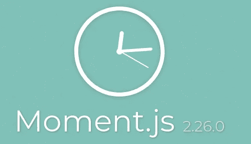

# 如何用 Moment 在 JavaScript 中格式化日期？射流研究…

> 原文：<https://javascript.plainenglish.io/how-to-format-dates-in-javascript-with-moment-js-a9b38e320d35?source=collection_archive---------3----------------------->

## 让时间飞逝


Image by [Andreas Lischka](https://pixabay.com/users/webandi-1460261/?utm_source=link-attribution&utm_medium=referral&utm_campaign=image&utm_content=1990453) from [Pixabay](https://pixabay.com/?utm_source=link-attribution&utm_medium=referral&utm_campaign=image&utm_content=1990453)

让我们承认:我们不喜欢在应用程序中处理日期和时间。但是，我们对此无能为力:世界其他地方依赖于这种时间定位方法。但是你可以通过使用特殊的库，比如`moment.js`，让你的生活变得简单很多。

# 什么是时刻？



MomentJS 是 JavaScript 应用程序中日期时间处理的一体化解决方案。它允许您创建时间戳、修改时间戳(加、减等)、查询时间戳(一个接一个)，并以各种人类可读的格式显示时间戳。它有一个非常简单明了的 API，几乎是 JavaScript 应用程序中与日期相关的任务的行业标准。

# 安装时刻

您可以使用您选择的软件包管理器来安装它:

```
npm i -S momentjs
```

或者

```
yarn add momentjs
```

如果您没有使用包管理器，您可以直接将脚本包含在 HTML 中:

然后，可以像这样导入:

```
const moment = require('momentjs'); 
// or 
import moment from 'momentjs';
```

如果您将脚本包含在 HTML 中，`moment`对象将是全局可用的，因此您不必导入它。

# 转换时间

要以人类可读的格式输出时间，首先必须将其转换为`moment`对象。如果从服务器获取时间戳，它必须是符合 ISO 的日期字符串，或者是以毫秒为单位的 Unix 时间戳:

```
const timestamp = await getTimeFromServer(); 
const momentTimestamp = moment(timestamp); console.log(momentTimestamp.format()); 
// 2020-09-08T08:02:17-05:00
```

如果您正在使用内置的`new Date()`创建时间戳，您也可以使用它来创建`moment`对象:

```
const timestamp = new Date(); 
const momentTimestamp = moment(timestamp);
```

如果您想使用当前日期和时间创建一个`moment`对象，只需不带任何参数地调用`moment()`即可。

# 格式化时间

Moment 为格式化时间提供了一个简单的接口。您唯一需要的函数是`format`，它接受一个字符串作为模板。像这样使用它:

```
moment().format(); // "2020-06-05T12:28:46-04:00"moment().format("dddd, MMMM Do YYYY, h:mm:ss a"); 
// "Friday, June 5th 2020, 12:29:07 pm" moment().format("ddd, hA"); // "Fri, 12PM"
```

以下是您可以在`format()`中使用的常见格式化标记列表:


此外，有几个方便的函数可以使格式化更加容易。例如，如果您需要显示上次看到的状态，您可以使用`fromNow`功能:

```
const almostNow = moment().subtract(15, 'minutes'); 
const yesterday = moment().subtract(1, 'day'). 
const monthAgo = moment().subtract(1, 'month');

console.log(almostNow.fromNow()); // 15 minutes ago console.log(yesterday.fromNow()); // a day ago console.log(monthAgo.fromNow()); // a month ago
```

类似地，有一个函数`toNow()`做相反的事情。

# 操纵时间

格式化时间并不是 MomenJS 的唯一优势。它还可以通过简单的界面以多种方式操纵时间。例如，下面是如何直接更改值:

```
const jesusBday = moment()
 .hour(1)
 .day(1)
 .month(1)
 .year(1);
```

当然，对于不同的用例，有更简单的方法来控制时间。例如，您可以增加或减少:

```
const past = moment().subtract(2, 'month'); // To past 
const future = moment().add(1, 'year'); // Back to future
```

对于第二个参数，您可以提供以下任意内容:

*   `years`
*   `quarters`
*   `months`
*   `weeks`
*   `days`
*   `hours`
*   `minutes`
*   `seconds`
*   `milliseconds`

最后，你可以快进时间。假设，你需要得到下个月(或者明年)月初的时间戳。为此，您可以使用`endOf`功能:

```
const today = moment(); 
const nextMon = moment().endOf('month');
 // nextMon is now set to the ending of the current month 
// 1 millisecond before that, to be precise
```

当然，还有一个功能`startOf`:

```
const today = moment(); 
const lastNewYear = moment().startOf('year'); 
// lastNewYear is set to the first millisecond 
// of the current year
```

# 询问时间

如果你什么都不知道，修改时间有什么用？MomenJS 有几个函数可以帮助你做到这一点。首先，有`isBefore`和`isAfter`:几乎不言自明:

```
const now = moment(); 
const then = moment().add(1, 'day');
console.log(now.isAfter(then)); // false
console.log(then.isAfter(now)); // true
console.log(now.isBefore(then)); // true
console.log(then.isBefore(now)); // false
```

此外，还有这些函数的非严格版本:`isSameOrBefore`和`isSameOrAfter`。另一个值得了解的功能是`isBetween`:

```
const now = moment();
const past = moment().subtract(1, 'day');
const future = moment().add(1, 'day');
console.log(now.isBetween(past, future)); // true
console.log(past.isBetween(now, future)); // false
```

最后是`max`和`min`功能。它们完全按照您的预期工作:从一列矩中返回最小值或最大值:

```
const now = moment();
const past = moment().subtract(1, 'year');
const future = moment().add(1, 'year');
console.log(moment.min(now, past, future).year()); // 2019
console.log(moment.max(now, past, future).year()); // 2021
```

# 结束语

感谢您的阅读，希望您喜欢这篇文章。继续订阅更多关于 JavaScript 和软件开发的有趣内容！

# 资源

*   [MomentJS 文档](https://momentjs.com)