# 如何使用新的 2020 Instagram API 生成令牌

> 原文：<https://javascript.plainenglish.io/how-to-generate-a-token-with-the-new-2020-instagram-api-bf27c57858ab?source=collection_archive---------0----------------------->

## 随着 Instagram API 新版本的发布，我们来看看如何获得令牌。

最近，Instagram API 贬值了。不像是真的贬值了，更像是迁移到了脸书开发者 API 中心。得到一个令牌并不困难，只是不一样，还没有太多的文档。

Photo by [Luke van Zyl](https://unsplash.com/@lukevz?utm_source=unsplash&utm_medium=referral&utm_content=creditCopyText) on [Unsplash](https://unsplash.com/s/photos/instagram?utm_source=unsplash&utm_medium=referral&utm_content=creditCopyText)

所以让我们一起来做吧。对于您想要查询的每个 API，过程都是一样的，第一步是创建一个开发者帐户。在这种情况下，不会是 Instagram，而是脸书。但是我相信你已经知道了，但是，脸书几年前买了 Instagram。我的脸书开发者帐户已经创建，但你可能需要创建一个，当你这样做时，让它由脸书验证。

因此，进入[这里](https://developers.facebook.com/)，进行必要的设置，然后点击我的应用程序:

[https://developers.facebook.com/](https://developers.facebook.com/)

现在你已经进入了你的应用程序页面，你只需要选择你想要创建的应用程序。在我们的例子中，它是“别的东西”:

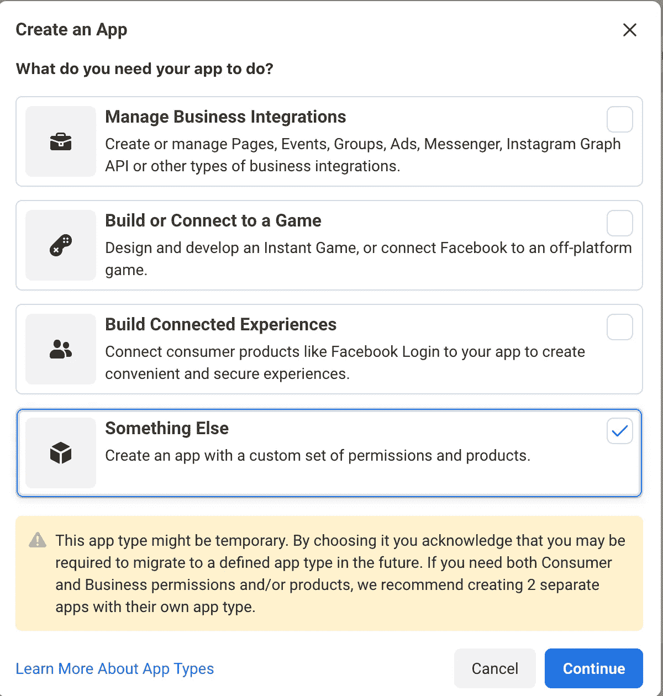

App Type

首先，我尝试选择管理业务集成，但是没有成功，因为没有提供我需要的产品。然后，您可以创建一个新的应用程序，为它命名并指定用途:

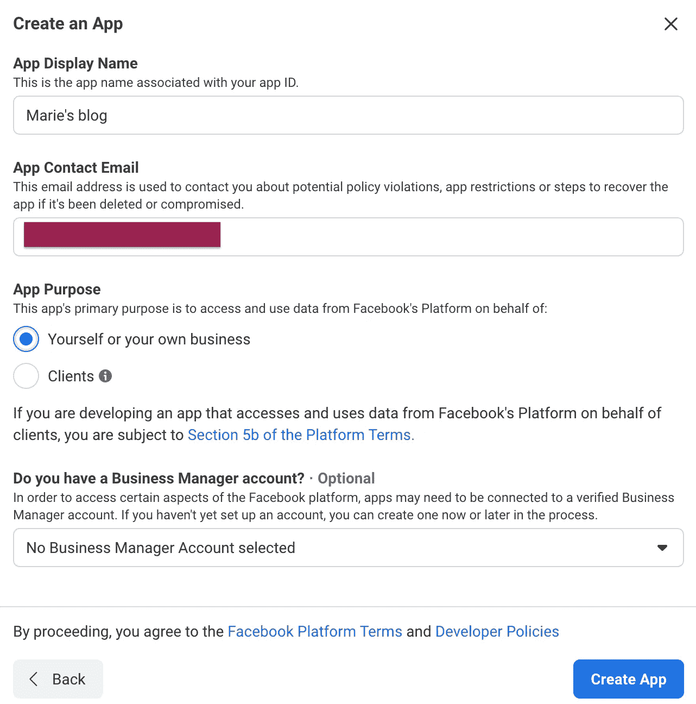

App Creation

您的应用程序已创建！恭喜你！🎊

但是我们还没有到那一步。难过吧？现在，我们要设置 Instagram Graph API。您只需点击 Instagram 基本界面中的“设置”:

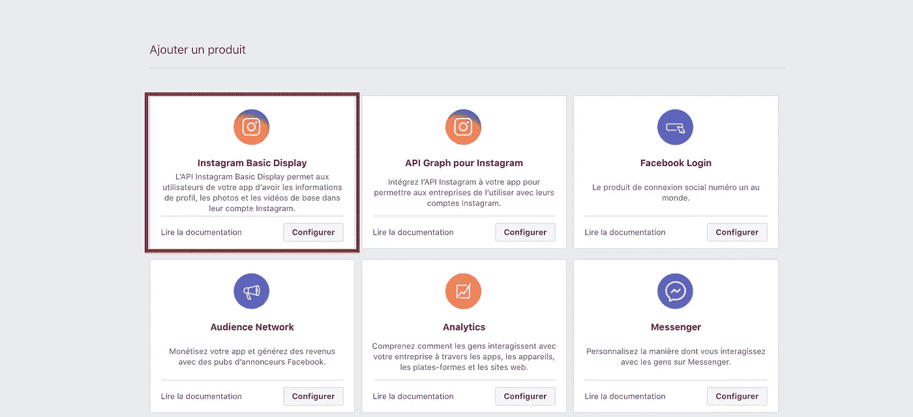

如果 Instagram Basic 显示没有出现在您的产品页面上，可能是因为您的应用程序类型错误。

它会将你重定向到你的应用页面。如你所见，在底部，你需要在创建 Instagram 应用之前纠正一些设置

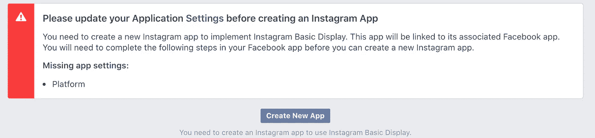

Settings to correct

只需点击“设置”,转到页面底部，添加一个平台:

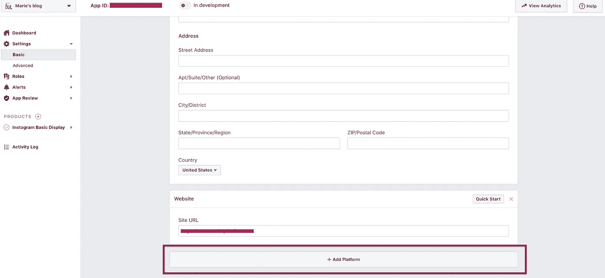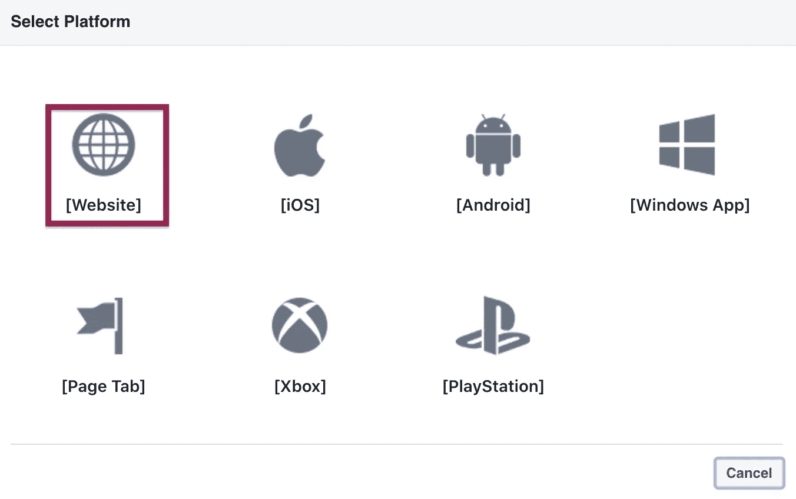

Select platform type

然后，选择你需要的平台。在我们的例子中，它是一个“网站”。

现在，您只需输入您的网站地址并保存即可！

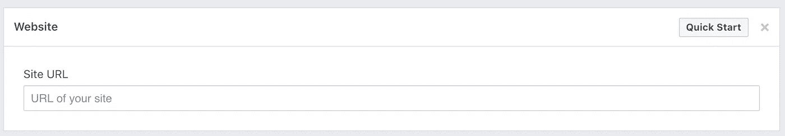

Website URL for your platform

现在，我们可以创建一个 Instagram 应用程序。所以，让我们回到产品部分，然后是 Instagram 基本展示，最后是 Instagram 基本展示。我们可以点击创建新应用程序:

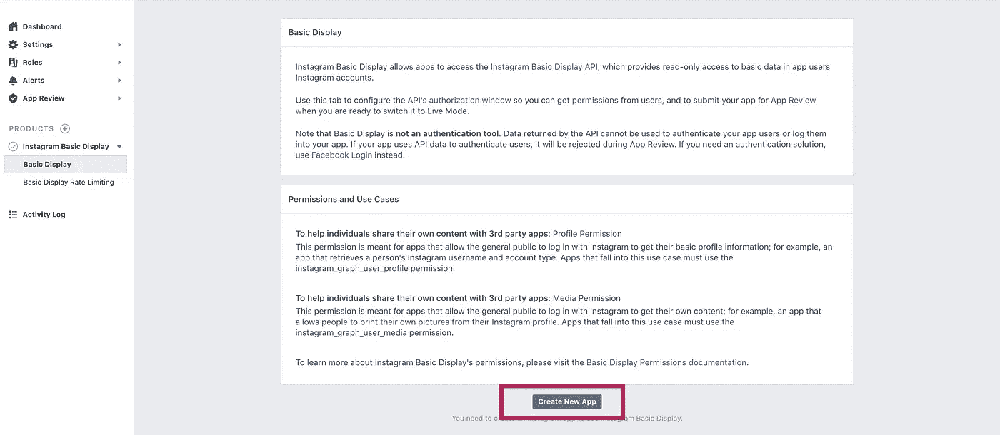

Create New App

然后，让我们命名并创建它:

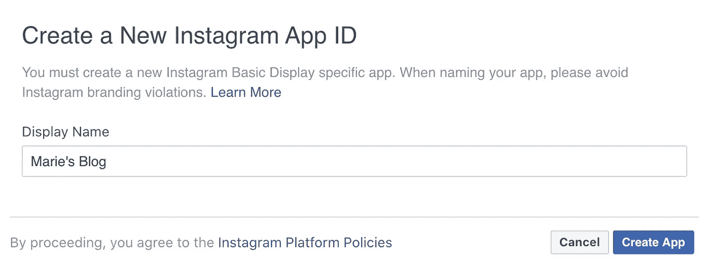

Create a New Instagram App ID

现在我们的应用程序已经创建好了，让我们在“客户端 OAuth 设置”、“取消授权”和“数据删除请求”中添加我们的 URL。现在，它是我们的本地主机，但是不要忘记在你的网站投入生产后改变它。

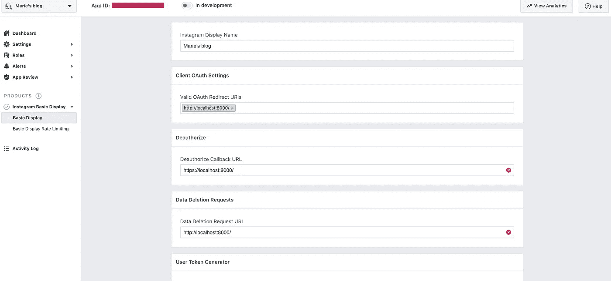

现在，在我们能够生成用户令牌之前，我们必须定位我们的用户。为此，请转到“角色”和“角色”。然后，可以“添加 Instagram 测试器”:

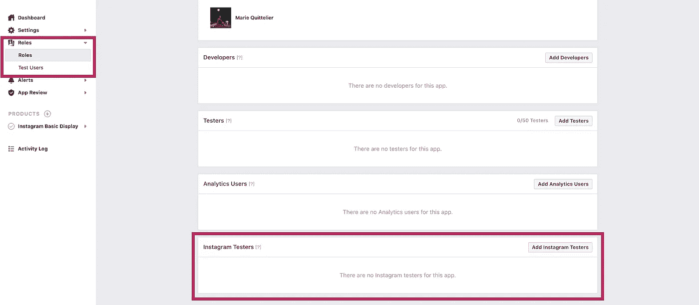

点击“添加 Instagram Tester”后，您可以通过输入用户名在列表中找到自己:

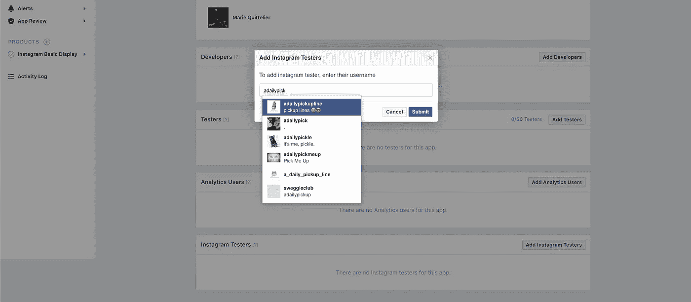

Find yourself in the list

Instagram API 的一个限制是，你的 Instagram 账户需要是专业的，你才能查询。

这真的只是一个简单的点击来改变。只要进入你的 Instagram，设置，账户，在蓝色的底部，你会看到一个切换到专业账户的选项。如果您的帐户不是公共的，它将不会出现在列表中。

完成并提交后，会要求您连接到您的 Instagram 帐户:

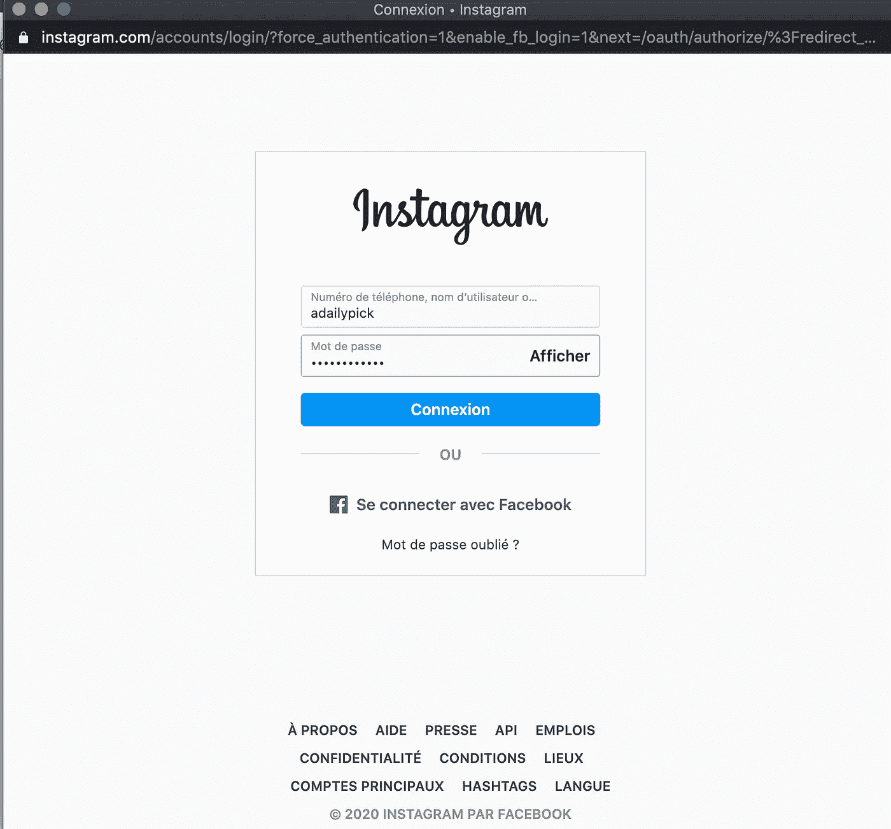

Connect to your Instagram account

然后，前往[此处](https://www.instagram.com/accounts/manage_access/)，直接进入您的 Instagram 页面，接受您刚刚提出的请求:

Your Instagram page

现在您有了一个测试器，您只需返回“Instagram 基本显示”和“基本显示”,然后点击“生成令牌”:

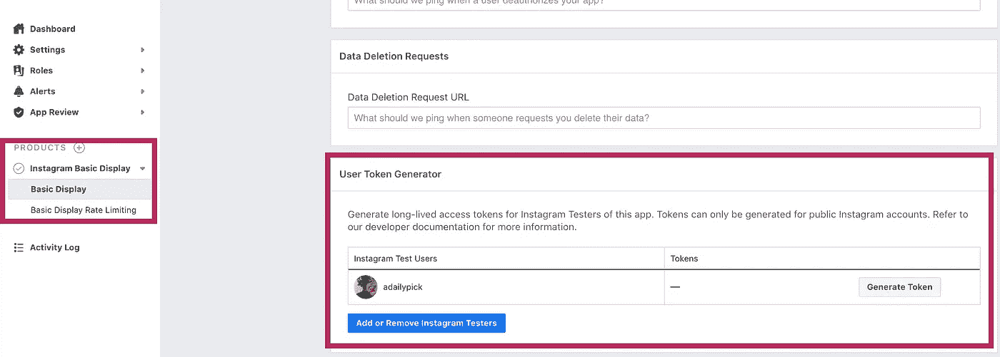

一旦你做到这一点，恭喜你，你有你的令牌。只要勾选我明白，复制你的令牌就大功告成了！

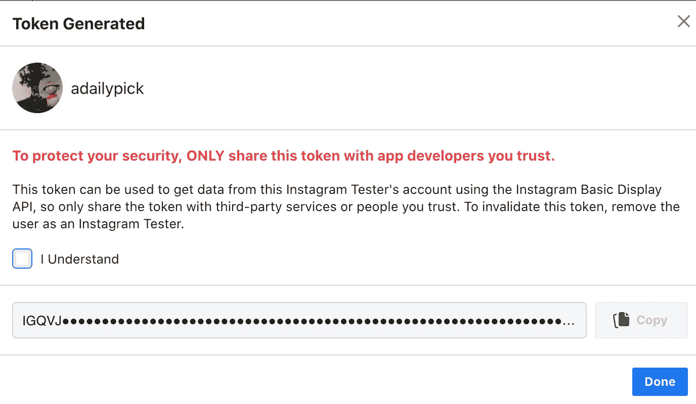

Token Generated!

恭喜你！🎊🎉🎉🎊您的令牌已生成！