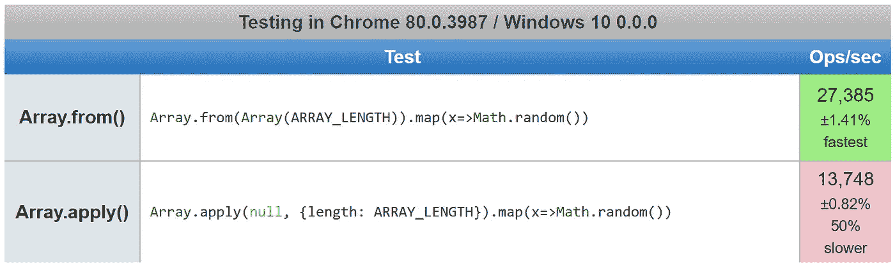
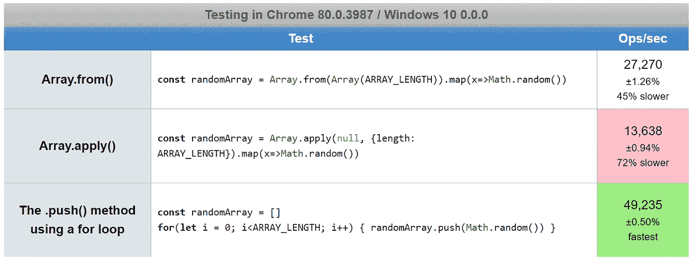

# 如何在 JavaScript 中生成一个随机数数组

> 原文：<https://javascript.plainenglish.io/how-to-generate-an-array-of-random-numbers-in-javascript-f883de667e84?source=collection_archive---------0----------------------->

## 在 JavaScript 中生成一个随机整数数组非常容易。这里有三种方法。

Photo by [Eric Prouzet](https://unsplash.com/@eprouzet?utm_source=medium&utm_medium=referral) on [Unsplash](https://unsplash.com?utm_source=medium&utm_medium=referral)

在 JavaScript 中工作时，你可能会发现自己需要一个由随机数组成的数组，比如在测试一个排序算法时。

例如，在 JavaScript 中，当学习[如何对数组进行数字排序](https://medium.com/coding-at-dawn/how-to-sort-an-array-numerically-in-javascript-2b22710e3958)而不是词汇排序时，随机数数组就很有用。

我将比较使用内置的`[Math.random()](https://developer.mozilla.org/en-US/docs/Web/JavaScript/Reference/Global_Objects/Math/random)`功能生成数组和具有更多功能的 JavaScript 库。

在这篇文章中，我只讨论随机浮点数。对于随机整数，您可以添加一个`[Math.floor()](https://developer.mozilla.org/en-US/docs/Web/JavaScript/Reference/Global_Objects/Math/floor)`调用，正如我在这里讨论的:

 [## 如何在 JavaScript 中生成随机数

### 无论是为了性能测试还是任何其他目的，生成伪随机数有时都是有用的。

medium.com](https://medium.com/javascript-in-plain-english/how-to-generate-random-numbers-in-javascript-8bc3987896a7) 

# `.push()`方法

Using`[Array.prototype.push()](https://developer.mozilla.org/en-US/docs/Web/JavaScript/Reference/Global_Objects/Array/push)`方法将一个项目添加到一个[堆栈](https://en.wikipedia.org/wiki/Stack_(abstract_data_type))的末尾，在本例中是一个[数组](https://developer.mozilla.org/en-US/docs/Web/JavaScript/Reference/Global_Objects/Array)(与`[.pop()](https://developer.mozilla.org/en-US/docs/Web/JavaScript/Reference/Global_Objects/Array/pop)`方法相比)。

因此，使用一个简单的`[for](https://developer.mozilla.org/en-US/docs/Web/JavaScript/Reference/Statements/for)` [循环](https://developer.mozilla.org/en-US/docs/Web/JavaScript/Reference/Statements/for)，我们可以通过将随机浮点数推入一个空数组来生成一个数组:

每个随机数被推到数组的末尾，产生一个由随机浮点数组成的数组`ARRAY_LENGTH`。

用一个`for`循环生成一个随机数数组是解决这个问题最有效的[方法，我将在本文后面讨论。](https://www.incredible-web.com/blog/performance-of-for-loops-with-javascript/)

# `.map()`方法

TJavaScript 函数式编程[的宠儿](https://medium.com/javascript-in-plain-english/what-are-javascript-programming-paradigms-3ef0f576dfdb)，`[Array.prototype.map()](https://developer.mozilla.org/en-US/docs/Web/JavaScript/Reference/Global_Objects/Map)`根据给定的[回调函数](https://developer.mozilla.org/en-US/docs/Glossary/Callback_function)返回一个新数组。

一个替代的等价语法使用`[Function.prototype.apply()](https://developer.mozilla.org/en-US/docs/Web/JavaScript/Reference/Global_Objects/Function/apply)`:

根据[这些 jsperf 测试用例](https://jsperf.com/array-from-vs-array-apply-for-random-numbers)，使用`.apply()`会慢 50%:

这不同于如何利用`.apply()`比`[...](https://medium.com/coding-at-dawn/how-to-use-the-spread-operator-in-javascript-b9e4a8b06fab)`更快的[展开算子](https://medium.com/coding-at-dawn/how-to-use-the-spread-operator-in-javascript-b9e4a8b06fab)来寻找[最大值或最小值的最快方法](https://medium.com/coding-at-dawn/the-fastest-way-to-find-minimum-and-maximum-values-in-an-array-in-javascript-2511115f8621)。

但是`for`循环比那个快吗？我添加了另一个测试用例来检查:

在这种情况下，是的，`for`循环要快得多——`Array.from()`是使用基本`for`循环的`.push()`方法的一半速度。

但 Chrome 仍然可以用最慢的方法在一秒钟内生成超过 10，000 个由 10，000 个项目组成的随机数组，所以在生成 100 万个随机项目之前，性能不会有太大影响。

# 图书馆方法

如果您需要生成一个随机数数组，而不仅仅是一些基本的浮点数，那么请查看 [chancejs](https://chancejs.com/) :

你可以在你浏览器控制台的[chancejs.com](https://chancejs.com)或者[吉斯 npm 库](https://npm.runkit.com/chance)的运行工具包中试用上面的代码样本。

注意`[chance.floating()](https://chancejs.com/basics/floating.html)`的行为与`[Math.random()](https://developer.mozilla.org/en-US/docs/Web/JavaScript/Reference/Global_Objects/Math/random)`完全不同，所以你会想要阅读优秀的[机会文档](https://chancejs.com/)。

具体来说，`chance.floating()`将只返回小数点后最多 4 位数字，并且指定的最小值和最大值包含在内

相比之下，`Math.random()`排除最大值，将返回小数点后 16 位的数字 0 ≤ x < 1。

chancejs 库( [GitHub](https://github.com/chancejs/chancejs) ， [npm](https://www.npmjs.com/package/chance) )超级好玩，还有很多其他有用的功能，比如生成随机的电话号码或邮政编码:

chancejs 的另一个优点是，您可以[为随机数生成器](https://chancejs.com/usage/seed.html)提供可重复性，比如在生成测试用例时。

无论你选择哪种方法，如果你很享受的话，用 JavaScript 生成一个充满随机数的数组是不会错的。

编码快乐！😍🔥 👍📈🦄

德里克·奥斯汀博士是《职业编程:如何在 6 个月内成为一名成功的 6 位数程序员 》一书的作者，该书现已在亚马逊上架。