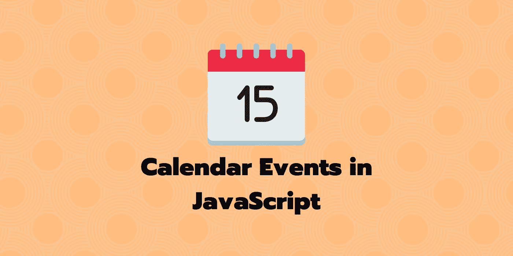

# 如何使用 JavaScript 为 Browser 和 NodeJS 编程生成日历事件？

> 原文：<https://javascript.plainenglish.io/how-to-generate-calendar-events-programmatically-for-browser-and-nodejs-using-javascript-157c5f54b761?source=collection_archive---------0----------------------->

## JavaScript 库

## 以一个小的 JavaScript 库为特色来构建日历事件，您可以通过电子邮件在 ou 网站上共享这些事件。



最近，我有两个用例需要为我的公司实现。为了给出一点上下文，我们在用户和组织体育会议的体育教练之间提供链接。

**当用户预定一个会话时，在它的议程中有这个事件的提醒会很好。**

*   用户应该有一个按钮，在网站上添加一些事件到他们的个人日历(Outlook，谷歌日历，iOS 日历，…)。
*   当预订了某个活动后，他们必须通过电子邮件接收一些信息，以便将该活动添加到他们的日历中。

乍一看，它看起来很简单，但是当你不知道它是如何工作的时候，就有点尴尬了。

根据日历提供商的不同，技术会有所不同，有些只是基于 URL，有些则需要特定格式的文件。

在搜索了这个主题后，我得出的结论是，对于谷歌来说，这很简单，你只需要建立一个特定的网址。

对于苹果日历和 Outlook，你需要一个`.ics`文件，这是一个由这类日历应用程序处理的特殊文件。

## 关于日历事件的知识

如果你想要一个自制的算法，下面的库给出了一些关于它如何工作的细节和关于实现的规范。

[](https://github.com/InteractionDesignFoundation/add-event-to-calendar-docs) [## InteractionDesignFoundation/将事件添加到日历文档

### 该存储库包含描述如何将事件添加到不同在线日历服务的文档，这些服务通常…

github.com](https://github.com/InteractionDesignFoundation/add-event-to-calendar-docs) 

但是如果你需要一个简单明了的 JavaScript 库，我只能推荐使用`DateBook`，它可能是 JavaScript 中处理这种需求的最先进的库。

起初，这不是 SSR 就绪，但我已经通过与所有者合作，使其工作在服务器端。这很好，让我们可以在电子邮件模板中使用它。

 [## 记事册

### 将事件添加到流行的日历应用程序。阅读文档→记事本支持服务器端渲染，以及所有主要的…

datebook.dev](https://datebook.dev/) 

**DateBook** 是一个非常简单的库，可以让你免除麻烦，它很简单，只需实例化一个类并在其上调用一些生成函数。

```
const config: CalendarOptions = {
  title: 'Happy Hour',
  location: 'The Bar, New York, NY',
  description: 'Let\'s blow off some steam with a tall cold one!',
  start: new Date('2022-07-08T19:00:00'),
  end: new Date('2022-07-08T23:30:00'),
  // an event that recurs every two weeks:
  recurrence: {
    frequency: 'WEEKLY',
    interval: 2
  }
}

const icalendar = new ICalendar(config)
```

它支持 GoogleCal、Outlook，当然还有 IOS 日历。

个性化可以变得很深，有了递归之类的东西，你所要做的就是用需要的数据填充类构造函数。

使用 Datebook，你可以在 NodeJS 上或者直接在浏览器中呈现文件，这允许你在电子邮件中使用它，这对于一个预订网站来说是很好的。

您还可以想象制作一个 HTTP REST 端点服务器端，在飞行中生成一个 ICS 文件，人们可以以流的形式订阅该文件。

我在这里不再赘述，只是重复已经描述过的内容，请随意阅读非常详细的文档。

## [🇫🇷对于法国人来说🥖我建议⚡️编码火花和电子邮件简讯，以获得技术报酬！](https://codingspark.io/?referral=medium)