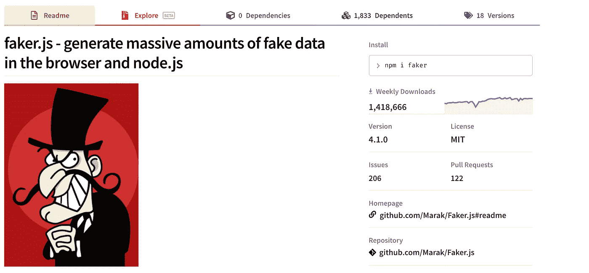
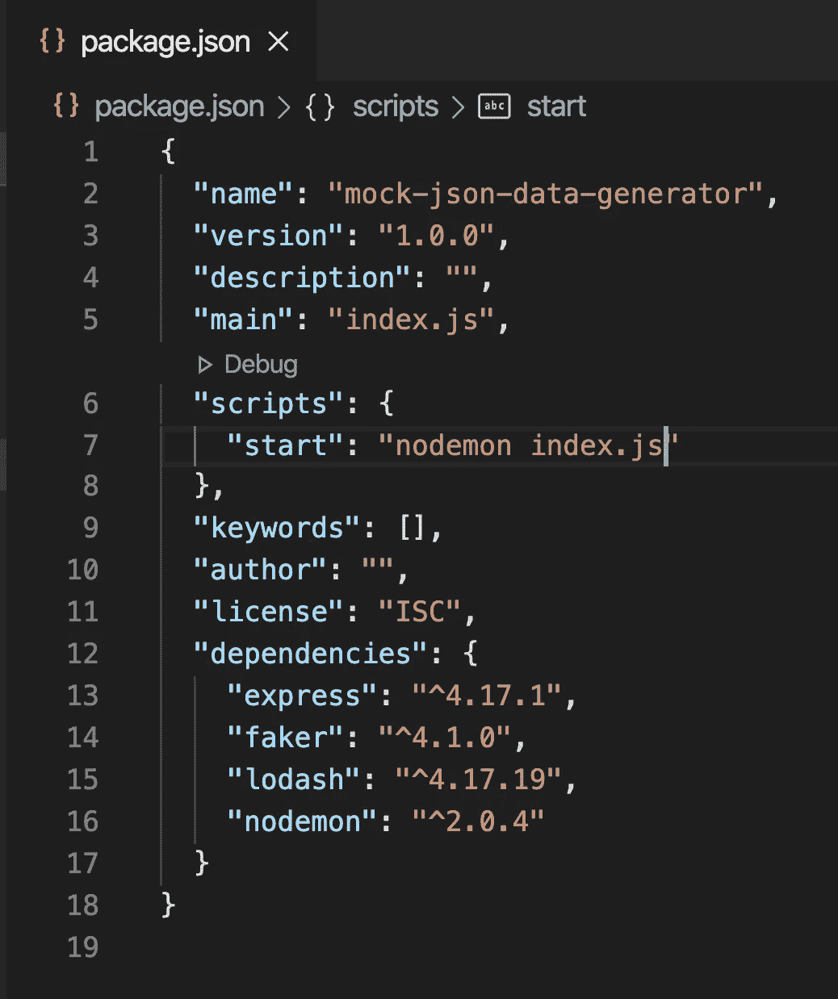
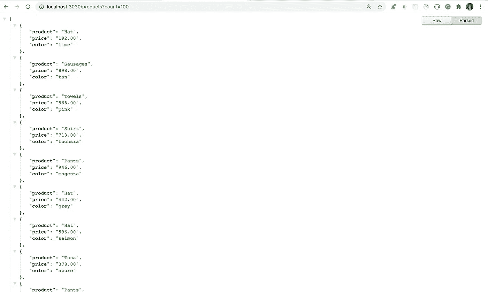
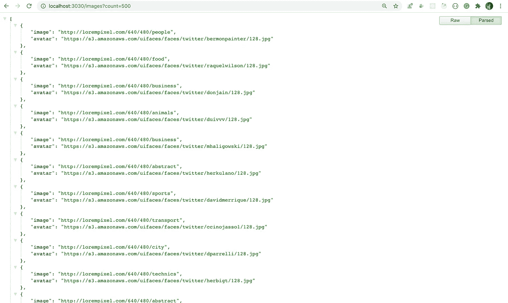
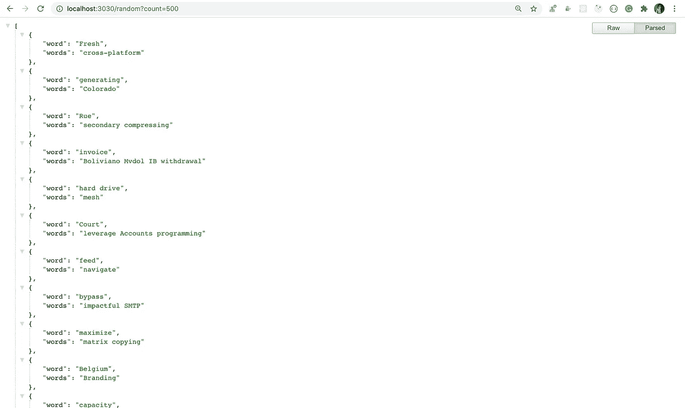
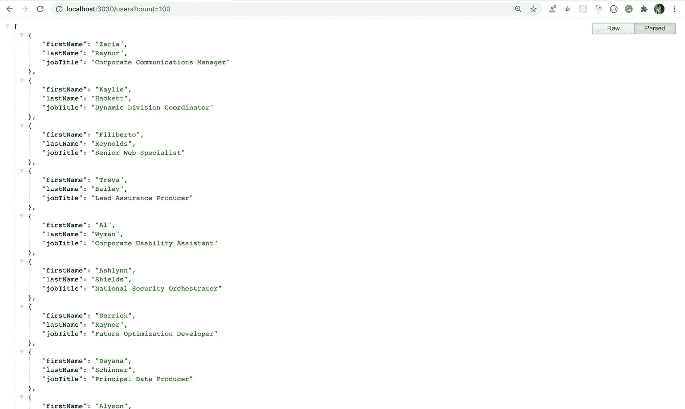
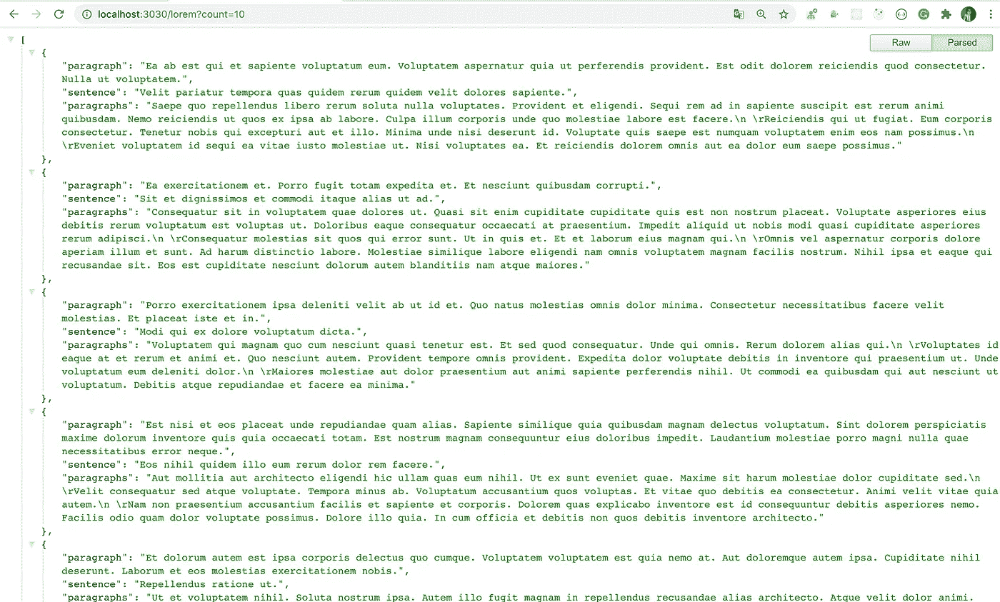
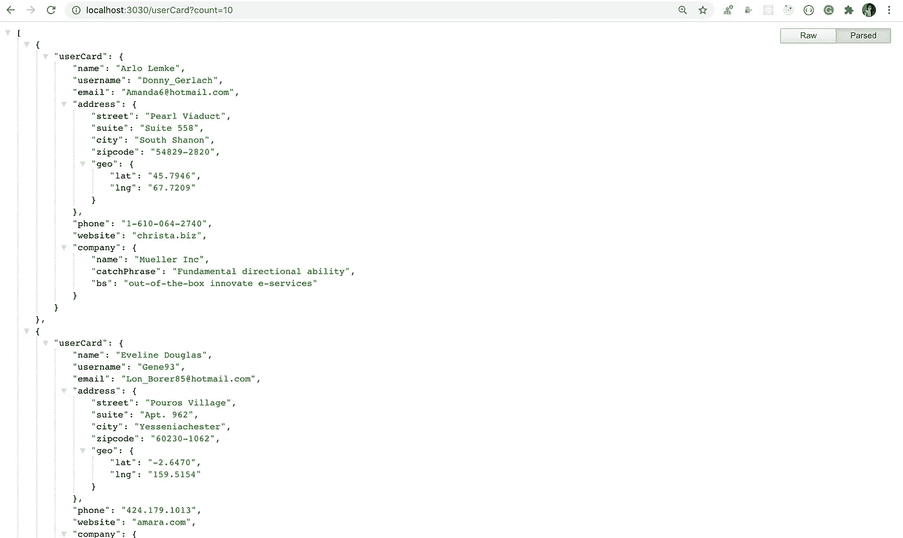
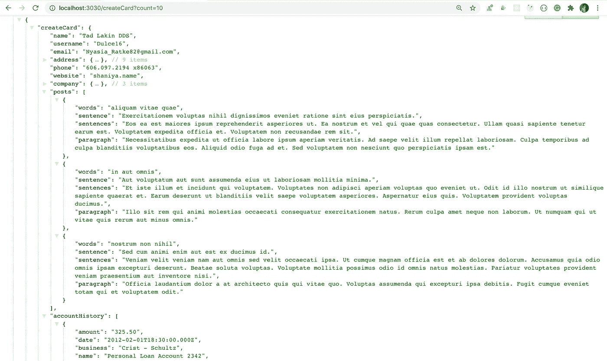

# 如何使用 Node.js 在几秒钟内生成模拟数据

> 原文：<https://javascript.plainenglish.io/how-to-generate-mock-data-within-seconds-using-node-js-3add366c4bac?source=collection_archive---------3----------------------->

## 快速生成 JSON 数据，以便在任何应用程序中使用


Photo by [Safar Safarov](https://unsplash.com/@codestorm?utm_source=medium&utm_medium=referral) on [Unsplash](https://unsplash.com?utm_source=medium&utm_medium=referral)

## **简介**

在大多数应用程序中，您需要一些静态 JSON 数据，这样您就可以在不直接使用生产数据的情况下创建和测试应用程序。

如果您正在构建一个电子商务应用程序，您可能需要一个包含产品名称、图像和价格的产品详细信息列表来进行测试。

如果你想展示一些东西，那么首先你需要一些数据来显示在用户界面上。

Faker 的周下载量约为 140 万次(截至 2020 年 8 月 19 日)。



Faker library

因此，在本教程中，您将看到如何使用一个非常流行的 npm 库`faker`轻松生成任意数量的所需数据。

# 先决条件

完成本教程需要以下内容:

*   本地安装的 Node.js

本教程通过了`Node` v13.14.0、`npm` v6.14.4、`faker` v4.1.0、`express` v4.17.1、`lodash` v4.17.19 和`nodemon` v2.0.4 的验证

# 装置

要安装库和其他依赖项，请从终端执行以下命令:

```
npm install faker@4.1.0 express@4.17.1 lodash@4.17.19 nodemon@2.0.4
```

以下列方式导入库

```
const faker = require('faker');
```

# 使用 API

以下是该库提供的一些 API 类别

*   地址
*   贸易
*   公司
*   数据库
*   金融
*   黑客
*   助手
*   图像

每个类别都提供了不同的函数来访问数据。

**随机获取国家、城市、州和邮政编码:**

```
const country = faker.address.country(); // Singaporeconst city = faker.address.city(); // Lavernebergconst state = faker.address.state(); // West Virginiaconst zipCode =  faker.address.zipCode(); // 57449-4128
```

**随机获取产品名称、价格和颜色:**

```
const product = faker.commerce.product(); // Tableconst price = faker.commerce.price(); // 458.00const color = faker.commerce.color(); // Cyan
```

让我们在 Node.js 中构建一个简单的应用程序，其中您提供了一个您想要的`count`记录，应用程序将以 JSON 格式生成那么多数据。

# 初始设置

创建一个新文件夹`mock-json-data-generator`并初始化`package.json`文件

```
mkdir mock-json-data-generatorcd mock-json-data-generatornpm init -y
```

现在，安装`faker`、`lodash`、`express`和`nodemon` npm 库

*   `faker`将用于生成随机模拟数据
*   `lodash`将用于执行某个功能一定次数
*   `express`将用于创建 REST APIs
*   `nodemon`如果文件内容发生变化，将用于重启 Express.js 服务器

从`mock-json-data-generator`文件夹执行以下命令:

```
npm install faker@4.1.0 lodash@4.17.19 express@4.17.1 nodemon@2.0.4
```

在`package.json`文件中添加一个新的启动脚本

```
"scripts": {
 "start": "nodemon index.js"
}
```

为了避免将`node_modules`文件夹添加到 git 存储库中，创建一个新的`.gitignore`文件，并在文件中添加`node_modules`条目

```
node_modules
```

您的`package.json`文件现在将看起来像这样:



package.json

# 获取随机地址列表

创建一个新的`index.js`文件，并在其中添加以下代码:

```
const express = require('express');
const faker = require('faker');
const _ = require('lodash');const app = express();app.get('/address', (req, res) => {
  const count = req.query.count;
  if (!count) {
    return res
      .status(400)
      .send({ errorMsg: 'count query parameter is missing.' });
  }
  res.send(
    _.times(count, () => {
      const address = faker.address;
      return {
        country: address.country(),
        city: address.city(),
        state: address.state(),
        zipCode: address.zipCode(),
        latitude: address.latitude(),
        longitude: address.longitude()
      };
    })
  );
});app.listen(3030, () => {
  console.log('server started on port 3030');
});
```

在上面的文件中，

1.  首先，我们导入了所有需要的包
2.  然后通过调用`express`函数创建了一个 express app

```
const app = express();
```

3.然后创建了一条`/address`路线

4.然后我们检查用户是否提供了`count`查询参数，该参数指定了要获取的记录数

```
const count = req.query.count;
if (!count) {
  return res
    .status(400)
    .send({ errorMsg: 'count query parameter is missing.' });
}
```

5.如果`count`不存在，那么我们将显示一条错误消息

6.然后我们使用由`lodash`提供的`times`方法，它将执行所提供的函数`count`的次数。`Lodash`库针对性能进行了优化，因此我们没有使用数组`map`方法来生成 1000 条记录，而是使用`lodash`库，这样响应会更快。

```
_.times(count, () => {
  const address = faker.address;
  return {
    country: address.country(),
    city: address.city(),
    state: address.state(),
    zipCode: address.zipCode(),
    latitude: address.latitude(),
    longitude: address.longitude()
  };
})
```

7.`times`方法返回一个数组。在提供的 arrow 函数中，我们返回一个带有随机生成值的对象，因此`times`方法的输出将是一个带有生成值的对象数组。

8.然后我们使用响应对象的`send`方法发送结果，使用`res.send`

9.最后，我们在端口`3030`上启动`Express.js`服务器

```
app.listen(3030, () => {
 console.log('server started on port 3030');
});
```

现在，通过从终端执行以下命令启动应用程序:

```
npm run start
```

并通过访问[http://localhost:3030/address 访问应用？计数=10](http://localhost:3030/address?count=10)


randomly generated list of addresses

***提示:*** *要获得如上图所示的格式化 JSON，可以安装* [*JSON 格式化程序*](https://chrome.google.com/webstore/detail/json-formatter/bcjindcccaagfpapjjmafapmmgkkhgoa) *Google Chrome 扩展。*

如果您不提供`count`查询参数，那么您将得到如下所示的错误。


Missing query parameter error

# 获取随机产品列表

再添加一条`/products`路线，获取产品列表。

```
app.get('/products', (req, res) => {
  const count = req.query.count;
  if (!count) {
    return res.status(400).send({
      errorMsg: 'count query parameter is missing.'
    });
  }
  res.send(
    _.times(count, () => {
      const commerce = faker.commerce;
      return {
        product: commerce.product(),
        price: commerce.price(),
        color: commerce.color()
      };
    })
  );
});
```

在这段代码中，我们使用了`faker.commerce`及其相关方法，而不是`faker.address`。



randomly generated list of products

# 获取随机图像列表

添加另一条`/images`路线来获得图片列表。

```
app.get('/images', (req, res) => {
  const count = req.query.count;
  if (!count) {
    return res.status(400).send({
      errorMsg: 'count query parameter is missing.'
    });
  }
  res.send(
    _.times(count, () => {
      const image = faker.image;
      return {
        image: image.image(),
        avatar: image.avatar()
      };
    })
  );
});
```

在这段代码中，我们使用了`faker.image`及其相关方法。



randomly generated list of images

# 获取一个随机单词列表

添加另一条`/random`路线来获得随机单词列表。

```
app.get('/random', (req, res) => {
  const count = req.query.count;
  if (!count) {
    return res.status(400).send({
      errorMsg: 'count query parameter is missing.'
    });
  }
  res.send(
    _.times(count, () => {
      const random = faker.random;
      return {
        word: random.word(),
        words: random.words()
      };
    })
  );
});
```

在这段代码中，我们使用了`faker.random`及其相关方法。



randomly generated list of words

# 获取随机用户的列表

添加另一条`/users`路线来获得随机用户列表。

```
app.get('/users', (req, res) => {
  const count = req.query.count;
  if (!count) {
    return res.status(400).send({
      errorMsg: 'count query parameter is missing.'
    });
  }
  res.send(
    _.times(count, () => {
      const user = faker.name;
      return {
        firstName: user.firstName(),
        lastName: user.lastName(),
        jobTitle: user.jobTitle()
      };
    })
  );
});
```

在这段代码中，我们使用了`faker.name`及其相关方法。



randomly generated list of users

# 获取随机 Lorem Ipsum 文本的列表

再添加一个`/lorem`路由，获得随机 lorem ipsum 段落列表。

```
app.get('/lorem', (req, res) => {
  const count = req.query.count;
  if (!count) {
    return res.status(400).send({
      errorMsg: 'count query parameter is missing.'
    });
  }
  res.send(
    _.times(count, () => {
      const lorem = faker.lorem;
      return {
        paragraph: lorem.paragraph(),
        sentence: lorem.sentence(),
        paragraphs: lorem.paragraphs()
      };
    })
  );
});
```

在这段代码中，我们使用了`faker.lorem`及其相关方法。



randomly generated list of lorem ipsum paragraphs

# 获取随机用户信息列表

`Faker`库也提供了一套类似`createCard`、`userCard`、`createTransaction`的助手。

添加另一个`/userCard`路径，获取用户信息的随机卡片列表，如姓名、电子邮件、地址、网站、公司。

```
app.get('/userCard', (req, res) => {
  const count = req.query.count;
  if (!count) {
    return res.status(400).send({
      errorMsg: 'count query parameter is missing.'
    });
  }
  res.send(
    _.times(count, () => {
      const helpers = faker.helpers;
      return {
        userCard: helpers.userCard()
      };
    })
  );
});
```

在这段代码中，我们使用了`faker.helpers`及其`userCard`方法。



randomly generated list of user information

除了上面的用户详细信息，如果我们想要用户的帖子和交易详细信息，我们可以使用`createCard` helper 方法

添加另一个`/createCard`路径来获取用户帖子和交易的数据以及其他详细信息

```
app.get('/createCard', (req, res) => {
  const count = req.query.count;
  if (!count) {
    return res.status(400).send({
      errorMsg: 'count query parameter is missing.'
    });
  }
  res.send(
    _.times(count, () => {
      const helpers = faker.helpers;
      return {
        createCard: helpers.createCard()
      };
    })
  );
});
```

在这段代码中，我们使用了`faker.helpers`及其`createCard`方法。



randomly generated list of user information with posts and transactions

`Faker`提供了很多其他的细节，你可以在[这个网址](https://www.npmjs.com/package/faker)查看。

# 结论

如您所见，faker 库提供了许多 API 函数来轻松生成随机数据。当您想快速构建一些东西，而不浪费时间来创建数据时，它也非常有用。

你可以在这里找到这个应用[的完整源代码。](https://github.com/myogeshchavan97/mock-json-data-generator)

今天到此为止。我希望你学到了新东西。

**别忘了订阅我的每周简讯，里面有惊人的技巧、诀窍和文章，直接在你的收件箱** [**这里。**](https://yogeshchavan.dev/)