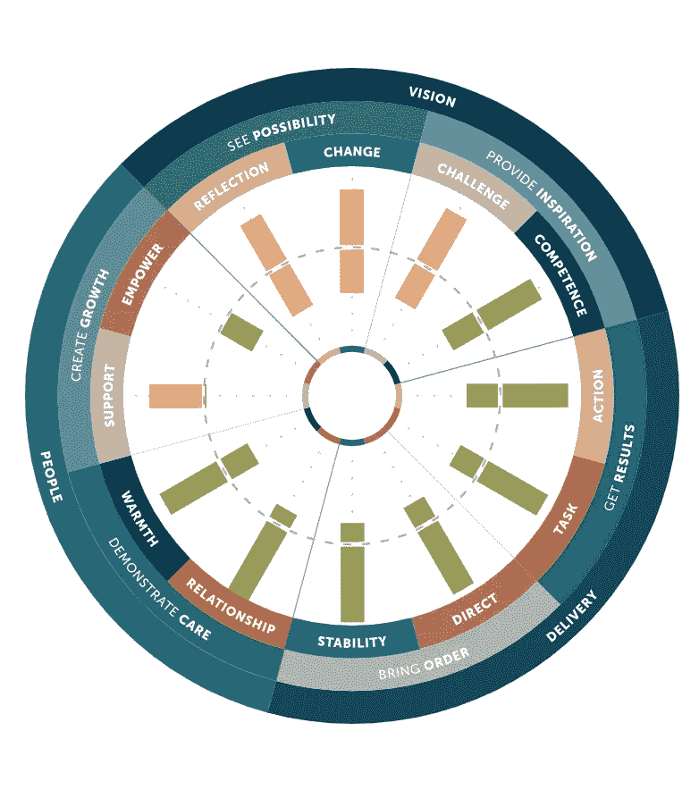

# 如何使用木偶师、D3 和手柄生成服务器端 PDF 报告

> 原文：<https://javascript.plainenglish.io/how-to-generate-server-side-pdf-reports-with-puppeteer-d3-and-handlebars-97bc8ed38a53?source=collection_archive---------6----------------------->

正在寻找一种方法来创建一个设计繁重、数据驱动、风格优美的 PDF 报告—在服务器端使用与您已经在前端使用的工具类似的工具？停止你的谷歌搜索。你来对地方了。几个月前，在帮助一个客户解决这个问题时，我和你处境相同。为了完成这个壮举，我用木偶师、D3 和把手开发了一个四步解决方案。在这篇文章中，我将一步一步地指导你创建服务器端的 pdf 报告。让我们开始吧。



Example of a D3 generated page using handlebars and puppeteer

# 在本帖中，我们将介绍

*   设置木偶师和把手
*   创建一个生成器来制作 PDF
*   构建车把模板
*   添加最后的润色

# 创建这些 PDF 报告的挑战:

因为我们使用模板框架来访问标准的 web 技术，并使用 puppeteer 来管理 pdf，所以我们需要在开发过程中考虑这些事情:

*   页面将需要手动约束。
*   除了“屏幕”之外，我们将无法访问 css 媒体道具(无“分页符”或印刷媒体类型)
*   一旦 PDF 被编译和渲染，我们将无法使用开发工具来调试不规则性。
*   木偶师本身增加了额外的构建时间和部署规模。
*   根据文件大小，生成报告可能需要一段时间。

# 对于这个例子，让我们假设…

我们已经有了项目的基础，并运行 Node/Express，以及一些 ORM 和 DB 解决方案。我们已经准备好将我们的甜蜜数据输入到报告中。

# 我们实现这一目标所需的工具:

# 1.把手

来自 Mustache 家族的 Html 模板框架。这允许部分模板化(对组件的花哨说法)以及定制和内置的助手功能来扩展我们的逻辑。

```
npm **install** handlebars
```

*使用部分和内置模块的示例*

```
{{#each poleComparison as |page|}}
<div class="page">
  {{#each page.pairs as |polePair|}}
	{{> comparison-header polePair=polePair }}
	    <div class="comparison-tables">
		    {{> comparison-body polePair=polePair }}
	    </div>
  {{/each}}
  {{> footer @root }}
</div>
{{/each}}
```

# 操纵木偶的人

一个节点库，它将为我们提供对 chrome headless 实例的访问，以便基于我们编译的手柄模板生成 PDF。

```
npm **install** puppeteer
```

用例列表:

*   生成页面的截图和 pdf。
*   抓取 SPA(单页应用程序)并生成预呈现内容(即“SSR”(服务器端呈现))。
*   创建一个最新的自动化测试环境。
*   测试 Chrome 扩展。

# 3.D3(数据驱动文档)

D3.js 是一个基于数据操作文档的 JavaScript 库。D3 帮助您使用 HTML、SVG 和 CSS 将数据变得生动。D3 对 web 标准的重视让您拥有现代浏览器的全部功能，而无需将自己束缚在一个专有的框架中，它结合了强大的可视化组件和一种[数据驱动的](https://www.singlestoneconsulting.com/blog/data-infrastructure-architecture/)DOM 操作方法。

```
<script src="https://d3js.org/d3.v5.min.js"></script>
```

# 第一步:设置木偶师和把手

首先，我们将为 PDF 创建一个目录，然后导入所需的模块。这将是一个 JavaScript 文件，我们将把它放在应用程序的服务器端结构中。为了方便起见，我们可以将此称为 generatePDF.js。

```
const puppeteer = require("puppeteer"); 
const hbs = require("handlebars");
```

接下来，我们需要让 handlebars 编译我们的模板。我们将创建一个编译函数来定位。hbs 文件，并使用内置的 handlebars 编译方法来实现这一点。

```
const puppeteer = require("puppeteer");
const hbs = require("handlebars");

const compile = async (templateName, data) => {
	const filePath = path.join(__dirname, "templates", `${templateName}.hbs`);
	if (!filePath) {
		throw new Error(`Could not find ${templateName}.hbs in generatePDF`);
	}
	const html = await fs.readFile(filePath, "utf-8");
	return hbs.compile(html)(data);
};
```

这个方法还允许我们将将要使用的数据注入到模板中。

最后，我们需要设置 generatePDF 函数。它的工作将是打开一个傀儡无头铬实例转换成 PDF 格式的模板。

```
let browser; 
const generatePDF = async (fileName, data) => {
	try {
		if (!browser) {
			browser = await puppeteer.launch({
				args: [
				"--no-sandbox",
				"--disable-setuid-sandbox",
				"--disable-dev-shm-usage"
				],
				headless: true,
			})
		}
	} catch (err) {
		...
```

我们已经将一些配置选项传递给我们的木偶浏览器，这将使它变得无头和轻量级。我们也不希望同时打开多个浏览器，这会在生成多个报告时导致性能问题。

接下来，我们将创建一个新的隐名浏览器上下文。我们将使用这个方法而不是通常的上下文方法，因为它不会与其他浏览器上下文共享 cookies 缓存。这对木偶师的其他功能很有帮助，但在这个过程中并不需要。

```
],
				headless: true,
			})
		}
		const context = await browser.createIncognitoBrowserContext();
		const page = await context.newPage();
		const content = await compile(fileName, data);

	} catch (err) {
		...
	}
}
```

现在，我们将设置我们的内容，并告诉木偶师在渲染 PDF 之前等待所有内容加载完毕。

```
const content = await compile(fileName, data);

		await page.goto(`data: text/html, ${content}`, { 
			waitUntil: "networkidle0" 
		});
		await page.setContent(content);
		await page.emulateMedia("screen");

	} catch (err) {
		...
	}
}
```

** page.goto 采用 URL 字符串和配置选项。我们不会访问一个 URL，相反，我们将利用我们编译的 html*

** emulateMedia 改变页面上使用的 CSS 媒体类型。我们希望我们的媒体类型反映用于屏幕的 CSS。*

我们将设置页面格式，以便木偶师知道如何渲染。请记住，puppeteer 不知道我们想要在哪里分割我们的实际内容(这将在稍后通过我们的模板 css 来处理)。

```
await page.emulateMedia("screen");

		const pdf = await page.pdf({
			format: "A4",
			printBackground: true,
		});

		await context.close();
		return pdf;

	} catch (err) {
		...
	}
}
```

# 第二步:设置我们的车把模板

我们将首先为我们的报告创建第一个把手模板文件。请注意，语法看起来和行为就像普通的 HTML。

```
our_report.hbs<!DOCTYPE html>
<html lang="en">
<head>
  <meta charset="UTF-8">
  <title>Our Cool PDF Report</title>
  <meta name="viewport" content="width=device-width, initial-scale=1.0, maximum-scale=1.0" />
  <script src="https://d3js.org/d3.v5.min.js"></script>
</head>
  <body>
	  <div>
	    <p>Hello World<p>
	  </div>
  </body>
```

# 让我们的数据进入我们的模板

我们可以使用一些手柄内置块来帮助我们与之前在编译函数中注入的数据进行交互。我们可以使用“with”块获得我们需要的数据的上下文，然后使用“each”块迭代它。

```
<!DOCTYPE html>
<html lang="en">
<head>
  <meta charset="UTF-8">
  <title>Our Cool PDF Report</title>
  <meta name="viewport" content="width=device-width, initial-scale=1.0, maximum-scale=1.0" />
  <script src="https://d3js.org/d3.v5.min.js"></script>
</head>
  <body>
	  <div>
		{{#with Data as |myData| }}
		 {{#each myData.text as |text| }}
		 <p>{{text}}<p>
		 {{/each}}
		{{/with }}
	  </div>
  </body>
```

# 现在我们可以添加一些过程来生成我们的 PDF

现在，在我们的节点应用程序中，我们可以使用 generatePDF 函数来创建 PDF。这将是你决定最终如何处理报告的时候了。您可以将它存储在您的数据库中，提供给客户端，或者将其存放在 S3 桶中。根据应用程序的需求，这里有很大的自由度。

```
const generatePDF = require('./generatePDF.js');

const generateReportWithData = reportData => {
 return generatePDF("our_report", reportData);
  }
```

如果您有不同类型的报告，我们可以借此机会添加一个 switch 语句和一些逻辑来决定生成哪个报告。

# 第三步:建立一个车把模板

现在我们可以设置模板样式了。我们将创建一个名为 style.hbs 的文件。我喜欢设置全局变量 css 变量，以保持我对许多样式的诚实。pt 是可打印文档的推荐单位，我发现 px 并不总是适用于文本。我还发现 em 单位比像素更适合翻译字母间距。这使得在转换值时更容易匹配设计的字距/字母间距。

# 构建页面约束

```
**style.hbs**:root {
	--font-s-small: 8pt;
	--font-s-normal: 10pt;
	--font-s-mid: 12pt;
	--font-s-large: 14pt;
	/* Kerning */
	--ltr-spc-200: 0.2em;
	--ltr-spc-100: 0.1em;
	--ltr-spc-020: 0.02em;
	--ltr-spc-025: 0.025em;
}
```

如果你还记得，我们谈到过当我们想把文档分成页面时，木偶师是如何没有上下文的。它将生成 PDF 并适当地分解页面，而不管我们的内容位于何处。这意味着当溢出时，我们的内容会自动溢出到下一页，我们不希望这样，因为我们宁愿控制。我们将添加一些样式来让我们的 HTML 主体永远延续下去，并添加一个页面容器来匹配 A4 格式页面的约束。如果您使用不同的格式，您需要在页面容器的高度和宽度中插入相应的数字。

```
<style>
html, body {
	height: 100%;
	margin: 0;
	padding: 0;
	}
.page {
	background: white;
	display: block;
	margin: 0 auto;
	margin-bottom: 8.5em;
	/* Size = A4 */
	width: 21cm;
	height: 29.7cm;
	padding: 5em 30px 0 30px;
	position: relative;
```

# 在设置木偶师和手柄的文件中

因为我们创建了一个 style.hbs 文件，所以我们想注册为一个分部文件，这样我们就可以把它插入到我们的模板中。这样，我们就不必把所有的样式都塞进我们的主模板文件，如果需要的话，还可以重用代码。

```
hbs.registerPartial("style", fs.readFileSync(
    path.join(__dirname, "/path/to/style.hbs"), "utf-8"),
);
```

既然它已经注册为 handlebars partial，我们可以简单地将它放入模板中。

```
{{> styles }}
</head>
  <body>
	  <div class="page">
		{{#with Data as |myData| }}
		 {{#each myData.text as |text| }}
		 <p>{{text}}<p>
		 {{/each}}
		{{/with }}
	  </div>
  </body>
```

# 第四步:加入一些 d3

我们已经在模板头中引入了 d3 CDN 链接

```
<script src="https://d3js.org/d3.v5.min.js"></script>
```

现在是时候为我们的 d3 脚本创建一个片段了。我们将使用与创建 style.hbs partial 相同的方法来完成此操作。将 d3_script.hbs 文件注册为 handlebars 辅助对象。

```
hbs.registerPartial("d3_script", fs.readFileSync(
	path.join(__dirname, "/path/to/d3_script.hbs"), "utf-8"),
);
```

然后我们可以根据需要把它放到我们的主模板中。还要注意模板中使用的 canvas anchor div，它为我们的 D3 提供了一个基础。

```
my_template.hbs{{/each}}
	{{/with }}
  </div>
  <div class="canvas"></div>
</body>

<script type="text/javascript">
const svg = d3
	.select('#canvas')
	.append('svg')
	.attr('viewBox', [-width / 2, -height / 2, width, height]);
</script>
```