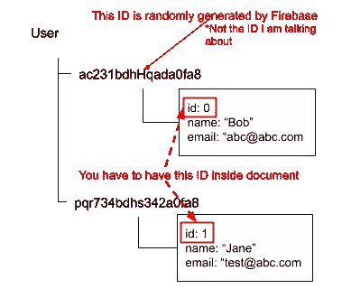

# 如何使用 Ionic Angular 从 Firebase Cloud Firestore 获得随机文档

> 原文：<https://javascript.plainenglish.io/how-to-get-a-random-document-from-firebase-cloud-firestore-with-ionic-angular-a59940efb55e?source=collection_archive---------1----------------------->

## 我目前正在建立这个应用程序，我正在谷歌寻找一种方法来从云 Firestore 获得随机文件。了解 Firebase 和云 Firestore 的酷功能，肯定有一个简单的方法可以做到这一点。然而…

我无法找到任何方法，可以实现这一点与离子角。不相信我，就去试着找找吧。因此，我决定为那些想使用 Ionic Angular 从 Firebase Cloud Firestore 的集合中随机抽取文档的开发人员编写一个指南

首先，我想说的是，我很惊讶的发现，但是没有官方的指导。有人会认为现在已经有人写了一个简单的指南，但是相信我，我没有找到。我发现了一个关于堆栈溢出的解决方案，我已经将其用于 Ionic Angular，特别是 TypeScript，我将在本文中详细介绍。


Photo by [Patrick Fore](https://unsplash.com/@patrickian4?utm_source=unsplash&utm_medium=referral&utm_content=creditCopyText) on [Unsplash](https://unsplash.com/s/photos/random-selection?utm_source=unsplash&utm_medium=referral&utm_content=creditCopyText)

但首先，在我继续向您展示该方法之前，只是简单解释一下**什么是 Firebase** 和**什么是 Firebase Cloud Firestore，**，以防您偶然看到这篇文章，并想了解更多有关该主题的信息。

> Firebase 是一个移动和 web 应用程序开发平台，由 Firebase，Inc .于 2011 年开发，随后于 2014 年被谷歌收购。截至 2020 年 3 月，Firebase 平台有 19 款产品，被超过 150 万个应用程序使用-
> 
> 来自[维基百科](https://en.wikipedia.org/wiki/Firebase)

Firebase 提供的 19 个产品之一是一个功能齐全、可查询的 NoSql 数据库，名为 Cloud Firestore。

> Cloud Firestore 是一个灵活、可扩展的数据库，用于 Firebase 和 Google 云平台的移动、web 和服务器开发。像 Firebase 实时数据库一样，它通过实时监听器使您的数据在客户端应用程序之间保持同步，并为移动和 web 提供离线支持，因此您可以构建响应迅速的应用程序，无论网络延迟或互联网连接如何。Cloud Firestore 还提供了与其他 Firebase 和 Google 云平台产品的无缝集成，包括云功能。
> 
> 来自 [Firebase 网站](https://firebase.google.com)

要了解更多关于 Firebase、云 Firestore 和其他 Firebase 相关产品的信息，请访问 Firebase 网站

[](https://firebase.google.com) [## 重火力点

### Firebase 为您提供了分析、数据库、消息传递和崩溃报告等功能，因此您可以快速移动并…

firebase.google.com](https://firebase.google.com) 

## **从云 Firestore 中提取随机数据，高级概述**

从很高的层面来看，你需要在你的文档中有一个递增的或者随机的 ID 号。

您的数据应该如下所示:



DIAGRAM 1: SHOWING INCREMENTAL ID INSIDE DOCUMENT

*“但我没有在我的文档中添加增量或随机 id，我有 1000 多个条目。我如何将它添加到每个文档中？”*

别担心，我也一样，所以我决定写点东西来帮助我解决那个问题。解决方案是构建一个简单的 Firebase 函数，它会自动为您完成这项工作。您可以使用我写的这个简单的代码片段，它将通过`for`循环在每个文档中添加和更新字段`id`。

```
const admin = require("firebase-admin");admin.initializeApp(functions.config().firebase);...exports.updateRandom=functions.https.onRequest((request, response) => {
  admin
   .firestore()
   .collection("user")
   .get()
   .then(res => {
           var pack_data = [];
           res.forEach(datax => {
             pack_data.push({id: datax.id});
           });for(var x=0;x<pack_data.length;x++)
           {
             var random=Math.floor((Math.random() * pack_data.length) + 1);
             admin
             .firestore()
             .collection("user")
             .doc(pack_data[x].id)
             .update({id:random})
           }return response.send("OK");
    })
    .catch(err=>{
      return response.send("ERROR "+err);
    })
})
```

所以现在我们已经添加了一个随机化的`id`，我们需要做的就是生成一个随机数，并从云 Firestore 查询这个随机数。

## **随机拉一个用户文档**

例如，假设我们正在构建一个 raffles draw 应用程序，我们需要从 Cloud Firestore 中的用户集合中随机抽取一个用户文档。假设我们已经在每个文档中添加了一个随机的或递增的 ID 字段，下一步就是进行查询。

## **步骤 1:生成随机数**

在客户端应用程序中，我们需要生成一个随机数。当我们从 Cloud Firestore 中抽取一个随机的文档时，这个随机数将成为引用的密钥。

假设我们有超过 1500 个用户，通过使用下面的代码片段，我们可以得到一个介于 0 到 1499(记住，程序员从 0 开始计数)之间的随机数:

```
var random=Math.floor((Math.random() * documentSize.length));
```

## **第二步:查询随机数**

一旦我们生成了一个随机数，我们就可以在客户端应用程序中查询云 Firestore。我们需要写一个函数来完成这个任务。在这种情况下，让我们调用我们的函数`getRandomUser():`

```
getRandomUser(){return new Promise(async (resolve)=>{var random = Math.floor((Math.random() * documentSize.length));await firebase
        .firestore()
        .collection("user")
        .where("id",">=" , random)
        .limit(1)
        .get()
        .then((res)=>{
          let pack_data:any=[];
          res.forEach(quest=>{
            pack_data.push(quest.data());
          }); resolve(pack_data[0]);})}
```

如果您注意到了`.where`语句，我们实际上是在这里查询数据库，以返回与我们生成的随机数相同或更大的数。这将返回最接近随机数的项，即使随机生成的数不返回文档。

虽然这个方法是进行单向查询，但是如果您想进行双向查询，也可以采用同样的方法，我在这里不做介绍，因为使用这个单向方法可以返回我正在寻找的随机项，但是我只想指出，也可以进行双向查询。

## **第三步:获取随机文件**

上一节中方法的查询解析一个承诺并返回`pack_data[0]`。这将是我们想要的随机文档，然后我们可以在我们的应用程序中使用它。

**总结**

如果你能够完成上述 3 个任务，你应该能够返回并从你的云 Firestore 获得一个随机文件。一定要试一试。

**编码快乐！**

**建议增强功能**

1.  如上所述，您可以向查询添加双向方法
2.  如果返回了 1 个以上的文档，您可以添加另一层随机性。在上述带有`limit(1)`的文件中，我们已经将限制设置为 1，但是我们可以将限制返回到 5，并对返回的 5 份文件进行进一步的随机化。

## **简单英语团队的通知**

你知道我们有四种出版物吗？给他们一个如下的提示来表达爱意: [**简单的 JavaScript**](https://medium.com/javascript-in-plain-english)、[、**简单的 AI**、](https://medium.com/ai-in-plain-english)、[、**简单的 UX**、](https://medium.com/ux-in-plain-english)、[、**简单的 Python**、](https://medium.com/python-in-plain-english)、**、**——谢谢你，继续学习吧！

此外，我们一直对帮助推广好的内容感兴趣。如果您有任何想提交给我们的出版物的文章，请发邮件至[**submissions @ plain English . io**](mailto:submissions@plainenglish.io)**并附上您的 Medium 用户名和您感兴趣的文章，我们将回复您！**