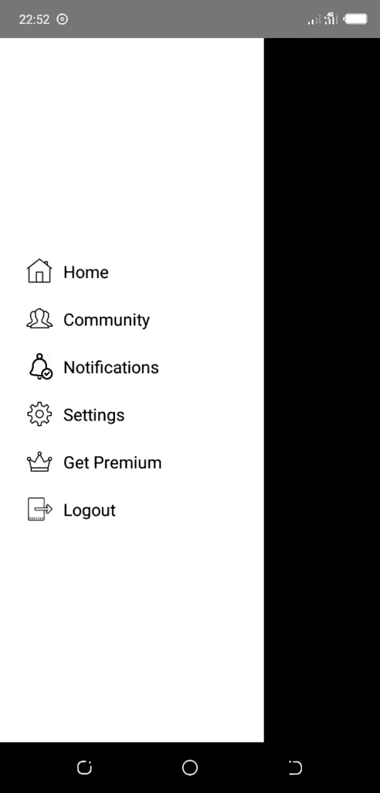
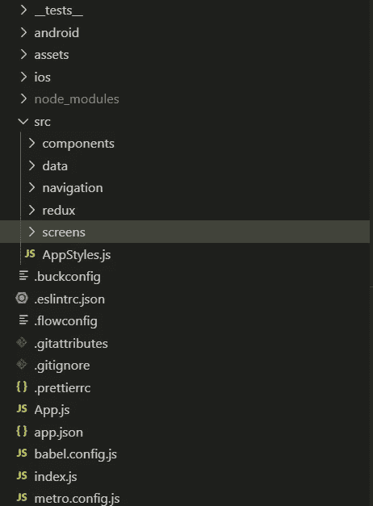

# 如何更快地熟悉一个新的代码库

> 原文：<https://javascript.plainenglish.io/how-to-get-familiar-with-a-new-codebase-faster-39d93913d375?source=collection_archive---------9----------------------->

这篇文章假设你刚刚得到一份新工作，你发现安顿下来并开始在新团队的代码库上工作是一项艰巨的任务。我们在本文中讨论了一些技巧，可以帮助您更快地熟悉新的代码库。

## 熟悉的代码库技巧

这些技巧和诀窍是经过深入研究和咨询业内一些领域开发人员后总结出来的。这里没有魔法，只有实用有效的步骤让你尽快熟悉新的代码库。

作为一名开发人员，本文还将帮助您为下一个接手您的优秀工作的开发人员维护一个合理的代码库。让我们直接跳进来吧

以下是掌握新代码库的五次主要旅行

*   作为最终用户运行应用程序
*   深入文档
*   学习和提问
*   重写

# 以终端用户身份运行应用程序

你应该运行实时应用程序，寻找应用程序功能，你应该浏览应用程序，寻找代码可以分成的可能模块。这种模块可以是入职、聊天、主页模块等。

对于前端开发人员来说，你需要注意菜单、底部导航、抽屉或任何能把整个应用整合成一个整体的小部件。

有时候，你会一次做一个模块，所以你的注意力应该放在那个模块上，你可以在心里把它分解成子模块。

## 应用程序的模块

看着上面的图片，我可以立即识别出整个应用程序的一些主要模块，并且当我深入代码库并开始改进时，我知道应该注意应用程序的哪些模块。

# 深入文档

既然你已经将应用程序分解成了独立的模块，那么你需要深入代码，寻找之前存在的任何形式的文档。我个人将文档分为低级文档和高级文档。

高级文档是指需求文档、架构设计和技术文档。

对于低级文档，您应该留意一些命名约定、注释和文件夹安排。

## 文件夹排列

上面的图片显示了一个典型的自文档化的文件夹排列，并且已经告诉我在哪里可以找到屏幕、状态管理器、导航、主要应用程序组件甚至一般应用程序风格的代码。

# 研究代码并提出问题

这里的目标不是用问题烦扰你当前的团队。你必须自己对代码库做大量的研究，因为有很多关于你将要工作的代码库和系统的信息。

这项研究的重要性怎么强调都不为过。少量的研究可以产生巨大的收益，帮助你在新的项目想法、重构、代码库的改进上采取主动。

建议只问关键相关的问题，以免给你的新同事/团队带来麻烦。我有一个同事坚持认为在编程中没有太愚蠢的问题，我完全同意他的观点。

一个开发人员的伟大品质不仅仅是提出问题，而是正确地提出问题，这意味着以这样一种方式提出问题，从而得到一个有帮助的答案。

# 重写

在极端情况下，您可能想要重写您将要处理的部分或全部代码库。这应该是在代码库会给你和将来在同一代码库上工作的开发人员带来额外问题的情况下。

这可能会花费你的新公司大量的时间和精力来实现，这应该是最后的手段。相信我，你应该和你的主管好好讨论一下重写你负责的代码库的部分或全部模块的利弊。

# 结论

这些技巧可以一次应用于一个模块，然后使用获得的技巧并应用于代码库的其他模块。

作为一名开发人员，尽可能保持一个接近原始的代码库也是非常重要的，这样才不会让其他开发人员的生活变成一场噩梦。

对于任何一个刚进入新团队并学习新代码库的人来说，开始一个新的代码库可能是非常棘手和困难的，但是我希望这篇文章能帮助你在尝试熟悉新代码库的过程中变得愉快。