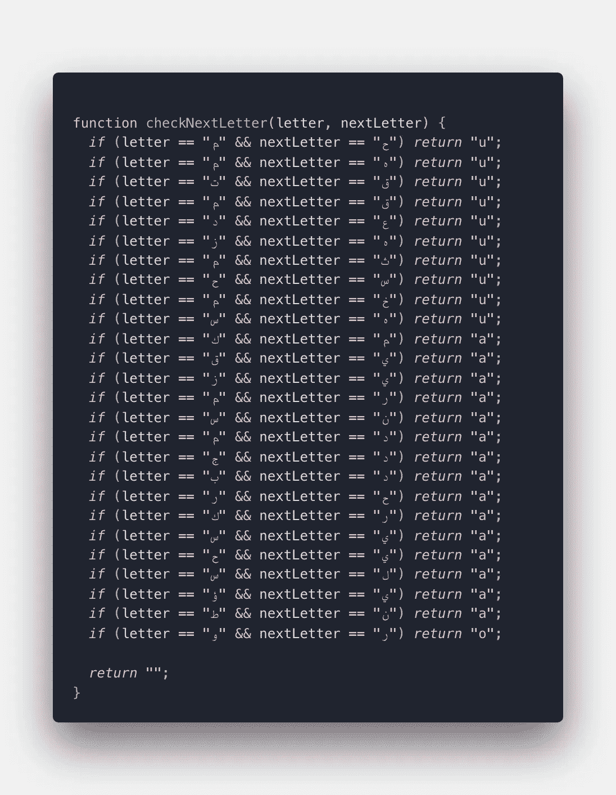
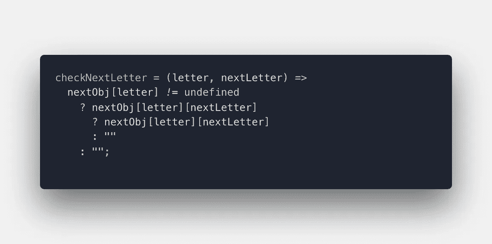
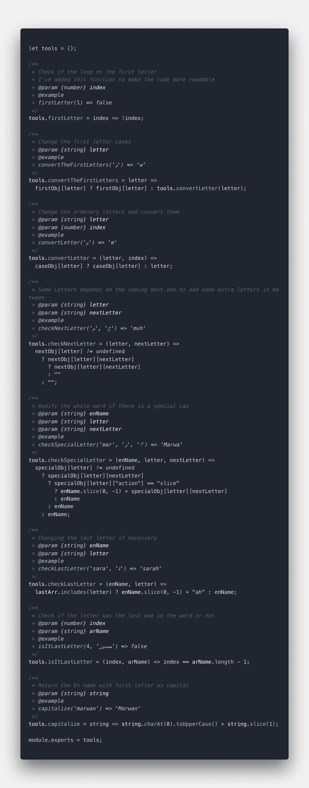
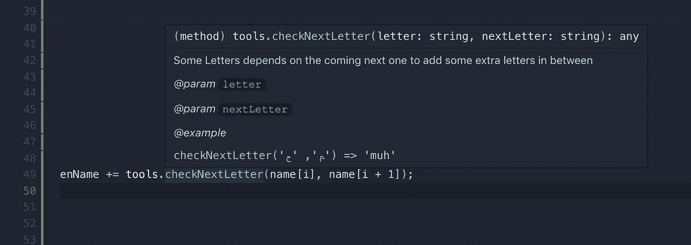

# 如何摆脱混乱的代码？

> 原文：<https://javascript.plainenglish.io/how-to-get-rid-of-your-messy-code-getting-rid-of-frequent-if-statements-28d1e43b5053?source=collection_archive---------5----------------------->

## 摆脱频繁的 if 语句


*在本文中，我将展示我是如何改变我混乱的代码的，这些代码有很多
“if 语句”和长时间不需要的“转换用例”*

当您开始为某种解决方案编写一个想法时，因为您只想看看它是否会工作——而且速度很快。你的代码可能有点臭。大多数时候，不是“一点点”。

一开始还不错，但你必须清理干净。

我将举一个活生生的例子，它是从下图中的一个讨厌的代码中修改出来的。



下面图像中的代码。



*该代码是将阿拉伯语名称转换为英语名称的包的代码* [*链接*](https://www.npmjs.com/package/arabic-name-to-en)

首先，有很多 if 语句决定将其一扫而光。
我们可以通过为所有您想检查的案例设置 JSON 对象，

假设我们想检查第一个字母是“م”，第二个字母是“ح”还是“خ”,我们可以说。

```
if(firstLetter == "م" && secondLetter == "ح" || secondLetter == "خ")
  return "u";
```

一切都会好的。但是。如果我们想增加更多的病例呢？它在一行中看起来很糟糕，在多行 if 语句中看起来也很糟糕。

## 这看起来太糟糕了！

Don’t do that, please

# 解决方案是:

我的方法是创建一个对象，它的第一个字母作为键，值也是一个对象，它的键是第二个字母，值是返回值

```
let obj = { *k:* { *m:* “a” }, { *r:* “b” }
};
```

让我重新解释一下这里发生的事情，所以“k”是第一个字母，
如果“k”后面的第二个字母是“m”，返回值将是“a”。
如果“k”后面的第二个字母是“r”，则返回应为“b”。

这张桌子会让它更清晰。:)

但是，如果您注意到，到目前为止，我们没有返回或检查任何内容，那么就开始吧。

该函数必须检查 obj 是否有一个等于第一个字母的键。然后它将检查是否有一个对象属于 obj[firstLetter]并具有关键字“secondLetter”。然后我们必须返回第二个对象的值

```
if(obj[firstLetter] != undefined  && obj[firstLetter][secondLetter])
   retuen obj[firstLetter][secondLetter]
```

但是。有更好的方式来写它，对吗？班轮呢如果。

```
res = obj[firstLetter] != undefined ? :
         obj[firstLetter][secondLetter] ?
           obj[firstLetter][secondLetter]
           :""
        :""
```

现在，在这种情况下，我们可以根据需要添加任意多个案例，代码将一如既往地保持有序。

# 如何让它变得更好:

我们可以向对象添加另一个属性，就像我们想要使用的操作一样。

```
let obj = { *k:* { *m:* “a”, action: "slice" },
   { *r:* “b”, action: "" }
};
```

此外，如果你创建了一个路由器的行动，它将更加可怕。

现在，代码都是干净的！！！！

AND NOW THE CODE IS ALL CLEAN !!!!

# 您可以检查旧代码:


# 还有新密码！



使用此链接查找代码[https://github.com/hamdongunner/arabic-names-to-en](https://github.com/hamdongunner/arabic-names-to-en)

啊，还有，如果你在下面的函数上面加上一个描述，你可能还想使用一个技巧。这将有助于解释，并清楚每当有人悬停该函数时，它实际上会做什么

```
*/***** Some Letters depends on the coming next one to add some extra letters in between*** @param {string} letter*** @param {string} nextLetter*** @example*** checkNextLetter('م', 'ح') => 'muh'***/*
```

检查它:)



在所有这些之后，我相信我们都可以得到一个更好、更容易理解的代码。

再见！