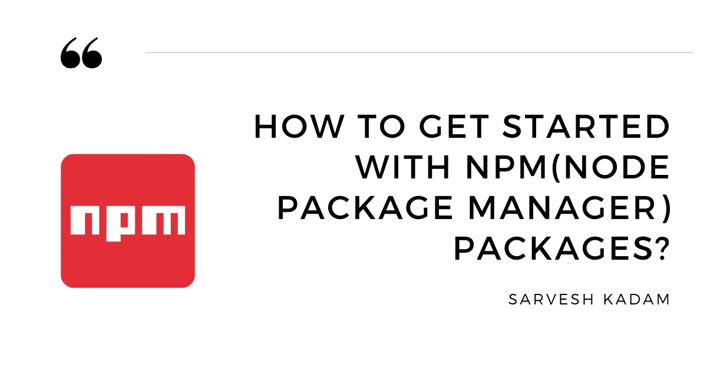
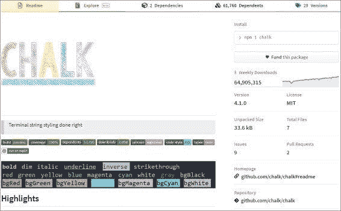
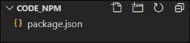
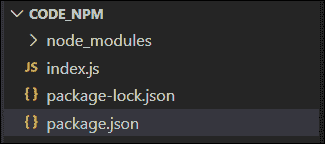
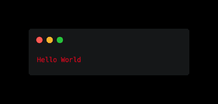

# NPM 入门

> 原文：<https://javascript.plainenglish.io/how-to-get-started-with-npm-node-package-manager-packages-dcb787445141?source=collection_archive---------12----------------------->



在这篇文章中，我们将讨论什么是 NPM(节点包管理器)以及我们如何在我们的项目中使用它。

这是我的[节点模块系列](https://hashnode.com/series/node-modules-ckgn9w1n001uuo9s11k8e5cq2)的第三部分

## NPM 概述:

那么到底什么是节点包管理器呢？
包是由包管理器管理的一段代码，包管理器就是管理包的安装和更新的软件。

NPM 根据官方[文件](https://docs.npmjs.com/):*NPM 是世界上最大的软件注册地。来自各大洲的开源开发者使用 npm 来共享和借用包，许多组织也使用 npm 来管理私有开发。”*

因此，在 NPM，我们通过导入到我们的项目中来使用别人由 NPM 管理的开源代码。

NPM 通常在下载时会附带 Node JS。您可以通过在命令提示符下运行命令`npm -v`来检查您的机器上是否安装了 npm。如果它返回一些版本号，这意味着 NPM 安装成功。

在 npmjs.com，NPM 有它的注册中心，在那里我们可以找到我们可以使用的软件包。

我们来看一个叫做 [chalk](https://www.npmjs.com/package/chalk) 的包，基本上是用来终端造型的。



*pic credit* [*npmjs.com*](http://npmjs.com/)

在上图中，我们可以看到该软件包的每周下载量，这表明它有多受欢迎。

此外，您可以在其中看到这个包的依赖关系。因此，这个模块将作为我们项目的依赖项，它本身依赖于其他模块。所以整个管理过程都由包管理器负责。甚至 GitHub 上的源代码也给了我们。我们可以导航到它，并验证是否存在任何未解决的问题。

在继续之前还有一件事，NPM 软件包有不同的版本。版本遵循的模式是语义版本化。
正如你所看到的，最新版本的[粉笔](https://www.npmjs.com/package/chalk)模块在我写文章的时候是 **4.1.0**

遵循语义版本化为`Major_changes` **。** `Minor_changes` **。**

`Major_changes`顾名思义，对模块所做的重大更改可能会影响您现有的代码。

是否添加了新的增强功能或特性以及缺陷修复，它们不会影响您现有的代码。

`Patch`是不会让你现有代码崩溃的小 bug 修复。

你可以在[semver.org](https://semver.org/)上了解更多关于语义版本控制的信息

## NPM 装置

现在要从 NPM 导入任何包，首先需要通过在命令提示符下运行命令来初始化本地项目文件夹中的 NPM

```
npm init
```

一旦您运行上面的命令，它将要求您提供一些数据，如下所示，例如包名、版本等等。

如圆括号 **()** 中所述，这些数据中的大部分可以保留为默认值。此外，像`author`和`license`这样的字段是为创建 NPM 包的人准备的。
另一方面，我们只是引进并使用它们来创建我们自己的应用程序。

```
package name: (code_npm) code_npm
version: (1.0.0) 1.0.0
description: npm demo
entry point: (index.js) index.js
test command: test
git repository:
keywords: npm test
author: Sarvesh
license: (ISC)
```

输入所有字段后，它将创建一个 JSON 文件，其中的值具有上述属性，并要求您确认

```
Is this OK? (yes) yes
```

一旦你确认了`yes`，它将创建一个`package.json`文件，包含你输入的所有数据，如下图所示。

```
{
  "name": "code_npm",
  "version": "1.0.0",
  "description": "npm demo",
  "main": "index.js",
  "scripts": {
    "test": "echo \"Error: no test specified\" && exit 1"
  },
  "keywords": [
    "npm",
    "test"
  ],
  "author": "Sarvesh",
  "license": "ISC"
}
```

此外，您可以观察到一个添加了`test`属性的`script`对象，您可以使用`npm test`命令运行它，它将返回期望的输出

```
"Error: no test specified"
```

现在，您可以简单地运行命令，而不是执行初始化 NPM 和输入自定义属性值的冗长方法

```
npm init -y
```

一旦你运行这个命令，它将直接用默认值创建一个`package.json`文件。



现在，要在您的项目中安装最新版本的 **chalk** 包，您需要执行命令。

```
npm install chalk
```

你也可以通过添加如下所示的`@version number`来安装你需要的任何特定版本的粉笔，你也可以简单地放置代表安装的简写`i`标志来代替`install`。

```
npm i chalk@4.0.0
```

这将安装两个东西，一个`node_modules`文件夹和一个`package-lock.json`文件。



此外，它将向我们的`package.json`文件添加一个名为`dependencies`的新属性，该文件包含已安装软件包的名称及其版本。

```
"dependencies": {
    "chalk": "^4.0.0"
  }
```

`node_module`文件夹包含 packages 文件夹及其依赖文件夹。当安装 npm 软件包时，它会进行修改。
`package-lock.json`包含使 NPM 更快更安全的代码。

```
"chalk": { 
"version": "4.0.0",
"resolved": "https://registry.npmjs.org/chalk/-/chalk-4.0.0.tgz", "integrity": "sha512-N9oWFcegS0sFr9oh1oz2d7Npos6vNoWW9HvtCg5N1KRFpUhaAhvTv5Y58g880fZaEYSNm3qDz8SU1UrGvp+n7A==",
"requires": {
        "ansi-styles": "^4.1.0", 
        "supports-color": "^7.1.0" 
          }
```

主要包含`version`等属性，即语义版本号。
`resolved`属性是获取包的目录或位置，在这里是从 [chalk](https://www.npmjs.com/package/chalk) 获取的。
`integrity`属性是为了保证，如果我们再次安装依赖项，我们会得到相同的代码。
`requires`对象属性表示`chalk`包的依赖性。

**注意** :-不要对这两个文件`node_modules`和`package-lock.json`进行任何修改或编辑

## NPM 用法

现在，一旦我们将 chalk 安装到我们的项目中，我们就可以使用`require()`方法将其导入到我们的根项目文件中，并将该模块存储在变量`chalk`中。

使用`chalk`包的`red()`方法，我们将“Hello World”文本颜色设置为红色。在运行命令`node index.js`时，我们得到以下输出



现在有很多方法可以使用 chalk 包来设计命令行输出，更多信息请参考 npm 上的 [Chalk 官方文档](https://www.npmjs.com/package/chalk)。

此外，您可以在我们的操作系统上全局安装 npm 包，而不是在您的本地项目中安装，方法是在命令行上添加代表全局的`-g`标志，如下所述

```
npm i nodemon -g
```

这个全局包不会以任何方式影响我们的`package.json`，因为它不是本地安装的。我们已经全局安装了`nodemon`包，用于在观察到目录中的文件发生变化时自动重启节点应用程序。更多信息请参考[节点监控](https://www.npmjs.com/package/nodemon)。

我们可以使用 nodemon 包，方法是使用

```
nodemon index.js
```

它的工作方式与`node index.js`类似，除了它会关注文件的变化，并且一旦检测到变化，它会重启应用程序。

```
[nodemon] 2.0.6
[nodemon] to restart at any time, enter `rs`
[nodemon] watching path(s): *.*
[nodemon] watching extensions: js,mjs,json
[nodemon] starting `node index.js`
Hello World
```

**注意**:当您使用`nodemon`时，`chalk`造型可能不起作用

最后，我们将穿过`dev dependencies`。有一些 NPM 包或模块在我们的项目生产环境中不需要，但只用于我们的开发需求。我们使用如下所示的`dev`标志在项目中安装这样的模块

```
npm i nodemon --save-dev
```

它在`package.json`创造了名为`devDependencies`的新地产

```
"devDependencies": {
    "nodemon": "^2.0.6"
  }
```

## 结论

*   NPM 是一个包经理，管理第三方开源代码，我们可以在我们的项目中使用。
*   在使用 NPM 模块之前，我们需要使用命令行上的`npm init`在项目文件夹的根目录下本地初始化 NPM。
*   使用命令`npm i <package name>`安装任何 NPM 软件包
*   我们可以使用`-g`标志全局安装 NPM 软件包
*   此外，可以使用`--save-dev`标志使包依赖于开发

*最初发布于*[*https://sarveshcadm . tech*](https://sarveshkadam.tech/npmnode-package-manager-packages)*。*