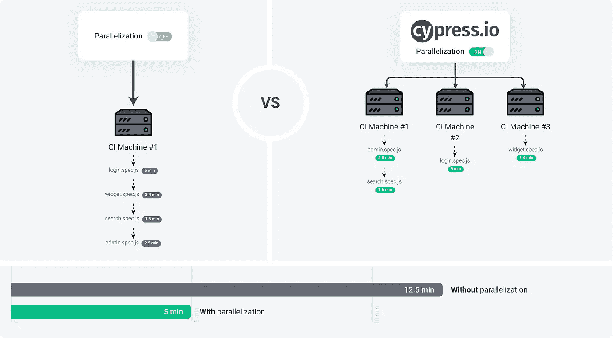
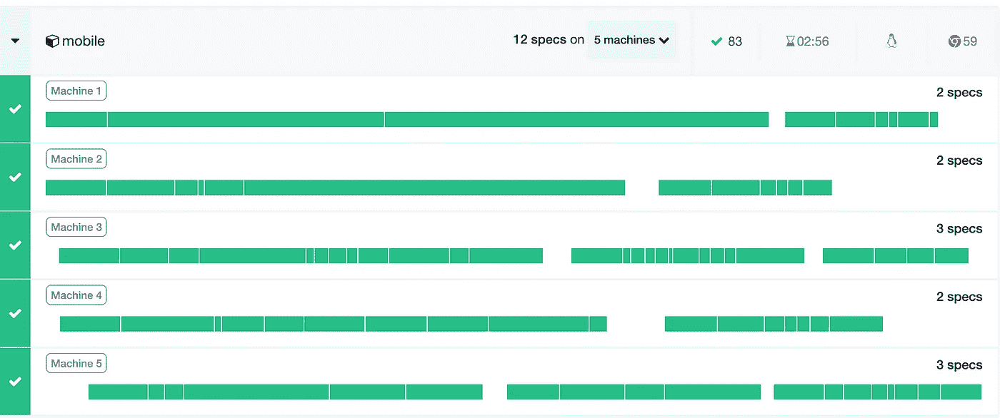
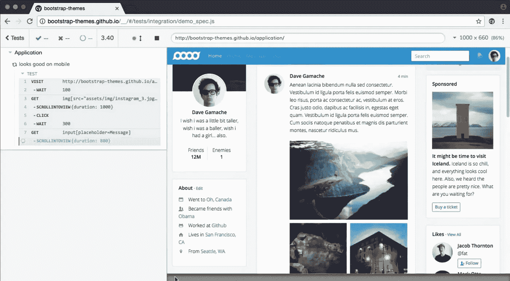

# 用 Cypress 改进 UI 测试自动化的 4 个技巧

> 原文：<https://javascript.plainenglish.io/how-to-get-the-best-of-ui-test-automation-using-cypress-and-ci-continuous-integration-f9c5f056b364?source=collection_archive---------1----------------------->

## UI 测试最佳实践

Image from Cypress website: [https://www.cypress.io](https://www.cypress.io/)

拥有用户界面测试自动化可以使开发团队非常高效，因为它可以更快地发现只有在集成、手动测试或者更糟的情况下，在生产中才会发现的问题/错误。然而，如果在创建和执行测试时忽略了一些实践，那么自动化会成为团队的额外负担，而不是支持它们。接下来是一些动作，比如标准选择器、并行化、弹性和分担责任，这些都有助于提高 UI 测试的性能和质量。

**1。为您的测试创建特定的选择器**

虽然有几种方法可以通过 UI 自动化获得元素，但最常用的是 xpath、ID 或 Class，它们都有相同的问题:它们在开发过程中经常被更改。假设一个测试正在使用名为#login 的 ID 对 login 按钮进行操作，但是有人将它的名称改为#loginID。测试将开始失败，因为#login 不再是 DOM 的一部分。如果对 DOM 的结构进行了修改，对 xpath 也是如此；如果前端开发人员决定重构一些类，对 Class 也是如此。

如何修复这个问题？定义一种类型的选择器，在整个团队中达成一致，该选择器将仅用于测试目的，因此不会因为不同的原因而改变。

哪个选择器？Cypress 有一个[最佳实践文档](https://docs.cypress.io/guides/references/best-practices.html#Selecting-Elements)，他们建议创建一个属性——类似 data-cy='login'。另一方面，csswizardry.com 在[的一篇文章](https://csswizardry.com/2011/09/writing-efficient-css-selectors/)中指出，通过属性获取元素是最低效的方式之一，更不用说编写'[data-cy=login]'的语法不是很友好，而且名称不应该耦合到您的框架中，因为您永远不知道什么时候会改变它。此外，通过 ID 获取元素仅限于一个元素——是的，如果有两个元素具有相同的 ID，那么只返回第一个元素。因此，使用类可能是最好的选择。它们将表示类似于' login-style test-login '的东西，并且可以只由'引用。测试登录'或'。测试登录表单。“测试登录”。如果选择器有可能被另一个客户端或工具使用，团队可以选择一个更通用的名称，避免直观的单词“test”。

**2。创建独立的弹性测试**

没有什么比为了让你的测试在一些失败后运行而不得不重置数据更令人沮丧和耗时的了，然而，为了最小化这些问题，你的测试应该能够自愈。

确保测试期间使用的实体(登录、数据、集成访问的用户)仅由自动化使用。开发人员不应该使用自动化所使用的相同的登录来执行开发测试。

保留一些测试所依赖的数据，并在语义上描述它们。例如:如果创建一个订单需要选择一个国家，那么最好已经定义了一些东西，比如“国家测试”。这将使您的订单测试完全独立于国家测试，并使管理并行化变得更容易(将进一步讨论)。

使用“beforeAll”步骤来安排测试环境。但是，如果可能的话，将它作为一个测试来使用，并使用条件来避免问题。与其调用 API 来删除所有国家，不如创建一个名为“cleanAll”的测试(it ),并使用 UI 来完成这项工作。例如:考虑国家测试用例，它很可能是一个 CRUD，你需要准备一些数据来执行它。创建一个 cleanAll 测试来删除所有不同于“国家/地区测试”的国家/地区，并测试“删除”功能，而无需为此添加额外的测试。此外，如果在 CRUD 过程中出现故障，并且没有创建国家，只需使用一个条件并跳过清理步骤的任何操作。这里的目标是避免使用 API 执行删除操作，因为它可以通过 UI 来完成，并且由于它已经通过 UI 完成，因此可以避免对删除操作进行另一次测试。还要注意，Cypress 为每个规范依次运行测试。

尽管建议每个测试(it)都是独立的，但由于一个简单的额外登录步骤可能会大大增加每个测试(it)的执行时间，因此最好将规范(describe)作为一个独立的源，在这种情况下，这意味着在 beforeAll 步骤中执行登录，并对同一规范下的其他测试使用身份验证。

**3。使用并行化来执行您的测试**

并行运行测试将是节省测试执行时间的最佳方法，但是这会增加测试的复杂性，因为它们将同时执行，并且可能操作相同的内容。

当谈到测试并行化时，它可能意味着同时在不同的浏览器、操作系统或客户端(移动、web)中执行，但在这种情况下，它意味着同时拥有您的规格。让我们想象一个 UI 测试项目，它包含 10 个规格，在 4 台机器上执行。由于规范是按执行时间排序的，所以每台机器都会从队列中取出一个规范，直到它们完成为止。

Image of Cypress dashboard with machines running specs in parallel

尽管大多数问题都可以通过上述主题的建议来避免，但让我们来看另一个案例:考虑两个测试规范 UserRegistration 和 UserUpdate，其中后者需要用户的信息，而前者不需要。规范同时执行的可能性很小，但是如果发生了，测试就会受到影响。在这种情况下，每个规范一个不同的用户登录可能是最好的解决方案。

关于资源，用于并行执行测试的机器数量与总的执行时间不成正比，换句话说，在 10 台机器上并行运行 10 个规范不会导致最快的测试执行。为什么不呢？它可能因不同的 CI/CD 工具而异，但是一台准备好运行测试的机器需要一个设置，并且它可能需要比您的最快规格更长的时间。Cypress 显示了基于机器数量的预测执行时间，但是建议将最长的测试作为一个基础来决定机器的数量将提供最佳的性能。例如:如果在这 10 个规格中，有 4 个需要大约 1-2 分钟来执行，而其他的不到 1 分钟，那么很可能 5 台机器就能完成这项工作。

**4。分担责任**

UI 自动化测试通常由一个专门的团队来管理，但是其他团队(解决方案的一部分)对他们的变更负责是很重要的，确保他们不会破坏测试。如果他们这样做了，他们应该从测试中得到一个反馈信息(或者访问以查看它)，这样他们就可以在传递代码之前修复它。

当涉及到代码更新后的测试语法错误时，第一个主题将有助于将其最小化，但重要的是确定责任的级别。例如:如果在表单中创建了一个新的强制字段，测试也可以被更新，但是如果在流程中创建了一个额外的步骤，并且它需要更复杂的更新，失败的测试可以被注释掉，并通知其他团队来处理它。因为测试是 CI 验证的一部分，并且在失败的情况下它可能会停止开发流程，所以这里的目标是减少修复测试的官僚作风，并降低生产力。

Cypress 提供了一个非常友好的仪表板，可以看到测试失败的地方，并且有日志描述导致错误的步骤/动作。访问它将有助于团队成员了解正在发生的事情，并最终采取正确的行动。这是一种“我知道我做错了什么，我愿意改正”的态度，而不是“这在我的电脑上行得通”。问题出在测试上。”

Image from Cypress website: [https://www.cypress.io](https://www.cypress.io/)

**结论**

可能有其他方法更适合其他团队，但是良好的沟通、预定义的标准、并行化和协作不仅可以帮助团队，还可以帮助公司通过 UI 测试自动化获得高质量的产品。因此，在可能的情况下，尝试:

*   有一个标准的选择器类型。
*   编写弹性测试并避免重复。
*   并行运行测试规格。
*   团队成员分担责任。

**词汇表**

描述→是测试如何在代码中分组。通常每个规格我都有一个。
它→是如何在代码中创建一个测试，它意味着一个测试单元。
Spec →就像一个测试套件。
UI →用户界面。

**资源**

[https://docs . cypress . io/guides/references/best-practices . html # Selecting-Elements](https://docs.cypress.io/guides/references/best-practices.html#Selecting-Elements)
[https://CSS wizardry . com/2011/09/writing-efficient-CSS-selectors/](https://csswizardry.com/2011/09/writing-efficient-css-selectors/)