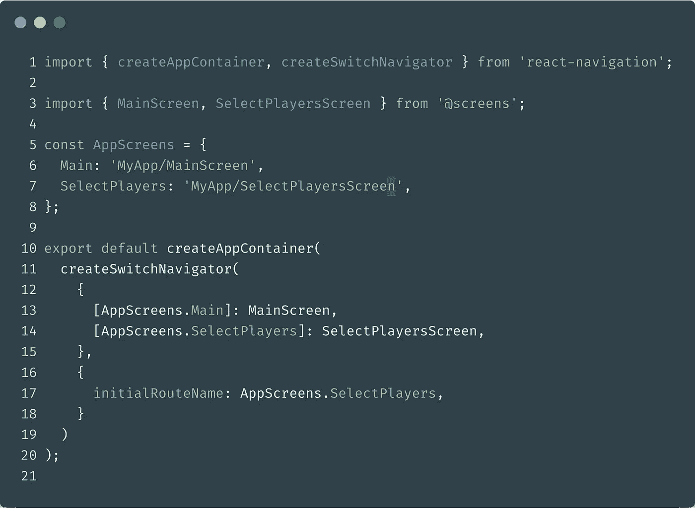

# 如何在 react-navigation 内获取 React 中的当前屏幕元数据？

> 原文：<https://javascript.plainenglish.io/how-to-get-the-current-screen-metadata-in-react-within-react-navigation-b9c18206e9c4?source=collection_archive---------2----------------------->

## 使用导航状态排除公共陷阱的小指南！


当将 [react-navigation](https://reactnavigation.org/) 与 [react-native](https://facebook.github.io/react-native/) 或[经典的基于网络的 react 应用](https://reactjs.org/)一起使用时，你可能有一天会问自己:

> 如何获取**当前路线**元数据，如路线名称？

这是一个非常常见的用例，但有时可能会有点棘手，很难找到如何处理它。

这就是为什么我与你分享这个小指南来克服你可能经历的大多数失败案例，在几个小时的挣扎后，我希望这个模式能帮助你不要重蹈我的覆辙。

# 👨🏻‍🔬让我们从一点理论开始

在我们的应用环境中，在`react-navigation`逻辑中，我们会遇到两种组件:

1.  导航组件的直接子组件，称为**屏幕组件**
2.  导航树的任何其他嵌套子节点，不是屏幕组件，我将调用**屏幕组件的嵌套子节点**。

**还有一个主要的缺陷，根据组件的上下文，你从道具中得到的导航状态是不一样的**

让我们一起来看看我们能做些什么来正确地获得当前的屏幕元数据。

## ➡️从屏幕组件获取当前屏幕元数据

> 屏幕组件是导航器的直接子组件。



**MainScreen** and **SelectPlayersScreen** are direct children of your SwitchNavigator.

这里很简单:只要你的屏幕是你的导航器的直接孩子，你只需要依赖来自`react-navigation-hooks`的`props.navigate.state`或`const navState = useNavigationState()`。

这将为你的屏幕提供你需要的元数据，比如 T4。

## ➡️从屏幕组件的嵌套子组件获取当前屏幕元数据

如果您需要值的组件不是直接导航子组件，无论是使用`withNavigation` HOC、`useNavigation`还是`useNavigationState`钩子，您都可能得到整个状态树，因为 react-navigation 将无法解析当前上下文。

**✋🏻⚠️警告:**你可以使用道具将屏幕组件的值传递给孩子，这是你应该考虑使用的首选方法。但是如果你不能，并且你在组件树中嵌套很深，你可以使用下面的代码片段加上一些传统的代码，这将帮助你处理这个问题。

> getActiveRouteMetadata 是一个小的实用函数，它将帮助您从完整的导航状态树对象中检索当前的屏幕元数据。

A small utility function to dig into the navigation state tree

就这样过了导航状态就好了！

```
import { useNavigationState } from "react-navigation-hooks";function MyNestedComponent(){
  const navState = useNavigationState();
  const myScreenMetadata = getActiveRouteMetadata(navState); return (
    // … your component JSX …
  )
}
```

# 🚛外卖/TLDR；📦

在 react-navigation 中:获取当前活动路线的元数据有两种方式，这将取决于您实际所处的环境:

*   **屏幕组件:**仅使用`props.navigation.state`或挂钩`useNavigationState`。
*   **Screen 组件的嵌套子组件:**使用`props.navigation.state`或钩子`useNavigationState`并将状态传递给上面定义的爬行函数。