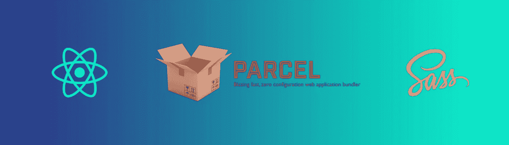
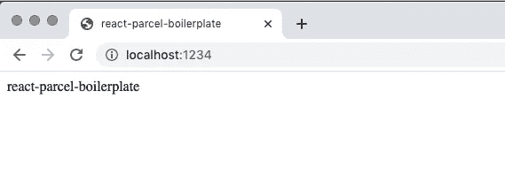

# 如何使用 React/Parcel 样板文件快速构建您的应用程序创意

> 原文：<https://javascript.plainenglish.io/how-to-get-your-app-ideas-built-quickly-using-a-boilerplate-of-react-parcel-5e91c4db3059?source=collection_archive---------5----------------------->



我经常发现自己在寻找快速构建一些东西来表达和构想一个愿景。作为工程师和开发人员，我们拥有的一个奢侈条件是，我们真的可以快速“创造”东西来分享我们的愿景、想法或产品。

我发现所有想法中有一点很重要，那就是趁热打铁。

我经常遇到的一个限制是在一开始就设置项目。我找到了一个我现在每次都在使用的样板文件，我想这是一个很好的机会向你们展示我是如何做到的，以及它有多简单。

我经常发现自己使用的框架由 [React](https://reactjs.org/) 、 [Parcel](https://parceljs.org/) 、&、Sass 组成，用于造型。它满足了我的大部分“web-app”风格的想法，我通常会考虑可扩展性，以便在一切“正常”的情况下让它增长。

这篇文章将使你能够为自己创建一个，或者至少有信心你知道它由什么组成，所以你不会害怕为自己复制它。

如果你对*“如何制作样板文件”不感兴趣，只想看看最终的结果，*前往我引用 Github repo 的帖子底部。

# 步骤 1:创建项目。

在为你的项目创建一个新文件夹后，打开你的终端并运行`npm init`，这有效地设置了你的项目来使用 [npm](https://www.npmjs.com/) 。它还会在您的目录中创建一个`package.json`文件，但更重要的是，它会让您访问[React](https://reactjs.org/)&[parcel . js](https://parceljs.org/)模块。

# 第二步:安装 Parcel.js。

`npm install parcel-bundler — save-dev`这有效地下载了运行 Parcel.js 所需的文件。它还将在您的`package.json`中添加依赖项

```
“devDependencies”: {
    “parcel-bundler”: “¹.12.4”
}
```

# 步骤 3:向 package.json 脚本添加任务。

您实际上想要将 2 个任务添加到您的`package.json` `scripts`中，以便稍后运行。

首先是`dev`任务，它将启动一个本地服务器供你开发。

其次，`build`任务会将您的项目编译到一个`dist`文件夹中，使您的文件可以部署。

```
“dev”: “parcel ./src/index.html”,
“build”: “parcel build ./src/index.html”
```

## 第四步:安装 React。

对于这一点，你可以选择运行`create-react-app`但是对于大多数项目来说，我总是认为我应该选择我想要为一个项目安装什么样的包，在这一点上，我只需要 2。

1.  `npm install react — save-dev`
2.  `npm install react-dom — save-dev`

如果你只是想复制/粘贴`npm install react react-dom — save-dev`，请随意。

你现在应该在你的`package.json`中看到下面的`devDependencies`

```
“devDependencies”: {
    “parcel-bundler”: “¹.12.4”,
    “react”: “¹⁶.13.1”,
    "react-dom”: “¹⁶.13.1”
}
```

## 第五步:做一些文件材料。

所以我个人喜欢把我的文件夹结构分成

```
~/src
~/src/components/
~/src/styles.scss
~/src/index.html
~/src/index.js
```

**文件内容如下…**

`~/src/index.html`包括的

```
<html>
    <head>
        <title>react-parcel-boilerplate</title>
        <link rel=”stylesheet” href=”./styles.scss” />
    </head>
    <body>
        <div id=”root”></div>
        <script src=”index.js”></script>
    </body>
</html>
```

`~/src/index.js`包括

```
import * as React from “react”;
import { render } from “react-dom”;const App = () => <>react-parcel-boilerplate</>;render(<App />, document.getElementById(“root”));
```

`~/src/index.js`有效地扮演你的`root`包含

```
import * as React from “react”;
import { render } from “react-dom”;const App = () => (
    <>
        react-parcel-boilerplate
    </>
);render(<App />, document.getElementById(“root”));
```

## 第六步:开始建造！

现在是时候在根目录下打开你的终端并输入`npm run dev`

这将返回如下内容

```
Server running at [http://localhost:1234](http://localhost:1234)
✨ Built in 2.39s.
```

浏览至`http://localhost:1234`将显示



从这一点上，你可以开始朝着你的愿景努力，要知道这是一个快速而简单的框架，具有真正的扩展潜力。

我希望你和我一样觉得这很有用，祝你好运，看到你的想法变成现实，而不用担心初始设置的麻烦。

如果你想获得或下载完整的样板文件，可以在 Github 这里找到[https://github.com/lindsayjopson/react-parcel-boilerplate](https://github.com/lindsayjopson/react-parcel-boilerplate)

***这也是我在我的中型帖子*** [***中使用的样板文件，介绍如何在 React 中构建一个家庭仪表盘，以及 Alexa***](https://medium.com/javascript-in-plain-english/how-to-build-a-home-dashboard-in-react-parcel-and-alexa-41f4eb2ebe5a) ***的包裹，所以如果你有兴趣了解这个样板文件如何扩展，请查看。***