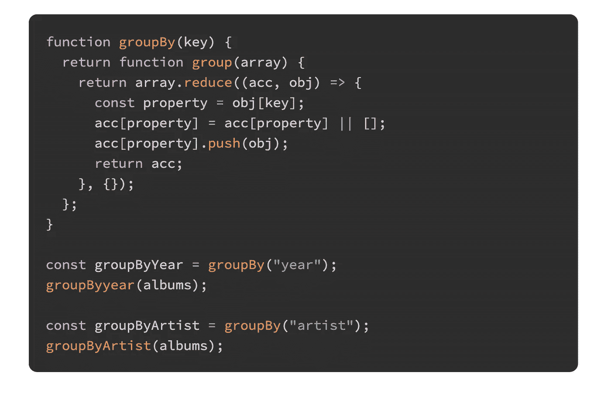

# 如何在 JavaScript 中对对象数组进行分组

> 原文：<https://javascript.plainenglish.io/how-to-group-an-array-of-objects-in-javascript-5d05c4a902b3?source=collection_archive---------1----------------------->

## 我们可以从头开始构建一个简单的解决方案来处理对象分组

这是我们开始使用的阵列:

我们现在要对这个数组进行分组。我们可以按艺术家或年份来做。

# 以下是我们想要的结果:

**按年分组**

**按艺人分组**

# 履行

# 说明

我们的`groupBy`函数是一个定制函数，它利用部分应用程序来帮助保持这个函数的可重用性。

`groupBy`函数将一个键(例如:“year”)作为其唯一的参数，并返回另一个函数`group`，该函数又接受我们想要排序的对象的数组。

在`group`函数中，我们使用一个空对象作为累加器来减少数组(因为这是我们想要的最终结果的形状)。

在 reduce 中，假设我们的键是“year”，这是我们的第一次迭代(这意味着 out acc 是一个没有任何键值对的空对象)。

***全披露*** *:我是在* [*JamieMason 的*](https://gist.github.com/JamieMason/0566f8412af9fe6a1d470aa1e089a752) *Github gist 上偶然看到这个解决方案的。*

*注:本帖最初写于* [*我的博客*](https://nikhilvijayan.com/group-array-objects-in-javascript) *。*