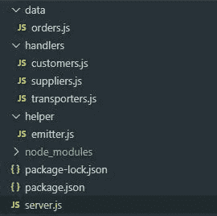

# 如何使用事件发射器处理 Node.js 中的一系列事务

> 原文：<https://javascript.plainenglish.io/how-to-handle-a-series-of-transactions-in-node-js-using-event-emitter-128cc7de24c2?source=collection_archive---------3----------------------->

## 你可以自己应用的实用指南


Picture from [Pexels](https://www.pexels.com/photo/grayscale-photo-of-computer-laptop-near-white-notebook-and-ceramic-mug-on-table-169573/)

# 1.什么是一系列交易？

我们经常处理一类涉及一组顺序执行的事务的事务。我们称之为一系列的交易。

下面以 ***网购*** 为例。当购物交易发生时，通常采取以下步骤:

1.  **将订单和详细信息保存到应用数据库**。数据库可以是任何类型，例如 *MySQL* 、 *PostgreSQL* 、 *MongoDB* 或其他。订单详细信息可能包括以下信息:*创建订单的客户、商品、订购数量和交货地址*。
2.  **通知客户订单确认**。应用程序向客户发送订单确认，例如通过电子邮件。
3.  **向第三方运输商预订交货单。**应用程序向第三方运输商预订交货单，以安排将订单运送到客户的地址。
4.  **等等等等。**

根据业务需求，我们可能会有更多的后续交易列表。但是现在，让我们假设这三个步骤是我们网上购物过程中需要的所有步骤。现在，让我们进入下一节，看看 Node.js 的情况如何。

# 2.Node.js 中的实现(传统方法)

我们从使用 Node.js 处理在线购物案例的传统方法开始。

首先，为我们的 Node.js API 服务器创建一个空文件夹`api`，并在这里克隆源代码。请注意，代码是骨架格式。这将使它们保持简单，因为您以后可能想要修改它们。应用程序结构如下:



Application structure

1.  `data`文件夹包含`order.js`文件，我们在其中定义客户订单的 JSON 结构。
2.  `helper`文件夹包含我们在`emitter.js`文件中定义的事件发射器。**注意:**由于我们是用传统方法开发的，我们可以暂时忽略这个库。我们将在下一节稍后使用它。
3.  `handlers`文件夹是我们为其他事务创建处理库的地方。到目前为止，我们有三个负责人:

*   `customers.js`:通知客户的处理程序。
*   `transporters.js`:登记发货单的处理程序。
*   `suppliers.js`:在物品库存水平低的情况下订购物品的处理程序。

在`api`文件夹中，使用**命令提示符**或**终端**键入以下内容:

```
npm install
```

它会将所有需要的依赖项安装到`node_modules`文件夹中。

现在，让我们来看看`server.js`，其中我们定义了一个名为`createorderwithoutevent`的 API 函数

File: server.js

如果我们看看上面的`createorderwithoutevent`函数，我们会注意到，在该函数将订单保存到数据库中之后，它调用了另外两个后续事务:

1.  `customers.notifyCustomer`:发送`./handlers/customers.js`中定义的订单确认邮件的功能。
2.  `transpoters.bookForDelivery`:向`./handlers/transporters.js`中定义的第三方运输商登记交货订单的功能。

让我们假设这两个事务连接到外部 API 服务。一般这是我们在处理一系列交易时习惯采用的方式。这没有错。

但是，如果业务需求发生变化，要求我们在订单流程之后再进行一次交易，该怎么办呢？假设卖方不维护其库存，因此当客户订单到达时，他需要向供应商创建采购申请。因此，我们需要创建一个新函数——`suppliers.requestForStock`——，并将其放入`createorderwithoutevent`函数中，如下所示:

```
app.post('/createorderwithoutevent', function(req,res){
   const { trxorder } = req.body;

   *//a new order is saved to any database e.g: mySQL, mongodb, etc.*
   orders.push(trxorder);
   console.log(JSON.stringify(orders));

   *//these are subsequent transactions following the order saving*
   customers.notifyCustomer(trxorder.orderid);
   **suppliers.requestForStock(trxorder.orderid);**
   transporters.bookForDelivery(trxorder.orderid);

   *//order transaction is successfully processed*
   return res.status(200).json({"message" : "ok"});
});
```

如果我们在代码中有其他功能，而业务的变化告诉我们也要将`requestForStock`应用于这些功能，该怎么办？因此，我们需要逐个修改函数。**在一定程度上，当受影响的函数数量很多时，情况会变得更加复杂。**我们将在下一节使用事件发射器学习更好的方法。

# 3.处理一系列事务的事件发射器

`eventEmitter`是 Node.js 中的一个模块，实现 Node.js 中对象之间的交互，其工作原理如下:

1.  首先，我们定义一个`eventEmitter`对象。
2.  接下来，我们将监听器函数注册到由`eventEmitter`对象定义的命名事件中。
3.  最后，`eventEmitter`对象发出命名事件，这些事件导致注册的侦听器被执行。

关于 Node.js 的`eventEmitter`更多细节在[这里](https://nodejs.org/api/events.html#events_class_eventemitter)。

现在，让我们回到我们的网购案例。要使用`eventEmitter`，我们需要在一个名为*助手*的新文件夹中创建一个新的助手文件——`emitter.js`。

File: emitter.js

在`emitter.js`中，我们注册了所有命名的事件和当命名的事件发生时应该运行的所有监听器函数。让我们看看上面的代码。每次创建订单— `order_created`，我们都会*通知客户，从供应商处购买一些库存物品，并预订交付给运输商*。这些活动是通过向`order_created`事件注册监听器函数`customers.notifyCustomer`、`suppliers.requestForStock`和`transporters.bookForDelivery`来完成的。

最后，让我们修改`server.js`并创建一个名为`createorderwithevent`的新函数来修补我们之前的函数`createorderwithoutevent`，如下所示:

```
const express = require('express');
const app = express();
const bodyParser = require('body-parser');*//declare our emitter object* **const emitter = require('./helper/emitter');**
const orders = require('./data/orders');
const customers = require('./handlers/customers');
const suppliers = require('./handlers/suppliers');
const transporters = require('./handlers/transporters');app.use(bodyParser.json());.....*//same as previous*.....app.post(**'/createorderwithevent'**, function(req,res){
   const { trxorder } = req.body;*//a new order is saved to any database e.g: mySQL, mongodb etc.* orders.push(trxorder);
   console.log(JSON.stringify(orders));

   **emitter.emit('order_created', trxorder.orderid);**
   return res.status(200).json({"message" : "ok"});
})
```

正如您所注意到的，新函数`createorderwithevent`比我们的`createorderwithoutevent`函数干净多了。当订单被创建时，我们只需要发出`order_created`事件。自动执行`emitter.js`中注册的所有监听器功能。

我们新方法最好的一点是，当业务需求动态变化时，我们不需要担心。每当有变化时，**我们只需要在一个地方注册/注销监听器函数，这个地方就是`emitter.js`文件中的**。代码现在更加结构化，当我们有许多系列的交易时，这将减少错误。

请注意`eventEmitter`按照注册的顺序同步调用所有监听器。因此，请确保您按照正确的顺序放置侦听器函数。

# 结论

现在我们已经了解到`eventEmitter`在我们处理一系列事务时特别有用。我们可以跟上业务需求的任何变化，同时轻松地维护我们的代码。