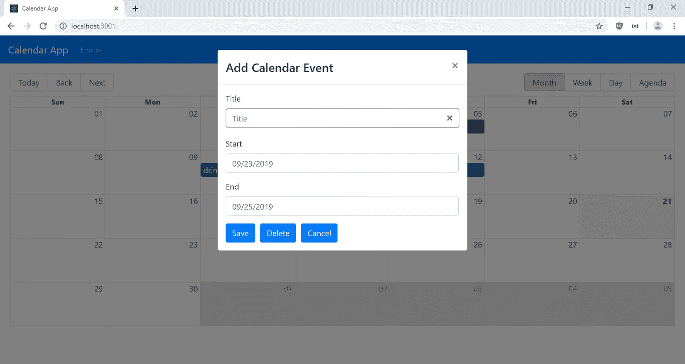
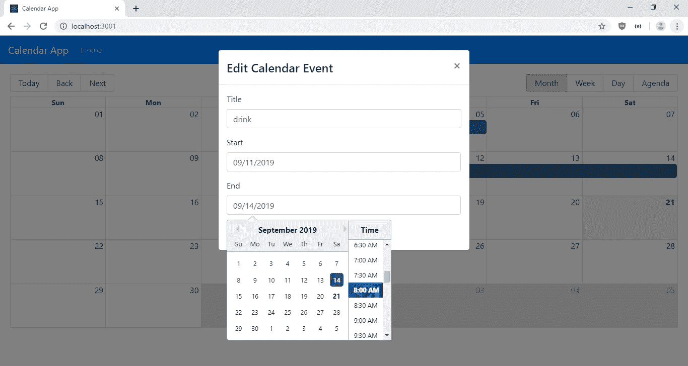
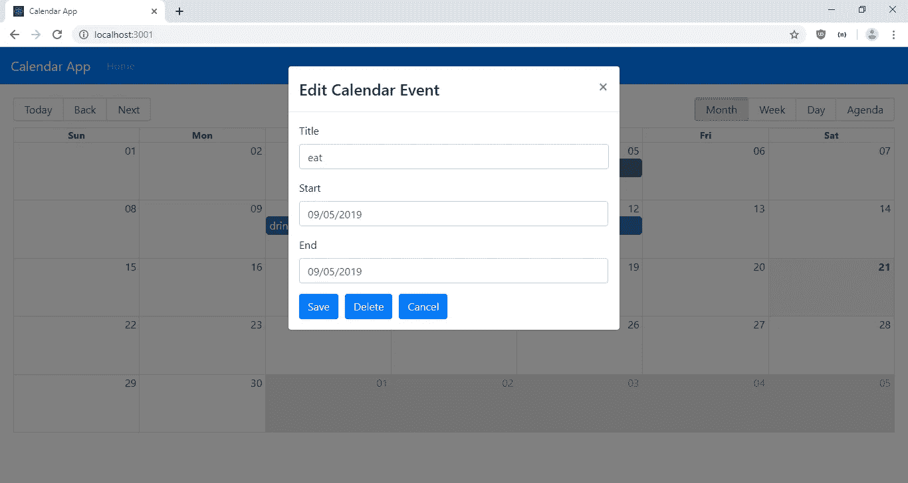

# 如何处理 React 中输入值的变化

> 原文：<https://javascript.plainenglish.io/how-to-handle-input-value-changes-in-react-1835754b7cc4?source=collection_archive---------2----------------------->

**现在在**[**http://jauyeung.net/subscribe/**](http://jauyeung.net/subscribe/)**订阅我的邮件列表。**

**在推特上关注我**[**https://twitter.com/AuMayeung**](https://twitter.com/AuMayeung)

React 的一个特殊特性是您必须自己处理输入值的更改。否则，用户无法看到他们输入的内容，因为状态中没有设置该值。

要更新输入值并将其设置为组件的状态，首先我们必须添加:

```
const [title, setTitle] = React.useState("");
```

创建函数`setTitle`来设置`title`的值。

然后，我们添加了一个处理函数来从输入中获取值并设置它:

```
const handleTitleChange = ev => setTitle(ev.target.value);
```

`ev.target.value`有输入值。

然后当我们添加输入时，我们必须像这样添加:

```
<input
 type="text"
 name="title"
 placeholder="Title"
 value={title || ""}
 onChange={handleTitleChange}
 isInvalid={!title}
/>
```

我们将`handleTitleChange`函数传递给`onChange`道具，这样`title`就会被设置。然后一旦它被设置，那么`value` prop 将被填充，用户将能够看到他们输入的值。

在本文中，我们将制作一个简单的日历应用程序，用户可以在其中拖动日期范围并添加日历条目。用户还可以点击现有的日历条目并编辑该条目。也可以删除现有条目。用于添加和编辑日历条目的表单将有一个日期和时间选择器来选择日期和时间。

React 有许多日历小部件，我们可以添加到我们的应用程序中。其中之一是反应大日历。它有很多特点。它有一个月，一周，和每日日历。此外，您可以通过“后退”和“前进”按钮轻松导航到今天或任何其他日期。您也可以拖过日历中的日期范围来选择日期范围。有了它，你可以对日期做任何你想做的操作。

我们将把后端的数据保存在一个 JSON 文件中。

我们将使用 React 来构建我们的应用程序。首先，我们运行:

```
npx create-react-app calendar-app
```

创建项目。

接下来，我们必须安装几个软件包。我们将使用 Axios 处理对后端的 HTTP 请求，使用 Bootstrap 处理样式，使用 MobX 处理简单的状态管理，使用 React Big Calendar 处理日历组件，使用 React Datepicker 处理表单中的日期和时间选择器，使用 React Router 处理路由。

要安装它们，我们运行:

```
npm i axios bootstrap mobx mobx-react moment react-big-calendar react-bootstrap react-datepicker react-router-dom
```

安装好所有的包后，我们就可以开始写代码了。首先，我们用以下代码替换`App.js`中的现有代码:

```
import React from "react";
import { Router, Route } from "react-router-dom";
import HomePage from "./HomePage";
import { createBrowserHistory as createHistory } from "history";
import Navbar from "react-bootstrap/Navbar";
import Nav from "react-bootstrap/Nav";
import "./App.css";
import "react-big-calendar/lib/css/react-big-calendar.css";
import "react-datepicker/dist/react-datepicker.css";
const history = createHistory();function App({ calendarStore }) {
  return (
    <div>
      <Router history={history}>
        <Navbar bg="primary" expand="lg" variant="dark">
          <Navbar.Brand href="#home">Calendar App</Navbar.Brand>
          <Navbar.Toggle aria-controls="basic-navbar-nav" />
          <Navbar.Collapse id="basic-navbar-nav">
            <Nav className="mr-auto">
              <Nav.Link href="/">Home</Nav.Link>
            </Nav>
          </Navbar.Collapse>
        </Navbar>
        <Route
          path="/"
          exact
          component={props => (
            <HomePage {...props} calendarStore={calendarStore} />
          )}
        />
      </Router>
    </div>
  );
}export default App;
```

我们在这里添加了 React Bootstrap 顶部栏，并带有一个到主页的链接。此外，我们在这里添加了主页的路由，并传入了 MobX `calendarStore`。

此外，我们在这里导入日期选择器和日历的样式，这样我们就可以在整个应用程序中使用它们。

接下来在`App.css`中，将现有代码替换为:

```
.page {
  padding: 20px;
}.form-control.react-datepicker-ignore-onclickoutside,
.react-datepicker-wrapper {
  width: 465px !important;
}.react-datepicker__current-month,
.react-datepicker-time__header,
.react-datepicker-year-header,
.react-datepicker__day-name,
.react-datepicker__day,
[class^="react-datepicker__day--*"],
.react-datepicker__time-list-item {
  font-family: -apple-system, BlinkMacSystemFont, "Segoe UI", "Roboto", "Oxygen", "Ubuntu", "Cantarell", "Fira Sans",
    "Droid Sans", "Helvetica Neue", sans-serif;
}
```

要为页面添加一些填充，请更改日期选择器输入的宽度并更改日期选择器的字体。

接下来，在`src`文件夹中创建一个名为`CalendarForm.js`的文件，并添加:

```
import React from "react";
import Form from "react-bootstrap/Form";
import Col from "react-bootstrap/Col";
import DatePicker from "react-datepicker";
import Button from "react-bootstrap/Button";
import {
  addCalendar,
  editCalendar,
  getCalendar,
  deleteCalendar
} from "./requests";
import { observer } from "mobx-react";const buttonStyle = { marginRight: 10 };function CalendarForm({ calendarStore, calendarEvent, onCancel, edit }) {
  const [start, setStart] = React.useState(null);
  const [end, setEnd] = React.useState(null);
  const [title, setTitle] = React.useState("");
  const [id, setId] = React.useState(null);React.useEffect(() => {
    setTitle(calendarEvent.title);
    setStart(calendarEvent.start);
    setEnd(calendarEvent.end);
    setId(calendarEvent.id);
  }, [
    calendarEvent.title,
    calendarEvent.start,
    calendarEvent.end,
    calendarEvent.id
  ]);const handleSubmit = async ev => {
    ev.preventDefault();
    if (!title || !start || !end) {
      return;
    }if (+start > +end) {
      alert("Start date must be earlier than end date");
      return;
    }
    const data = { id, title, start, end };
    if (!edit) {
      await addCalendar(data);
    } else {
      await editCalendar(data);
    }
    const response = await getCalendar();
    const evs = response.data.map(d => {
      return {
        ...d,
        start: new Date(d.start),
        end: new Date(d.end)
      };
    });
    calendarStore.setCalendarEvents(evs);
    onCancel();
  };
  const handleStartChange = date => setStart(date);
  const handleEndChange = date => setEnd(date);
  const handleTitleChange = ev => setTitle(ev.target.value);const deleteCalendarEvent = async () => {
    await deleteCalendar(calendarEvent.id);
    const response = await getCalendar();
    const evs = response.data.map(d => {
      return {
        ...d,
        start: new Date(d.start),
        end: new Date(d.end)
      };
    });
    calendarStore.setCalendarEvents(evs);
    onCancel();
  };return (
    <Form noValidate onSubmit={handleSubmit}>
      <Form.Row>
        <Form.Group as={Col} md="12" controlId="title">
          <Form.Label>Title</Form.Label>
          <Form.Control
            type="text"
            name="title"
            placeholder="Title"
            value={title || ""}
            onChange={handleTitleChange}
            isInvalid={!title}
          />
          <Form.Control.Feedback type="invalid">{!title}</Form.Control.Feedback>
        </Form.Group>
      </Form.Row><Form.Row>
        <Form.Group as={Col} md="12" controlId="start">
          <Form.Label>Start</Form.Label>
          <br />
          <DatePicker
            showTimeSelect
            className="form-control"
            selected={start}
            onChange={handleStartChange}
          />
        </Form.Group>
      </Form.Row><Form.Row>
        <Form.Group as={Col} md="12" controlId="end">
          <Form.Label>End</Form.Label>
          <br />
          <DatePicker
            showTimeSelect
            className="form-control"
            selected={end}
            onChange={handleEndChange}
          />
        </Form.Group>
      </Form.Row>
      <Button type="submit" style={buttonStyle}>
        Save
      </Button>
      <Button type="button" style={buttonStyle} onClick={deleteCalendarEvent}>
        Delete
      </Button>
      <Button type="button" onClick={onCancel}>
        Cancel
      </Button>
    </Form>
  );
}export default observer(CalendarForm);
```

这是用于添加和编辑日历条目的表单。我们在这里通过添加`Form`组件来添加反应引导表单。`Form.Control`也来自同一个图书馆。我们将其用于`title`文本输入。

其他 2 个字段是开始和结束日期。我们在这里使用反应日期选择器让用户选择日历条目的开始和结束日期。此外，我们启用时间选择器让用户选择时间。

每个字段都有更改处理程序来更新状态中的值，以便用户可以看到他们输入的内容，并在以后提交数据。变更处理程序为`handleStartChange`、`handleEndChange`和`handleTitleChange`。我们用`useState`钩子生成的设置函数来设置状态。

我们使用`useEffect`回调将`calendarEvent`中的字段设置为状态。我们在`useEffect`函数的第二个参数中把所有我们想设置的字段传递给数组，这样只要`calendarEvent` prop 的最新值传入，状态就会被更新。

在`handleSubmit`功能中，点击表单保存按钮时调用。我们必须调用`ev.preventDefault`以便使用 Ajax 提交表单数据。

如果数据验证通过，我们将提交数据并获取最新数据，并将它们存储在我们的`calendarStore` MobX 存储中。

我们将`observer`包裹在`CalendarForm`组件之外，这样我们总是可以从`calendarStore`获得最新的值。

接下来，我们创建我们的主页。在`src`文件夹中创建`HomePage.js`文件并添加:

```
import React from "react";
import { Calendar, momentLocalizer } from "react-big-calendar";
import moment from "moment";
import Modal from "react-bootstrap/Modal";
import CalendarForm from "./CalendarForm";
import { observer } from "mobx-react";
import { getCalendar } from "./requests";const localizer = momentLocalizer(moment);function HomePage({ calendarStore }) {
  const [showAddModal, setShowAddModal] = React.useState(false);
  const [showEditModal, setShowEditModal] = React.useState(false);
  const [calendarEvent, setCalendarEvent] = React.useState({});
  const [initialized, setInitialized] = React.useState(false);const hideModals = () => {
    setShowAddModal(false);
    setShowEditModal(false);
  };const getCalendarEvents = async () => {
    const response = await getCalendar();
    const evs = response.data.map(d => {
      return {
        ...d,
        start: new Date(d.start),
        end: new Date(d.end)
      };
    });
    calendarStore.setCalendarEvents(evs);
    setInitialized(true);
  };const handleSelect = (event, e) => {
    const { start, end } = event;
    const data = { title: "", start, end, allDay: false };
    setShowAddModal(true);
    setShowEditModal(false);
    setCalendarEvent(data);
  };const handleSelectEvent = (event, e) => {
    setShowAddModal(false);
    setShowEditModal(true);
    let { id, title, start, end, allDay } = event;
    start = new Date(start);
    end = new Date(end);
    const data = { id, title, start, end, allDay };
    setCalendarEvent(data);
  };React.useEffect(() => {
    if (!initialized) {
      getCalendarEvents();
    }
  });return (
    <div className="page">
      <Modal show={showAddModal} onHide={hideModals}>
        <Modal.Header closeButton>
          <Modal.Title>Add Calendar Event</Modal.Title>
        </Modal.Header><Modal.Body>
          <CalendarForm
            calendarStore={calendarStore}
            calendarEvent={calendarEvent}
            onCancel={hideModals.bind(this)}
            edit={false}
          />
        </Modal.Body>
      </Modal><Modal show={showEditModal} onHide={hideModals}>
        <Modal.Header closeButton>
          <Modal.Title>Edit Calendar Event</Modal.Title>
        </Modal.Header><Modal.Body>
          <CalendarForm
            calendarStore={calendarStore}
            calendarEvent={calendarEvent}
            onCancel={hideModals.bind(this)}
            edit={true}
          />
        </Modal.Body>
      </Modal>
      <Calendar
        localizer={localizer}
        events={calendarStore.calendarEvents}
        startAccessor="start"
        endAccessor="end"
        selectable={true}
        style={{ height: "70vh" }}
        onSelectSlot={handleSelect}
        onSelectEvent={handleSelectEvent}
      />
    </div>
  );
}export default observer(HomePage);
```

我们获取日历条目，并在这里的日历中填充它们。从后端检索条目，然后保存到存储中。在`useEffect`回调中，我们设置在页面加载时获取项目。我们只在`initialized`为假时才这样做，所以我们不会在每次页面渲染时都重新加载数据。

为了打开添加日历条目的模式，我们用处理程序设置了`onSelectSlot`属性，这样我们就可以调用`setShowAddModal`和`setCalendarEvent`来设置打开模式，并在打开添加日历事件模式之前设置日期。

类似地，我们用`handleSelectEvent`处理函数设置`onSelectEvent`模态，以便打开编辑模态并设置现有条目的日历事件数据。

每个模态内部都有`CalendarForm`组件。我们将关闭模态的函数传入表单，这样我们就可以从表单中关闭它们。此外，我们传入`calendarStore`和`calendarEvent`，以便它们可以在`CalendarForm`中被操纵。

我们将`observer`包装在`CalendarForm`组件之外，这样我们总是从`calendarStore`获得最新的值。

接下来在`index.js`中，我们将现有代码替换为:

```
import React from "react";
import ReactDOM from "react-dom";
import "./index.css";
import App from "./App";
import * as serviceWorker from "./serviceWorker";
import { CalendarStore } from "./store";
const calendarStore = new CalendarStore();ReactDOM.render(
  <App calendarStore={calendarStore} />,
  document.getElementById("root")
);// If you want your app to work offline and load faster, you can change
// unregister() to register() below. Note this comes with some pitfalls.
// Learn more about service workers: [https://bit.ly/CRA-PWA](https://bit.ly/CRA-PWA)
serviceWorker.unregister();
```

这样我们就可以将 MobX `calendarStore`传入根`App`组件。

接下来，在`src`文件夹中创建一个`requests.js`文件，并添加:

```
const APIURL = "[http://localhost:3000](http://localhost:3000)";
const axios = require("axios");export const getCalendar = () => axios.get(`${APIURL}/calendar`);export const addCalendar = data => axios.post(`${APIURL}/calendar`, data);export const editCalendar = data =>
  axios.put(`${APIURL}/calendar/${data.id}`, data);export const deleteCalendar = id => axios.delete(`${APIURL}/calendar/${id}`);
```

这些是进行 HTTP 调用来操作日历条目的函数。

接下来，在`src`文件夹中创建`store.js`并添加:

```
import { observable, action, decorate } from "mobx";class CalendarStore {
  calendarEvents = [];setCalendarEvents(calendarEvents) {
    this.calendarEvents = calendarEvents;
  }
}CalendarStore = decorate(CalendarStore, {
  calendarEvents: observable,
  setCalendarEvents: action
});export { CalendarStore };
```

保存商店中的商品，供我们的所有组件访问。

接下来在`index.html`中，将现有代码替换为:

```
<!DOCTYPE html>
<html lang="en">
  <head>
    <meta charset="utf-8" />
    <link rel="shortcut icon" href="%PUBLIC_URL%/favicon.ico" />
    <meta name="viewport" content="width=device-width, initial-scale=1" />
    <meta name="theme-color" content="#000000" />
    <meta
      name="description"
      content="Web site created using create-react-app"
    />
    <link rel="apple-touch-icon" href="logo192.png" />
    <!--
      manifest.json provides metadata used when your web app is installed on a
      user's mobile device or desktop. See [https://developers.google.com/web/fundamentals/web-app-manifest/](https://developers.google.com/web/fundamentals/web-app-manifest/)
    -->
    <link rel="manifest" href="%PUBLIC_URL%/manifest.json" />
    <!--
      Notice the use of %PUBLIC_URL% in the tags above.
      It will be replaced with the URL of the `public` folder during the build.
      Only files inside the `public` folder can be referenced from the HTML.Unlike "/favicon.ico" or "favicon.ico", "%PUBLIC_URL%/favicon.ico" will
      work correctly both with client-side routing and a non-root public URL.
      Learn how to configure a non-root public URL by running `npm run build`.
    -->
    <title>Calendar App</title>
    <link
      rel="stylesheet"
      href="[https://maxcdn.bootstrapcdn.com/bootstrap/4.3.1/css/bootstrap.min.css](https://maxcdn.bootstrapcdn.com/bootstrap/4.3.1/css/bootstrap.min.css)"
      integrity="sha384-ggOyR0iXCbMQv3Xipma34MD+dH/1fQ784/j6cY/iJTQUOhcWr7x9JvoRxT2MZw1T"
      crossorigin="anonymous"
    />
  </head>
  <body>
    <noscript>You need to enable JavaScript to run this app.</noscript>
    <div id="root"></div>
    <!--
      This HTML file is a template.
      If you open it directly in the browser, you will see an empty page.You can add webfonts, meta tags, or analytics to this file.
      The build step will place the bundled scripts into the <body> tag.To begin the development, run `npm start` or `yarn start`.
      To create a production bundle, use `npm run build` or `yarn build`.
    -->
  </body>
</html>
```

添加引导 CSS 并重命名标题。

现在所有的艰苦工作都完成了。我们所要做的就是使用位于 https://github.com/typicode/json-server 的 JSON 服务器 NPM 包作为我们的后端。

通过运行以下命令进行安装:

```
npm i -g json-server
```

然后通过运行以下命令来运行它:

```
json-server --watch db.json
```

在`db.json`中，将现有内容替换为:

```
{
  "calendar": []
}
```

接下来，我们通过在应用程序的项目文件夹中运行`npm start`来运行应用程序，当程序要求您在不同的端口中运行时，选择 yes。

之后，您应该会看到:

