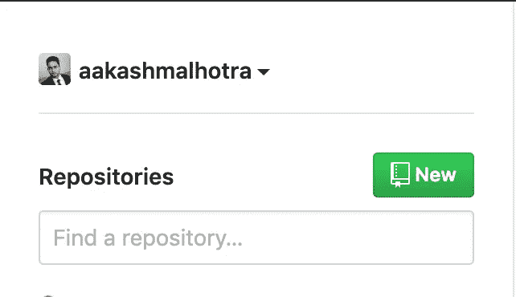
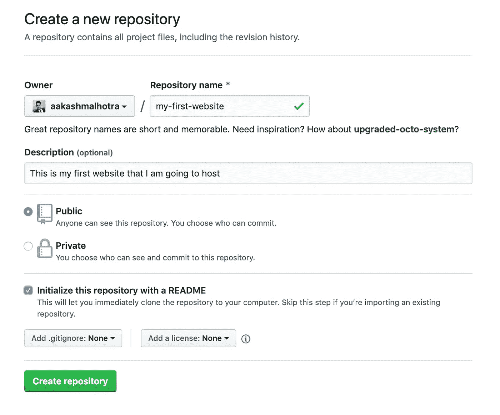
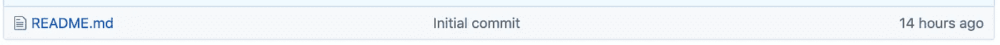
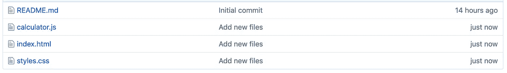

# 如何免费托管一个静态网站

> 原文：<https://javascript.plainenglish.io/how-to-host-a-static-website-for-free-7a2a959f5e4?source=collection_archive---------0----------------------->

## 所以你一直在学习 HTML、CSS，也许还学了一点 JS，但是你仍然不知道如何把这些项目从你的电脑里拿出来放到互联网上。

# 这篇博文会给你一直在寻找的答案。

我们将学习如何在 5 分钟内托管我们的网站，而且是免费的。至少在这篇文章中，我会让你们远离可怕的黑暗终端。我们也会考虑其他可行的方案。

注意:这篇文章将指导你只托管你网站的前端。

在这个阶段，一个过于简单但很好的知识就是知道什么是静态网站。简单来说，只有前端没有后端(没有数据库)的网站也称为静态网站。

# 可用选项

有数百万和数万亿(可能有点夸张)的选择来托管你的网站。我们将尽量只关注最重要的问题。

**剧透:我们将使用 Github 页面**

## **AWS S3:**

亚马逊网络服务有一项名为简单存储服务的服务，也称为 S3，用于存储图像和视频等静态内容，但同样的服务也可以用于托管静态网站。AWS 为新账户提供一些免费服务，有效期为一整年。你可以点击查看更多相关信息[。
**需要的信用卡:**是
**费用:** 0(第一年)
**个性化域名:**可能
**优点:** AWS 是行业相关，好用，资源很多。](https://aws.amazon.com/free/)

## GitHub 页面:

GitHub Pages 是 GitHub 提供的一项免费服务，用于托管静态网站。可能你已经知道一点 Git 和 GitHub，或者它已经在你的列表上了(如果没有，现在是更新你的列表的好时机😉).大多数开源网站都将其文档放在 GitHub 页面上。

此外，由于目标受众是初露头角的 web 开发人员，在 GitHub 上展示你的作品对你来说总是一个好主意。如果你在 GitHub 上维护你的代码，使用 GitHub 页面甚至可能不到 2 分钟(严肃脸)。在你的网站上部署新的变化也很容易。

作为一名招聘人员，我总是发现很难下载和建立一个受访者的 GitHub 项目，所以添加一个托管域的链接可能会增加你的项目被招聘人员审查的机会。
**需要信用卡:**不需要
**费用:** 0(永久)
**个性化域名:**可能
**优点:** GitHub 对于一个 dev 来说是不可避免的，易于使用，易于部署的新变化。

# 但是等等，为什么我们不涵盖更多的选择呢？

因为我们不需要😆。

这是市场上最可靠、最受欢迎的选择之一。然而，如果你想让我比较任何其他选项，请在评论中告诉我。

# 先决条件

-一个 GitHub 帐户和一个要托管的项目。
-有些兴奋(可选😆).

如果你没有现成的项目，你可以在 GitHub 上下载我在本教程[中使用的项目。(欢迎在 GitHub 上关注我的下一次编码冒险)](https://github.com/aakashmalhotra/js-tip-calculator)

# 实际托管

在我们实际托管网站之前，有几件事你应该确定。
-你的主 HTML 文件应该叫做 index.html *-*其他文件的路径(如果有)应该是相对路径。

# **步骤 1:创建一个新的存储库**

登录并点击仪表板左上方的 ***新建*** 来创建一个新的存储库。

New button to create a new repo

Create a repository form

存储库可以是公共的，也可以是私有的。另外，不要忘记检查 ***用 README*** 选项初始化这个库。

一旦创建了存储库，您的回购应该如下所示:

Files in your new repo

# **第二步:上传你的项目**

Buttons group on the project page

在您的项目中，您会看到一个如上的栏。

点击 ***上传文件*** ，上传你所有的项目文件。

在 ***提交更改*** 中，你可以放入任何你想要的消息。

上传文件后，GitHub repo 应该是这样的:

注意:如果你是学生，你可以从 GitHub 免费获得很多额外的好东西。你可以在[学生开发包中了解更多信息。](https://education.github.com/pack)

# 第三步:让它活起来

*   进入回购右上角的 ***设置***
*   向下滚动到第 ***节 GitHub 页面***
*   在 ***源*** 下拉菜单中选择 ***主***

瞧啊。你的网站上线了🎉

# **第四步:看你发布的网站**

现在，在你看到你的改变之前，你需要知道你的 GitHub 用户名是什么。如果你去你的仓库，你的回购协议名称应该是这样的。

Identify your username

斜线前的部分(带下划线的文本)是您的用户名。

好了，是时候访问你的托管网站了。在您的浏览器中进入:
{ {***your username***} } . github . io/{ {***your reponame***} }

例如，在我的情况下，它会:
aakashmalhotra.github.io/my-first-website

瞧啊。你有你的网站托管！🎉

想让我写些你感兴趣的其他东西吗？请在下面的评论中留下你的建议。另外，如果你喜欢这篇文章，不要忘记留下很多掌声。